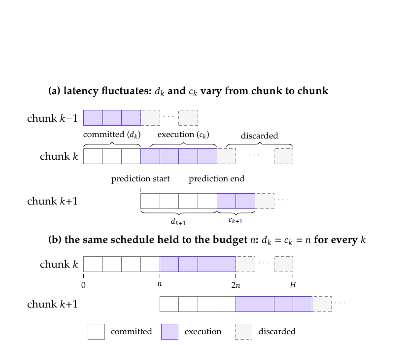
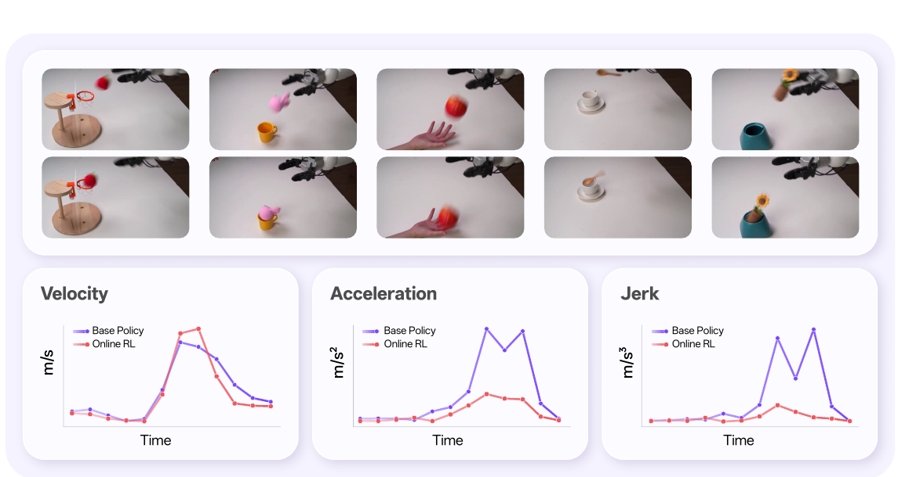
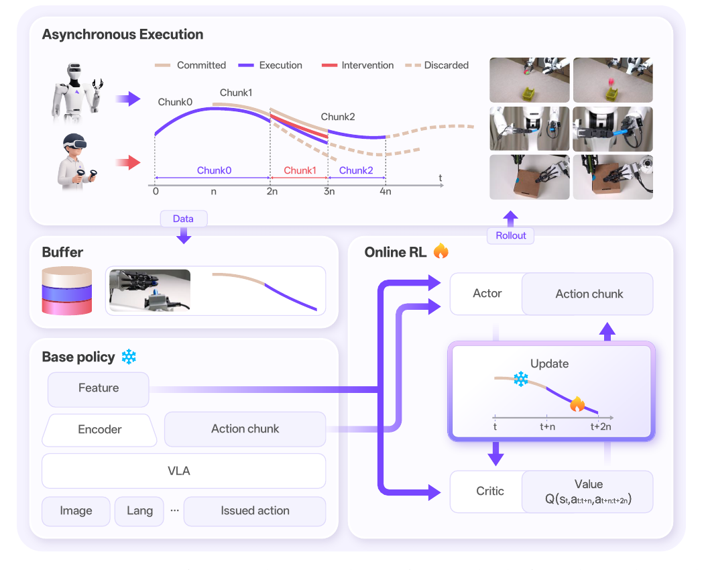
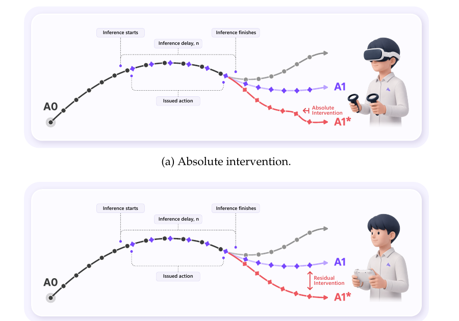
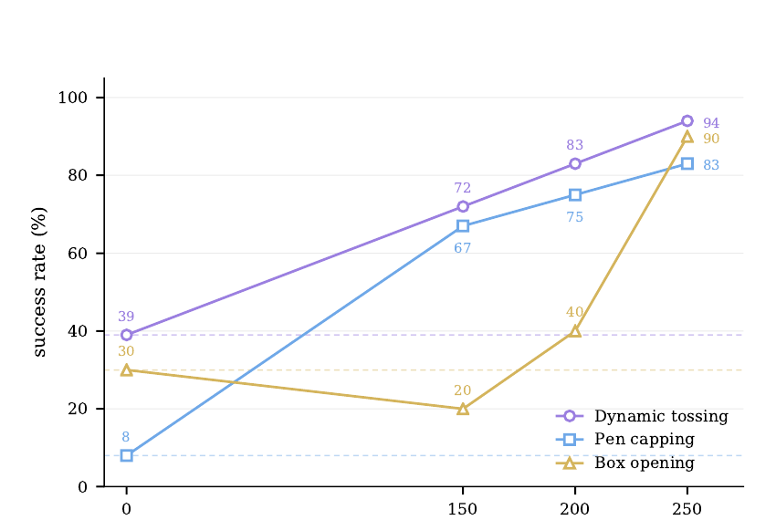

# SmoothRL：异步执行中的在线机器人强化学习

> 论文：**SmoothRL: Online Reinforcement Learning During Asynchronous Execution**
>
> 版本：arXiv:2608.29768v1，2026-08-30。
>
> 原始文件：`/home/mi/Downloads/SmoothRL.pdf`
>
> 阅读日期：2026-09-04

## 精简版

### 一句话结论

SmoothRL 把异步 action-chunk 执行显式写进 off-policy actor-critic：critic 同时读取上一轮已经发出的 committed prefix 与本轮真正执行的 action segment，但 value gradient 只穿过后者，从而让“被 $Q$ 优化的动作”重新等于“机器人实际执行的动作”；这个问题和处理方式都很重要，但论文没有用关键消融或同类在线 RL baseline 隔离验证该机制，现有真机结果更能证明整套系统有效，而不能单独证明 gradient truncation 必不可少。

### 核心方法

1. **按执行角色切分 action chunk：** 固定推理延迟预算为 $n$ 个 control frames，把 chunk 划为 committed $[0,n)$、execution $[n,2n)$ 和 discarded $[2n,H)$ 三段。
2. **critic 看完整因果动作，actor 只优化已执行动作：** $Q$ 读取 committed 与 execution 两段，保证 TD reward 与动作条件对应，也把 in-flight action 纳入并发决策状态；反向传播时对 committed 段 stop-gradient，并完全排除 discarded 段。
3. **冻结 VLA，只学习轻量 residual RL 分支：** 当前实现以任务微调后的 $\pi_{0.5}$ 为 base policy，附加 TD3/REDQ 风格 actor-critic，在 raw action space 预测有界修正。
4. **把连续性写进 actor loss：** 除最大化 $Q$ 和 BC anchor 外，还对 action chunk 的速度、加速度和 jerk 加惩罚，避免 RL 修正破坏跨 chunk 连续性。
5. **在线吸收人类纠正：** absolute intervention 直接替换 policy action，residual intervention 在 policy action 上加人类 correction；实际发出的动作既进入 critic transition，也作为 intervention chunk 的 BC target。



**读图：** 一个新 chunk 在完成推理时，其前缀对应的时间已经被上一 chunk 执行；下一次推理完成后，它的后缀又会被更新 chunk 覆盖。固定预算把随机边界变成 $[0,n)$、$[n,2n)$ 和 $[2n,H)$，使 frame-indexed gradient truncation 可实现。

### 关键结果

- **真实机器人成功率提升很大，但统计规模很小。** 250 个累计 rollout episodes 后，dynamic tossing 从 39% 提升到 94%，pen capping 从 8% 到 83%，box opening 从 30% 到 90%（Figure 7 / Table 1，p.19–20）。不过三个任务分别只在 18、12、10 个配置上各评一次，且每个任务只有一次 RL run。
- **学习并不保证单调。** Box opening 在 150 episodes 时从 base policy 的 30% 降到 20%，200 episodes 回到 40%，250 episodes 才升到 90%（Figure 7）。这说明真实机器人 exploration 或 critic/actor 早期偏移可能先损害已有能力。
- **“人直接控制”反而不如“人在 base policy 上做残差修正”。** 对 dynamic tossing 的最远 bin 配置，VR absolute teleoperation 约 30% 成功，而 residual intervention 约 80%（Sec. 4.3，p.17–18）；动态任务中，保留 pretrained chunk 的速度轮廓比让人重新控制整条轨迹更可靠。
- **平滑性结果只来自一个 rollout。** Figure 1 报告 online RL 相比 base policy 的 RMS acceleration 和 jerk 分别降低 52% 与 47%，但这是一次 autonomous throwing rollout，没有多 episode 方差或 smoothness ablation。

### 主要限制

- 没有比较 naive full-chunk value gradient、只看 execution region 的 critic、无 smoothness regularizer、同步在线 RL、RLT/GR-RL/RECAP 等关键 baseline，无法把收益归因给论文最核心的异步目标设计。
- 每任务仅一次训练，checkpoint 评测只有 10–18 episodes；初始状态配置与 online fine-tuning 使用的配置相同，没有置信区间、独立 seed 或 OOD pose/task 评测。
- 人类负责终止、二值 reward 标注、维持成功/失败平衡并在必要时 intervention，但论文没有披露 intervention 数量、比例和人工时长；无法分离 RL、在线 BC 和人工数据选择的贡献。
- 固定 latency budget 要求每次 inference 都在预算内完成；一旦 latency spike 超时，chunk handover 与训练目标的时间对齐会失效。
- 当前 residual actor 只能读取 frozen $\pi_{0.5}$ 的表示，并在半径 0.05 的局部动作邻域内修改；它适合修正系统性毫米级偏差，不足以补回 base policy 缺失的感知或全新行为。

### Takeaway

> 异步控制中的核心 RL 问题不是“chunk 如何生成”，而是**训练目标究竟在评价并更新哪一段真实执行过的动作**。先把 generated、committed、executed、discarded action 的身份对齐，再谈 value learning 和 smoothness；但这种目标修正是否真的带来收益，必须用 naive-gradient 与同步/异步对照实验验证。

---

## 完整版

### Metadata

- **Authors:** Guang Gao、Yuxuan Nong、Baifu Huang；Project Lead：Jianan Wang；署名 Astribot Team。
- **Venue / year:** arXiv technical report，2026。
- **Paper:** [arXiv:2608.29768](https://arxiv.org/abs/2608.29768)
- **Project page:** [SmoothRL](https://www.astribot.com/research/SmoothRL)
- **Code:** PDF 未给出代码仓库。
- **Task and setting:** 在 action chunking 与异步推理的真实机器人部署循环中，对预训练 VLA 做 sample-efficient online RL adaptation。
- **Base policy:** 按任务监督微调的 $\pi_{0.5}$；base policy 冻结，只训练轻量 residual actor-critic。
- **Reading source:** `/home/mi/Downloads/SmoothRL.pdf`
- **Reading date:** 2026-09-04
- **Source boundary:** 下文用“论文事实”“分析推断”“待验证”区分 PDF 直接证据、基于证据的判断与论文没有回答的问题。

### One-sentence Verdict

> SmoothRL 正确抓住了一个容易被部署系统掩盖的目标错位：异步生成的 action chunk 大部分并不是当前 policy 真正执行的动作，因此不能让这些动作污染 value gradient；其固定时序切分和 concurrent-state augmentation 在形式上自洽，整套 residual online RL 也能在三项真机任务上工作，但缺少机制消融、强 baseline、重复实验和 held-out 配置，使论文目前更像有价值的系统 formulation 与可行性验证，而不是完成因果归因的算法证据。

### Key Figures

#### Figure 1：成功动作不等于平滑动作



**论文事实：** 作者在一次 autonomous throwing rollout 中，按 action chunk 统计右末端 XYZ 运动的 RMS velocity、acceleration 和 jerk；online RL 的 acceleration 与 jerk 比 base policy 低 52% 和 47%。

**证据边界：** 图中没有绝对数值、多个 episode、误差条或“去掉 smoothness loss”的对照，因此它只能展示一个代表性平滑轨迹，不能证明 SmoothRL 普遍降低 jerk，也不能区分收益来自异步执行、BC anchor 还是显式导数正则。

#### Figure 2：committed / execution / discarded 三段


**论文事实：** variable latency 下，chunk $k$ 的 committed 长度 $d_k$ 由本次推理时长决定，execution 长度 $c_k$ 由下一次推理时长决定，两者在生成时并不同时可知。作者把推理调度固定到 $n$ frames，使 $d_k=c_k=n$。

**读图：** 当前 chunk 的 committed 区域只是“对上一轮已发动作的重述”，execution 区域才真正进入机器人，discarded 区域会在到达执行时间前被下一 chunk 覆盖。三段在 tensor 中都可能存在，但只有中段同时拥有 policy-output 身份和 environment-action 身份。

#### Figure 3：SmoothRL 的实际 instantiation



**论文事实：** frozen VLA 产生内部 feature 和 reference action chunk；attached actor 在 raw action space 给出 bounded correction；critic 读取实际 committed action 与 actor execution action；rollout 与更新过程并行运行，共享 replay buffer 和模型参数。

**证据边界：** 论文声称 gradient truncation 原则可用于 end-to-end generative policy fine-tuning，但实验只验证了 frozen VLA + 小型 residual MLP，不能据此确认它对完整 diffusion/flow policy 参数同样稳定。

#### Figure 4：两种 human intervention



**论文事实：** absolute intervention 丢弃 actor output，直接执行 VR teleoperation chunk；residual intervention 则把手柄 correction 加到 actor output。两者下游都记录实际 issued action，并把 intervened execution segment 当作 BC target。

**分析推断：** residual intervention 相当于把人类控制限制在 pretrained policy 的局部 tangent space：操作者只纠偏，不必重新产生动态轨迹。这解释了它在投掷任务上的优势，也说明该方式依赖 base policy 已经提供正确的运动 primitive。

#### Figure 7：单次训练过程中的成功率



**论文事实：** nonzero checkpoints 来自每个任务的一次 RL run，折线只为可视化连接。不同任务每个点的评测 episode 数分别为 18、12 和 10。

**证据边界：** 纵轴看起来是平滑百分比，但最小粒度分别约为 5.6、8.3 和 10 percentage points；例如 box opening 的 90% 实际对应 10 次中的 9 次成功。

### Problem and Baseline

#### 1. 部署中的目标错位

同步 chunk execution 的朴素流程是：

```text
observe
→ policy forward
→ execute chunk
→ observe again
```

大模型 forward 较慢时，机器人会在 chunk 边界等待。异步系统改为：

```text
execute current chunk
‖
infer next chunk from an earlier observation
→ next chunk becomes ready and takes over
```

这样 inference latency 被动作执行隐藏，但产生两个问题：

1. 新 chunk 根据 stale observation 生成，不知道推理期间真实执行了什么；
2. 一个生成出的 chunk 只会执行中间一段，前缀已经错过、后缀会被下一 chunk 覆盖。

对于 BC 或 offline RL，异步可以只是 deployment scheduler；但 value-gradient online RL 会沿着 $\nabla_a Q$ 更新 action-producing parameters。若 $Q$ 对整条 generated chunk 求梯度，其中便包含从未进入环境、没有产生相应 reward consequence 的动作。

#### 2. 相关方法缺少哪一个条件

论文用三个条件组织设计空间：

| Setting | Online data | Async execution | $\nabla_aQ$ 直接更新 raw-action policy | 主要边界 |
|---|---:|---:|---:|---|
| $\chi_0$、RECAP 等 offline RL | 否 | 可 | 否 | advantage 通过 weighting / conditioning 进入 policy |
| RLT、EXPO-FT 等 online RL | 是 | 否 | 是 | 默认完整 chunk 同步执行 |
| GR-RL 等 latent steering | 是 | 是 | 否 | 改 latent candidate，能力受 frozen decoder 支配 |
| SmoothRL | 是 | 是 | 是 | 需要显式处理 partial chunk execution |

**分析推断：** SmoothRL 的真正新意不是 TD3 residual actor，也不是 jerk penalty，而是把 asynchronous scheduler 变成 objective 的一部分，明确规定哪些 action coordinates 有合法环境反馈。

### Method

#### 1. 固定 latency budget，把执行边界变成 frame index

设 base policy 产生 horizon 为 $H$ 的 action chunk，推理预算为 $n$ 个 control frames。SmoothRL 强制每个 handover 按预算发生：推理提前完成就等待，不能利用剩余时间获取更新观测。

于是每条 generated chunk 的角色固定为：

$$
\underbrace{a_{[0,n)}}_{\text{committed}}
+
\underbrace{a_{[n,2n)}}_{\text{execution}}
+
\underbrace{a_{[2n,H)}}_{\text{discarded}}.
$$

- **Committed region：** 该时段已经由上一 chunk 的 issued action 控制；当前 policy 对这段的预测不会进入环境。
- **Execution region：** 当前 chunk 成为 latest available output 后，真实发给机器人。
- **Discarded region：** 下一 chunk 到达后被覆盖，不进入环境，也不进入 RL objective。

具体系统以 30 Hz 控制、5 Hz chunk inference 运行，所以：

$$
n=6\ \text{frames}=200\ \text{ms}.
$$

$\pi_{0.5}$ 每次产生 $H=32$ frames 的 reference chunk，但 SmoothRL 的 actor/critic objective 只使用前 $2n=12$ frames；其中前 6 frames 是 committed action，只有后 6 frames 属于本轮新输出并被真实执行，reference chunk 剩余 20 frames 会被 discard。

#### 2. Actor objective：只让 value gradient 穿过 execution region

用 $\tilde a_{[0,n)}$ 表示机器人真实执行的 committed 动作，它来自上一 inference cycle；当前 actor 只负责 $a_{[n,2n)}$。论文的受约束目标为：

$$
\max_\theta\
\mathbb{E}
\left[
Q\left(
s,
\tilde a_{[0,n)},
\pi_\theta(s)_{[n,2n)}
\right)
\right],
$$

$$
\text{s.t.}\quad
\left(
\tilde a_{[0,n)},
\pi_\theta(s)_{[n,2n)}
\right)\in\mathcal E,
$$

其中 $\mathcal E$ 是满足机器人可执行性和跨边界连续性的 chunk 集合。

关键不是把 committed segment 从 $Q$ 输入中删掉，而是：

$$
\nabla_\theta Q
=
\frac{\partial Q}{\partial a_{[n,2n)}}
\frac{\partial \pi_\theta(s)_{[n,2n)}}{\partial\theta},
$$

对 $\tilde a_{[0,n)}$ stop-gradient。这样，接收 value gradient 的动作同时满足：

1. **Agreement：** $Q$ 评价的是机器人实际执行的动作；
2. **Differentiability：** 该动作仍能沿 actor computation graph 回到 $\theta$。

#### 3. 为什么 critic 仍必须读取 committed action

论文给出两个理由。

第一，TD transition 覆盖 $[0,2n)$。reward 由 committed + execution 两段共同产生，因此 critic 必须以实际产生这段 reward 的完整 action sequence 为条件：

$$
Q(s_t,a_{t:t+2n})
\leftarrow
r_t+\gamma^{2n}
Q(s_{t+2n},\pi(s_{t+2n})).
$$

第二，异步系统属于 concurrent decision process。当前 actor 在 $s_t$ 生成 chunk 时，上一 chunk 仍在未来 $n$ frames 内控制机器人。若只给 critic $(s_t,a_{[n,2n)})$，它会对 replay buffer 中不同旧 policy 留下的 in-flight action 做隐式边缘化，破坏 Markov state。

一般 concurrent control 需要把以下两项加入 state：

1. 当前 in-flight action；
2. 距离该 action 完成的剩余时间。

SmoothRL 中前者就是 $\tilde a_{[0,n)}$，后者被固定预算锁定为常数 $n$。

**分析推断：** 这部分比“只裁掉没执行动作的梯度”更重要。它说明 async RL 不只是 mask loss，还要把 pipeline 中已经承诺、尚未完成的控制输入视作状态变量。

#### 4. 具体 actor-critic

当前实现沿用 RLT 的 frozen-base skeleton：

```text
image + language + proprioception
→ frozen π0.5
→ reference action chunk ā + compressed RL token z
→ residual actor(z, s, ā)
→ bounded correction + ā
→ issued action execution segment
```

- actor 与 critic 均为 3-layer MLP，每层 512 hidden units，并在 hidden layers 使用 LayerNorm；
- actor 只修改 31 维机器人 action 中的 20 个双臂维度，不修改 torso 与 head；
- residual correction bound 为 0.05；
- critic 使用 TD3-style target action noise，并以 REDQ-style critic ensemble 的随机子集最小值构造 pessimistic target；
- batch size 256，update-to-data ratio $G=5$，actor delay $D=5$；
- base policy、RL hyperparameters 和 correction bound 在三个任务间固定。

actor loss 为：

$$
\begin{aligned}
\mathcal L_{\text{actor}}
=\;&-
Q\left(z,s,
\operatorname{sg}[\tilde a_{[0,n)}],
a_{[n,2n)}\right)\\
&+w_{\text{bc}}
\left\|a-a^{\text{target}}\right\|^2_{[0,2n)}\\
&+w_{\text{smooth}}
\sum_{k=1}^{3}w_k
\left\|\Delta^ka\right\|^2_{[0,2n)}.
\end{aligned}
$$

三项分别负责：

1. 提高实际 execution segment 的 predicted $Q$；
2. 把 local residual policy 锚定在 base/reference action 或人类 correction；
3. 限制速度、加速度和 jerk，近似实现 $\mathcal E$ 的连续性约束。

**论文事实：** smoothness 并不是 gradient truncation 自动产生的；value objective 可能破坏 base policy 从 demonstration 继承的连续性，所以作者额外加了显式导数正则。

#### 5. Human intervention 如何进入同一目标

训练过程中 base policy 和 residual actor 始终继续 inference，operator 只改变 issued action：

- **Absolute intervention：** VR action 完全替换 actor output，适合需要大幅改轨迹的精确任务；
- **Residual intervention：** 手柄 delta 加到 actor output，适合要保留 velocity profile 的动态任务。

intervened chunk 的实际 execution action 被：

1. 当作普通 off-policy transition 训练 critic；
2. 当作该 segment 的 BC target 训练 actor；
3. 传递成下一决策的 committed action，使 state augmentation 记录真实 in-flight human action。

非 intervention chunk 的 BC target 是 base-policy reference action；committed region 的 BC target 始终是 reference action。

#### 6. Replay 与在线更新

1. 先用 frozen base policy 在同一异步 scheduler 下收集 50 个 episodes 初始化 replay buffer；
2. rollout process 每隔 $n$ frames 请求一条新 chunk，并记录实际 committed/execution actions；
3. operator 只在 episode 结束时给 terminal binary success reward，没有 intermediate reward；
4. optimization process 与 rollout 并行，每新增一条 trajectory 做 $G=5$ 个 critic iterations；
5. 每 $D=5$ 个 critic steps 更新一次 actor 与 target networks。

这种初始化很重要：如果 buffer 来自同步执行或纯 teleoperation，它没有与 objective 一致的 committed/execution 时间语义。

### Experiments

#### Platform and tasks

- **Robot：** Astribot S1 mobile bimanual robot，25 DoF。
- **Observation：** head、left wrist、right wrist 三路 224×224 RGB，加 proprioceptive joint state。
- **Action：** 30 Hz、31 维；RL branch 只修正 20 个 arm-action dimensions。
- **Dynamic tossing：** 物体约 6×7 cm，bin opening 约 7×12 cm；需要连续 swing、正确 release speed/timing。
- **Pen capping：** 双臂相对位姿容差约 5 mm。
- **Box opening：** 约 1 mm blade 对准 2–3 mm seam，关键是毫米级插入精度。

base $\pi_{0.5}$ 的 supervised task data 为：dynamic tossing 500 demonstrations，pen capping 与 box opening 各 1,500 demonstrations。

#### Evaluation protocol

| Task | Eval configurations / checkpoint | Base | 150 episodes | 200 episodes | 250 episodes |
|---|---:|---:|---:|---:|---:|
| Dynamic tossing | 18 | 39% | 72% | 83% | 94% |
| Pen capping | 12 | 8% | 67% | 75% | 83% |
| Box opening | 10 | 30% | 20% | 40% | 90% |

**论文事实：** 每个 configuration 每个 checkpoint 只评一次；三个 nonzero checkpoints 来自每任务同一次 RL run；评测初始状态配置与 online fine-tuning 使用的配置相同。

**分析推断：** 这些结果支持“small residual online adaptation 能修正 base policy 的系统性偏差”，尤其是 pen pose、blade left bias 和 throwing distance-to-velocity mapping；但不能证明方法泛化到未训练配置，也不能估计 run-to-run variance。

### Evidence Audit

| Claim | Direct evidence | Controls / ablations | Assessment |
|---|---|---|---|
| 异步执行需要 execution-only value gradient | chunk-role 推导、agreement/differentiability 论证、Eq. 4 | 没有 full-chunk gradient 或错误 mask 对照 | **形式上支持，经验上未验证** |
| committed action 应进入 critic state | concurrent-control state augmentation 与 $2n$-skip TD backup | 没有移除 committed input 的 ablation | **理论动机充分，经验未隔离** |
| SmoothRL 提升任务成功率 | 三项真机任务从 39/8/30% 提升到 94/83/90% | 仅 frozen base policy；无同数据 online RL baseline | **整套系统有效，归因不完整** |
| online RL 保持或改善平滑性 | 单次投掷 rollout 中 acceleration/jerk 降 52/47% | 无多次统计，无 $w_{\text{smooth}}$ 消融 | **初步证据** |
| residual intervention 更适合动态任务 | 最远 bin 上 residual 约 80%，absolute 约 30% | 未给 trial 数、置信区间和操作者差异 | **有启发，但证据有限** |
| 方法可推广到 end-to-end generative policy | objective 与 raw action parameterization 解耦的论证 | 实验只训练 residual MLP | **待验证** |

#### Fairness of baselines

- 所有 checkpoint 使用同一机器人、同一异步 loop、同一 latency budget，这是 base-vs-finetuned 比较的优点。
- 但没有使用相同 online episodes、人类 intervention 和训练预算比较 RLT、GR-RL、RECAP、naive async TD3 或 synchronous residual RL。
- frozen base policy 不包含 attached actor；因此比较同时改变了模型容量、在线数据、BC correction 和 RL objective。

#### Gain attribution

现有实验无法分解以下因素：

$$
\text{gain}
=
\text{online interaction}
+
\text{human correction BC}
+
\text{value gradient}
+
\text{gradient truncation}
+
\text{smoothness regularization}
+
\text{residual adapter capacity}.
$$

最缺失的 factorial ablation 是在相同 buffer 上比较：

1. BC-only residual adapter；
2. RL + full-chunk gradient；
3. RL + execution-only gradient；
4. 第 3 项去掉 committed critic input；
5. 第 3 项去掉 smoothness loss。

#### Robustness and missing evidence

- 没有 inference latency jitter、预算超时、不同 $n/H$ 比例或 scheduler drift 实验；
- 没有未见物体/目标 pose、未见任务或跨 embodiment 评测；
- 没有报告 intervention rate、人工时长、真实 wall-clock training time、硬件磨损/失败安全；
- 没有 Q calibration、overestimation、critic ensemble size 或 correction-bound sweep；
- 没有 policy update 导致 catastrophic regression 时的 rollback / safety gate。

### 关键与非常规结果

#### 1. 32-frame reference 中只有 6 frames 属于本轮 policy 的真实控制

在 $H=32,n=6$ 的设置里，base policy 的 reference chunk 有 32 frames，但 RL objective 只保留前 12 frames：当前 actor 的 execution region 只有 6 frames，另 6-frame committed prefix 实际由上一 chunk 产生，而 20-frame reference suffix 会被下一 chunk 覆盖。

这说明把“policy 输出的 action tensor”直接当作“环境执行的 action”并不只是轻微近似；在本设置中，两者对大多数 frame 都不相等。任何依赖 action likelihood、$Q(s,a)$ 或 behavior-policy ratio 的训练都应先定义 executed-action provenance。

#### 2. Critic 的 action span 与 actor 的 optimization span 可以不同

critic 需要完整 $[0,2n)$ 才能解释 interval reward，actor 却只能对 $[n,2n)$ 获取合法 gradient。这打破了常见的直觉：$Q$ 看见哪些 action，actor 就应该优化哪些 action。

更一般地：

$$
\text{credit-conditioning span}
\neq
\text{policy-gradient span}.
$$

在 delayed actuation、networked control、model-predictive pipelines 和 partially committed generation 中，这个区分都可能成立。

#### 3. SmoothRL 的“smooth”主要来自显式约束，不来自 RL 本身

gradient truncation 只解决 credit assignment；跨 chunk continuity 仍由 TT-RTC-style conditioning、base demonstration prior、BC anchor 和 velocity/acceleration/jerk penalty 共同保证。

因此不能把成功率与平滑性都归因于一个机制。论文标题覆盖的是整个系统目标，而不是一个单独的 smoothness algorithm。

#### 4. 动态任务中，人类 correction 比人类 replacement 更有效

absolute teleoperation 给人完整自由度，却要求操作者同时重建方向、速度、release timing 和 chunk-boundary continuity。residual mode 限制更强，反而把 base policy 的动态 primitive 保留下来。

这提示 human-in-the-loop RL 的接口不应只比较“是否有人”，还要比较人类控制变量的参数化：raw action、residual action、latent steering 和 high-level preference 会产生完全不同的数据质量与操作负担。

#### 5. 大幅最终提升可以掩盖不稳定的中间训练过程

Box opening 在 150 episodes 时低于 base policy。若真实部署不能接受在线性能回退，就需要 checkpoint gating、safe policy improvement、shadow evaluation 或 conservative correction bound；论文没有讨论训练期间是否持续执行性能较差的当前 actor。

### Assumptions and Possible Shortcuts

#### Explicit assumptions

- inference latency 有可信上界，固定预算 $n$ 不会被频繁超过；
- robot 可在 chunk handover 时直接执行 policy output，不经过额外 blending；
- $[0,2n)$ 内的实际 issued actions、reward 与 bootstrap state 可被准确记录；
- velocity、acceleration、jerk penalty 足以近似机器人的 executable-set constraint。

#### Hidden assumptions

- 当前 observation、VLA token、in-flight chunk 和固定 remaining time 构成足够的 Markov state；
- frozen VLA embedding 保留了 RL correction 所需的目标 pose 与接触信息；
- base policy 已进入正确 behavior basin，0.05 residual neighborhood 内存在成功轨迹；
- operator 的终止、success label 和 intervention policy 在训练期间一致；
- off-policy replay 中旧 policy 与 human action 的混合不会让 critic 学到不可控的 distribution shift。

#### Possible shortcuts or confounds

- adapter 可能只记住训练使用的有限 target positions，而不是学习通用 pose-conditioned correction；
- balanced success/failure collection 与 human intervention 可能比 value-gradient 机制贡献更大；
- smoothness regularizer 可能主要收缩动作幅度，在特定 throwing rollout 上降低导数，却不保证所有任务保持必要的高速动作；
- sparse terminal reward 加 operator-guided intervention 可能让 critic 主要识别人类接管模式或接近成功的状态，而非稳定估计长程 $Q$；
- base policy 已用 500–1,500 demonstrations task-finetune，SmoothRL 展示的是“最后毫米”局部 adaptation，不是从弱 policy 学习新 skill。

### Independent Assessment

- **Problem value：高。** 大型 VLA 的 asynchronous execution 已是实际部署问题；generated action 与 executed action 的错位会直接破坏在线 value-gradient 的语义。
- **Novelty：中高，主要是问题 formalization 与训练/部署对齐。** Chunk partition、concurrent-state augmentation 和 frame-indexed gradient truncation 的组合清晰；TD3 residual RL、BC regularization、REDQ ensemble 与 derivative smoothness penalty 本身并不新。
- **Technical soundness：中高。** 固定-budget setting 下，critic conditioning、TD interval 和 gradient path 能互相对应；variable latency、external blending 和 end-to-end flow/diffusion fine-tuning 仍停留在讨论层面。
- **Experimental strength：中低。** 三项真实机器人任务和毫米级失败分析有价值，但没有核心 ablation、同类 baseline、seed、held-out configuration 或充分评测次数。
- **Practicality：中高，适用于 local correction。** 冻结大 VLA、训练小 MLP、复用 raw-action intervention 很适合真实机器人数据预算；固定 latency、人工监督和 base-policy expressiveness 是主要部署约束。
- **Likely failure modes：** latency overrun、观测/动作时间戳漂移、base feature 缺失、需要大幅新动作、Q overestimation、intervention distribution shift、在线性能暂时回退、接触安全和 residual bound 过小/过大。

### Connections

- [[Robot/VLA/PI/Pi_0.5综述|pi0.5]]：SmoothRL 实验把 task-finetuned $\pi_{0.5}$ 冻结为 reference policy；它补的是 π0.5 缺少 deployment-time reward feedback 和局部纠偏的部分，不改变 base VLA 本体。
- [[RL/SAC_PPO_compare|SAC vs PPO]]：SmoothRL 属于 replay-buffer、continuous-action、$Q$ 直接指导 actor 的 off-policy value-gradient 路线；具体实现更接近 TD3/REDQ，而不是 PPO-style likelihood ratio。
- [[Robot/VLA/PI/Pi_star0.6论文问题解答|pi*0.6 / RECAP]]：两者都利用真实 rollout、失败和 human correction 改进 VLA；RECAP 把 advantage 变成条件标签并进行 offline rounds，SmoothRL 则在异步执行环内让 $\nabla_aQ$ 直接更新 residual actor。
- [[Robot/WAM/DayDreamer论文综述与阅读重点|DayDreamer]]：两者都在真实机器人上并行执行 rollout 与 learning；DayDreamer 通过 latent world model imagination 提高数据利用率，SmoothRL 是 model-free chunk critic，重点处理 inference pipeline 与 gradient span 的一致性。
- [[Robot/VLA/ALOHA与ACT完整笔记|ALOHA 与 ACT]]：ACT 展示 action chunking、receding-horizon execution 和 temporal ensemble；SmoothRL 说明一旦加入 online value gradient，chunk stitching/blending 不再只是平滑后处理，因为 critic 必须评价最终实际执行的 action。

### Open Questions

1. 在相同 replay data 和 intervention budget 下，execution-only gradient 是否显著优于 naive full-chunk gradient？
2. 若移除 committed action 的 critic input，Q error、policy success 和训练稳定性会下降多少？
3. latency 服从真实 jitter distribution、偶尔超过 $n$ 时，能否记录实际 $d_k,c_k$ 并做 variable-length masking，而不是强制等待？
4. 怎样把 temporal ensemble / action blending 直接纳入 differentiable executed-action objective，同时避免一次 transition 反传多个旧 actor forward？
5. human intervention 的 episode 比例、frame 比例与 BC/RL loss 占比各是多少？BC-only adapter 能解释多少提升？
6. residual bound 从 0.05 放大时，何时从“修正最后毫米”转变为 critic exploitation 或不平滑动作？
7. 对 flow/diffusion VLA 做 end-to-end value-gradient 时，如何固定 committed prefix 并只更新 future segment，而不破坏 generative trajectory consistency？
8. 真实上线是否需要 conservative checkpoint selection，避免 box-opening 式 early degradation？

### Takeaway

SmoothRL 给异步机器人 RL 提供了一个可迁移的建模原则：

$$
\boxed{
\text{critic conditioning}
=
\text{产生 reward 的完整已执行动作}
}
$$

$$
\boxed{
\text{actor gradient support}
=
\text{既由当前 policy 生成、又实际进入环境的动作}
}
$$

两者不必是同一时间跨度。这个原则在 fixed-latency residual actor 上成立得很清楚；论文下一步最需要的不是更多最终成功率，而是用受控实验确认：**若不做这种对齐，性能究竟会坏多少，以及 human BC、smoothness penalty 与 value gradient 各贡献多少。**

### 相关笔记

- [[Robot/VLA/PI/Pi_0.5综述|pi0.5 综述]]
- [[RL/SAC_PPO_compare|SAC vs PPO]]
- [[Robot/VLA/PI/Pi_star0.6论文问题解答|pi*0.6 / RECAP]]
- [[Robot/WAM/DayDreamer论文综述与阅读重点|DayDreamer]]
- [[Robot/VLA/ALOHA与ACT完整笔记|ALOHA 与 ACT]]

### 来源边界

- 本笔记依据用户提供 PDF 的正文、公式、Algorithm 1、Figure 1–8、Table 1、Limitations 和 References 整理。
- PDF 不含附录；未发现独立 supplementary material。论文中没有报告的代码、超参数、intervention 统计与重复实验不作推测。
- 成功率、平滑性和 teleoperation 数字均属于论文在 Astribot S1、自定义任务与 2026-08 模型版本上的结果，不用于推断通用 SOTA。
