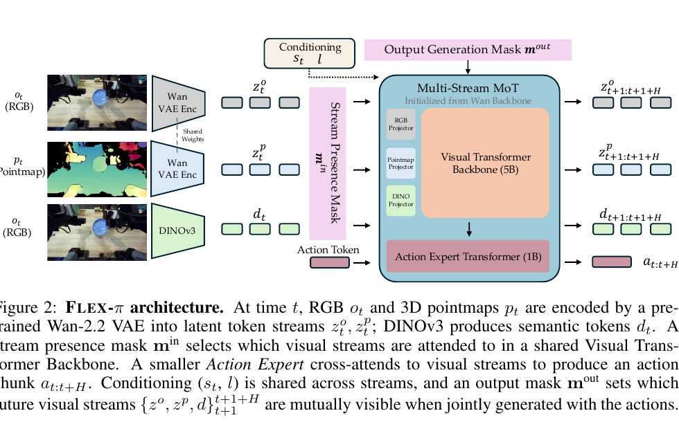
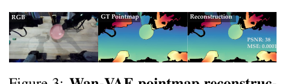
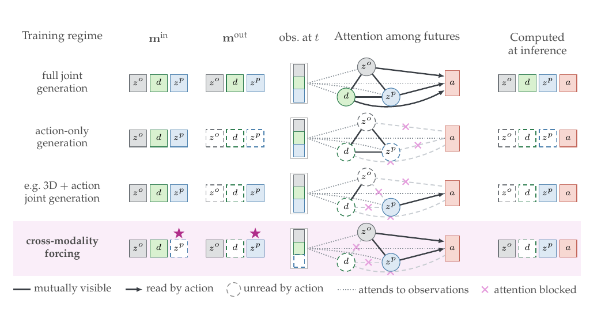
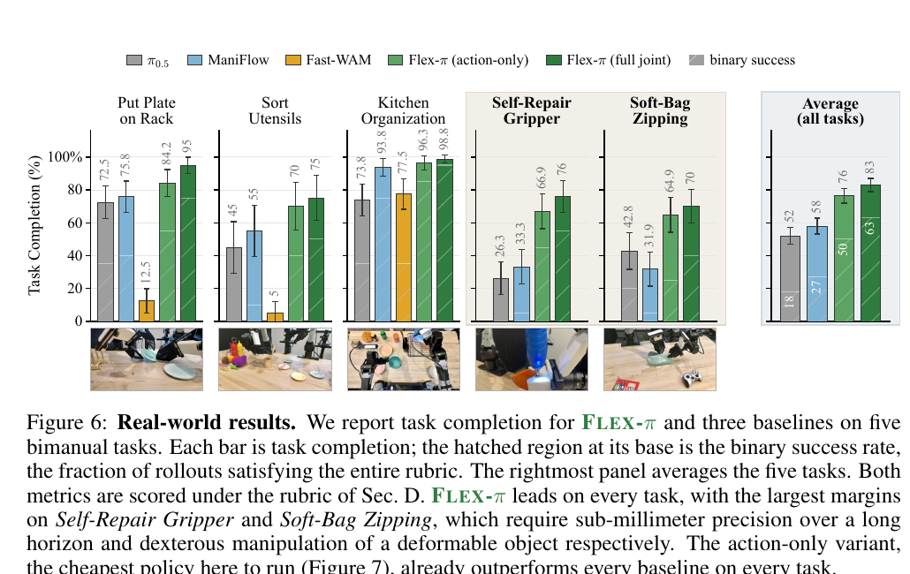
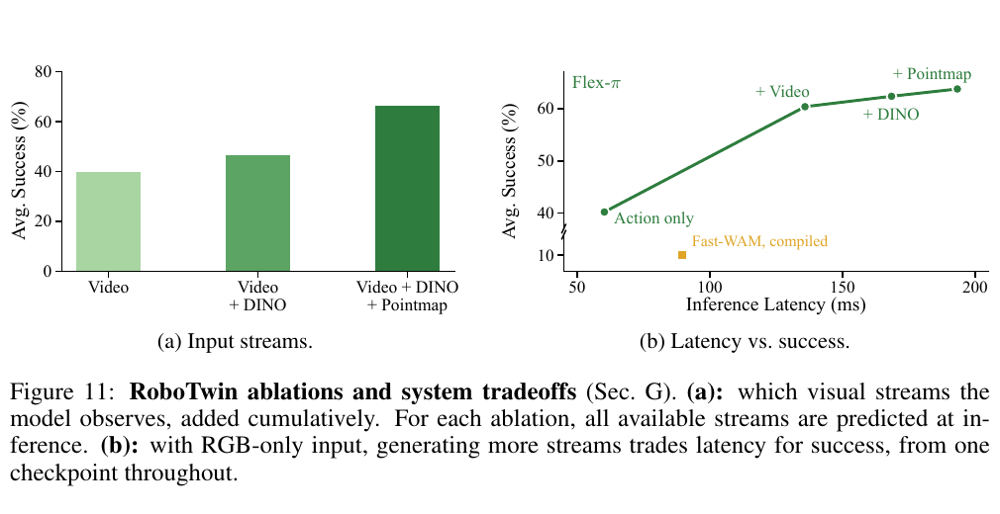
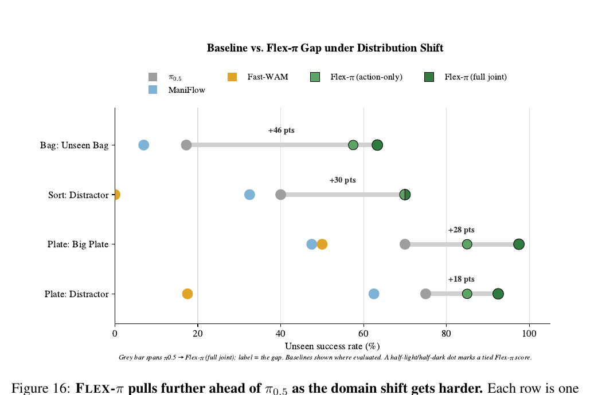

# Flex-π：多流世界动作模型与计算灵活性

> 论文：Flex-π: A Multi-Stream World-Action Model with Compute Flexibility
> 作者：Ge Yan、Jinghao Liu、Yuzhi Fan、Lei Cai、Minwen Liao、Jesse Zhang、Dieter Fox
> 版本：arXiv:2608.10860v2，2026-08-13；项目页：[flex-pi.github.io](https://flex-pi.github.io/)
> 本笔记基于论文正文、附录和图表阅读整理。文中的“论文事实”指论文直接报告的内容；“我的判断”是对证据边界和工程含义的分析。

## 精简版

### 一句话结论

Flex-π 把 RGB、3D pointmap、DINO 语义的未来表征与动作 chunk 放进同一个 flow-matching WAM，并用随机输入缺失和 cross-modality forcing 训练出一个可按部署算力切换的 checkpoint；真实双臂实验显示它确实提升了精确、长时程操作，但“几何几乎免费”的证据仍主要是单例重建和有限规模消融。

### 核心方法

1. 用冻结的 Wan-2.2 VAE 同时编码 RGB 与 pointmap；用冻结的 DINOv3 提供 object-centric 语义。pointmap 训练标签主要由 RGB 经过 Depth Anything 3 和相机内参得到，因此不必为训练增加新的视觉先验。
2. 用 5B Visual Transformer 加约 1B Action Expert 的 Mixture-of-Transformers，共同去噪未来 RGB latent、pointmap latent、DINO token 和动作 chunk。动作流可以读取未来视觉流，但视觉流不读取动作流。
3. 训练时独立采样输入 presence mask 和输出 attention mask。输入流可以缺失，缺失流仍会被预测；推理时只计算 action，或生成部分/全部未来视觉流，从而在性能与延迟之间切换。

### 关键结果

- YAM 五个真实双臂任务的平均 task completion 为：π0.5 52%、ManiFlow 58%、Flex-π action-only 76%、full joint 83%；full joint 的平均完整任务成功率为 63%，而 π0.5 和 ManiFlow 分别为 18% 和 27%（Fig. 6，p. 8）。
- 在同一 RTX 5090 部署栈上，action-only 约 60 ms、full joint 约 193 ms；action-only 已比三个真实机器人 baseline 更快，full joint 的平均完整任务成功率再高 13 个百分点，task completion 约高 7 个百分点（Fig. 7、15，pp. 8、30）。
- RoboTwin 50-task 平均成功率为 94.6%，略高于使用约 38,100 小时预训练数据的 Qwen-RobotManip 的 93.9%；但 full joint 与 action-only 几乎持平，说明该 benchmark 可能接近饱和（Table 1，p. 10）。
- 训练消融中，加入 DINO 比 video-only 提升 6.8 个百分点，再加入 pointmap 提升 20 个百分点；移除 cross-modality forcing 反而使成功率下降 21%（Fig. 11、12，p. 11）。

### 主要限制

- Wan VAE 的 pointmap “free lunch”只用一个可视化例子展示，报告 PSNR 38、MSE 0.0001；缺少跨场景、跨尺度和噪声条件下的系统重建统计。
- 真实实验只有一个 YAM 平台、每任务 10–20 次 rollout，并采用人工 partial-credit rubric；Fast-WAM 没有覆盖两个最难任务，baseline 的覆盖范围并不完全一致。
- full joint 仍然比 action-only 慢很多，训练收敛也更慢；最佳 TensorRT 路径峰值约 25.7 GB，32 GB 显卡上的余量有限。
- 未来视觉流不读取动作流，没有显式的 action-conditioned forward consistency 或 inverse-dynamics 检查；生成的视觉未来是否真的是“动作会导致的未来”仍未被直接验证。

### Takeaway

> 对 WAM 最有价值的增益未必来自部署时一直生成视频，而可能来自训练期间强迫 RGB、几何和语义互相可预测；但要把它称作通用 3D 世界模型，还需要更全面的 pointmap 评测和动作—视觉一致性实验。

> 以下为完整分析。

## Metadata

- Authors / venue / year: Ge Yan、Jinghao Liu、Yuzhi Fan、Lei Cai、Minwen Liao、Jesse Zhang、Dieter Fox；arXiv preprint，2026，v2 于 2026-08-13 发布。
- Paper / code: [论文项目页](https://flex-pi.github.io/)；论文编号为 [arXiv:2608.10860](https://arxiv.org/abs/2608.10860)。论文正文未给出独立代码仓库链接。
- Task and setting: 机器人 world-action model；RGB、pointmap、DINO 语义、语言和本体状态条件下的双臂/单臂操作，重点评测精确接触、长时程和分布外操作。
- Reading date: 2026-08-27

## One-sentence Verdict

> Flex-π 的实质是把“多种视觉未来监督”变成 WAM 的训练期表征约束，再用 mask 把这些监督和部署时的计算开关解耦；在真实高难度双臂任务上证据较有说服力，但对 pointmap 表征的普适性、动作与视觉未来的一致性及跨平台能力仍没有充分证明。

## Key Figures

### Figure 2：总体架构

**读图：** 当前 RGB 与 pointmap 经过共享权重的 Wan VAE，DINOv3 产生语义 token；三类视觉 token 进入 5B Visual Transformer，约 1B 的 Action Expert 读取视觉流并输出动作 chunk。输入 mask 决定当前哪些视觉流可见，输出 mask 决定未来视觉流之间以及动作对未来视觉流的可见关系。
**证据边界：** 该图能说明模块和信息流，不能单独证明生成的视觉未来对动作有因果作用。

### Figure 3：冻结 RGB VAE 的 pointmap 重建

**读图：** 论文把 RGB、ground-truth pointmap 和 VAE reconstruction 并排展示，示例中报告 PSNR 38、MSE 0.0001。作者据此把 pointmap 放入与 RGB 相同的 latent space。
**证据边界：** 这是“可行性证据”，不是对所有物体、距离、相机和深度噪声的重建保证；而且 pointmap 本身在预训练阶段主要是由 RGB 深度估计器生成的伪标签。

### Figure 4：一个 checkpoint 的输入/输出可变性

**读图：** full joint、action-only、只用 3D 加动作，以及 pointmap 输入被丢弃但仍生成 pointmap 的 forcing 情形，都由同一个 mask 机制表达。注意输出 mask 不是 loss mask；未被动作读取的未来流在训练时仍被去噪和监督。
**证据边界：** 这张图说明“如何实现灵活性”，性能收益需要结合 Fig. 11、Fig. 12 和真实部署结果。

### Figure 6：真实 YAM 任务

**读图：** 纵轴是按 rubric 归一化的 partial task completion，柱底斜线部分是完成全部 rubric 的 binary success。Flex-π 在五个任务上都高于已评测 baseline，差距在 Self-Repair Gripper 和 Soft-Bag Zipping 上最大。
**证据边界：** 这是强的真实任务信号，但不是标准化的二元成功率排行榜；Fast-WAM 没有在两个最难任务上评测，平均值也因此没有把它作为五任务 baseline。

### Figure 11：额外视觉流与速度—性能折中

**读图：** 左图固定输出所有可用流，逐步加入 DINO 和 pointmap；右图固定 RGB-only 输入，逐步增加要生成的未来流。action-only 约 60 ms、40.2% success；生成 video 后约 60.4%；再加 DINO 和 pointmap 达到 63.8%，延迟约 193 ms。
**证据边界：** 左图是五个 RoboTwin 任务、50 demos/task、5 epochs、从 scratch 的消融，右图来自同一 checkpoint 的不同部署模式；不能把左图的增益直接等同于完整预训练模型在所有任务上的增益。

### Figure 16：分布偏移下的差距

**读图：** 灰线从 π0.5 的 unseen 分数延伸到 Flex-π full joint；未见 bag、sort distractor、big plate 和 plate distractor 的差距分别标为约 +46、+30、+28、+18 个百分点。
**证据边界：** 这些是少数手工构造的真实条件，不足以代表全面 OOD；但趋势与正文报告的平均性能下降相符。

## Problem and Baseline

### Problem

已有 WAM 通常把未来 RGB latent 和动作联合预测，借助视频预训练获得时空先验。但 RGB pixel reconstruction 主要强调外观，未必显式约束：

- 物体的 metric geometry、相对位置和接触关系；
- 面向操作对象的 object-centric semantic identity；
- 在某一视觉传感器缺失时，仍能构造可用的未来场景表征。

直接引入 3D 感知会带来额外深度传感器、3D encoder 或新的视觉预训练；始终在推理时生成多种视觉未来又会增加延迟。论文要解决的是：能不能只用现有 RGB 和冻结视觉组件，把 geometry/semantics 作为训练信号，同时不把推理成本固定在最重的模式上？

### Why it matters

对于简单搬运，RGB appearance 可能已经足够；对于插入、螺丝、交接、拉链和柔性物体，动作是否成功取决于局部空间关系和操作阶段。若多种未来表征都由同一模型预测，WAM 可能学习到更接近“下一步会发生什么”的内部状态，而不是只记住当前图像到动作的表面映射。

### Baseline pipeline

典型 RGB-only WAM 可以抽象为：

$$
o_t \xrightarrow{\mathrm{VAE}} z^o_t
\xrightarrow{\mathrm{video\text{-}action\ model}}
\left(z^o_{t+1}, a_{t:t+H}\right).
$$

VLA baseline 则更接近：

$$
\left(o_t,l,s_t\right)
\xrightarrow{\mathrm{VLM/action\ expert}}
a_{t:t+H},
$$

不要求在推理时预测未来视觉。

### Exact delta

Flex-π 在 RGB-only WAM 上增加了三件互相耦合的变化：

| 维度 | RGB-only WAM | Flex-π |
|---|---|---|
| 未来视觉监督 | RGB latent | RGB latent、pointmap latent、DINO semantic token |
| 视觉编码 | 视频模型 VAE | RGB 与 pointmap 共用冻结 Wan-2.2 VAE，DINOv3 独立冻结 |
| 跨模态鲁棒性 | 通常固定输入和输出 | 输入 presence mask、输出 attention mask、cross-modality forcing |
| 推理开关 | 模型训练时基本确定 | 同一 checkpoint 可 action-only、部分 joint 或 full joint |
| 动作生成 | 与未来视觉联合或独立 | Action Expert 读取当前和被允许读取的未来视觉流，视觉不读取动作 |

因此它不是单个新 head，而是一套“多流监督 + 统一 latent 接口 + 运行时 mask”的 WAM recipe。

## Method

### Data flow

1. **构造当前视觉流。**
   RGB 观测记为 $o_t$。pointmap $p_t\in\mathbb{R}^{H\times W\times 3}$ 可由 Depth Anything 3 从 RGB 估计深度后，结合 camera intrinsics 反投影得到；模拟 LIBERO 使用渲染 depth，真实 YAM 也有 stereo depth 可用。DINOv3 从 RGB 提取 patch features $d_t$。三路相机在部署中先拼成一个 composite canvas，使 RGB 和 pointmap 各只需一次 VAE pass。

2. **进入三类 token stream。**

   $$
   z^o_t=\mathrm{Enc}(o_t),\qquad
   z^p_t=\mathrm{Enc}(p_t),\qquad
   d_t=\mathrm{DINOv3}(o_t).
   $$

   RGB latent 承担 appearance 与视频先验；pointmap latent 承担 3D geometry；DINO token 承担 object/semantic grounding。

3. **压缩 DINO token 数。**
   DINOv3 ViT-B/16 产生 768 维 patch token。模型把每个 $2\times2$ 邻域无损折叠为一个 3072 维 token，空间网格从 $14\times14$ 变成 $7\times7$，token 数减少 4 倍但不丢空间信息。由于折叠后的单 token 维度很高，DINO head 使用 clean-feature 的 x-prediction，再按 Eq. (4) 换算成 flow velocity。

4. **加入语言和本体状态。**
   语言由 Wan-2.2 的冻结 umT5 编码为 128 个 conditioning tokens；当前本体状态通过一个 $32\rightarrow4096$ 的线性层变成 1 个 token，附加到语言序列。模型只接收当前状态，不使用 proprioception history。

5. **统一 backbone 联合去噪。**
   Visual Transformer Backbone 约 5B 参数，直接从 Wan-2.2-5B 初始化；Action Expert 约 1B 参数，宽度更窄但保持 24 heads、128 head dimension 和 30 blocks，通过 resampling 初始化。中间 16 个 MoT blocks 做跨流融合，外层 blocks 保持各流相对独立。

6. **动作读取未来视觉。**
   模型联合预测未来 $z^o$、$z^p$、$d$ 与动作 $a$。动作 token 可以读取当前观测和输出 mask 允许的未来视觉 token；视觉 token 不读取动作 token。这种单向结构使未来视觉更像任务条件下的 imagined state，而不是被当前候选动作显式驱动的 forward simulation。

7. **部署时选择计算模式。**
   选择要提供的输入流和要生成的输出流，运行 flow ODE 的 $K$ 个 Euler steps，输出长度为 $H=32$ 的动作 chunk。action-only 模式把视觉未来流从 denoising sequence 中移除，只让 32 个 action tokens 对 cached visual prefix 去噪；full joint 则同时生成所有视觉未来。

### Objective and supervision

#### Flow matching

对任一未来 latent $z_{t+1}$，论文使用线性 flow path：

$$
z^\tau_{t+1}=\tau z_{t+1}+(1-\tau)\epsilon,\qquad
\epsilon\sim\mathcal{N}(0,I),\quad \tau\in[0,1].
$$

模型预测常量速度 $z_{t+1}-\epsilon$：

$$
\mathcal{L}_{FM}(z_{t+1})
=
\mathbb{E}_{z,\epsilon,\tau}
\left\|
v_\theta(\cdot\mid \tau,l,z_{\leq t})
-
(z_{t+1}-\epsilon)
\right\|_2^2.
$$

推理时从 $\tau=0$ 到 $\tau=1$ 做 $K$ 步 Euler 积分。Flex-π 的总损失为：

$$
\mathcal{L}(\theta)
=
\lambda_a\mathcal{L}_{FM}^{a}(a_t)
+\sum_{i\in\{o,d,p\}}\lambda_i\mathcal{L}_{FM}^{i}(i_{t+1}),
$$

所有实验都设 $\lambda_a=\lambda_o=\lambda_d=\lambda_p=1$。输出 mask 不会删除某个 stream 的 loss；每个未来流都持续被监督。

#### Action and visual horizon

- 每个样本覆盖连续 33 个 timestep，动作 chunk 为 $H=32$。
- RGB/pointmap 在同一窗口中以 stride 4 采样 9 帧，经 VAE 的时间压缩得到当前帧加两个未来 latent frames。
- DINO 取与这些视觉时间点对应的三个 timestamp。
- 真实 YAM 每次生成 32 步并全部 open-loop 执行，30 Hz 下每约 1.07 秒重新规划；LIBERO 每次执行 10 步再重新规划。
- 真实机器人动作以 chunk 起点状态为 anchor，末端位姿使用 body-frame relative pose，关节使用位移，夹爪保持 absolute；LIBERO 保持其原生 per-step operational-space delta。

#### 什么被冻结，什么被训练

| 组件 | 训练状态 | 作用 |
|---|---|---|
| Wan-2.2 VAE | 冻结 | RGB 与 pointmap 的共同编码/解码器 |
| Wan-2.2 umT5 | 冻结 | 语言和本体状态的 global conditioning |
| DINOv3 ViT-B/16 | 冻结 | RGB 的 object-centric semantic features |
| Visual Transformer trunk | 训练 | 融合多流并继承视频先验 |
| Action Expert | 训练 | 输出连续动作 chunk |
| Per-modality adapters / heads | 训练 | 将各流映射进/出共享 backbone |

#### 输入 dropout 与 cross-modality forcing

输入 mask $m^{in}\in\{0,1\}^3$ 对 RGB、DINO、pointmap 独立以 0.5 概率丢弃，但拒绝全丢的样本；被丢弃的 token 被置零而不是从序列删除，因此 batch 的形状不变。

输出 attention mask $m^{out}\in\{0,1\}^3$ 独立采样，以 0.5 概率决定：

- 哪些未来视觉流彼此可见；
- 哪些未来视觉流会被 action tokens 读取。

训练时即便某个流没有出现在 $m^{in}$ 中，也仍然生成它并计算 loss。这就是 cross-modality forcing：例如没有 pointmap 输入时，模型仍要从 RGB 和 DINO 生成未来 pointmap；没有 DINO 输入时，仍要生成未来语义。作者的解释是，这种“每个模态都要能被其它模态预测”的约束迫使模型学习 appearance、geometry、semantics 的相互可预测结构。

推理时，$m^{out}$ 还会决定哪些视觉流实际被计算；因此训练时全监督，部署时可删掉 action 不读取的未来流。

### Assumptions and inductive biases

- **显式假设：** 任何与 RGB 同形状的 pointmap tensor 都可以被视频 VAE 有效编码；RGB 估计的 pointmap 足以提供对操作有用的 metric geometry；只用当前状态和单帧视觉也能覆盖任务。
- **强归纳偏置：** appearance、geometry、object semantics 之间高度互相可预测；未来视觉表征本身能作为动作生成的中间状态；视频预训练学到的时空先验可以迁移到 pointmap。
- **隐藏假设：** RGB-derived depth 的误差不会破坏 pointmap supervision；DINO 语义变化与操作相关；生成的未来视觉与动作 chunk 在时间上对齐，即使视觉流没有读取动作。
- **可能的 shortcut：** pointmap 与 DINO 都由同一 RGB 派生，额外增益可能一部分来自多视角变换、正则化或更强的多任务训练，而不一定是独立 3D/语义信息。LIBERO 的 pointmap 使用 simulator ground-truth depth，也可能比真实单目深度更干净。

## Evidence Audit

| Claim | Direct evidence | Controls / ablations | Assessment |
|---|---|---|---|
| 冻结 RGB VAE 能保留 pointmap 几何 | Fig. 3 单例重建，PSNR 38、MSE 0.0001（p. 4） | 没有跨数据集重建表，也没有系统比较其它 VAE | **部分支持**：证明可行，不足以证明普适 |
| DINO 和 pointmap 监督提升动作 | Fig. 11a：video → video+DINO 提升 6.8 点，再加 pointmap 提升 20 点（p. 11） | 同一五任务、50 demos/task、5 epochs、从 scratch | **支持但范围有限**：消融能说明贡献方向，不能分离预训练和模态派生方式 |
| cross-modality forcing 不只是缺失传感器鲁棒性 | Fig. 12：移除 forcing 后成功率下降 21%（p. 11） | 两个模型都看三路输入，只改变训练规则 | **较强支持**：对表征约束解释有直接消融，但仍是单一 RoboTwin 配方 |
| 一个 checkpoint 可以切换输入/输出 | Fig. 4 mask 规则；Fig. 11b 和真实两种部署模式（pp. 6、11） | action-only、部分 joint、full joint 运行同一 checkpoint | **支持**：机制和性能/延迟曲线相互对应 |
| Flex-π 对真实视觉偏移更稳 | OOD 平均 drop：full joint 4.7 点、action-only 4.1 点；ManiFlow drop 26.7 点；Fig. 16 的 gap 为 +18 到 +46 点（pp. 8、31） | 未见 plate、distractor、unseen bag 等少数条件 | **部分支持**：趋势清楚，但平台和条件有限 |
| Flex-π 在高难度真实任务中更强 | Fig. 6 五任务；同一任务数据，Flex action-only/full joint 都领先（p. 8） | 同步客户端、同一训练集；但 baseline 覆盖任务不完全一致 | **有说服力但非决定性**：真实任务难度高，样本数仍小 |
| action-only 的低延迟可部署 | RTX 5090 上 action-only K=4 为 60 ms，full joint 为 193 ms；K=4 成功率 94.5%（Tables 9–11，pp. 37–39） | TensorRT、CUDA graph、缓存等完整优化栈 | **配置内支持**：硬件、编译栈和 chunk 执行方式改变后需重测 |

### Fairness of baselines

- 真实 YAM 上所有方法使用同一任务 demonstrations、train split 和预处理；但各 baseline 保留自己的 camera layout、action parameterization 和 chunk length。
- π0.5 和 ManiFlow 覆盖五个任务，Fast-WAM 只覆盖前三个，因为在两个长程高难任务上无法达到可评分水平。平均图因此不能简单看成四个方法的完全对齐比较。
- RoboTwin 和 LIBERO 的多数 baseline 是论文公开数字；RoboTwin 数据缩放部分重新训练 π0.5、Fast-WAM 和 LingBot-VA，LIBERO-Plus 的 π0.5/Fast-WAM 是作者对 released checkpoint 的评估。
- Qwen-RobotManip 的 RoboTwin 预训练语料约 38,100 小时，是 Flex-π 约 500 小时 AGIBOT 预训练数据的 76 倍；Flex-π 的优势更像数据效率优势，而不是公平的预训练规模对决。

### Gain attribution

当前证据无法完全把收益分解为单项因素：

1. **多流目标：** Fig. 11a 说明 DINO 和 pointmap 在受控五任务配方中有效。
2. **视频先验：** backbone 和 VAE 直接来自 Wan-2.2，但没有一个同样参数、同样训练 recipe、只使用 RGB 且拥有完全相同数据管线的主对照。
3. **数据和伪标签：** 500 小时 AGIBOT、Depth Anything 3 的 pointmap、DINOv3 features 都构成额外训练信号。
4. **推理时 imagined future：** full joint 相比 action-only 的平均 task completion 约高 7 个百分点，完整任务成功率高 13 个百分点；但 action-only 已经从多流训练中获益，所以“训练收益”和“推理收益”被分开了一部分而不是完全隔离。
5. **工程优化：** latency 结果依赖 TensorRT、CUDA graphs、host-glue memoization 和 prefill/decode split，不能只归因于模型结构。

### Cross-domain or robustness evidence

- **真实 OOD：** unseen plate、distractor 和 unseen soft bag；Flex-π 的性能下降显著小于 ManiFlow，且随着 shift 变难，与 π0.5 的 gap 增大。
- **LIBERO-Plus：** 七类 camera、robot、language、lighting、background、noise、layout perturbation，共 10,030 个任务；Flex full joint 总体 80.9%，action-only 78.3%，低于 Qwen-RobotManip 91.4% 和 π0.5 84.7%，但高于 Fast-WAM 65.3%。
- **跨 embodiment：** 论文把本体状态散射到 32-D canonical layout，模拟 LIBERO 使用 8 个 slots，YAM 使用全部 32 个 slots；这更像统一接口设计，尚不是广泛的 zero-shot embodiment 评测。

### Missing decisive experiment

- 在多个视觉数据集上统计 Wan VAE 的 pointmap reconstruction，并与专门的 3D encoder 或普通 image VAE 比较。
- 用真实 depth、单目估计 depth、带噪 depth 和不同 metric scale 做严格的 pointmap supervision ablation。
- 测量 action-conditioned visual prediction、视觉未来与动作 chunk 的 forward consistency，以及去掉未来视觉读取后的性能。
- 在相同 backbone、相同预训练时数、相同 fine-tuning budget 下比较 RGB-only、RGB+DINO、RGB+pointmap 和 full recipe。
- 跨多个机器人形态、相机布局和未见 embodiment 做独立测试，并报告多 seed 置信区间。

## 关键与非常规结果

### 1. 几何监督的“免费”主要发生在训练接口，而不是传感器接口

论文的巧妙处是利用 image-shaped pointmap 复用视频 VAE，而不是为 pointmap 训练一个新 tokenizer。这样 pointmap 可以与 RGB 共用 latent backbone。但“无需额外传感器”需要加限定：

- 训练 pointmap 可以由 RGB 和 Depth Anything 3 离线得到；
- 真实 YAM 的 full input 可以使用 stereo depth；
- 通过 forcing，推理时 pointmap 输入可以被去掉；Put Plate on Rack 的 full joint task completion 从有 depth 的 95.0% 变为无 depth 的 91.7%（Fig. 18，p. 31）；
- 但从训练中移除 pointmap stream 会让 RoboTwin 平均成功率下降 20.0%（Fig. 11a）。

所以更准确的说法是：**pointmap 是可选的部署传感器输入，但在训练中仍是重要的表征监督。**

### 2. forcing 的收益超过了“缺传感器时还能运行”

按直觉，输入 dropout 只应该使模型对缺失模态更稳；论文却发现去掉 cross-modality forcing 会使成功率下降 21%。这是因为 forcing 不只是让模型学会 fallback，还要求 appearance、geometry、semantics 在内部相互可预测。该结论是本文最有价值的消融之一，但仍然没有说明究竟是哪个模态之间的预测最关键。

### 3. 生成未来视觉确实买到性能，但速度—收益不是线性的

在 RGB-only input 的输出消融中：

- action-only：40.2% success，约 60 ms；
- 生成 RGB future：60.4%；
- 生成 RGB、DINO、pointmap future：63.8%，约 193 ms。

真实 YAM 上 full joint 平均 task completion 83%，action-only 76%；但 action-only 60 ms 已经比 π0.5 66 ms、ManiFlow 103 ms 和 Fast-WAM 86 ms 更快（Fig. 15，p. 30）。这说明多流监督的训练收益能留在轻量部署模式，完整想象只在性能足够重要时开启。

### 4. benchmark 结果和真实高难任务给出的信息不同

RoboTwin full-data 平均值中 action-only 与 full joint 都为 94.6%，差异非常小，可能接近饱和；LIBERO 中 Flex-π 标准 flexible checkpoint 为 action-only 98.4%、full joint 98.5%，而不使用 stream dropout 的 Flex-π* full joint 达到 99.2%。相反，YAM 的 Self-Repair Gripper 和 Soft-Bag Zipping 对 full joint 的收益更明显：

- Self-Repair：action-only 66.9%，full joint 76.0%；完整任务成功率分别约 45% 和 55%；
- Soft-Bag：action-only 64.9%，full joint 70.0%。

因此 full joint 的价值更像在困难、接触密集、长时程或外观变化任务中显现，而不是在接近饱和的标准模拟 benchmark 上稳定体现。

### 5. Euler steps 是实际部署的关键边界

同一 checkpoint 的 action-only 路径中，$K=4$ 时成功率 94.5%、延迟 60 ms；$K=2$ 时 93.7%、53 ms；$K=10$ 时 93.5%、85 ms；$K=1$ 虽然只有 49 ms，但成功率降到 51.0%（Table 11，p. 39）。论文还报告二阶 multistep solver 在六步时只有 20.5% success，而 Euler 为 94.7%，说明推理 solver 不能脱离训练时的数值轨迹单独替换。

## Independent Assessment

- **Problem value：高。** 现有 WAM 的 RGB-only latent 目标确实没有显式覆盖几何和 object semantics；把训练时监督与部署时计算解耦也直击机器人策略的 latency 约束。
- **Novelty：机制整合 + 有价值的经验观察。** 共享视频 VAE 编码 pointmap、DINO/pointmap 多流联合预测、mask 与 forcing 组合起来形成了可复用 recipe；flow matching、MoT 和 auxiliary future prediction 各自并非全新。
- **Technical soundness：较强但有假设。** 公式、mask 规则、token 接口和附录实现细节是自洽的；最大的技术假设是图像 VAE 对 pointmap 的泛化，以及动作不读取视觉的单向结构仍能提供与动作一致的未来。
- **Experimental strength：中上。** 真实 YAM 包含毫米级装配和柔性拉链，且有 OOD、数据效率、延迟和消融，覆盖面好；但真实 rollout 数少、单平台、baseline coverage 不一致，pointmap 重建证据较弱。
- **Practicality：action-only 模式较高，full joint 模式中等。** 60 ms 的 action-only 路径适合实时部署，训练期多流监督不会强迫线上一直生成视觉；但 6B 模型、约 26 GB engine memory、500 小时预训练和离线深度/DINO 标注仍有明显工程成本。
- **Likely failure modes：**
  - 单目/传感器深度在反光、透明、遮挡和柔性物体上错误，导致 pointmap 监督或 fallback geometry 失真；
  - 生成的未来视觉与实际动作不一致，尤其在多个可能动作和强接触动力学场景中；
  - 只用当前帧和当前状态，长任务依赖当前图像中可观测的阶段信息，无法主动记忆不可见历史；
  - 对强语义推理、语言变化和未见 robot morphology 的能力可能弱于更大 VLM 或更大机器人预训练；
  - full joint 的同步 chunk 执行会把推理延迟转化为边界 idle time，且 32 步 open-loop 会放大误差。

## Connections

- **Closest prior mechanism：** 与 [[DreamZero_Technical_Report|DreamZero]] 同属以视频生成 latent 作为 WAM 中间表示的路线；Flex-π 从单一 RGB future 扩展到 RGB、pointmap、DINO 三流，并把输出流变成运行时开关。
- **与语言/世界状态建模：** [[WLA_reading_notes|WLA]] 把文本子任务和物理动态作为未来状态的不同层次；Flex-π 不显式生成语言子任务，而是把几何和对象语义作为并行视觉 stream。
- **与结构化对象世界模型：** [[OA_WAM|OA-WAM]] 用 object slots、address routing 和 address reset 维持目标绑定；Flex-π 仍使用 dense latent/token stream，语义 grounding 主要来自 DINO 和多流预测。
- **与视频预训练先验：** [[Video/Wan2.1技术报告|Wan2.1]] 记录了 Wan 系列的视频 latent/VAE 背景；Flex-π 具体使用 Wan-2.2-5B 的 VAE、umT5 和 backbone 初始化。
- **与 VLA 基线：** [[Pi_0.5综述|pi0.5]] 是真实任务和 LIBERO/RoboTwin 对照中的代表性 VLA；Flex-π 的优势来自 WAM 多流训练目标，而不只是更大的语言模型。

### Reusable idea for other tasks

1. 把不一定需要在线使用的辅助表征，变成训练期间的 future prediction target，并允许推理时删掉它。
2. 对输入模态和输出模态分别设置 mask，避免“鲁棒输入”和“昂贵输出”被同一个开关绑定。
3. 对 image-shaped 的几何/结构张量先验证能否复用成熟视频 VAE，再决定是否需要新的 modality-specific tokenizer。
4. 将 cross-modality forcing 视作一种表征一致性正则，而不只是 missing-modality augmentation。

## Open Questions

1. Wan VAE 对 pointmap 的高重建质量是否能在不同深度范围、点云噪声、透明/反光物体和多个相机布局上复现？
2. 如果把未来视觉改成 action-conditioned，或额外加入 inverse-dynamics / consistency loss，真实接触任务是否还会超过当前单向 visual-to-action 结构？
3. DINO 与 pointmap 的收益在更强 VLM、更多机器人预训练数据或同等计算预算下是否仍然独立存在？
4. 同一 checkpoint 在不同 robot morphology、不同相机数量和不同 action chunk 语义下，canonical 32-D state layout 是否足够？
5. 在真实闭环中缩短 chunk、异步计算或使用视觉未来筛选多个 action candidate，能否保留 full joint 的收益并降低同步 idle time？

## Takeaway

Flex-π 最值得复用的不是“同时生成 RGB、3D 和 DINO”这个固定组合，而是下面这条可验证的设计原则：

> **训练时让多个相互关联的未来表征互相约束，推理时再把不必要的表征计算删掉；如果删除辅助表征只影响延迟而不影响动作质量，就能把 WAM 的世界建模收益转化为实际策略性能。**

这条原则成立的前提是：辅助表征确实提供了独立且与任务相关的结构信息，而不是从同一 RGB 派生出的冗余变换；Flex-π 的 pointmap 重建、动作—视觉一致性和跨平台实验正是下一步需要补齐的验证。

## 相关笔记

- [[DreamZero_Technical_Report|DreamZero]]：RGB video-action WAM 的直接对照。
- [[WLA_reading_notes|WLA]]：世界状态、语言子任务和动作生成的分层建模。
- [[OA_WAM|OA-WAM]]：object-addressable world-action representation。
- [[Video/Wan2.1技术报告|Wan2.1]]：Wan 视频生成先验与 VAE 背景。
- [[Pi_0.5综述|pi0.5]]：Physical Intelligence VLA baseline 与 flow-matching action expert。
