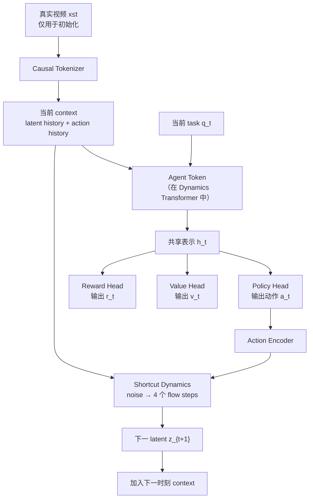
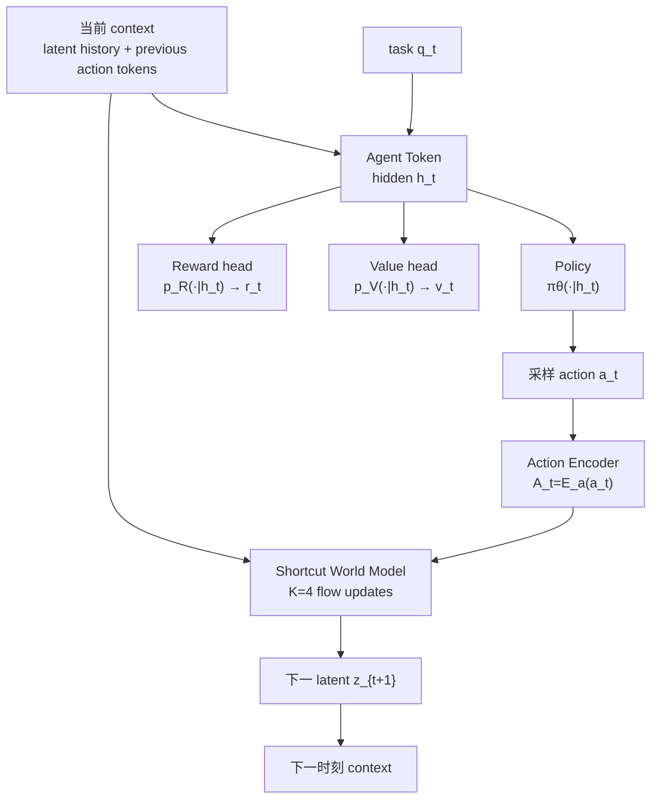

# Dreamer 4 技术报告：可扩展世界模型中的想象训练、Shortcut Forcing 与 Flow Policy 强化学习

> 基于论文 **Training Agents Inside of Scalable World Models**（Dreamer 4，Hafner, Yan, Lillicrap，2025）以及围绕公式、架构与强化学习接口的讨论整理。
>
> 报告版本：2026-08-17
>
> 论文定位：大规模生成式世界模型、离线强化学习、交互式视频生成、Minecraft 长时程控制。

---

## 摘要

Dreamer 4 的核心目标，是把 Dreamer 系列中适合控制但容量有限的 latent world model，升级为一个**可扩展、动作可控、长 rollout 相对稳定且足够快**的生成式世界模型，并让智能体直接在该模型内部进行强化学习。论文在 Minecraft 上展示：仅使用固定离线数据，不在训练阶段访问真实环境，智能体仍能通过 imagined rollouts 改进策略，并首次在该设定下获得钻石。

系统由三阶段构成：

1. **世界模型预训练**：训练 causal tokenizer，将视频压缩为连续 latent；训练 action-conditioned dynamics，以 Shortcut Forcing 生成未来 latent。
2. **Agent finetuning**：向 dynamics Transformer 插入 task-conditioned agent tokens，学习策略与奖励模型。
3. **Imagination training**：策略在世界模型中采样动作，世界模型生成未来状态，reward/value heads 标注 imagined trajectory，再用 PMPO 更新策略。

本文重点澄清以下容易混淆的问题：

- Flow Matching 生成的是**未来视觉 latent**，而不是 Dreamer 4 中的动作；动作由 categorical/Bernoulli policy 直接采样。
- `x-prediction` 只规定网络输出 clean endpoint，并不意味着必须一步采样；Dreamer 4 仍选择 4 个 shortcut steps 以换取质量。
- Shortcut Model 中，$\tau$ 是 flow 路径起点，$d$ 是沿 flow 时间轴的步长；二者是条件采样关系，不是同一个变量。
- Formula (7) 用 x-space 输出，但构造 bootstrap 时仍临时转回 velocity；除以 $1-\tau$ 来自“剩余 flow 时间”。
- PMPO 只使用 advantage 的符号，将 imagined actions 分为正、负两组，并用行为克隆策略作为 prior 约束分布外行为。
- Flow Matching policy 与经典 policy gradient 的难点主要是 endpoint likelihood 难算；已有 DPPO、ReinFlow、FPO 等路线可用于连接生成式策略和强化学习。

---

## 1. 研究问题与论文定位

### 1.1 世界模型要成为 RL 训练环境，必须同时满足什么？

一个仅用于“看起来合理”的视频生成器，并不一定能用来训练智能体。作为 imagined environment，它至少要满足三项要求：

1. **动作因果性准确**：给定动作后，物体交互和游戏规则必须正确响应，不能只是视觉自补全。
2. **逐帧 rollout 稳定**：前一帧的细小生成误差会成为后一帧的输入，模型必须避免快速累积成崩坏。
3. **推理足够快**：强化学习需要生成海量 imagined transitions；若每帧需要几十次大型网络前向，训练成本不可接受。

Dreamer 3 类型的 RSSM 具有高效控制能力，但较难拟合复杂、高分辨率的视频分布；现代 diffusion/flow 视频模型容量高，却常在精确物理、长时一致性和实时交互方面不足。Dreamer 4 的工作可以理解为：

> 将 Dreamer 的 latent imagination RL，与现代高容量视频生成模型的可扩展架构合并。

---

## 2. Dreamer 4 的整体系统

本节先建立一张总图，再分别说明单步数据流、训练阶段、时间索引和冻结范围；具体模块的
推导放在后面的专节，不在这里重复展开。

Dreamer 4 可以分成两个相互连接、但职责不同的部分：

- **World Model**：Causal Tokenizer 将视频压缩为连续 latent，Interactive Dynamics 根据
  latent history 和 action history 生成未来 latent。
- **Agent**：Agent Token 读取 world-model context 和外部 task，产生 policy、reward、
  value 三个 head 的条件表示；policy 的动作再通过 Action Encoder 回到 World Model。

因此，Dreamer 4 的核心不是“一个 flow 模型生成所有东西”，而是：

$$
\text{policy 生成动作}
\qquad\neq\qquad
\text{Shortcut Dynamics 生成未来视觉 latent}.
$$

### 2.1 DreamerV4 完整训练算法流程



DreamerV4 与 DreamerV3 最大的训练流程差异是：

> **DreamerV4 使用固定的 offline dataset 训练，不会在训练过程中不断用新 Actor 回真实环境采集新数据。**

整体流程为：

$$
\boxed{
\text{Offline Dataset}
\rightarrow
\text{World Model Pretraining}
\rightarrow
\text{Agent Finetuning}
\rightarrow
\text{Imagination RL}
\rightarrow
\text{Final Policy}
}
$$

其中只有最后的 Final Policy 会进入真实环境进行 evaluation。

---

#### Phase 1：World Model Pretraining

首先使用固定的离线视频/动作数据：

$$
(x_{1:T},a_{1:T})
$$

训练世界模型。

##### 1. Causal Tokenizer

将真实视频编码成 latent：

$$
z_t=f_{\mathrm{tok}}(x_{\le t})
$$

同时通过 Decoder 重建 observation：

$$
z_t\rightarrow \hat x_t
$$

Tokenizer 的主要训练目标为：

$$
\mathcal L_{\mathrm{tok}}
=
\mathcal L_{\mathrm{MSE}}
+
0.2\mathcal L_{\mathrm{LPIPS}}
$$

其作用是学习适合视频 dynamics 建模的连续 visual latent。

---

##### 2. Interactive Dynamics

利用：

$$
(z_{\le t},\mathbf A_{\le t})
$$

学习未来 latent 的生成：

$$
z_{t+1}
\sim
p_{\mathrm{dyn}}
\left(
\cdot
\mid
z_{\le t},
\mathbf A_{\le t}
\right)
$$

其中：

$$
a_t
\xrightarrow{\text{Action Encoder}}
\mathbf A_t
$$

Dynamics 使用：

- Diffusion Forcing；
- Shortcut Model；
- x-prediction；
- x-space loss；
- ramp weighting；

来学习少步、稳定的未来视频 latent 生成。

这一阶段最终得到一个由 Causal Tokenizer 和 Interactive Dynamics 组成的预训练世界模型：

$$
\text{Causal Tokenizer}
+
\text{Interactive Dynamics}
\Longrightarrow
\text{Pretrained World Model}.
$$

---

#### Phase 2：Agent Finetuning

World Model 训练完成后，在 Transformer 中加入 task-conditioned Agent Tokens。

当前世界 context 定义为：

$$
\mathcal C_t
=
\left(
z_{\le t},\mathbf A_{<t}
\right).
$$

Agent Token 根据当前 context 与任务 $q_t$ 得到：

$$
h_t
=
\operatorname{AgentToken}_{\phi}
\left(
\mathcal C_t,q_t
\right).
$$

然后从共享的 Agent representation $h_t$ 上训练不同 heads。

---

##### 1. Behavior Cloning Policy

使用真实 offline action 训练：

$$
\pi_{\mathrm{BC}}(a_t\mid h_t)
$$

即：

$$
\mathcal L_{\mathrm{BC}}
=
-\log\pi_{\mathrm{BC}}(a_t\mid h_t).
$$

Policy 学习数据集中人类/行为策略的动作分布。

---

##### 2. Reward Model

利用 offline dataset 中已有的 reward / event supervision 学习：

$$
p_R(r_t\mid h_t)
$$

得到之后 imagination rollout 中使用的 Reward Head。

---

##### 3. 继续保持 Video Prediction Objective

Agent finetuning 时不会完全停止 world-model objective。

仍继续施加 Dynamics 的 video-prediction / Shortcut Forcing loss：

$$
\mathcal L_{\mathrm{video}}
$$

其目的不是新增一种 Dynamics loss，而是：

> **避免加入 Agent Token、Policy Head 和 Reward Head 后破坏已经学好的 World Model。**

因此 Phase 2 可以概括为：

$$
\boxed{
\mathcal L_{\mathrm{Phase2}}
=
\mathcal L_{\mathrm{video}}
+
\mathcal L_{\mathrm{BC}}
+
\mathcal L_{\mathrm{reward}}
}
$$

---

##### Phase 2 的结果

训练完成后得到三个组件：World Model、Reward Model 和 BC Policy。

随后 BC Policy 分成两个角色：

$$
\boxed{
\pi_{\mathrm{BC}}
\rightarrow
\begin{cases}
\pi_\theta, & \text{作为 RL policy 的初始化},\\
\pi_{\mathrm{prior}}, & \text{复制并冻结为 behavioral prior}.
\end{cases}
}
$$

同时初始化 Value Head：

$$
V_\psi(h_t)
$$

然后进入真正的 Imagination RL。

---

#### Phase 3：Imagination Training

这是 DreamerV4 真正进行强化学习的阶段。

每次 imagined rollout **从真实 offline dataset 中的一段 context 开始**：

$$
\mathcal C_0
\sim
\mathcal D_{\mathrm{offline}}.
$$

但一旦开始 imagination，之后的未来状态和动作都不再来自真实数据。

---

##### 1. 当前 Agent 状态

根据 imagined history：

$$
\mathcal C_t
=
\left(
z_{\le t},\mathbf A_{<t}
\right).
$$

和当前任务：

$$
q_t
$$

得到：

$$
h_t
=
\operatorname{AgentToken}_{\phi}
\left(
\mathcal C_t,q_t
\right).
$$

---

##### 2. Policy 采样 imagined action

Policy 输出动作分布：

$$
\pi_\theta(a_t\mid h_t)
$$

并采样：

$$
a_t
\sim
\pi_\theta(\cdot\mid h_t).
$$

然后 Action Encoder 将动作转换为 action tokens：

$$
\mathbf A_t
=
E_a(a_t).
$$

---

##### 3. World Model imagined transition

当前动作进入 World Dynamics：

$$
(z_{\le t},\mathbf A_{\le t})
\rightarrow
z_{t+1}
$$

DreamerV4 中一个 environment step 内部需要运行多个 Shortcut flow steps，例如：

$$
\tau:
0
\rightarrow
\frac14
\rightarrow
\frac12
\rightarrow
\frac34
\rightarrow
1
$$

最终得到 clean future latent：

$$
z_{t+1}
$$

因此：

$$
\boxed{
1\ \text{environment step}
\neq
1\ \text{flow step}
}
$$

---

##### 4. 形成 imagined trajectory

不断重复：

$$
h_t
\rightarrow
a_t
\rightarrow
z_{t+1}
\rightarrow
h_{t+1}
\rightarrow
a_{t+1}
\rightarrow
z_{t+2}
\rightarrow
\cdots
$$

于是得到 imagined trajectory：

$$
\mathcal T
=
\left\{
(z_t,q_t,h_t,a_t,r_t,c_t,z_{t+1})
\right\}_{t=0}^{H}.
$$

其中一个 transition 可以写成：

$$
\boxed{
(z_t,q_t,h_t)
\xrightarrow{\pi_\theta}
a_t
\xrightarrow{\text{World Model}}
(r_t,c_t,z_{t+1})
}
$$

---

##### 5. Reward 与 Value

Reward Head 对 imagined state 给出：

$$
r_t
\sim
p_R(\cdot\mid h_t).
$$

Value Head 给出：

$$
v_t
=
V_\psi(h_t).
$$

注意两者角色不同：

- Reward Model 在 Phase 2 使用真实数据训练；
- Value Head 主要在 Phase 3 使用 imagined return 学习。

---

##### 6. 计算 $\lambda$-Return

根据 imagined rewards 和 values：

$$
R_t^\lambda
=
r_t+\gamma c_t
\left[
(1-\lambda)v_{t+1}
+
\lambda R_{t+1}^\lambda
\right].
$$

其中：

$$
c_t
$$

表示 continuation / non-terminal signal。

$\lambda$-return 综合：

- 当前 imagined reward；
- 后续 imagined rewards；
- Value bootstrap；

得到 Actor 与 Value 的学习目标。

---

##### 7. Value Learning

Value Head 学习预测 imagined $\lambda$-return：

$$
V_\psi(h_t)
\approx
R_t^\lambda
$$

因此：

$$
\boxed{
\text{Imagined trajectory}
\rightarrow
R_t^\lambda
\rightarrow
\text{Value learning}
}
$$

---

##### 8. Advantage

计算：

$$
A_t
=
R_t^\lambda-v_t.
$$

DreamerV4 的 PMPO 不直接使用 advantage 的大小，而主要使用其符号：

$$
A_t\ge0
\Rightarrow
\text{positive sample}
$$

$$
A_t<0
\Rightarrow
\text{negative sample}
$$

---

##### 9. PMPO 更新 Policy

定义：

$$
D^+
=
\left\{
(h_t,a_t):A_t\ge0
\right\}.
$$

$$
D^-
=
\left\{
(h_t,a_t):A_t<0
\right\}.
$$

Policy 更新包含三部分：

- 对正 advantage 动作提高概率；
- 对负 advantage 动作降低概率；
- 用 BC Prior 约束 policy 不要离开 offline data support。

即：

$$
\mathcal L_\pi
=
\mathcal L_{\mathrm{PMPO}}
+
\beta D_{\mathrm{KL}}
\left(
\pi_\theta
\Vert
\pi_{\mathrm{prior}}
\right).
$$

其中：

$$
\pi_{\mathrm{prior}}
$$

是 Phase 2 得到并冻结的 BC Policy。

---

#### Phase 3 内部循环

因此 Imagination RL 本身形成一个循环：

$$
\boxed{
\pi_k
\rightarrow
\text{Imagined Rollout}
\rightarrow
R^\lambda
\rightarrow
A
\rightarrow
\text{PMPO + Value Update}
\rightarrow
\pi_{k+1}
}
$$

然后新的 Policy：

$$
\pi_{k+1}
$$

再次进入 **World Model** 中生成新的 imagined rollout。

注意：

> **这里不会拿 $\pi_{k+1}$ 回真实 Minecraft 收集新的训练数据。**

整个强化学习循环发生在 learned world model 中。

---

#### 默认参数更新范围

进入 Phase 3 后，默认的参数更新范围如下：

| 模块 | Phase 3 状态 |
| --- | --- |
| Tokenizer | Freeze |
| Dynamics | Freeze |
| Reward Model | Freeze |
| BC Prior | Freeze |
| Policy Head | Train |
| Value Head | Train |

因此 DreamerV4 的 World Model 在这一阶段更像一个已经训练好的 imagined environment。

---

#### DreamerV4 完整算法主线

最终可以压缩成：

$$
\boxed{
\begin{aligned}
\text{Offline Data}
&\rightarrow \text{Tokenizer + Dynamics}\\
&\rightarrow \text{BC Policy + Reward Model}\\
&\rightarrow \text{Real Context}\\
&\rightarrow \text{Imagined Rollout}\\
&\rightarrow \text{Reward + Value}\\
&\rightarrow \lambda\text{-Return}\\
&\rightarrow \text{Advantage}\\
&\rightarrow \text{PMPO + Value Update}\\
&\rightarrow \text{Improved Policy}
\end{aligned}
}
$$

其中真正的 Imagination RL 闭环是：

$$
\boxed{
h_t
\xrightarrow{\text{Policy}}
a_t
\xrightarrow{\text{Action Encoder}}
\mathbf A_t
\xrightarrow{\text{World Dynamics}}
z_{t+1}
\xrightarrow{\text{Agent Token}}
h_{t+1}
}
$$

---

#### 与 DreamerV3 的核心流程区别

DreamerV3 更接近：

$$
\boxed{
\text{Real Rollout}
\rightarrow
\text{Replay Buffer}
\rightarrow
\text{World Model}
\rightarrow
\text{Imagination}
\rightarrow
\text{Actor/Critic}
\rightarrow
\text{Real Rollout}
}
$$

真实环境 interaction 和 imagination 在训练过程中不断交替。

DreamerV4 则是：

$$
\boxed{
\text{Fixed Offline Data}
\rightarrow
\text{World Model}
\rightarrow
\text{BC + Reward}
\rightarrow
\text{Imagination RL}
\rightarrow
\text{Final Policy}
}
$$

因此最关键的区别是：

> **DreamerV4 保留了 Dreamer 系列“在 World Model 中 imagination → Actor learning”的核心思想，但去掉了训练过程中反复回真实环境采集新数据的外循环。**

#### 图中节点的数学接口

$$
\left[
x_{\le t}
\xrightarrow{\text{Tokenizer}}
z_{\le t}
\xrightarrow{+\mathbf A_{<t},\,q_t}
h_t
\xrightarrow{\text{Policy}}
a_t
\xrightarrow{\text{Dynamics}}
z_{t+1}
\right]
$$
这其实就是 **DreamerV4 单个 environment step 的骨架**。

> **$z_t$ 是 task-independent 的世界表示；$\mathcal C_t$ 是当前可用的交互历史；$h_t$ 是 Agent Token 从“历史 + 当前任务”中提取出的 task-conditioned 决策表示，policy/reward/value 都在这个表示上工作。**

$$
\boxed{
\begin{aligned}
x_{\le t}
&\xrightarrow{f_{\mathrm{tok}}}
z_{\le t},\\
\mathcal C_t
&=
\left(z_{\le t},\mathbf A_{<t}\right),\\
h_t
&=
\operatorname{AgentToken}_{\phi}
\left(\mathcal C_t,q_t\right),\\
a_t
&\sim
\pi_\theta(\cdot\mid h_t),\\
\mathbf A_t
&=
E_a(a_t),\\
z_{t+1}
&\sim
p_{\mathrm{dyn}}
\left(
\cdot\mid
z_{\le t},\mathbf A_{\le t}
\right).
\end{aligned}
}
$$

**1. Causal Tokenizer 与当前 context**

$$
z_t=f_{\mathrm{tok}}(x_{\le t}),
\qquad
\mathcal C_t\equiv\left(z_{\le t},\mathbf A_{<t}\right).
$$

这里用 $\mathcal C_t$ 表示当前 context，保留 $c_t$ 给 continuation mask。

**2. Agent Token 与共享状态**

$$
h_t=
\operatorname{AgentToken}_{\phi}\!\left(\mathcal C_t,q_t\right).
$$

**3. Policy、Reward、Value 三个 head**

$$
a_t\sim\pi_{\theta}\!\left(\cdot\mid h_t\right),
\qquad
r_t\sim p_R\!\left(\cdot\mid h_t\right),
\qquad
v_t=\mathbb E_{u\sim p_V(\cdot\mid h_t)}[u].
$$

其中 policy 输出动作分布，reward head 输出 reward 预测分布，value head 输出 value
分布，其期望 $v_t$ 用于 bootstrap。

**4. Action Encoder**

若动作由 $m$ 个组件组成：

$$
a_t=\left(a_t^{(1)},\ldots,a_t^{(m)}\right),
\qquad
\mathbf A_t
=E_a(a_t)
=E_{\mathrm{base}}+\sum_{i=1}^{m}E_i\!\left(a_t^{(i)}\right).
$$

这里的 $\mathbf A_t$ 才是送入 World Model 的 action tokens；它不是 advantage $A_t$。

**5. Shortcut Dynamics 与下一 latent**

先从噪声初始化待生成的下一 latent，再执行 $K$ 个 flow updates：

$$
\tilde z_{t+1}^{(0)}\sim\mathcal N(0,I),
$$

$$
\tilde z_{t+1}^{(k+1)}
=\operatorname{FlowStep}_{\phi}\!\left(
\tilde z_{t+1}^{(k)},\tau_k,d,\mathcal C_t,\mathbf A_t
\right),
\qquad k=0,\ldots,K-1.
$$

默认 $K=4$，因此：

$$
\tau_k=\frac{k}{K},
\qquad
d=\frac{1}{K},
\qquad
z_{t+1}=\tilde z_{t+1}^{(K)}.
$$

$\operatorname{FlowStep}_{\phi}$ 把 x-prediction、velocity 转换和 shortcut 更新封装起来；
具体采样公式见第 4–5 节。

**6. 下一时刻 context 与 transition**

$$
\mathcal C_{t+1}
=\left(z_{\le t+1},\mathbf A_{\le t}\right),
$$

一个环境时间步可以整体记为：
$$
\boxed{
(z_t,q_t,h_t)
\xrightarrow{\;\pi_\theta\;}
a_t
\xrightarrow{\;\text{World Dynamics}\;}
(r_t,c_t,z_{t+1})
}
$$
$$
\boxed{
\mathcal T_t
=
\underbrace{(z_t,q_t,h_t)}_{\text{pre-action state}}
,\;
\underbrace{a_t}_{\text{action}}
,\;
\underbrace{(r_t,c_t,z_{t+1})}_{\text{post-action outcome}}
}
$$

其中 $c_t$ 只表示 continuation / non-terminal signal，用于决定是否继续 bootstrap，
不是图中的独立 prediction head。

只按一条主链读这张图：

1. 当前 context 和 task $q_t$ 经过 Agent Token，得到共享表示 $h_t$；
2. $h_t$ 同时提供 policy、reward 和 value 三个 head 的输入，但只有 policy 产生动作
   $a_t$；
3. $a_t$ 经过 Action Encoder，与当前 context 一起输入 Shortcut Dynamics，生成
   $z_{t+1}$，再把它追加到下一时刻的 context。

这里有两个必须分开的生成过程：**Policy 生成动作，Shortcut Dynamics 生成下一视觉
latent**。真实数据阶段，视频经 Tokenizer 提供初始 context；imagination 阶段只使用这
个初始 context，后续 $z_{t+1}$ 都由 World Model 生成，不再读取未来真实视频。

### 2.2 三个训练阶段各自做什么？

#### Phase 1：World Model Pretraining

先训练 Causal Tokenizer，使视频帧可以被压缩和重建；再训练 Interactive Dynamics，使它在
给定 latent history、action history 和 flow 条件时预测未来 clean latent。此时还没有
task-conditioned Agent Token、policy improvement 或 PMPO，目标只是得到一个可交互的 latent
world model。

#### Phase 2：Agent Finetuning

固定 Tokenizer，用它产生 latent；在 Dynamics Transformer 中加入 task-conditioned Agent
Tokens。Agent Token 读取 world-model context 和 task，训练 policy head 与 reward head，
其中动作和 reward 使用 MTP 监督；同时继续保留 dynamics/video prediction objective，避免
为了学会 task 输出而破坏世界模型。这个阶段结束后，得到行为克隆策略 $\pi_{\mathrm{BC}}$
和 task-conditioned reward model。

#### Phase 3：Imagination Training

从离线数据的真实 context 启动 latent rollout，不访问真实环境。默认冻结 Tokenizer、
Dynamics Transformer、Agent Token 表征和 reward model；把 $\pi_{\mathrm{BC}}$ 复制成冻结的
$\pi_{\mathrm{prior}}$，当前 policy 从 $\pi_{\mathrm{BC}}$ 开始继续训练，并新建 value
head。每个 imagined transition 由 policy 采样动作、Shortcut Dynamics 生成下一 latent、
reward/value heads 提供学习信号，最后用 $\lambda$-return 训练 value，用 PMPO 更新 policy。
具体目标见第 10–11 节。

### 2.3 一个环境步与 flow step 的关系

Dreamer 4 的“环境时间步”和 flow 采样时间不是同一层级：

$$
\boxed{
1\ \text{environment step}
=
1\ \text{policy action sample}
+K\ \text{Shortcut flow updates}
}
$$

论文默认每个未来 latent 使用 $K=4$ 个 shortcut steps。也就是说，policy 只决定一次
$a_t$；Action Encoder 将它编码后，Shortcut Dynamics 再用多个 flow 更新得到
$z_{t+1}$。flow 的 $\tau$、步长 $d$、x-prediction 和 bootstrap 目标统一放在第 4–6 节
说明，这里不重复展开采样公式。

### 2.4 默认的 Train / Freeze 范围

| 模块 | Phase 1：World Model | Phase 2：Agent Finetuning | Phase 3：Imagination RL |
|---|---|---|---|
| Causal Tokenizer | Train | Freeze | Freeze；不参与 latent rollout |
| Dynamics Transformer | Train | Finetune，并保留 dynamics/video loss | 默认 Freeze |
| Agent Token | 尚未加入 | 加入并训练 | 随 Transformer 默认 Freeze |
| Policy Head | 尚未加入 | MTP / BC Train | PMPO Train |
| Reward Head | 尚未加入 | MTP reward Train | Freeze，作为 imagined reward source |
| Value Head | 尚未加入 | 尚未用于 RL | 初始化并训练 |
| $\pi_{\mathrm{prior}}$ | 不存在 | 由 $\pi_{\mathrm{BC}}$ 复制 | Freeze |

论文也讨论了全量 finetune Transformer 的变体，但那不是默认 Phase 3 流程；若采用该变体，
需要同时继续施加 dynamics、prior 和 reward loss，防止世界模型和行为先验退化。

### 2.5 时间索引与模块接口

为了避免把 reward、action 和 next latent 错位，第 2.1 节给出了完整的 transition tuple；
本节只说明各字段的时间对齐和用途。

| 符号 | 含义 |
|---|---|
| $z_t$ | 当前视频时间步的 continuous latent，或 imagination 中的当前 latent |
| $q_t$ | 外部提供的 task condition；Minecraft 实验使用 task indicator |
| $h_t$ | Agent Token 的 hidden representation，供三个 head 使用 |
| $a_t$ | policy 在时间 $t$ 采样的动作，经 Action Encoder 送入 dynamics |
| $r_t$ | 与时间 $t$ 对齐的 reward annotation / reward-head 输出 |
| $c_t$ | continuation / non-terminal mask，用于决定是否继续 bootstrap |
| $z_{t+1}$ | 执行动作 $a_t$ 后由 Shortcut Dynamics 生成的下一 latent |

主因果关系是：

$$
z_t,q_t\rightarrow h_t\rightarrow a_t\rightarrow z_{t+1},
\qquad
r_t,v_t\leftarrow h_t.
$$

这里的 $r_t$ 是和 $h_t$ 对齐的时间步标注；如果具体环境 API 把“执行 $a_t$ 后返回的奖励”
记作 $r_{t+1}$，只需要整体平移记号。论文只说明 $c_t$ 是 non-terminal signal，没有把它
定义成单独的 continuation head；因此不能把 $c_t$ 擅自写成 reward 或 value head 的输出。
第 10 节再使用这套记号定义 $\lambda$-return。


---

## 3. Figure 2 逐层解读

> [!figure] 论文原始模型结构图
> ![[attachments/paper-figures/dreamer4-world-model-architecture.png]]
> Dreamer 4 的世界模型设计：Causal Tokenizer 与 Interactive Dynamics。原图来自 [Training Agents Inside of Scalable World Models（arXiv:2509.24527）](https://arxiv.org/abs/2509.24527)，由论文 Figure 2 的两个矢量面板按原布局合成。

论文第 4 页 Figure 2 分成两个部分：左侧是 Causal Tokenizer，右侧是 Interactive Dynamics。策略、奖励和价值 heads 是预训练后插入的，因此 Figure 2 主体没有完整画出 imagination RL 的闭环。

### 3.1 Figure 2(a)：Causal Tokenizer

#### 输入与编码

每帧图像被划分为 patch tokens，同时加入 learned latent tokens：

```text
图像 patch tokens + learned latent tokens
                  │
                  ▼
        Block-Causal Encoder
                  │
                  ▼
        Linear + tanh bottleneck
                  │
                  ▼
          压缩表示 z_t
```

Minecraft 配置中：

- 原始图像：$360\times640$；
- padding 后：$384\times640$；
- patch size：$16\times16$；
- 原始 patch tokens：960；
- dynamics 使用的空间 latent tokens：256。

#### 解码

$z_t$ 被升维，再与 learned decoder tokens 组合，恢复图像 patches：

```text
z_t → 高维投影 → Block-Causal Decoder → 重建图像
```

#### 为什么是 causal tokenizer？

它允许：

$$
z_t = f(x_{\le t}),
$$

即当前帧可以利用过去帧的信息进行时间压缩，但不能看未来；同时仍可逐帧在线编码和解码。

#### 训练目标

$$
\mathcal L_{\text{tok}}
=\mathcal L_{\text{MSE}}+0.2\mathcal L_{\text{LPIPS}}.
$$

训练时还随机 mask 0%–90% 的输入 patches。Masked autoencoding 不仅改善重建表示，论文还观察到它能提升 dynamics 生成视频时的空间一致性。

---

### 3.2 Figure 2(b)：Interactive Dynamics

Figure 2(b) 描绘的是 **Interactive Dynamics 的 world-model backbone**，不是完整的 Agent
闭环。它要解决两个问题：

1. 把动作、flow 条件和当前带噪的视觉 latent 放进同一个时间 block；
2. 让当前 block 读取过去 block 的信息，并为每个带噪 latent 预测对应的 clean latent。

所以，训练时它是一个可以并行处理整段序列的 latent denoiser；推理时才沿环境时间逐帧
使用，生成下一个 latent。

#### 3.2.1 一个环境时间步对应一个 token block

Tokenizer 产生的不是一个单独的视觉向量，而是每帧的连续空间 latent。以下用
$z_t^1$ 表示 clean latent，用 $\tilde z_t$ 表示加噪后的 latent：

$$
\mathbf{Z_t^1}
$$
$$
\tilde{\mathbf Z}_t
$$

动作也先被编码成 token 序列：

$$
\mathbf A_t=E_a(a_t)\in\mathbb R^{S_a\times D}.
$$

如果动作有 mouse、keyboard 等多个 component，它们分别编码后相加；无动作标签的视频只
使用 learned action embedding。

Shortcut 条件由一个 token 提供。它同时携带当前 signal level 和本次请求的 step size：

$$
\mathbf u_t=\operatorname{concat}\!\left(e_{\tau}(\tau_t),e_d(d_t)\right)\in\mathbb R^D.
$$

此外，模型还加入 $S_r$ 个 learned register tokens，作为 Transformer 内部跨空间位置
共享的工作区，而不是要被解码成图像的内容。于是一个环境时间步可以抽象为：

$$
B_t=\left[\mathbf A_t;\ \mathbf u_t;\ \tilde{\mathbf Z}_t;\ \mathbf R_t\right],
\qquad
\mathbf R_t\in\mathbb R^{S_r\times D}.
$$

这里的分号表示 token 序列拼接。$B_t$ 是一个 block，不是一个 token；其中同时包含
动作条件、去噪条件、空间 latent tokens 和 register tokens。

#### 3.2.2 Block-Causal Transformer 如何读取这些 block？

整段输入是按环境时间排列的 block 序列：

$$
B_{1:T}=\left(B_1,B_2,\ldots,B_T\right).
$$

它有两种不同的 attention，不能把它们都理解成普通的时间 self-attention：

- **Space Layer** 只在同一个 $B_t$ 内部混合 token。动作 token、$\mathbf u_t$、空间
  latent tokens 和 register tokens 可以在当前时间步交换信息；它回答的是“当前这个
  latent block 内部如何完成一次条件去噪”。
- **Causal Time Layer** 沿环境时间连接不同 block。第 $t$ 个 block 可以读取
  $B_1,\ldots,B_{t-1}$，以及当前的 $B_t$，但不能读取未来的 $B_{t+1:T}$；它回答的
  是“当前 latent 应该如何利用历史动作和历史视觉 context”。

用 attention 的可见范围写，就是：

$$
\operatorname{Space}:\quad B_t\leftarrow B_t,
\qquad
\operatorname{Causal\ Time}:\quad B_t\leftarrow B_{\le t}.
$$

Figure 2 中的重复单元包含 3 个 Space Layers 和 1 个 Causal Time Layer，大约重复
$L/4$ 次：

$$
\left[\text{Space Layer}\times 3+\text{Causal Time Layer}\right]^{L/4}.
$$

这就是它同时具备空间建模能力和长时 rollout 能力的原因：大部分层在便宜地处理一帧
内部的空间 token，只有每 4 层插入一次时间 attention 来传递历史信息。它不是严格的
“一个 token 接一个 token”生成，而是“当前 block 内并行交互、block 之间保持因果”。

#### 3.2.3 模型到底预测什么？

Dynamics 的输入是整段序列中每个时间位置的 action、noise condition 和 noisy latent，
输出是每个位置对应的 clean latent：

$$
\hat z_{1:T}^{1}
=f_{\theta}\!\left(\tilde z_{1:T},\tau_{1:T},d_{1:T},a_{1:T}\right).
$$

由于时间 attention 是 causal 的，第 $t$ 个输出只能依赖当前及过去 block：

$$
\hat z_t^1
=\operatorname{Readout}_{\tilde z_t}\!\left(F_{\theta}(B_{\le t})\right).
$$

这里是 **x-prediction**：网络直接预测 clean endpoint $z_t^1$，不是直接预测环境动作，
也不是把 RGB 图像作为 Dynamics 的输出。Shortcut rollout 需要的 velocity 转换和
bootstrap 细节放在第 4–5 节。

还要区分三个不同的“时间”：

| 记号 | 含义 |
|---|---|
| $t$ | 环境/视频序列中的第几个 block |
| $\tau_t$ | 当前 block 的 flow signal level，$0$ 是纯噪声，$1$ 是 clean |
| $d_t$ | 当前 shortcut update 希望跨越的 flow step size |

Diffusion Forcing 为不同环境时间位置设置不同的 $\tau_t$。典型的 noisy latent 为：

$$
\tilde z_t=(1-\tau_t)z_t^0+\tau_tz_t^1,
\qquad
z_t^0\sim\mathcal N(0,I).
$$

因此 $t$ 不是 $\tau_t$，$d_t$ 也不是环境时间步；它们分别描述序列位置、当前噪声
程度和本次 flow 更新的跨度。

#### 3.2.4 训练时和 rollout 时分别怎样使用？

训练时，整段真实视频先经冻结 Tokenizer 得到 $z_{1:T}^1$，再为每个环境时间位置
采样自己的 $\tau_t$、$d_t$ 和 noisy latent。模型一次前向同时预测多个时间位置的
clean latent，并用 shortcut forcing objective 训练。这是“序列并行训练”，不是 rollout
时的逐帧生成。

推理时，历史 block 保留为干净或轻微加噪的 context，把下一帧的 latent 初始化为纯噪声，
并固定 $K=4$、$d=1/4$ 做 shortcut sampling：

$$
\tau_{\mathrm{ctx}}\approx0.1,
\qquad
\tilde z_{t+1}^{(0)}\sim\mathcal N(0,I),
\qquad
d=\frac14,\quad K=4.
$$

4 次 flow forward 只生成一个新的环境 latent $z_{t+1}$，不是执行 4 个环境动作。生成
完成后把 $z_{t+1}$ 追加进 context，再进入下一个环境时间步；RL rollout 中也不需要每一步
把 latent 解码回 RGB。


---

## 4. Flow Matching、Shortcut Model 与 Diffusion Forcing

### 4.1 Flow Matching 基础

定义线性插值路径：

$$
x_\tau=(1-\tau)x_0+\tau x_1,
\qquad x_0\sim\mathcal N(0,I),\quad x_1\sim\mathcal D.
$$

其中：

- $\tau=0$：纯噪声；
- $\tau=1$：干净数据；
- 线性路径的真实速度：

$$
v=x_1-x_0.
$$

标准 flow matching 训练：

$$
\mathcal L(\theta)=
\left\|f_\theta(x_\tau,\tau)-(x_1-x_0)\right\|_2^2.
$$

Euler 推进：

$$
x_{\tau+d}=x_\tau+d\,f_\theta(x_\tau,\tau).
$$


---

### 4.2 Shortcut Model：Formula (3) 做了什么？

Shortcut model 将网络写成：

$$
f_\theta(x_\tau,\tau,d),
$$

即网络不仅知道当前 flow 位置，还知道“这一次希望跨多大的步”。

设：

$$
d_{\min}=1/K_{\max}.
$$

训练分成两种情况。这么做是为了让模型训练1/64 step 长度, 但是可以在后续推理时候用1/2, 1/4, 1/8这样的step进行. 让模型获得“少步生成能力”

关键 insight：

$$
\boxed{
x_1-x_0
\neq
v^*(x_t,t)
}
$$

单个 Flow Matching 样本提供的监督信号是：

$$
v_{\mathrm{sample}}
=
x_1-x_0
$$

但模型真正学习的是条件期望速度场：

$$
\boxed{
v^*(x_t,t)
=
\mathbb{E}
\left[
x_1-x_0
\mid
x_t,t
\right]
}
$$

因此，**单个样本的速度标签**和**模型最终学到的 velocity field**不是一回事。

Shortcut 进一步学习的是有限步长 $d$ 上的平均速度：

$$
\boxed{
s(x_t,t,d)
=
\frac{1}{d}
\int_t^{t+d}
v(x(\tau),\tau)\,d\tau
}
$$

因此整个关系可以概括为：

$$
\boxed{
\text{sample velocity}
\;\longrightarrow\;
\text{expected velocity field}
\;\longrightarrow\;
\text{finite-step shortcut}
}
$$

#### 情况 A：$d=d_{\min}$

最小步没有更细的 $d/2$ 模型可供蒸馏，因此直接使用真实 flow target：

$$
v_{\text{target}}=x_1-x_0.
$$

#### 情况 B：$d>d_{\min}$

用两个连续的半步构造大步 target：

$$
b'=f_\theta(x_\tau,\tau,d/2),
$$

$$
x'=x_\tau+b'\frac d2,
$$

$$
b''=f_\theta(x',\tau+d/2,d/2).
$$

两步总位移为：

$$
\frac d2 b'+\frac d2 b''
=d\frac{b'+b''}{2}.
$$

所以一个长度 $d$ 的大步应输出平均速度：

$$
v_{\text{target}}
=\operatorname{sg}\left(\frac{b'+b''}{2}\right).
$$

`sg` 是 stop-gradient，使 target 在当前更新中被视为常量。

#### $\tau$ 与 $d$ 是否独立采样？

不是。更准确的联合分布为：

$$
p(\tau,d)=p(d)p(\tau\mid d).
$$

先选尺度 $d$，再从该尺度的合法起点网格采样 $\tau$：

$$
\tau\in\{0,d,2d,\ldots,1-d\}.
$$

这样保证 $\tau+d\le 1$，且 bootstrap 的半步网格对齐。

---

### 4.3 Diffusion Forcing 具体做了什么？

普通 full-sequence diffusion 往往给整段序列使用同一个 signal level。Diffusion Forcing 则给每个环境时间步独立设置：

$$
\tau_1,\tau_2,\ldots,\tau_T.
$$

各位置分别加噪：

$$
\tilde z_t=(1-\tau_t)z_t^0+\tau_tz_t^1.
$$

例如：

| 环境时间 | $t=1$ | $t=2$ | $t=3$ | $t=4$ |
|---|---:|---:|---:|---:|
| signal level | 1.0 | 0.8 | 0.3 | 0.0 |
| 含义 | 干净历史 | 轻微破坏 | 高噪状态 | 待生成的纯噪声未来 |

由于时间注意力是 causal 的，每个位置同时扮演两种角色：

1. 自己是一个 denoising target；
2. 自己的带噪版本是后续时间步的 history context。

这使模型在训练时见到“不完美历史”，缓解逐帧 rollout 中训练—推理分布不匹配。推理时则可构造：

```text
历史帧：干净或轻微加噪
下一帧：纯噪声
```

然后逐帧生成未来。

#### Diffusion Forcing 与 Shortcut Model 的分工

| 方法 | 解决的问题 |
|---|---|
| Diffusion Forcing | 序列中不同环境时间位置可以处于不同去噪阶段，支持流式/交互式生成 |
| Shortcut Model | 每次网络前向可跨更大的 flow step，减少每帧采样步数 |
| Shortcut Forcing | 将二者结合，兼顾交互式序列建模与少步生成 |

---

## 5. Formula (7)：x-prediction、velocity 转换与 loss 尺度
$$
b'
=
\frac{
f_\theta\!\left(\tilde z,\tau,\frac{d}{2},a\right)-\tilde z
}{
1-\tau
},
\qquad
z'
=
\tilde z+b'\frac{d}{2}
$$

$$
b''
=
\frac{
f_\theta\!\left(
z',
\tau+\frac{d}{2},
\frac{d}{2},
a
\right)-z'
}{
1-\left(\tau+\frac{d}{2}\right)
}
$$

$$
\mathcal L(\theta)
=
\begin{cases}
\left\|
\hat z_1-z_1
\right\|_2^2,
&
d=d_{\min}
\\[8pt]
(1-\tau)^2
\left\|
\frac{\hat z_1-\tilde z}{1-\tau}
-
\operatorname{sg}
\left(
\frac{b_1+b_2}{2}
\right)
\right\|_2^2,
&
\text{otherwise}
\end{cases}
$$

### 5.1 网络直接预测 clean latent

Dreamer 4 的 dynamics 输出：

$$
\hat z^1=f_\theta(\tilde z,\tau,d,a).
$$

这与传统 v-prediction 不同：网络输出的是 clean endpoint 参数，而非直接输出 velocity。

但 **x-prediction 不等于 one-step generation**。给定 $\hat z^1$，采样器仍可只走一个小步，再重新估计 endpoint。

### 5.2 为什么 $b'$ 要除以 $1-\tau$？

线性路径满足：

$$
z_\tau=(1-\tau)z_0+\tau z_1.
$$

因此：

$$
z_1-z_\tau=(1-\tau)(z_1-z_0).
$$

所以从当前状态指向 endpoint 的隐含 velocity 为：

$$
v_\tau=\frac{z_1-z_\tau}{1-\tau}.
$$

把模型预测代入：

$$
b'=
\frac{f_\theta(\tilde z,\tau,d/2,a)-\tilde z}{1-\tau}.
$$

然后只推进半步：

$$
z'=\tilde z+b'\frac d2.
$$

这里：

- $d$ 始终是 flow-time step size；
- $b'$ 是 latent 对 flow time 的变化率；
- $b'd/2$ 才是 latent 位移。

### 5.3 为什么 bootstrap loss 乘 $(1-\tau)^2$？

x-space 与 v-space 的误差满足：

$$
\|\hat z_1-z_1\|_2^2
=(1-\tau)^2\|\hat v-v\|_2^2.
$$

因此 bootstrap 分支先在 velocity space 比较大步与两个半步，再乘 $(1-\tau)^2$，使其数值尺度接近 x-space flow loss。

### 5.4 为什么用了 x-prediction 仍然分 4 步？

当 $\tau=0,d=1$ 时，确实有：

$$
z_1=z_0+\frac{\hat z_1-z_0}{1-0}=\hat z_1,
$$

可以一步得到结果。但“一步可用”不代表“一步质量最佳”。低 signal level 下首次 endpoint 预测通常较粗糙；多步采样允许模型在中间状态上反复修正物体结构、位置和纹理。

Dreamer 4 推理选择：

$$
K=4,\qquad d=1/4,
$$

作为质量与计算量的折中。论文 Figure 8 显示 4-step Shortcut Forcing 已接近 64-step Diffusion Forcing 的生成质量。

### 5.5 x-error 是否天然比 v-error 更安全？

不是。若：

$$
\hat z_1=z_1+\epsilon_x,
$$

转换后一步误差为：

$$
\Delta z=\frac{d}{1-\tau}\epsilon_x.
$$

从纯数学缩放看，x-error 并不天然更小，$\tau\to1$ 时甚至会被放大。论文的经验假设是：

- clean latent $z_1$ 是结构化的数据目标；
- velocity $z_1-z_0$ 含有随机噪声带来的高频残差；
- 直接在 x-space 训练，更容易产生接近视频 latent manifold 的、结构化误差；
- 高频 off-manifold 误差在逐帧自回归 rollout 中更容易累积和放大。

消融也支持“x-space loss”比仅改变输出参数化更关键：Table 2 中，x-prediction 本身改善很小，而 x-space loss 使 FVD 从约 326 显著降至 151。

---

## 6. 低 signal level、数据集均值与 Ramp Weight

论文指出：低 signal level 的 flow matching 含有更少有效学习信号。

当 $\tau\approx0$ 时：

$$
z_\tau\approx z_0,
$$

输入几乎是与具体数据样本无关的高斯噪声。若用 MSE 预测 clean target，最优函数为条件均值：

$$
f^*(z_\tau,\text{context},a)
=\mathbb E[z_1\mid z_\tau,\text{context},a].
$$

极端情况下，若输入与目标独立，则退化为：

$$
\mathbb E[z_1].
$$

在多模态未来中，条件均值常是模糊或折中的结果，因此低 $\tau$ 的梯度虽然未必数值小，却较少提供样本级细节。

### 为什么 bootstrap target 更容易优化？

Flow target 涉及随机数据样本与随机噪声；在低 signal level 时，相似输入可能对应差异很大的 clean targets，条件方差较高。

Bootstrap target：

$$
\operatorname{sg}\left((b'+b'')/2\right)
$$

在给定当前输入、当前模型参数和采样配置后，是由两次确定性网络前向计算出的固定伪标签，因此优化方差通常更低。它并非永久不变，模型参数更新后也会变化；最小步的真实 flow supervision 负责把整个递归蒸馏链锚定到数据分布。

### Ramp Weight

论文使用：

$$
w(\tau)=0.9\tau+0.1.
$$

从：

$$
w(0)=0.1
$$

线性增长至：

$$
w(1)=1.
$$

低 signal level 仍保留训练，因为生成必须能从纯噪声开始；但模型容量更多地分配给包含样本细节的高 signal level。

---

## 7. 动作编码、Agent Tokens 与 Policy Head

### 7.1 Action Encoder：“各 action component 分别编码，再与 learned embedding 求和”

这里讨论的不是 Policy 如何预测动作，而是：

> **Policy 已经得到环境动作 $a_t$ 之后，如何把这个动作重新编码成 Transformer 可以处理的 action representation。**

整个方向是：

$$
\boxed{
h_t
\xrightarrow{\text{Policy Head}}
a_t
\xrightarrow{\text{Action Encoder}}
\mathbf A_t
\xrightarrow{\text{Dynamics}}
z_{t+1}
}
$$

其中：

- $h_t$：Agent Token 得到的当前决策表示；
- $a_t$：Policy 实际采样得到的环境动作；
- $\mathbf A_t$：动作经过 Action Encoder 后得到的 action tokens；
- $z_{t+1}$：World Dynamics 生成的下一时刻 visual latent。

---

#### 1. 一个 Minecraft action 由多个 component 组成

Minecraft 的一个动作不是单独的一个数，而是多个控制分量共同组成：

$$
a_t
=
\left(
a_t^{(1)},
a_t^{(2)},
\ldots,
a_t^{(m)}
\right).
$$

例如可以包含：

```text
mouse movement
forward
backward
jump
attack
use
...
```
设动作由多个组件组成：

$$
a_t=(a_t^{(1)},a_t^{(2)},\ldots,a_t^{(m)}).
$$

每个组件都编码为相同形状的 $S_a$ 个 token：

$$
E_i(a_t^{(i)})\in\mathbb R^{S_a\times D}.
$$

最终 action tokens 为逐元素相加：

$$
\mathbf{A}_t=E_{\text{base}}+
\sum_{i=1}^{m}E_i(a_t^{(i)}).
$$

这里不是拼接，也不是把原始动作数值相加。`learned embedding` 的作用包括：

- 标识 action modality；
- 提供固定数量的 action-token scaffold；
- 在无动作标签视频中作为 unknown-action/default condition。

论文明确说明：训练无标签视频时，只使用这个 learned embedding。

### 7.2 Action encoder 与 Policy head 不是同一个东西

| 模块 | 方向 | 功能 |
|---|---|---|
| Action encoder | 已知动作 $a_t\rightarrow\mathbf{A}_t$ | 把已执行动作提供给世界模型 |
| Policy head | 状态表示 $h_t\rightarrow\pi(a_t\mid h_t)$ | 决定下一步做什么 |

闭环为：

$$
h_t\xrightarrow{\text{policy}}a_t
\xrightarrow{\text{action encoder}}\mathbf{A}_t
\xrightarrow{\text{dynamics}}z_{t+1}.
$$

在本文语境中，policy head 本质上就是“输出动作分布的 action head”，不需要再额外增加一个独立 action-output head。

### 7.3 Agent token 的单向 attention

论文说：

> Agent tokens attend to themselves and all other modalities, but no other modality can attend back to agent tokens.

含义是 attention mask 单向开放：

| Query \ Key/Value | 世界 latent | 历史动作 | register | agent token |
|---|---:|---:|---:|---:|
| agent token | ✓ | ✓ | ✓ | ✓ |
| 世界 latent | ✓ | ✓ | ✓ | ✗ |
| action/register | ✓ | ✓ | ✓ | ✗ |

Agent token 注入 task embedding，并读取世界状态来输出 policy/reward/value；世界 dynamics 不能直接读取 task token。

正确因果链应是：

$$
q_t\rightarrow \pi(a_t\mid z_t,q_t)
\rightarrow a_t
\rightarrow z_{t+1}.
$$

若 dynamics 能直接看到 task，则可能学成：

```text
任务是“砍树” → 未来画面直接出现树被砍
```

即使动作没有真正执行砍树。这是 causal confusion。单向 mask 强迫任务只能通过动作影响世界。

---

## 8. Multi-Token Prediction（MTP）

普通 BC 从当前 hidden state $h_t$ 只预测当前动作；MTP 从同一个 $h_t$ 并行预测多个未来距离：

$$
p(a_t\mid h_t),p(a_{t+1}\mid h_t),\ldots,p(a_{t+L}\mid h_t),
$$

reward 也一样。论文使用：

$$
\mathcal L=
-\sum_{n=0}^{L}\log p_\theta(a_{t+n}\mid h_t)
-\sum_{n=0}^{L}\log p_\theta(r_{t+n}\mid h_t),
\qquad L=8.
$$

每个预测距离拥有独立输出层。

### MTP 不是自回归 action chunk

它不是：

$$
\hat a_t\rightarrow\hat a_{t+1}\rightarrow\cdots
$$

而是：

$$
h_t\rightarrow
\{\hat a_t,\hat a_{t+1},\ldots,\hat a_{t+8}\}.
$$

论文的 imagined rollout 仍是每个环境步重新根据新状态采样当前动作。最合理的理解是：

- $n=0$ head 是实际当前 policy；
- $n>0$ heads 主要是辅助监督，让 $h_t$ 编码短期行为意图与任务进展。

---

## 9. Policy Head 到底输出什么？

Minecraft policy 是显式概率分布，而非 Flow Matching policy。

### 9.1 鼠标动作

横纵鼠标位移分别离散为 11 个 bins，组合为 121 类：

$$
a_t^{\text{mouse}}\sim
\operatorname{Categorical}
\left(\operatorname{softmax}(\ell_t^{\text{mouse}})\right),
\qquad \ell_t^{\text{mouse}}\in\mathbb R^{121}.
$$

### 9.2 键盘动作

23 个按键可同时激活，因此使用向量化 Bernoulli：

$$
a_t^{(j)}\sim\operatorname{Bernoulli}(\sigma(\ell_t^{(j)})),
\quad j=1,\ldots,23.
$$

完整策略近似分解为：

$$
\pi(a_t\mid h_t)=
\operatorname{Cat}(a_t^{\text{mouse}}\mid h_t)
\prod_{j=1}^{23}
\operatorname{Bernoulli}(a_t^{(j)}\mid h_t).
$$

因此 Dreamer 4 imagination 并不是“只能用近似 Gaussian 动作”。它选择 categorical/Bernoulli，是因为 Minecraft 动作空间天然适配这些显式分布，也便于计算 log-probability 与 KL。

---

## 10. Imagination Training 的具体闭环

### 10.1 一步 imagined transition

这一步的输入不是单个 $z_t$，而是当前的 latent history 与 action-token history；
$z_{t+1}$ 也不是一次普通前向直接回归出来的，而是由带初始噪声的 Shortcut Dynamics
经过 $K=4$ 个 flow updates 生成。



数学上，先从当前 context 得到 Agent Token 的 hidden：

$$
\mathcal C_t=\left(z_{\le t},\mathbf A_{<t}\right),
\qquad
h_t=\operatorname{AgentToken}_{\phi}\!\left(\mathcal C_t,q_t\right).
$$

Policy 采样动作，再把动作编码成送入 dynamics 的 action tokens：

$$
a_t\sim\pi_{\theta}\!\left(\cdot\mid h_t\right),
\qquad
\mathbf A_t=E_a(a_t).
$$

World Model 的真实 rollout 接口是：

$$
\tilde z_{t+1}^{(0)}\sim\mathcal N(0,I),
\qquad
z_{t+1}=\mathcal S_{\phi}\!\left(
\mathcal C_t,\mathbf A_t,\tilde z_{t+1}^{(0)};K=4
\right).
$$

这里的 $\mathcal S_{\phi}$ 表示完整的 4-step Shortcut rollout，包含 noise 初始化、
每次的 $\tau,d$ 条件和 x-prediction / flow update。若只写成分布形式，可以把它简写为：

$$
z_{t+1}\sim p_{\phi}^{\mathrm{WM}}\!\left(\cdot\mid\mathcal C_t,\mathbf A_t\right),
$$

但这个写法隐藏了初始噪声和 4 次 flow forward，不能替代上面的 rollout 接口。

Reward 和 Value head 输出的是分布；用于 $\lambda$-return 的 $r_t$、$v_t$ 是从这些分布
解码出的标量（通常取 twohot 分布的期望）：

$$
r_t=\mathbb E_{u\sim p_R(\cdot\mid h_t)}[u],
\qquad
v_t=\mathbb E_{u\sim p_V(\cdot\mid h_t)}[u].
$$

因此不能把后续 bootstrap 中使用的标量 $v_t$ 直接写成“从 $p_V$ 采样的随机变量”。
本节沿用第 2 节的时间对齐约定：$r_t$ 与 $h_t$ 对齐，而动作 $a_t$ 生成下一 latent
$z_{t+1}$；$c_t$ 是外部的 continuation / non-terminal signal，不是这个图中的预测 head。

### 10.2 Rollout 起点与模型更新范围

- imagined trajectories 从离线数据的真实 context 开始；
- 每个 context 只启动一条 rollout，以优先提高 context 多样性并节省显存；
- 默认冻结 tokenizer、dynamics Transformer 与 reward model；
- 只更新 policy 和 value heads；
- 论文注释指出，全量 finetune Transformer 可带来小幅收益，但计算更昂贵，且必须继续施加 dynamics、prior 和 reward losses 以防能力遗忘。

### 10.3 Value learning

$$
R_t^\lambda
=r_t+\gamma c_t
\left[(1-\lambda)v_t+\lambda R_{t+1}^\lambda\right],
$$

$$
R_T^\lambda=v_T,
\qquad \gamma=0.997.
$$

value head 预测 $\lambda$-return 的 symexp twohot 分布，以处理跨任务、跨量级的 value。

---

## 11. PMPO：Dreamer 4 的策略更新方法

PMPO 源于“Preference Optimization as Probabilistic Inference”。Dreamer 4 将 imagined advantage 转换为正/负反馈，而不是使用 advantage 的绝对大小。

### 11.1 正负集合

$$
A_t=R_t^\lambda-v_t.
$$

定义：

$$
D^+=\{(s_i,a_i):A_i\ge0\},
\qquad
D^-=\{(s_i,a_i):A_i<0\}.
$$

含义：

- $A\ge0$：动作结果不差于 value baseline 的预期，增加概率；
- $A<0$：动作结果差于预期，降低概率。

### 11.2 Dreamer 4 的 PMPO loss

$$
\begin{aligned}
\mathcal L_{\pi}
=&\frac{1-\alpha}{|D^-|}
\sum_{i\in D^-}\log\pi_\theta(a_i\mid s_i)\\
&-\frac{\alpha}{|D^+|}
\sum_{i\in D^+}\log\pi_\theta(a_i\mid s_i)\\
&+\frac{\beta}{N}\sum_{i=1}^{N}
D_{\mathrm{KL}}
\left[\pi_\theta(\cdot\mid s_i)
\Vert \pi_{\text{prior}}(\cdot\mid s_i)\right].
\end{aligned}
$$

训练最小化该 loss。

- 正样本项是 negative log-likelihood，最小化后提升动作概率；
- 负样本项直接最小化 log-probability，使其变得更负，降低动作概率；
- KL 防止概率质量转移到任意分布外动作。

参数：

$$
\alpha=0.5,\qquad \beta=0.3.
$$

正负两组分别平均后再等权混合，因此即使样本数量严重不平衡，两组也各自获得约一半关注。

### 11.3 为什么只看 advantage 符号？

普通 policy gradient：

$$
\mathcal L_{\text{PG}}=-A_t\log\pi_\theta(a_t\mid s_t)
$$

会让大 reward-scale 任务产生更大梯度。PMPO 将 advantage 压缩为正/负标签：

- 不需要 return/advantage normalization；
- 多任务间更不易因奖励尺度不同而失衡；
- learned reward 存在误差时，更保守。

代价是丢弃“好多少/坏多少”的信息：稍微好和极好都只算 positive。

### 11.4 Behavioral Prior 与 reverse KL

$\pi_{\text{prior}}$ 是冻结的 BC policy。Dreamer 4 使用：

$$
D_{\mathrm{KL}}(\pi_\theta\Vert\pi_{\text{prior}}).
$$

若 BC prior 对某动作赋予近零概率，而新 policy 试图赋予较大概率，该 KL 会产生强惩罚。这对 offline imagination RL 很重要：否则策略可能进入世界模型未覆盖的状态，并利用模型错误获得虚假高奖励。

---

## 12. Efficient Transformer 与长度泛化

### 12.1 主要架构优化

- 时间/空间注意力分解；
- 每 4 层才使用一次 temporal attention；
- dynamics 中使用 GQA 缩小 KV cache；
- register tokens 改善长期一致性；
- RMSNorm、RoPE、SwiGLU、QK-Norm、attention logit soft-capping；
- 短 batch 与长 batch 交替训练，最后长序列 finetune。

### 12.2 为什么 batch length 必须大于 context length？

设 Transformer 上下文长度为 $C$，训练片段长度为 $T$。若始终：

$$
T\le C,
$$

每个训练窗口最左边总是“训练片段起点”。模型可能过拟合为：

```text
上下文的第一帧 = 整个世界模拟的真实初始帧
```

但长时间推理时使用滑动窗口：

```text
预测 z_6 时：[z_2,z_3,z_4,z_5]
预测 z_7 时：[z_3,z_4,z_5,z_6]
```

窗口第一帧只是视频中途的一帧，不是真实起点。

让：

$$
T>C
$$

后，训练片段后半部分也会形成不包含真实起点的滑动窗口，使模型学会仅依靠最近 $C$ 帧继续生成。

Minecraft 中：

$$
C=192,
\qquad T_{\text{short}}=64,
\qquad T_{\text{long}}=256.
$$

第 193–256 帧的训练窗口会逐渐移出片段起点，模拟任意长 rollout 的中途状态。

### 12.3 Length generalization 不等于 long-term memory

它意味着模型能用固定窗口持续生成超过 $C$ 的序列，而不是拥有无限记忆。被滑出窗口的信息仍可能遗失，这与论文观察到的 inventory inconsistency 和 9.6 秒显式上下文限制一致。

---

## 13. 实验结果与消融解读

### 13.1 Offline Diamond Challenge

主要里程碑成功率：

| Item | BC | VLA (Gemma 3) | WM+BC | Dreamer 4 |
|---|---:|---:|---:|---:|
| Crafting table | 93.5 | 97.2 | 99.1 | 98.5 |
| Wooden pickaxe | 86.5 | 94.1 | 97.3 | 96.6 |
| Stone pickaxe | 53.8 | 76.7 | 89.4 | 90.1 |
| Iron ore | 26.5 | 46.3 | 62.9 | 66.7 |
| Iron ingot | 4.3 | 22.5 | 27.8 | 39.5 |
| Iron pickaxe | 0.6 | 11.2 | 16.9 | 29.0 |
| Diamond | 0.0 | 0.0 | 0.0 | 0.7 |

越靠后的里程碑，imagination training 相对 WM+BC 的提升越明显，说明其价值主要体现在长时程行为组合和恢复能力，而非简单视觉识别。

### 13.2 世界模型交互能力

对比表中：

| 模型 | Context | 单 H100 FPS | 人类任务成功 |
|---|---:|---:|---:|
| Lucid-v1 | 1.0 s | 44 | 0/16 |
| Oasis large | 1.6 s | 约 5 | 5/16 |
| Dreamer 4 | 9.6 s | 21 | 14/16 |

Dreamer 4 能模拟放置/破坏方块、切换工具、战斗、船、传送门、工作台和熔炉等复杂交互；失败主要与 inventory/UI 细节和长时一致性相关。

### 13.3 Action Generalization

使用全部 2541 小时视频，但只给一小部分动作标签：

- 10 小时动作：达到全动作模型约 53% 的相对 PSNR、75% 的相对 SSIM；
- 100 小时动作：达到约 85% 的相对 PSNR、100% 的相对 SSIM；
- 只在 Overworld 提供动作，action conditioning 仍可迁移到只见过无标签视频的 Nether/End。

该实验支持“视觉世界知识”和“动作 grounding”可部分解耦，但不能直接外推为少量机器人动作就能 grounding 任意互联网视频；Minecraft 的视角、控制接口和物理规则高度统一。

### 13.4 Table 2：级联消融

| 累积设计 | FPS | FVD ↓ |
|---|---:|---:|
| Diffusion Forcing, 64 steps | 0.8 | 306 |
| 直接减到 4 steps | 9.1 | 875 |
| + Shortcut model | 9.1 | 329 |
| + x-prediction | 9.1 | 326 |
| + x-space loss | 9.1 | 151 |
| + ramp weight | 9.1 | 102 |
| + alternating batch lengths | 9.1 | 80 |
| + temporal layer every 4 layers | 18.9 | 70 |
| + GQA | 23.2 | 71 |
| + time-factorized long context | 30.1 | 91 |
| + registers | 28.9 | 91 |
| + 128 spatial tokens | 25.7 | 66 |
| + 256 spatial tokens | 21.4 | 57 |

这是级联消融，不是相互独立的单变量实验，因此不宜把每一行差值直接当作严格因果效应。但几个趋势清楚：

- 单纯把 diffusion steps 降到 4 会严重损害质量；
- shortcut model 几乎恢复 64-step 基线；
- x-space loss 与 ramp weight 是关键质量改进；
- 架构优化释放计算预算后，增加空间 tokens 显著提升复杂交互预测。

---

## 14. 对论文结论的审慎评价

### 14.1 “纯离线”并不等于完全无监督

训练不与真实 Minecraft 环境交互，但使用：

- 2541 小时带动作 contractor 数据；
- event annotations；
- 人工定义的 20 个子任务；
- 人工指定的通往钻石的 prompt sequence；
- 50% relevant-sequence 数据混合。

因此系统尚未自动发现目标、奖励和高层任务分解。

### 14.2 0.7% 是突破，但不是任务已解决

随机世界、空背包、低级鼠标键盘控制和约 24000 步长时任务使 0.7% 具有研究意义；但绝对鲁棒性仍很低。

### 14.3 世界模型 exploitation 仍是核心风险

BC prior 与从真实 context 起步能降低风险，但不能从理论上排除策略利用 reward/world model 漏洞。未来需要：

- model uncertainty；
- conservative reward/value；
- ensemble disagreement；
- 少量在线纠偏；
- distribution-shift-aware policy constraints。

### 14.4 机器人实验只验证了 simulator，不等同于完整 agent

论文在机器人数据上展示 counterfactual generation，但没有复现 Minecraft 式的完整 reward modeling、imagination RL 和真实机器人评估。

---

## 15. Flow Matching Policy 与 Policy Gradient：为什么难、如何连接？

### 15.1 核心矛盾

经典 stochastic policy gradient 需要：

$$
\nabla_\theta J
=\mathbb E[A(s,a)\nabla_\theta\log\pi_\theta(a\mid s)].
$$

PPO 还需要：

$$
r_\theta(s,a)
=\frac{\pi_\theta(a\mid s)}
{\pi_{\theta_{\text{old}}}(a\mid s)}.
$$

Gaussian、categorical、Bernoulli 的 log-probability 与 KL 易算。Flow policy 通常定义为：

$$
a_0\sim\mathcal N(0,I),
\qquad
\frac{da_\tau}{d\tau}
=v_\theta(a_\tau,\tau,s),
\qquad a=a_1.
$$

它容易采样复杂、多峰动作，但给定 endpoint $a_1$ 后，精确计算 $\log\pi(a_1\mid s)$ 通常需要反解 flow 和积分 divergence/Jacobian trace，PPO 式反复更新代价高。

Dreamer 4 没有这个问题，因为其 action policy 是显式 categorical/Bernoulli；Flow Matching 只用于视觉 dynamics。

### 15.2 路线 A：将 denoising/flow steps 视作内部 MDP——DPPO

Diffusion policy 的随机去噪链：

$$
a^K\rightarrow a^{K-1}\rightarrow\cdots\rightarrow a^0
$$

可视为内部 Markov 决策过程。每一步 transition 是可计算 likelihood 的 Gaussian：

$$
p_\theta(a^{k-1}\mid a^k,s).
$$

于是同一个环境 advantage 可分配给整条去噪链：

$$
A_t\sum_k\nabla_\theta
\log p_\theta(a_t^{k-1}\mid a_t^k,s_t).
$$

优点是接近标准 PPO；缺点是有效 horizon 增长、计算昂贵，并且确定性 ODE flow 的 transition 是 Dirac delta，不能直接照搬。

### 15.3 路线 B：给确定性 Flow 注入可学习噪声——ReinFlow

将确定性 flow step：

$$
a^{k+1}=a^k+d\,v_\theta(a^k,k,s)
$$

改成随机 transition：

$$
a^{k+1}\sim\mathcal N
\left(a^k+d\,v_\theta(a^k,k,s),
\sigma_\psi^2 I\right).
$$

这样每个内部 step 都有显式 likelihood，可以应用 PPO；最终动作分布经过非线性 flow 后仍可多模态，并不等于单峰 Gaussian。ReinFlow 特别适用于 Rectified Flow 和 Shortcut Models 的少步策略微调。

### 15.4 路线 C：用 Flow Matching loss 构造 likelihood-ratio proxy——FPO

对 rollout 动作 $a$ 采样噪声与 flow 时间：

$$
\epsilon\sim\mathcal N(0,I),
\qquad
 a_\tau=(1-\tau)\epsilon+\tau a.
$$

CFM loss：

$$
\ell_\theta(a,s;\epsilon,\tau)
=\|v_\theta(a_\tau,\tau,s)-(a-\epsilon)\|^2.
$$

FPO 使用新旧策略的 CFM-loss 差构造 PPO-style ratio proxy：

$$
\hat r_\theta
\propto
\exp\left(\ell_{\theta_{\text{old}}}-\ell_\theta\right).
$$

正 advantage 会降低该动作的 matching loss，使 flow 更擅长把噪声运输到高回报动作；负 advantage 则相反。它避免显式 endpoint density，但 proxy 与真实 likelihood ratio 之间存在近似误差，需要 clipping、Monte Carlo 和 trust-region 稳定化。

### 15.5 路线 D：通过可微 critic 反传——Pathwise Actor Gradient

若 flow policy 可写为：

$$
a=F_\theta(\epsilon,s),
$$

可直接最大化：

$$
J(\theta)=\mathbb E_\epsilon
[Q_\phi(s,F_\theta(\epsilon,s))].
$$

梯度：

$$
\nabla_\theta J=
\mathbb E
\left[\nabla_a Q_\phi(s,a)
\frac{\partial F_\theta}{\partial\theta}\right].
$$

优点是不需要 log-likelihood；缺点是需要穿过完整 sampling chain 反向传播，依赖 critic 的动作梯度准确性，容易出现高显存、梯度不稳和 Q exploitation。

### 15.6 路线 E：Advantage-Weighted Flow Matching

一种更简单的离线/保守方案：

$$
\mathcal L_{\text{AWFM}}
=\mathbb E
\left[w(A(s,a))\,
\ell_{\text{CFM}}(a,s)\right],
$$

例如：

$$
w(A)=\exp(A/\alpha).
$$

高价值动作被更强地匹配，低价值动作权重降低。它更像 advantage-weighted regression，而非严格的 REINFORCE/PPO，但实现简单且适合从 BC flow policy 开始。

### 15.7 各路线比较

| 路线 | 是否需要 endpoint likelihood | 主要优点 | 主要问题 |
|---|---:|---|---|
| Gaussian/Cat/Bernoulli PG | 是，闭式可算 | 简单、稳定、便宜 | 表达能力可能受限 |
| DPPO | 否；使用内部 transition likelihood | 可直接 PPO 微调 diffusion policy | 内部 horizon 长、计算大 |
| ReinFlow | 否；人为构造随机 flow transitions | 适配确定性 flow/shortcut，likelihood 可算 | 需设计噪声与离散化 |
| FPO/FPO++ | 用 CFM surrogate | 原生 flow objective、无需 Jacobian | ratio 是近似，稳定性依赖实现 |
| Pathwise Q gradient | 否 | 直接 value-aware 优化 | critic/反传链不稳定 |
| Advantage-weighted FM | 否 | 简洁、适合离线保守更新 | 不完全等价于经典 PG |

---

## 16. 将 Flow Policy 接入 Dreamer 4 的一种可行设计

当前 Dreamer 4：

$$
h_t\rightarrow \pi_{\text{explicit}}(a_t\mid h_t)
\rightarrow a_t
\rightarrow p_{\text{WM}}(z_{t+1}\mid z_t,a_t).
$$

可替换为少步 shortcut action flow：

$$
a_t^0\sim\mathcal N(0,I),
$$

$$
a_t^{k+1}
=a_t^k+d_a v_\theta(a_t^k,\tau_k,h_t),
\qquad K_a\in\{1,2,4\}.
$$

### 推荐训练流程

1. **BC 预训练 action flow**：使用离线动作数据学习多模态连续 action/chunk 分布。
2. **冻结或慢更新世界模型**：避免 policy 与 dynamics 同时快速漂移。
3. **从真实 context imagined rollout**：降低初始 model bias。
4. **策略更新选择**：
   - 少步 deterministic shortcut flow：优先考虑 ReinFlow 或 FPO；
   - 高维 action chunk 且可承受多步：可考虑 DPPO；
   - 强 critic、低维动作：可尝试 pathwise Q gradient。
5. **保持行为 prior**：显式分布 KL 可改为 trajectory-level KL、CFM distance、Wasserstein regularization 或 teacher-flow matching。
6. **加入模型不确定性惩罚**：防止 flow policy 利用 imagined dynamics 的漏洞。
7. **对齐 action chunk 与世界模型时间尺度**：若一个 flow policy 输出 $H_a$ 步 action chunk，world model 必须能在相同条件下逐步生成并反馈，而不能将开环 chunk 当成没有中间观测修正的单动作。

### 计算预算问题

Dreamer 4 的世界模型每环境步已有 4 次大型 dynamics forward。若 action flow 也需要 4 次，则 imagined transition 至少需要：

$$
K_{\text{world}}+K_{\text{action}}=8
$$

次生成前向。因此实际系统更适合：

- 1–4 step shortcut/consistency action flow；
- action flow 使用远小于 world model 的网络；
- 训练时 flow、部署/imagining 时蒸馏为 one-step actor；
- 或仅在复杂连续机器人动作上使用 flow，而 Minecraft 这类离散动作保留显式 policy。

---

## 17. 推荐阅读路线

### 第一遍：建立系统图

阅读：摘要、Introduction、Figure 2、Algorithm 1、Figure 3/4。回答：

- 哪些模块生成动作？
- 哪些模块生成未来视觉？
- 三个训练阶段如何衔接？

### 第二遍：攻克生成目标

阅读：Section 2、Section 3.2、公式 (3)、(6)–(8)、Figure 8、Table 2。重点：

- $t,\tau,d$ 的区别；
- 两个半步为何形成一个大步 target；
- Diffusion Forcing 为何适合交互式序列；
- x-prediction 与 x-space loss 的差别。

### 第三遍：攻克 Agent 与 RL

阅读：Section 3.3、公式 (9)–(11)、Appendix C/D。重点：

- agent-token 单向 attention；
- MTP 是否执行 action chunk；
- policy head、action encoder、flow head 的角色；
- PMPO 如何使用 imagined advantage。

### 第四遍：批判性阅读

阅读：Section 4、Discussion、Appendices。重点：

- “纯离线”依赖了哪些人工标注与 curriculum；
- world model 的 9.6 秒 context 如何支撑 20 分钟任务；
- 哪些结果来自 representation，哪些来自 imagination RL；
- 机器人实验与 Minecraft 完整 agent 之间还有哪些差距。

---

## 18. 符号速查表

| 符号 | 含义 |
|---|---|
| $t$ | 环境/视频时间步 |
| $\tau$ | flow signal level，0 为噪声，1 为干净数据 |
| $d$ | 沿 flow 时间轴的一次步长 |
| $z_t^1$ | 第 $t$ 帧的 clean latent |
| $z_t^0$ | 高斯噪声 latent |
| $\tilde z_t$ | 按 $\tau_t$ 混合后的 noisy latent |
| $z_{t+1}$ | 执行动作 $a_t$ 后由 Shortcut Dynamics 生成的下一 latent |
| $a_t$ | 环境动作 |
| $\mathbf{A}_t$ | Action Encoder 输出的 action tokens |
| $h_t$ | agent token 的 hidden representation |
| $q_t$ | task embedding/任务条件 |
| $r_t$ | reward model 输出 |
| $c_t$ | continuation / non-terminal mask；论文未定义为独立预测 head |
| $v_t$ | value head 输出 |
| $R_t^\lambda$ | TD $\lambda$-return |
| $A_t$ | imagined advantage |
| $s_t$ | policy/value head 的条件状态简写，通常由 $h_t$ 表示 |
| $\pi_{\text{prior}}$ | 冻结的行为克隆策略 |
| $K$ | 每个未来 latent 的 shortcut flow steps，默认 $K=4$ |
| $C$ | dynamics 使用的 temporal context length |
| $S_a$ | 每个环境时间步使用的 action-token 数量 |
| $S_z$ | 每帧的 spatial latent-token 数量 |

---

## 19. 结论

Dreamer 4 的技术价值不只是“用视频模型玩 Minecraft”，而是给出了一套将大规模生成式世界模型变成 RL 训练环境的系统配方：

1. 用 causal tokenizer 压缩高分辨率视频；
2. 用 Diffusion Forcing 处理不完美历史和逐帧交互；
3. 用 Shortcut Model 将每帧采样压缩到少量前向；
4. 用 x-space 目标提高长 rollout 的结构稳定性；
5. 用单向 agent-token attention 保护 task→action→world 的因果链；
6. 用显式 policy distribution、value learning 和 PMPO 在世界模型内进行离线策略改进；
7. 用 BC prior 限制策略离开数据支持区域。

对于连续机器人控制，下一步自然方向是把显式 Gaussian policy 替换为表达力更强的 flow/shortcut policy。但这样会重新引入 endpoint likelihood、trust region、critic gradient 和计算成本等难题。DPPO、ReinFlow、FPO 等工作表明这条路线可行，但在 world-model imagination 场景中，还必须同时解决 model exploitation 和双重生成成本。

---

## 20. 相关笔记

- [[DreamerV3_技术报告|DreamerV3]]：直接前序工作；对比离散 RSSM 与 Dreamer 4 的可扩展生成式视频世界模型。
- [[Dreamer技术报告|Dreamer]]：潜空间想象、world-model actor-critic 与 Dreamer 系列训练闭环的基础。
- [[PlaNet 论文概述|PlaNet]]：RSSM、latent planning 和从像素学习动力学的早期路线。
- [[DreamZero_Technical_Report|DreamZero]]：同样利用视频生成先验，但 DreamZero 直接联合生成机器人视频和动作，Dreamer 4 在世界模型内训练显式策略。
- [[Video/Wan2.1技术报告|Wan2.1]]：通用视频生成基础模型的训练、latent 压缩和推理系统，可与 Dreamer 4 的 action-conditioned world model 对照。
- [[Video/Cosmos3技术报告|Cosmos 3]]：有 action-conditioned video/action generation，但尚未像 Dreamer 4 一样提供 reward/value 与 imagined RL 闭环。
- [[Robot/WAM/ShadowDancer_论文总结|ShadowDancer]]：同样采用 block-causal 视频 world model，但主要解决 demonstration action representation，尚未提供 Dreamer 4 的 reward/value 与 imagined RL 闭环。
- [[Diffusion Policy 概述|Diffusion Policy]]：对比生成动作轨迹的 diffusion policy 与生成环境未来的 flow-based dynamics。

---

## 参考文献

1. Hafner, D., Yan, W., Lillicrap, T. **Training Agents Inside of Scalable World Models**. arXiv:2509.24527, 2025.
2. Frans, K., Hafner, D., Levine, S., Abbeel, P. **One Step Diffusion via Shortcut Models**. arXiv:2410.12557, 2024.
3. Chen, B. et al. **Diffusion Forcing: Next-token Prediction Meets Full-sequence Diffusion**. NeurIPS 2024.
4. Abdolmaleki, A. et al. **Preference Optimization as Probabilistic Inference**. arXiv:2410.04166, 2024/2025 revisions.
5. Ren, A. Z. et al. **Diffusion Policy Policy Optimization**. arXiv:2409.00588; ICLR 2025.
6. Zhang, T., Yu, C., Su, S., Wang, Y. **ReinFlow: Fine-tuning Flow Matching Policy with Online Reinforcement Learning**. arXiv:2505.22094, 2025.
7. McAllister, D. et al. **Flow Matching Policy Gradients**. arXiv:2507.21053, 2025.
8. Yi, B. et al. **Flow Policy Gradients for Robot Control**（FPO++）. arXiv:2602.02481, 2026.
9. Lv, L. et al. **Flow-Based Policy for Online Reinforcement Learning**. arXiv:2506.12811, 2025.
