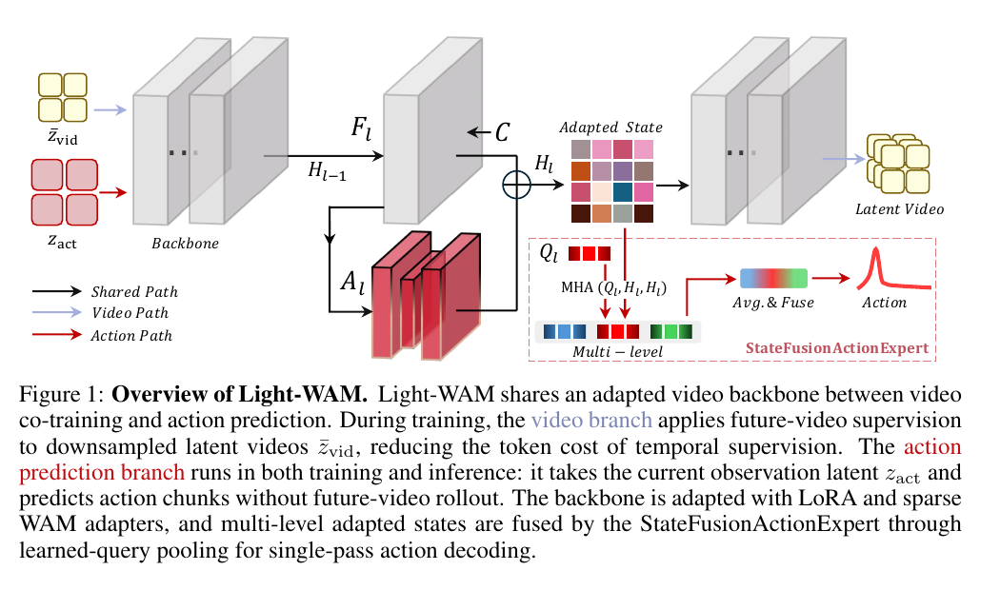
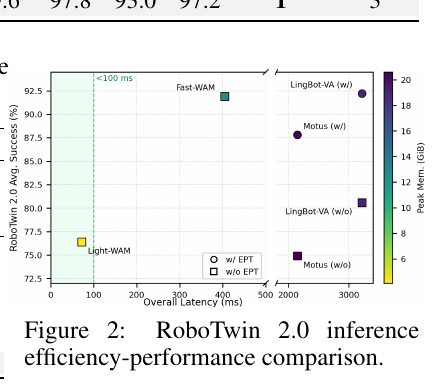
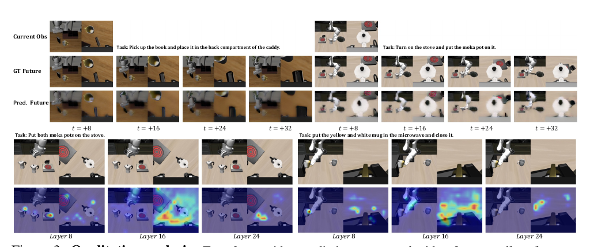
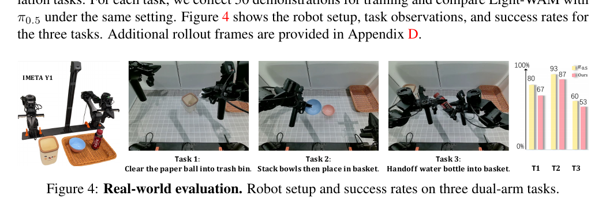

# Light-WAM：高效世界动作模型与 StateFusionActionExpert

## 精简版

### 一句话结论

Light-WAM 的核心不是让机器人在测试时“想象未来”，而是把 future-video prediction 保留为训练期的表示学习监督；推理时使用冻结的 Wan2.1 视频 backbone、多层轻量适配状态和 StateFusionActionExpert，一次前向直接解码 action chunk。它的效率来自整套组合：冻结大 backbone、LoRA、稀疏 WAM adapter、未来视频 latent 下采样、VAE latent 缓存和直接动作头，而不只是缩小模型。

### 核心方法

1. 以 Wan2.1-T2V-1.3B 作为冻结视频 backbone，用全层 LoRA 和第 8、16、24 层的瓶颈 WAM adapter 做轻量机器人域适配。
2. 视频分支把未来视频编码到空间下采样后的 latent 中，用 flow matching 目标训练；动作分支只取当前观测的原分辨率 latent。
3. StateFusionActionExpert 为每个选定 backbone 层设置 16 个 learned queries，通过 MHA 压缩 dense video tokens，再融合多层状态。
4. 通过时间步 embedding 为每个 action step 解码动作序列；测试时不生成未来视频、不进行迭代式 action denoising。

### 关键结果

- LIBERO 平均成功率 97.2%；在不使用 embodied pretraining 的方法中排名第一，总体排名第三，但 Long suite 为 93.0%，仍低于大模型 WAM。
- RoboTwin 2.0 的 50-task 平均成功率为 76.4%，低于 Fast-WAM 的 91.9%，但高于表中 π0 和 X-VLA，说明轻量架构可用但并非复杂多任务场景的最优方案。
- 相比 Fast-WAM，训练时加载参数从 6.73B 降至 1.99B、可训练参数从 6.02B 降至 0.44B；4×H100 上吞吐从 0.49 提升到 2.08 steps/s。
- RTX 4090 上单次 action query 为 72.03ms、峰值显存 4.1GiB；消融显示 2× latent downsampling 与 latent cache 是重要的效率来源，learned queries 从 16 减到 8 会使 LIBERO-Spatial 从 98.2% 降到 95.4%。

### 主要限制

- 论文没有在去掉 future-video loss 的严格对照下单独证明视频监督的因果收益，Figure 3 也只是定性可视化。
- RoboTwin 上明显落后于 Fast-WAM，且逐任务结果有较长尾；大容量模型和 embodied pretraining 对复杂多任务仍然重要。
- 真实世界只评估 3 个双臂任务、每个任务 50 条 demonstration，且没有报告误差条、随机种子或更广泛的鲁棒性结果。
- 没有训练或测试 LIBERO-Plus 等专门的 policy generalization/robustness benchmark，因此不能把 LIBERO 的高分直接解释为开放环境鲁棒性。

### Takeaway

Light-WAM 展示的是一种“训练时像 WAM、推理时像高效直接策略”的折中：未来视频预测帮助 backbone 学习时间结构，但部署链路只保留当前观测到动作 chunk 的单次前向。因此它适合作为低延迟、低显存的 WAM policy 基线，不应被理解为带有测试时 imagined rollout 或显式模型预测控制能力的 world model planner。

## 论文信息

- **论文**：Light-WAM: Efficient World Action Models with State-Fusion Action Decoding
- **作者**：Ziang Li、Dongzhou Cheng、Yibin Wang、Shiyue Wang、Xiaoyang Xu、Lingxuan Weng、Juan Wang、Jiaqi Wang
- **版本**：arXiv:2606.08242v1，2026-06-06
- **代码**：https://github.com/L1ziang/Light-WAM
- **基础模型**：Wan2.1-T2V-1.3B
- **评测**：LIBERO、RoboTwin 2.0、IMETA Y1 双臂机器人
- **阅读日期**：2026-08-27

## 阅读结论

Light-WAM 解决的是一个很具体的工程问题：WAM 通过 future-video prediction 获得比纯动作监督更强的时间结构，但大多数 WAM 把视频生成和动作生成都放进重型 generative pipeline，导致训练和闭环推理昂贵。论文沿用 Fast-WAM 提出的重要观察——未来视频不一定需要在测试时生成——并进一步把成本拆开处理：

- 训练期仍保留视频分支，以免丢掉 temporal representation supervision。
- 对视频监督使用空间下采样 latent，减少时空 token 数量。
- 对动作分支保留当前观测的原分辨率 latent，避免下采样损害精细操作信息。
- 不再使用重型迭代式 generative action expert，而是把多层 backbone 状态压缩后直接输出动作 chunk。

因此，Light-WAM 的主要贡献更接近 WAM 的系统级重构和效率配方，而不是一个新的显式环境动力学模型。它证明了在 LIBERO 这类相对饱和的 benchmark 上，可以用 0.44B 可训练参数维持很高的成功率；但 RoboTwin 和真实世界结果同时说明，去掉测试时视频生成、压缩表示和减少可训练容量，会在复杂多任务和部分真实任务上付出性能代价。

## 关键图表

### Figure 1：共享 backbone、分离训练与推理路径

图中最重要的分界是：future-video branch 只在训练期对下采样 latent 做监督；action branch 在训练和推理都存在，读取当前观测的原分辨率 latent。第 8、16、24 层的 adapted states 经过 learned-query pooling 后融合，再由 StateFusionActionExpert 直接输出动作。该图能证明数据流设计，但不能单独证明每个组件的性能贡献。

### Figure 2：RoboTwin 上的效率—性能位置

Light-WAM 位于低延迟、低显存区域，同时 RoboTwin 平均成功率约为 76.4%；Fast-WAM 的性能更高但延迟和显存开销也明显更大，带 embodied pretraining 的大模型 WAM 进一步偏向高性能、高成本一侧。这里的散点图是汇总视图，精确数字以 Table 2–4 为准。

### Figure 3：未来视频与 learned-query 的定性分析

上半部分显示预测未来帧在 downsampled latent 训练下更平滑，但仍能捕捉主要运动和场景变化；下半部分显示第 8、16、24 层的 query attention 倾向于关注不同区域，例如被操作物体、夹爪和目标区域。它支持“多层状态可能互补”的解释，但属于少量定性样例，不能作为动作性能因果证据。

### Figure 4：真实双臂任务的非单调结果

论文在 IMETA Y1 上比较 Light-WAM 和 π0.5：任务 1 中 Light-WAM 为 93%，高于 π0.5 的 67%；任务 3 中 Light-WAM 为 53%，反而低于 π0.5 的 60%；任务 2 的图中 Light-WAM 约为 100%，π0.5 为 87%。这比“真实世界全面领先”的叙述更重要：Light-WAM 的效率优势并不保证在每一种操作模式上都带来成功率优势。样本只有三个任务、每任务 50 条 demonstration，且未给出误差条，因此应把它视为初步可行性证据。

## 问题与对照基线

### WAM 相比普通 VLA 多了什么

普通 VLA 主要学习从视觉、语言和本体状态到动作的映射，时间结构需要由动作数据中的隐式相关性学习。WAM 在动作回归之外增加未来视频预测目标，让 backbone 还需要解释物体运动、交互动力学和任务进度。

Light-WAM 的问题定义可以写成：

$$
\hat{A}=\pi_{\phi}\big(h_{\theta}(o,l,p)\big),
$$

其中 $o$ 是当前观测，$l$ 是语言指令，$p$ 是 proprioception，$h_{\theta}$ 是适配后视频 backbone 的多层表示，$\pi_{\phi}$ 是 StateFusionActionExpert。

### 论文真正对比的路线

论文并不主张测试时需要生成未来视频，也不把 Light-WAM 设计成显式的 model-based planner。它的直接对照是：

- **Fast-WAM**：已经表明未来视频分支可以只作为训练期监督；Light-WAM 延续这个推理侧选择，并进一步压缩训练侧成本。
- **Motus、LingBot-VA**：代表视频—动作联合生成的更大 WAM，性能和容量更强，但推理代价高。
- **π0、π0.5、X-VLA 等 VLA**：代表 action-only 或 VLA 路线；其中部分方法使用 embodied pretraining，和 Light-WAM 的训练条件并不完全相同。

所以 Light-WAM 的核心问题不是“能否超过所有 VLA/WAM”，而是：在保留 WAM 训练监督的前提下，能否把 action-only 部署做得足够快、足够省显存，同时在常用 manipulation benchmark 上保持可用性能。

## 方法详解

### 输入与总体数据流

RoboTwin 训练伪代码（Appendix Algorithm 1）中的默认流程是：

1. 从三路相机画面构造 canvas video，并以 stride 4 取样：$V_{\mathrm{sub}}=[I_0,I_4,\ldots,I_{32}]$。
2. 用 Wan2.1 VAE 得到视频 latent $z_{\mathrm{vid}}$；训练时优先读取缓存的 VAE latent。
3. 将语言 token 与投影后的 proprioception 拼成 cross-attention context：

   $$
   C=[c_1,\ldots,c_L,c_{\mathrm{prop}}].
   $$

4. 视频分支对整个 latent 做空间下采样并执行 flow matching。
5. 动作分支只取当前观测：

   $$
   z_{\mathrm{act}}=z_{\mathrm{vid}}^{(0)},
   $$

   不执行视频分支使用的额外空间下采样。
6. 适配后 backbone 输出多个中间状态，经 StateFusionActionExpert 解码动作 chunk。

这一拆分使视频监督和动作精度共享同一个视觉先验，却不要求动作推理承担未来视频生成的 token 和迭代开销。

### Wan2.1 backbone 与轻量适配

Wan2.1-T2V-1.3B 的原始 backbone 参数被冻结。论文在两处加入可训练适配：

- **LoRA**：作用于所有 backbone block 的 self-attention、cross-attention 和 feed-forward projections。
- **稀疏 WAM adapter**：插入第 8、16、24 层。每个 adapter 是 256 维 bottleneck 的残差 MLP：

  $$
  A_{\ell}(x)=\gamma W_{\ell}^{\mathrm{up}}
  \sigma\left(W_{\ell}^{\mathrm{down}}x\right),
  \qquad \gamma=1.0.
  $$

  对被选中的层：

  $$
  U_{\ell}=F_{\ell}(H_{\ell-1},C),\qquad
  H_{\ell}=U_{\ell}+A_{\ell}(U_{\ell}).
  $$

动作头读取：

$$
H=\{H_{\ell}\}_{\ell\in\{8,16,24\}}.
$$

这不是只取最后一层特征，而是让动作头看到不同深度的 visual representation。论文的解释是，浅层、中层和深层可能分别包含更细的局部信息、交互信息和任务级信息；Figure 3 对这一点给出了定性支持。

### 未来视频分支：低成本的训练期监督

令 $D(\cdot)$ 表示空间下采样，视频分支使用：

$$
\bar{z}_{\mathrm{vid}}=D(z_{\mathrm{vid}}).
$$

在 flow matching 时间 $t$ 上构造扰动 latent $\bar{z}_t$，并固定下采样后的第一帧作为 observation anchor。视频 prediction head 的损失是：

$$
\mathcal{L}_{\mathrm{video}}
=\left\|G_{\theta}^{\mathrm{vid}}(\bar{z}_t,t,C)-u_t\right\|_2^2,
$$

其中 $u_t$ 是 flow matching target。

动作分支不共享这个下采样：

$$
z_{\mathrm{act}}=z_{\mathrm{vid}}^{(0)}.
$$

也就是说，论文的效率设计并非简单地“所有输入都降采样”：未来视频预测可以牺牲一部分空间细节，当前操作观测则保留原分辨率。这是性能—计算折中的关键位置。

### StateFusionActionExpert：把 dense tokens 压成动作状态

对每一个选定的 backbone state $H_{\ell}$，论文学习一组 layer-specific query：

$$
Q_{\ell}\in\mathbb{R}^{N_q\times d}.
$$

query 对该层的 dense video tokens 做多头注意力：

$$
P_{\ell}=\operatorname{MHA}(Q_{\ell},H_{\ell},H_{\ell}),
\qquad
s_{\ell}=\operatorname{LN}
\left(\frac{1}{N_q}\sum_{j=1}^{N_q}P_{\ell,j}\right).
$$

默认 $N_q=16$，每层使用 8 个 attention heads。随后：

1. 每个 $s_{\ell}$ 映射到 4608 维；
2. 第 8、16、24 层的结果拼接并投影为 6144 维 fused state；
3. 经过一个 residual MLP；
4. 为每个 action step 加入宽度为 256 的 sinusoidal step embedding；
5. 输出头预测每一步动作。

一般形式为：

$$
r_k=h+\psi(e_k),\qquad
\hat{a}_k=\phi_{\mathrm{out}}\big(\operatorname{LN}(r_k)\big),
\qquad
\hat{A}=[\hat{a}_1,\ldots,\hat{a}_K].
$$

在 RoboTwin 2.0 中，动作头输出 $24\times14$ 的 action chunk。learned-query pooling 是一个显式信息瓶颈：它减少动作头接收的 token 数量，但如果 query 太少，也可能丢掉夹爪、物体和目标之间的细粒度关系。

### 训练目标与推理路径

总损失为：

$$
\mathcal{L}
=\mathcal{L}_{\mathrm{video}}
+\lambda\mathcal{L}_{\mathrm{action}}(\hat{A},A).
$$

Appendix Algorithm 1 将 action loss 展开为带时间权重的逐步 L2 回归：

$$
\mathcal{L}_{\mathrm{action}}
=\sum_{k=0}^{K-1}w_k\|\hat{a}_k-a_k\|_2^2.
$$

训练时需要同时计算视频和动作两条路径；推理时只执行 Appendix Algorithm 2：

1. 将当前相机观测编码为单帧 latent；
2. 构造语言和 proprioception context；
3. 运行一次 adapted video backbone；
4. 收集第 8、16、24 层状态；
5. 直接预测并执行 action chunk。

没有 test-time future-video rollout，也没有迭代式 generative action denoising。因此，Light-WAM 的“world”能力主要体现为训练时塑造视觉表示，而不是部署时进行未来状态搜索。

## 训练设置与参数组成

### 训练配置

- 优化器：AdamW
- 学习率：$1\times10^{-4}$
- weight decay：$1\times10^{-2}$
- 学习率策略：cosine，1000 steps warmup
- 硬件：4× NVIDIA H100
- LIBERO global batch size：64
- RoboTwin 2.0 global batch size：128
- 训练：缓存 Wan2.1 VAE latent，避免在线 VAE 编码进入训练循环
- 评估：重新在线执行 VAE 编码，因此训练吞吐和部署延迟不能直接等价
- 可训练部分：backbone LoRA、WAM adapters、video prediction head、proprio encoder、StateFusionActionExpert

### 参数分解

| 组件 | 总参数 | 可训练 | 冻结 |
|---|---:|---:|---:|
| Frozen video backbone | 1418.90M | 0.00M | 1418.90M |
| Backbone LoRA | 87.49M | 87.49M | 0.00M |
| WAM adapters | 2.37M | 2.37M | 0.00M |
| Video prediction head | 0.10M | 0.10M | 0.00M |
| StateFusionActionExpert | 351.03M | 351.03M | 0.00M |
| Proprio encoder | 0.04M | 0.04M | 0.00M |
| Wan VAE | 126.89M | 0.00M | 126.89M |
| **Total** | **1986.82M** | **441.03M** | **1545.79M** |

“0.44B trainable”主要来自 StateFusionActionExpert（351.03M）和 LoRA（87.49M），不是 WAM adapter 本身。后者只有 2.37M，作用更像在选定深度提供机器人域的残差适配。

## 实验结果

### LIBERO：高分，但 benchmark 较接近饱和

| 方法 | 参数 | EPT | Spatial | Object | Goal | Long | Avg. |
|---|---:|:---:|---:|---:|---:|---:|---:|
| π0.5 | 3B | w/ | 98.8 | 98.2 | 98.0 | 92.4 | 96.9 |
| Motus | 8B | w/ | 96.8 | 99.8 | 96.6 | 97.6 | 97.7 |
| LingBot-VA | 5.3B | w/ | 98.5 | 99.6 | 97.2 | 98.5 | 98.5 |
| Fast-WAM | 6B | w/o | 97.0 | 99.4 | 96.6 | 94.8 | 97.0 |
| **Light-WAM** | **2B** | **w/o** | **98.2** | **99.6** | **97.8** | **93.0** | **97.2** |

Light-WAM 在不使用 embodied pretraining 的方法中排名第一，在全部比较方法中排名第三（Table 1, p.6）。它在 Spatial、Object、Goal 上都接近 98–100%，但 Long 为 93.0%，与 Motus 的 97.6%、LingBot-VA 的 98.5% 有明显差距。这提示轻量化策略在短、结构化任务上更容易保留性能，长时程任务仍需要更强容量或更丰富 embodied data。

### RoboTwin 2.0：可用的 50-task policy，但复杂多任务性能有明显代价

RoboTwin 2.0 用一个策略覆盖 50 个双臂任务，训练数据包括 2,500 条 clean demonstrations 和 25,000 条 randomized demonstrations，分别报告 clean 与 randomized evaluation。

| 方法 | 参数 | EPT | Clean | Randomized | Avg. |
|---|---:|:---:|---:|---:|---:|
| π0 | 3B | w/ | 65.9 | 58.4 | 62.2 |
| π0.5 | 3B | w/ | 82.7 | 76.8 | 79.8 |
| X-VLA | 0.9B | w/ | 72.9 | 72.8 | 72.9 |
| Motus | 8B | w/o | 72.8 | 77.0 | 74.9 |
| LingBot-VA | 5.3B | w/o | 80.6 | — | 80.6 |
| Fast-WAM | 6B | w/o | 91.9 | 91.8 | 91.9 |
| **Light-WAM** | **2B** | **w/o** | **76.4** | **76.3** | **76.4** |

论文对 Light-WAM 的定位也是 “usable multi-task performance”，而不是 SOTA：它超过 π0 和 X-VLA，在没有 embodied pretraining 的 Motus 对照附近，但落后 Fast-WAM 15.5 个百分点（Table 2, p.6）。这也是论文“效率—性能 trade-off”比“全面替代大型 WAM”更准确的地方。

逐任务结果进一步显示平均数掩盖了长尾：

- 相对较强：Adjust Bottle 为 100/100，Click Alarmclock 为 100/100，Grab Roller 为 100/98（clean/randomized）。
- 明显较弱：Hanging Mug 为 25/17，Move Stapler Pad 为 26/34，Turn Switch 为 33/39，Place Cans Plasticbox 为 37/68。
- Fast-WAM 在这些困难任务上的结果通常更高，例如 Hanging Mug 为 58/62、Move Stapler Pad 为 77/64、Turn Switch 为 61/59。

这些数值来自 Appendix Table 7，不代表每一类任务的系统性因果分析，但足以说明 Light-WAM 的失败不是均匀的小幅退化，而可能集中在需要精细接触、长时程协调或更强多任务记忆的任务上。

### 训练效率：关键不是单一“小 backbone”

Table 3 在 4×H100、effective global batch size 64 上比较不同组件：

| 模型/变体 | Action head | Cache | Video DS | Loaded | Trainable | Mem./GPU | Steps/s |
|---|---|:---:|:---:|---:|---:|---:|---:|
| Fast-WAM | DiT | No | 1× | 6.73B | 6.02B | 70.7GiB | 0.49 |
| Light-WAM | DiT | No | 1× | 2.28B | 0.73B | 58.9GiB | 0.43 |
| Light-WAM* | StateFusion | No | 1× | 1.99B | 0.44B | 48.6GiB | 0.56 |
| Light-WAM* | StateFusion | Yes | 1× | 1.99B | 0.44B | 48.2GiB | 0.86 |
| **Light-WAM** | **StateFusion** | **Yes** | **2×** | **1.99B** | **0.44B** | **43.1GiB** | **2.08** |

最值得注意的是：只把 backbone 换成 compact Wan2.1 并不自动带来更快训练。Light-WAM 的 DiT、无 cache、1× downsample 变体只有 0.43 steps/s，甚至低于 Fast-WAM 的 0.49 steps/s。StateFusion、VAE latent cache 和 2× latent downsampling 依次把吞吐推到 0.56、0.86 和 2.08 steps/s。因此 4.25× throughput gain 是系统配方的结果，不能归因于参数量下降一个因素。

### 推理效率：动作分支成为主要部署接口

Table 4 在单张 RTX 4090 48GB 上测量单次 action query，缓存 language context，包含 VAE encoding 和 policy forward，不包含 simulator/I/O：

| 模型 | Prediction scope | Policy forward | Overall latency | Peak memory |
|---|---|---:|---:|---:|
| π0.5 | Action-only | — | 76ms* | >8GiB |
| Fast-WAM | Action-only | 392.8ms | 404.62ms | 12.7GiB |
| Motus | Video + action | 2130.7ms | 2148.68ms | 20.6GiB |
| LingBot-VA | Video + action | 2990.1ms | 3214.14ms | 18.9GiB |
| **Light-WAM** | **Action-only** | **58.6ms** | **72.03ms** | **4.1GiB** |

Light-WAM 的 VAE encoding 为 12.7ms、visual branch 为 56.5ms、action branch 仅 2.1ms，整体为 72.03ms。π0.5 的 76ms 来自引用工作在 RTX 4090 上的报告，不是论文作者重新测量，因此只能作为近似参照。更稳妥的结论是：Light-WAM 在同一类硬件上达到接近 70ms 的 action-only latency，并显著低于表中的 WAM 推理开销。

## 消融与机制解释

Table 5 在 LIBERO-Spatial 上评估默认配置：

| 变体 | Latent DS | Adapter layers | Queries/layer | Success |
|---|:---:|---|---:|---:|
| Light-WAM | 2× | {8, 16, 24} | 16 | 98.2 |
| w/o downsample | 1× | {8, 16, 24} | 16 | 99.0 |
| w/ 5 adapter layers | 2× | {4, 8, 16, 20, 24} | 16 | 98.0 |
| w/ 8 learned queries | 2× | {8, 16, 24} | 8 | 95.4 |

可读出的机制是：

1. **下采样是明确的性能—成本折中**：1× 监督提高 0.8 个百分点，但训练代价显著更高，所以默认采用 2×。
2. **更多 adapter 层没有明显收益**：5 层为 98.0%，略低于 3 层的 98.2%，稀疏多层接口已经足够。
3. **query bottleneck 不能压得过窄**：16→8 造成 2.8 个百分点下降，说明动作解码需要保留一定的空间/物体关系信息。
4. **当前观测分支不应机械地跟随视频分支下采样**：论文选择只压缩 future-video supervision，而保留 $z_{\mathrm{act}}$ 原分辨率；这与动作任务需要精细视觉细节的假设一致，但论文没有单独报告 action branch 下采样的对照。

## 证据审计

| 论文主张 | 主要证据 | 能够支持的结论 | 仍不能证明的部分 |
|---|---|---|---|
| WAM 的未来视频可以只在训练时使用 | Eq. 12、Algorithm 2、与 Fast-WAM 的路线对照 | Light-WAM 的推理确实不做 future-video rollout | 没有完整的“同模型去掉 video loss”对照，无法量化 video supervision 的独立因果收益 |
| Light-WAM 显著更高效 | Table 3、Table 4 | 在指定硬件、batch、缓存和计时口径下，训练吞吐、显存和推理延迟明显下降 | 不同 backbone、VAE、实现优化、batch 策略和外部 π0.5 延迟引用会影响横向公平性 |
| StateFusionActionExpert 是有效的动作接口 | Table 3 的 DiT→StateFusion、Table 5 的 query 消融、Figure 3 query maps | 直接动作头可降低参数/计算，query 数量对性能重要 | 没有充分隔离 StateFusion、action loss、adapter 和其他训练细节，不能把全部性能差异归因于 pooling |
| 轻量模型能保持强 LIBERO 性能 | Table 1 | 0.44B trainable 参数取得 97.2% 平均成功率，无 EPT 方法中排名第一 | LIBERO 结果接近饱和，不能代表开放环境、长尾任务或鲁棒性 |
| 轻量模型在复杂多任务中仍可用 | Table 2、Appendix Table 7 | 50-task RoboTwin 平均 76.4%，多数任务不是失效，但表现有明显长尾 | 与 Fast-WAM 有 15.5 个百分点差距；没有解释具体失败是容量、表示瓶颈还是训练配方造成 |
| 真实机器人上具有部署价值 | Figure 4 | 三个双臂任务中展示了低延迟架构的可行性，且部分任务优于 π0.5 | 只有 3 个任务、每任务 50 demos；任务 3 反而低于 π0.5，缺少误差条、种子和统计显著性 |
| 具有泛化/鲁棒性 | 论文明确承认未评估 LIBERO-Plus | 只能说在现有 benchmark 和少量真实任务上有效 | 不能从现有结果推断对视觉扰动、物体变化、视角变化或分布外任务的鲁棒性 |

## 关键与非常规结果

### 1. 效率收益来自成本路径重构，而不是“参数更少”

DiT、无 cache、1× latent 的 Light-WAM 仍只有 0.43 steps/s。真正把吞吐推到 2.08 steps/s 的是 StateFusion action decoder、VAE latent cache 和 future-video latent 的 2× downsampling 共同作用。工程上如果只替换 backbone，而保留在线 VAE 和高分辨率视频 co-training，可能得不到论文标题所暗示的效率。

### 2. 论文把 WAM 的训练价值和规划价值拆开了

Light-WAM 保留视频预测损失，是因为它把 future-video 当作表示学习的 temporal auxiliary task；但部署时完全不生成未来。这让它更像“带世界监督的直接策略”，而不是“通过 imagined future 做决策的 world-model planner”。这一区分决定了它的低延迟优势，也决定了它不能直接提供测试时规划、候选动作排序或显式未来状态查询。

### 3. learned-query pooling 是有容量甜点区的瓶颈

16 个 query 是默认值，压到 8 个后 LIBERO-Spatial 从 98.2% 降到 95.4%；相反，从 3 个 adapter 层增加到 5 个并没有提升。因此，信息压缩能力比简单增加中间读取点更敏感。Figure 3 中不同层关注不同区域，为多层融合提供了直观解释，但还没有定量证明每个 query 对应稳定的对象或动作语义。

### 4. 平均成功率掩盖了复杂任务的尾部

LIBERO 的 97.2% 很强，但 RoboTwin 的 76.4% 明显低于 Fast-WAM 的 91.9%。Appendix Table 7 中 Hanging Mug、Move Stapler Pad、Turn Switch 等任务明显偏弱，而一些短动作或规则清晰的任务接近 100%。这说明“轻量化后仍能在 benchmark 平均分上工作”与“能够稳定处理复杂、多阶段、长尾操作”是两个不同命题。

### 5. 真实世界结果不是单调领先

Light-WAM 在清理纸球任务上为 93% 对 67%，但在 handoff water bottle 任务上为 53% 对 60%。这与 RoboTwin 的长尾现象相呼应：低延迟和视觉预训练先验带来的是更好的效率—性能折中，不是对所有接触模式和双臂协调任务的普遍性能提升。

## 假设、捷径与潜在失效

- **未来视频可以下采样**：方法假设操作相关的运动和任务进度在 2× spatial latent 中仍可学习；Figure 3 也显示预测更平滑，说明细节确实被牺牲。
- **16 个 query 足以表示动作所需信息**：如果物体、夹爪、目标和遮挡关系更复杂，固定 query bottleneck 可能成为信息损失点。
- **冻结通用视频先验可以迁移到机器人**：Wan2.1 原始权重和 VAE 冻结，机器人域适配主要依靠 LoRA、少量 WAM adapter 和动作头；这在 LIBERO 上有效，但复杂 RoboTwin 任务仍表现出容量/数据瓶颈。
- **单个当前观测足够进行动作 chunk 解码**：推理算法没有显式历史窗口或 test-time rollout，时间信息主要依赖训练得到的 backbone 表示；对需要观察隐状态、接触过程或历史消歧的任务可能不够。
- **训练和评估的 VAE 计算口径不同**：训练使用 cached latent，评估包含 online VAE encoding。部署时还要把传感器预处理、语言编码、控制频率和 I/O 纳入端到端预算。
- **视频预测质量与动作有效性并不等价**：预测帧平滑且捕捉主要运动，不代表其动力学、接触状态或 action-conditioned counterfactual 一定准确；论文没有验证这类物理一致性。

## 实用性评估

### 适合的使用场景

- 需要较低单次 action latency 和较小 GPU 显存的闭环 manipulation。
- 希望保留 WAM 的 future-video temporal supervision，但部署时只运行 action-only policy。
- 主要输入是 RGB、语言和 proprioception，任务规模中等，能接受复杂多任务上不如大 WAM。

### 不应直接承诺的能力

- 测试时未来想象、模型预测控制、候选轨迹评估或 action planning。
- 对视角、物体、背景和物理条件变化的鲁棒泛化。
- 在多阶段双臂、精细接触和长尾任务上达到 Fast-WAM 或 embodied-pretrained 大模型的成功率。

### 复现时最容易遗漏的成本项

1. 只报告 0.44B trainable 参数是不够的：推理仍然加载约 1.99B 总参数。
2. 训练吞吐的 2.08 steps/s 依赖 VAE latent cache 和 2× video latent downsampling。
3. 72.03ms 已包含 VAE encoding，但不包含 simulator/I/O；论文中的语言 context 是 cached 的。
4. 当前观测 action branch 保持原分辨率，不能把所有输入都按 future-video branch 的 2× 规则压缩。

## 相关笔记

- [[Robot/WAM/DreamZero_Technical_Report|DreamZero]]：同属 WAM 路线；DreamZero 更接近 video-action flow matching 与测试时视频—动作生成，Light-WAM 则把 future-video 退回训练期监督，并用直接动作头换取低延迟。
- [[Robot/VLA/PI/Flex-Pi_论文总结|Flex-π]]：两者都讨论如何把 WAM 的视频监督与部署计算解耦；Flex-π 扩展到 RGB、pointmap、DINO 多流，Light-WAM 聚焦单一 RGB 流和 StateFusion 效率。
- [[Robot/WAM/OA_WAM|OA-WAM]]：对照 object slot/address routing 的结构化世界状态；Light-WAM 使用 dense video tokens 加 learned-query bottleneck，不显式建模对象地址。
- [[Robot/WAM/WLA_reading_notes|WLA]]：同样区分世界建模与 action-only inference，但 WLA 还加入语言子任务；Light-WAM 的辅助监督仅是 future video。
- [[Video/Wan2.1技术报告|Wan2.1]]：Light-WAM 冻结并适配 Wan2.1-T2V-1.3B，将通用视频先验用作 WAM 的视觉 backbone。

## 开放问题

1. 在完全相同的 backbone、数据和 action head 下，去掉 $\mathcal{L}_{\mathrm{video}}$ 后性能和样本效率如何？这是验证 WAM 监督独立价值的关键对照。
2. 如果将 direct StateFusionActionExpert 与同参数量的 action flow/diffusion expert 严格匹配，性能、稳定性和延迟差异有多大？
3. query 数量、query 的空间结构、adapter 层位置是否能按任务难度自适应，而不是固定为 16 与 $\{8,16,24\}$？
4. 加入历史观测、触觉或显式状态估计后，能否改善 Hanging Mug、Turn Switch 等长尾任务，同时保持 72ms 级别延迟？
5. 在 LIBERO-Plus、跨相机视角、未见物体和更大规模真实双臂任务上，Light-WAM 的效率优势是否仍值得其性能损失？
6. 训练时 latent cache、评估时在线 VAE、以及实际控制循环中的 I/O 开销合并后，真实端到端频率是多少？

## 总结

Light-WAM 以一个清晰的系统观点重做 WAM：未来视频 prediction 是训练监督，不是必须在部署时执行的规划模块；视频 co-training 可以在低分辨率 latent 中完成，而当前动作观测保留原分辨率；多层 backbone states 可以经 learned-query pooling 压缩后由直接动作头一次性解码。论文在 LIBERO 上证明了很强的效率—性能折中，在 RoboTwin 和真实任务上则诚实地暴露出复杂多任务与长尾操作的代价。最准确的定位是：一个低成本、低延迟、带 WAM temporal supervision 的 direct robot policy，而不是一个完整的测试时世界模型规划器。
