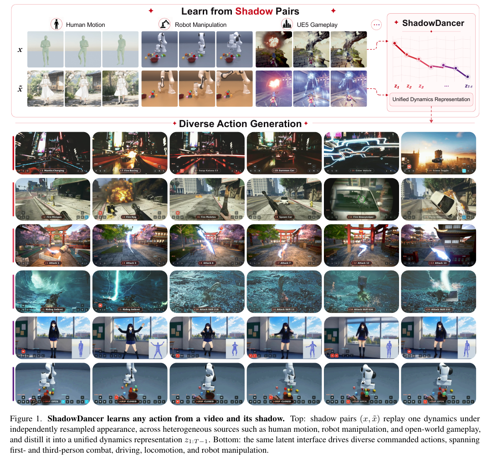
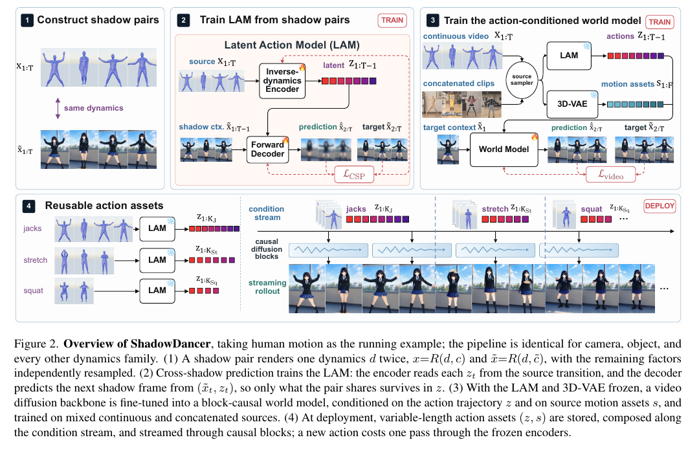
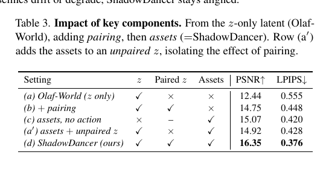
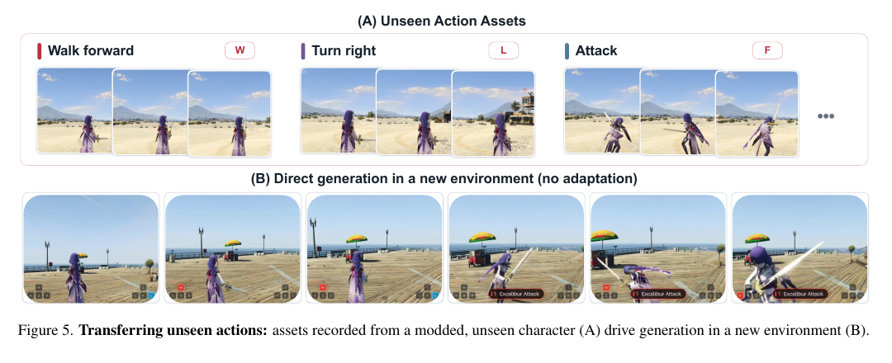
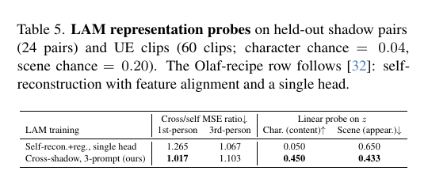
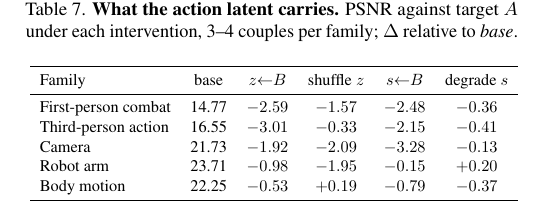

# ShadowDancer：用 Shadow Pair 学习统一动力学表示的任意动作视频世界模型

论文：ShadowDancer: Teaching Video World Models Any Action by Learning Unified Dynamics Representations from a Video and Its Shadow

- 作者：Jin Cao、Zian Meng、Kaipeng Zhang
- 机构：Alaya Lab、Shanghai Innovation Institute
- 项目页：[ShadowDancer](https://ShadowDancer-1.github.io)
- 阅读材料：论文 PDF，正文第 1–9 页，补充材料第 13–18 页；页码均按该 PDF 页码标注

## 精简版

### 一句话结论

[论文事实] ShadowDancer 用同一段运动或相机动力学的两份不同外观渲染构造 shadow pair，让 inverse-dynamics encoder 必须提取跨外观共享的 latent dynamics，再把 dynamics latent 与高频 source latent 组合成可复用的 action asset，驱动一个 block-causal 视频世界模型。

[分析推断] 这篇工作的核心价值不是提出一个全新的视频生成骨干，而是把动作接口的监督协议、latent 结构、跨 embodiment 读取方式和可部署的 action asset 串成一个统一系统。它在游戏、仿真和可渲染环境中很有吸引力，但论文的 any action 结论依赖于能否构造保持动力学不变的 shadow pair。

### 核心方法

1. [论文事实] Shadow pair 将同一动力学变量 $d$ 与两份独立重采样的外观变量 $c,c'$ 组合：$x=R(d,c)$、$\tilde{x}=R(d,c')$。
2. [论文事实] cross-shadow prediction 用 source transition 推断 $z_t$，再根据 target shadow 的上下文预测下一帧；source 外观对目标预测没有稳定帮助，因此 $z_t$ 被迫保留共享动力学。
3. [论文事实] 世界模型分别使用低频、跨帧的 $z$ 和高频细节/外观 latent $s$；实际可查找和拼接的动作资产是 $a=(z,s)$。
4. [论文事实] 一个 factor-selective readout 用 cam、dyn、full 三个 prompt slot 选择读取相机、物体/身体动力学或全部控制因素；同一套接口覆盖人、游戏角色、相机和机器人动作。

[读图] Figure 1（p.2）把贡献分成三层：用 shadow pair 学 dynamics、把 dynamics 和 source detail 组合成 action asset、将 asset 接入视频 world model。图示是方法结构，不是对真实世界任意动作可识别性的实验证明。

### 关键结果

- [论文事实] 相比 Olaf-World，ShadowDancer 在机器人操作上 PSNR/LPIPS 从 14.0/0.478 提升到 22.6/0.116；相机 ATE/RPE 从 0.072/0.021 降到 0.005/0.003（Table 1, p.7）。
- [论文事实] Table 3（p.8）显示在相同 source asset 条件下，使用 paired z 的 PSNR 为 16.35，而只使用 unpaired z 为 14.92，约有 1.43 dB 的配对监督收益。
- [论文事实] 盲测 VLM 2AFC 中，ShadowDancer 相对 Olaf-World、Yume-1.5、LingBot-World2.0 的平均胜率约为 86%；但该指标不是闭环控制成功率（Table 2, p.7）。
- [论文事实] 表征干预显示替换或打乱 $z$ 通常比退化 $s$ 造成更大的性能下降，支持 $z$ 承担动作、$s$ 承担源视频细节的职责分工（Table 7, Supplement p.18）。

### 主要限制

- [论文事实] action asset 需要预先准备；没有 demonstration 或可用 asset 时，系统不能凭语义凭空产生任意动作。
- [论文事实] shadow pair 在游戏和仿真中容易制作，在真实世界中很难保持运动、遮挡、接触和外观编辑的一致性。
- [分析推断] 理论保证是总体分布和理想优化下的可识别性结果，不保证有限样本、β-VAE 的非凸训练一定学到最小充分动力学表示。
- [分析推断] 主要实验证据来自渲染/仿真数据、短片段指标和 VLM 盲测；尚未证明真实机器人上的闭环任务收益、控制安全性或跨平台校准成本。

### Takeaway

如果拥有可渲染的 shadow pair 数据和大量可复用 demonstration，ShadowDancer 提供了一条很清晰的路线：把动作从模型专属的语义命令，变成跨外观、可组合、可流式执行的 latent asset。阅读时最应关注的不是表面上的视频质量，而是 Table 3 的 paired/unpaired 对照、$z/s$ 的职责分解，以及 shadow pair 假设在目标环境中是否真的可成立。

---

## 完整版

### Metadata

| 项目 | 内容 |
| --- | --- |
| 研究问题 | 如何让视频世界模型接受任意、精确、帧级的动作，而不依赖固定动作词表或某个 embodiment 的动作标签？ |
| 方法名 | ShadowDancer |
| 关键对象 | shadow pair、cross-shadow prediction、unified dynamics representation、action asset |
| 视频骨干 | SkyReels-V2-1.3B I2V DiT |
| 表征学习 | 冻结 3D-VAE + LAM；LAM latent 维度 $d_z=32$ |
| 训练目标 | cross-shadow β-VAE；world model 使用 flow matching |
| 主要数据 | 游戏/角色渲染、相机运动、ManiSkill 机械臂、真实机器人视频、真实/无配对视频 |
| 硬件 | NVIDIA H200；长时 rollout 使用 8 张 H200 |
| 结论强度 | 方法与消融证据较强；对真实世界和闭环控制的外推仍有限 |

### 总体判断

[分析推断] 这篇论文的 novelty 属于中高水平：各个零件——VAE/LAM、视频 diffusion/flow matching、action conditioning、causal rollout、representation probing——并非都新，但 shadow-pair 作为动作监督协议，以及由它统一出的跨外观 dynamics latent 和可拼接 action asset，形成了有辨识度的系统贡献。

[分析推断] 技术论证在其假设下是自洽的。补充材料的 identifiability theorem 说明了什么样的跨 shadow 表征足以恢复动力学；但这不是训练收敛保证，也不覆盖隐藏接触状态、随机后果、数据配对错误和真实世界资产获取问题。

### 关键图表

#### 总览与数据流

[读图] Figure 2（p.3）展示了训练期从 source/target shadow pair 提取动作表征，以及推理期由首帧和 demonstration 生成 action asset、再查找并流式 rollout 的流程。图中需要区分两种 latent：$z$ 是跨 shadow 的 unified dynamics，$s$ 是 source 侧的细节/外观条件。

#### paired 与 unpaired 消融

[读表] Table 3（p.8）最关键的对照是 (a') 与 (d)：两者都带 source asset，区别主要是 $z$ 来自 unpaired 还是 paired 训练；PSNR 从 14.92 提升到 16.35，说明配对关系本身带来增益，而不是仅仅增加了视频或动作数据量。

#### 未见角色与动作迁移

[读图] Figure 5（p.9）展示训练后在 modded unseen character 上执行双手剑攻击，并把一个地图中记录的 asset 重放到 held-out map。它是有说服力的 qualitative demonstration，但没有给出该例的定量成功率或闭环任务指标。

#### 表征探针

[读表] Table 5（Supplement p.18）比较 self-reconstruction 和 cross-shadow prediction 下的 cross/self MSE ratio 及 factor probes。结果支持 cross-shadow 训练减少 appearance leakage，但 character identity 与 motion set 共变，因而 character probe 不能单独当作纯粹的外观 disentanglement 证据。

#### $z$ 与 $s$ 的作用

[读表] Table 7（Supplement p.18）通过把 $z$ 或 $s$ 替换为随机 latent、打乱 latent 或退化 source latent，检验两者是否各司其职。整体上 $z$ 对动作变化更敏感，$s$ 对纹理和高频细节更敏感；body-motion 行的异常较小，说明这个分工并非在所有因素上都完全干净。

### 1. 问题与基线

#### 1.1 论文要解决什么问题

[论文事实] 交互式视频 world model 需要接受动作条件并预测未来帧。现有接口有三个张力：

- 文本或离散命令具有通用性，但难以精确表达逐帧相机轨迹、身体动作和机器人末端运动。
- 结构化动作，例如 pose、相机轨迹和机器人控制量，精确但通常依赖固定动作族、特定 embodiment 或难获得的标注。
- 从视频中自重建 latent action 看似无需标签，但 encoder 可能把角色身份、场景和纹理一起编码，导致同一个动作换外观后无法迁移。

[分析推断] 论文真正瞄准的是 action interface 的可迁移性，而不只是视频生成质量：同一动作资产能否在新外观、新地图或新角色中被复用。

#### 1.2 论文隐含的基线数据流

~~~text
source video / action command
        │
        ├── fixed vocabulary or embodiment-specific label
        │
        └── latent action from source video
                    │
                    └── appearance may leak into action code
                              ↓
                    video world model → future frames
~~~

ShadowDancer 把它改成：

~~~text
same dynamics d + source appearance c       same dynamics d + target appearance c'
                    │                                       │
                    └──── source transition ──┐             │
                                               ↓             │
                                      cross-shadow latent z  │
                                               │             │
source detail latent s ────────────────────────┘             │
                                               ↓             │
                         target context + z + s → next target frame
~~~

### 2. 方法：从 shadow pair 到 action asset

#### 2.1 Shadow pair 的形式化

[论文事实] 论文将视频帧写成渲染函数：

$$x=R(d,c),\qquad \tilde{x}=R(d,\tilde{c})$$

其中 $d$ 是希望控制的动态因素，$c$ 与 $\tilde{c}$ 是独立采样的外观、角色、场景或其他 nuisance factors。两段 shadow 在时间上同步，保持同一 $d$，但改变非目标因素。

[论文事实] 这个构造协议直接定义了 controllability：如果只改变相机因素，就得到 camera shadow；如果只改变身体/机械臂运动，就得到 dynamics shadow；如果同时改变多个因素，就得到 full shadow。

| shadow 类型 | 共享因素 | 被改变因素 | 论文用途 |
| --- | --- | --- | --- |
| body dynamics | 身份、场景等外观 | 身体动力学 | 学角色动作 |
| camera motion | 场景、内容 | 相机动力学 | 学视角控制 |
| body + camera | 其他渲染条件 | 身体和相机 | 学组合动作 |
| robot arm | 机器人场景/外观 | 机械臂运动 | 学操作动作 |
| self-pair | 同一个视频自身 | 不构造 shadow | 增加真实视频和多样性 |

[分析推断] 因而 any action 不是无条件的语义泛化承诺，而是一个由 shadow-pair 生成器所覆盖的动作因素集合。不能稳定重渲染或编辑的因素，不会自动获得同样的可识别性。

#### 2.2 Cross-shadow prediction

[论文事实] LAM 的 inverse-dynamics encoder 从 source transition 中得到动作 latent：

$$z_t\sim q_\phi(z_t\mid x_t,x_{t+1})$$

论文正文以相邻 transition 描述方法；补充材料的实现使用因果前缀 $q_\phi(z_t\mid x_{1:t+1})$，从而支持在线/因果动作提取。

decoder 不重建 source，而是使用 target shadow 的上下文预测 target 的下一帧：

$$\tilde{x}_{t+1}\sim p_\theta(\tilde{x}_{t+1}\mid \tilde{x}_t,z_t)$$

训练目标是 cross-shadow β-VAE：

$$\mathcal{L}_{CSP}=\frac{1}{T-1}\sum_t\left[-\mathbb{E}_{q_\phi}\log p_\theta(\tilde{x}_{t+1}\mid\tilde{x}_t,z_t)+\beta\,D_{KL}\left(q_\phi(z_t\mid\cdot)\,\|\,\mathcal{N}(0,I)\right)\right]$$

[论文事实] 关键因果约束是：decoder 已经拥有 target appearance，source appearance 又被独立重采样，因此 source appearance 无法稳定帮助预测 target；跨 shadow 可复用的信号主要只能来自共享 dynamics。

[分析推断] 这比在单视频上自重建 latent 更接近一种 intervention：训练数据显式告诉模型哪些变化应被视为同一个动作，而不是希望模型仅凭统计相关性自行发现 invariant。

#### 2.3 统一 dynamics representation 与 source detail

[论文事实] ShadowDancer 并不把所有视频信息都压进 $z$。冻结的 3D-VAE 提供 source latent $s$，用来保留高频运动、纹理和 source-specific appearance；$z$ 负责低频、可跨外观复用的 dynamics。

$$a=(z,s)$$

这里 $z$ 更接近统一的 action/dynamics representation，$s$ 更接近 demonstration 的 detail carrier。论文把二者组合成 variable-length action asset，用于后续查找、拼接和流式执行。

#### 2.4 Factor-selective readout

[论文事实] LAM 使用 prompt slots 选择读取因素：

- cam：只读取相机运动。
- dyn：读取物体、身体或机械臂动力学。
- full：同时读取可用的相机与动力学因素。

[论文事实] 每个样本有 factor mask $(m_{cam},m_{dyn})$，同一 encoder、同一 latent 接口和同一 world model 通过 mask 选择 readout。

[分析推断] unified 的含义是统一表征学习与接口，不是把机器人关节、游戏角色骨骼和相机位姿压成具有相同物理语义的坐标。跨 embodiment 迁移依赖 world model 学到的视觉后果和训练覆盖。

#### 2.5 接入视频 world model

[论文事实] 世界模型基于预训练 SkyReels-V2-1.3B I2V DiT，并使用 flow matching 微调；LAM 与 3D-VAE 冻结。动作与 source asset 通过两条路径进入 DiT：

- $z$ 按 latent frame 分组后求平均，注入 timestep/AdaLN，提供低频、长时间范围的控制。
- 每帧 $z$ 通过专门的 cross-attention 注入，提供精细动作变化。
- $s$ 与 noisy latent $u$ 及 binary availability mask 一起经过 Conv3D；patchified $s$ 也进入 cross-attention，补充 source 细节。

[论文事实] cross-attention 的 $W_o$ 零初始化，AdaLN gate 使用正值初始化；论文观察到 gate 若为零会导致梯度消失和训练停滞。

#### 2.6 Block-causal rollout

[论文事实] 为把原本的视频生成模型转成可交互模型，作者把每 3 个 latent frames 分成一个 block。模型在 block 之间因果运行，在当前 block 去噪时使用干净的历史，并用 KV cache 缓存历史状态；action stream 仍按帧提供，因此可以跨 block 连续。

[论文事实] 训练阶段还会拼接 canonical action chunks，使训练时的不连续条件流更接近部署期的 asset lookup 与 action concatenation。

[分析推断] 这一步主要解决时序接口和算力问题，不等于解决长时世界状态的真实性。KV cache 能降低重复计算，但不能防止模型在未见状态上累积漂移。

#### 2.7 推理期接口

部署流程可以概括为：

~~~text
首帧 / demonstration
        │
        ├── 一次冻结 LAM 编码 → z
        └── 一次冻结 3D-VAE 编码 → s
                         │
                   保存 action asset a=(z,s)
                         │
            lookup / concatenate 多个 variable-length assets
                         │
             block-causal video world model rollout
~~~

[论文事实] 运行时不需要动作标签、固定词表或针对每个新动作重新 fine-tune；资产可以在一个地图/角色上记录，再尝试在 held-out map 或 unseen character 上重放。

### 3. 数据与训练设置

#### 3.1 Shadow Library

[论文事实] Shadow Library 覆盖的来源如下；百分比来自论文补充材料的训练混合表。

| 来源 | 类型 | 训练占比（约） |
| --- | --- | ---: |
| SMPL-X + Blender | body dynamics 13.6%；camera 10.9%；body+camera 8.2%；paired character 8.8% | 41.5% |
| ManiSkill | arm only 2.7%；camera 6.8%；camera+arm 5.4% | 14.9% |
| GTA-style / Cyberpunk | first-person 8.8%；third-person 8.2% | 17.0% |
| Unreal Engine / Monster Hunter | third-person | 未报告 |
| DL3DV | static-scene camera | 6.8% |
| MiraData / OpenX BridgeData | self-pair 或真实机器人视频 | 5.5% |
| FurnitureBench | 机器人操作 | 4.1% |
| UR5 / Jaco / HYDRA / RoboTurk | 机器人视频 | 10.1% |

[论文事实] 真实或无法配对的视频以 self-pair 进入训练。人体视频的 self-pair 概率为 0.5，其他 paired 数据为 0；无配对真实视频和静态相机视频始终为 self-pair。作者估计约三分之一训练样本是 self-pair。

[分析推断] self-pair 提供真实感和视觉多样性，但不能提供跨外观 invariant 的 identification signal；真正约束 $z$ 去除 appearance 的力量主要来自精确配对的 synthetic/simulated shadow。

#### 3.2 LAM 与 world model 配置

- [论文事实] LAM latent 维度 $d_z=32$，β=0.01，使用 world model 一半的空间分辨率。
- [论文事实] action transfer 实验使用 480×720 视频、LAM 240×360、81-frame clips；每个 family 有 45–50 个 held-out pairs，机器人 split 更小。
- [论文事实] 长 rollout 使用 544×960 分辨率、8×H200、target-resolution fine-tuning 10k steps、30 个 flow-matching steps、CFG 5.0、16 个 command streams 和 240-frame segments。
- [论文事实] 由于训练/部署使用的 action stream 可能是离散 lookup 后的拼接，作者在训练时显式模拟 canonical action chunks。

#### 3.3 相机和长时评估协议

- [论文事实] 相机轨迹由 VGGT 恢复，并在计算 ATE/RPE 前做 Sim(3) 对齐。
- [分析推断] Sim(3) 对齐会消除整体尺度差异，因此 ATE/RPE 更适合衡量相对轨迹一致性，不是未经校准的绝对世界坐标误差。
- [论文事实] 长时评估用 Fable VLM 做 blind 2AFC，20% 由人工审计，不设 tie；评价轴是 control、fidelity、long-horizon consistency，并忽略纯视觉 style 差异。
- [分析推断] VLM 2AFC 能补足像素指标对语义动作的不足，但仍不能替代 ground-truth trajectory、任务成功率或真实交互反馈。

### 4. 结果与证据审计

#### 4.1 主结果

| 场景 | Olaf-World PSNR / LPIPS | ShadowDancer PSNR / LPIPS | ShadowDancer ATE / RPE |
| --- | ---: | ---: | ---: |
| Human | 18.2 / 0.288 | 22.4 / 0.184 | — |
| First-person combat | 13.0 / 0.532 | 17.0 / 0.354 | — |
| Third-person action | 12.6 / 0.506 | 17.4 / 0.309 | — |
| Camera | — | — | 0.005 / 0.003 |
| Robot manipulation | 14.0 / 0.478 | 22.6 / 0.116 | — |

[论文事实] 以上是 Table 1（p.7）的主要结果。像素重建和相机轨迹都显著改善，机器人操作的差距尤其大。

[证据边界] 该表能支持“在论文覆盖的数据和评测协议上，方法具有更好的视频/轨迹预测”，不能单独支持“动作在真实环境中安全可执行”或“world model 具备可靠物理模拟能力”。

#### 4.2 长时 VLM 盲测

| 对手 | control 胜率 | fidelity 胜率 | consistency 胜率 |
| --- | ---: | ---: | ---: |
| Olaf-World | 94% | 95% | 94% |
| Yume-1.5 | 88% | 86% | 91% |
| LingBot-World2.0 | 78% | 83% | 64% |

[论文事实] Table 2（p.7）给出上述 ShadowDancer 相对胜率，汇总平均约 86%。

[证据边界] 不同模型接受的动作接口和可用信息可能并不完全相同，系统级比较不应直接解释为纯粹的 backbone 或 loss 优势。2AFC 也没有给出物理 ground truth。

#### 4.3 组件和配对消融

| 配置 | 描述 | PSNR | LPIPS |
| --- | --- | ---: | ---: |
| (a) | Olaf z-only | 12.44 | 0.555 |
| (b) | 加入 paired z | 14.75 | 0.448 |
| (c) | assets，无 action | 15.07 | 0.420 |
| (a') | assets + unpaired z | 14.92 | 0.428 |
| (d) | paired z + assets，ShadowDancer | 16.35 | 0.376 |

[论文事实] Table 3（p.8）说明三个因素共同作用：paired z、source asset 以及将二者组合的 world-model interface。

[分析推断] 最干净的配对监督证据是 (a')→(d)：在 asset 条件相同的情况下，paired z 带来约 1.43 dB PSNR 提升。相反，(a)→(b) 同时改变了动作表征配置，不能把全部增益都归因于 pairing。

#### 4.4 表征和生成质量探针

[论文事实] Table 5（Supplement p.18）中，self-reconstruction 的 cross/self MSE ratio 为 first-person 1.265、third-person 1.067；cross-shadow prediction 下为 1.017、1.103。character probe 的 MSE 为 0.050，scene probe 为 0.650；cross-shadow 条件下 character/scene 分别为 0.450/0.433。

[论文事实] Table 6（Supplement p.18）的 FVD 从 555.8 降到 318.3（first-person），842.0 降到 422.2（third-person），511.6 降到 253.9（human），说明 cross-shadow 带来的提升不只是更保守的模糊预测。

[证据边界] Table 5 的 probe 样本量有限（论文提到 24 pairs 和 60 UE clips），且 character identity 与 motion set 共变；Table 6 使用 16-frame windows，不能直接代表 240-frame rollout 的整体分布质量。

#### 4.5 因素干预

[论文事实] Table 7（Supplement p.18）报告相对 PSNR 的干预下降：

| 因素 | first-person base 14.77 | third-person base 16.55 | camera base 21.73 | robot arm base 23.71 | body motion base 22.25 |
| --- | ---: | ---: | ---: | ---: | ---: |
| $z\leftarrow B$ | -2.59 | -3.01 | -1.92 | -0.98 | -0.53 |
| shuffle $z$ | -1.57 | -0.33 | -2.09 | -1.95 | +0.19 |
| $s\leftarrow B$ | -2.48 | -2.15 | -3.28 | -0.15 | -0.79 |
| degrade $s$ | -0.36 | -0.41 | -0.13 | +0.20 | -0.37 |

[分析推断] $z$ 对 first-person、third-person、camera 和 robot arm 的干预更加敏感，符合其作为动作变量的预期；$s$ 在视觉细节相关场景更重要。body-motion 行的 $z$ 干预下降很小，可能是 source render 本身已直接暴露了身体运动，提示该分工存在数据依赖。

#### 4.6 证据矩阵

| 论文主张 | 直接证据 | 控制/缺口 | 判断 |
| --- | --- | --- | --- |
| paired shadow 让 latent 更具 dynamics invariance | Table 3、Table 5、Table 7 | probe 规模小，因素共变 | 支持，但非完美 disentanglement 证明 |
| $z$ 与 $s$ 职责互补 | Table 7、world model 注入路径 | 仍有场景特异异常 | 较强支持 |
| 可迁移到未见角色/地图 | Figure 5 qualitative | 没有统一的成功率或闭环任务 | 现象已展示，定量强度有限 |
| 长时交互质量更好 | Table 2 VLM 2AFC | 没有物理 ground truth，基线接口可能不对等 | 支持感知质量，不等于控制成功 |
| theorem 保证 dynamics 可识别 | Supplement C.2–C.5 | 依赖总体分布、独立重采样、分离性和理想优化 | 条件理论结果 |
| any action | 多种渲染/机器人 family | 真实 shadow 构造、隐藏状态和新 embodiment 未充分验证 | 应理解为 protocol-defined coverage |

### 5. 关键与非常规结果

#### 5.1 配对关系比单纯增加 asset 更关键

[论文事实] Table 3 中，assets + unpaired z 为 14.92 PSNR，而 paired z + assets 为 16.35。也就是说，source video 多了并不自动产生可迁移动作；真正的增益来自 source/target shadow 对共享 dynamics 的约束。

[分析推断] 这是论文最值得迁移的思想：对于 representation learning，改变训练样本之间的因果/对应关系，可能比继续堆更多同分布视频更有效。

#### 5.2 $z$ 与 $s$ 的分工不是纯粹的内容/动作二分

[论文事实] 多数因素上 $z$ 的破坏明显伤害动作，$s$ 的退化更多伤害细节；但 robot arm 对 $s$ 的影响很小、body motion 的 $z$ 干预也很小。

[分析推断] 论文更准确的表述应是“$z$ 是跨 shadow、可复用的动力学通道，$s$ 是 source-conditioned detail 通道”，而不是绝对 disentangled latent。对一个动作已经直接显露于 source frame 的因素，world model 可能从 $s$ 或视觉 context 中旁路获取信息。

#### 5.3 any dynamics 的边界由渲染器定义

[论文事实] 论文能覆盖相机、人体、游戏角色和机器人臂，是因为这些因素可以在 Blender、游戏引擎或仿真器中重放并改变外观。

[分析推断] 更强的“任意动作”需要一个能生成 counterfactual shadow 的环境。现实中的力、摩擦、接触模式、柔性物体和不可见控制器状态通常不能仅通过 appearance editing 获得，因此 theorem 的 applicability 可能比 theorem 本身更决定成败。

#### 5.4 block-causal 使系统可交互，但没有闭环世界状态

[论文事实] block-causal conversion、KV cache 和按帧 action stream 让 rollout 可以在线推进并拼接 variable-length assets。

[分析推断] 这解决的是计算图和接口设计；论文没有展示基于预测结果反复决策、执行、再观测的真实 closed-loop benchmark。长时 consistency 的改善仍主要由视频比较或 VLM 判断衡量。

#### 5.5 真实视频的角色更像 realism regularizer

[论文事实] 无配对真实视频通过 self-pair 加入，精确 shadow pair 主要来自合成/仿真。

[分析推断] 真实数据帮助模型靠近真实视觉分布，却没有同等强度地约束 appearance-invariant action latent。若目标是现实机器人闭环，仍需要真实世界的可控配对、动作记录或其他反事实监督。

#### 5.6 理论识别与可训练性是两件事

[论文事实] 补充材料的 theorem 在 A1–A3 等假设下证明 cross-shadow sufficient/minimal representation 与真实 dynamics 的关系；同时明确说明 β-VAE 的 sampled Gaussian 只是 rate-distortion approximation，不提供有限 rate 的精确保证，也不保证非凸优化找到全局最优。

[分析推断] 这使理论部分定位清楚：它解释了为什么 cross-shadow objective 可能选择正确的信息，而不是证明当前 1.3B DiT、32 维 latent 和有限训练一定达到该解。

### 6. 理论、假设与归纳偏置

#### 6.1 补充材料中的显式假设

- A1 独立 context resampling：$X\perp(B,Y)\mid D$。给定 dynamics 后，source appearance 与 target context/label 的关联被切断。
- A2 source observability：$D=h(X)$。source 视频本身足以确定相关 dynamics。
- A3 target context overlap 与 separation：不同 dynamics 在可比较的 target context 下产生可区分输出；文中用 $K_d=K_{d'}\Rightarrow d=d'$ 表达。

在这些条件下，论文定义 $\Gamma(X)=[K_{h(X)}]_\nu$，并声称它是 cross-shadow sufficient/minimal、对 source nuisance invariant；每个充分表征都能确定 $D$，最小编码之间至多相差一个双射重参数化。

#### 6.2 未写在 theorem 里的工程假设

- 训练时的 source/target shadow 真正共享目标 dynamics，且时间同步误差可接受。
- appearance randomization 不会意外改变接触、遮挡、质量分布或可见的动作线索。
- source detail $s$ 不会成为绕过 $z$ 的动作捷径。
- 新角色、新地图和新 embodiment 的视觉后果落在 world model 可外推的范围内。
- 30-step flow matching 和 block-causal rollout 在目标分辨率下的误差不会快速累积。

#### 6.3 潜在 shortcut 与泄漏

[分析推断] 需要重点排查四种 shortcut：

1. shadow renderer 改变外观时同步改变了接触或运动轨迹，模型可能从 renderer artifact 识别动作。
2. source detail $s$ 或 source context 仍显露了足够多的动作，模型未必真的只依赖 $z$。
3. 角色 identity、动作族、场景和数据来源共变，probe 可能把 dataset cue 当成 semantics。
4. asset lookup 的动作 chunk 分布与测试动作相关，world model 可能记忆 chunk，而不是学习连续动力学。

### 7. 独立评估

#### 7.1 优点

- [分析推断] 问题重要且定义准确：动作接口的精确性和跨外观迁移是 interactive video model 的实际瓶颈。
- [分析推断] cross-shadow objective 与数据构造互相解释，配对/不配对消融也直接命中论文主张。
- [分析推断] $z/s$ 双通道让高频视频重建与低频动作控制不必争夺同一个 bottleneck。
- [分析推断] 从 LAM、asset 存储、查找、拼接到 block-causal rollout 的系统闭环，比单独提出一个 latent loss 更接近可部署接口。

#### 7.2 风险

- [分析推断] 真实世界 shadow pair 是最大瓶颈；self-pair 不能替代反事实 dynamics supervision。
- [分析推断] hidden force/contact/controller state 可能违反 source observability，造成同一帧/短片段对应多个未来。
- [分析推断] synthetic-to-real 外推、未见 embodiment 校准和长时漂移尚未被实验证实。
- [分析推断] 8×H200、30-step denoising 和高分辨率长片段意味着当前系统的实时性、能耗和部署成本仍需单独评估。
- [分析推断] VLM 评价无法发现细粒度末端误差、安全约束违反或视觉上合理但物理上错误的结果。

#### 7.3 最可能失败的场景

- 动作的关键变量是不可见的力、接触或控制器内部状态。
- 外观编辑改变了遮挡、碰撞或物理接触，shadow pair 不再保持同一 dynamics。
- 长 rollout 进入训练分布外状态，模型继续生成视觉合理但动力学错误的帧。
- 新 embodiment 的运动学和相机标定与训练 family 差异过大。
- 需要对随机动作后果作多模态预测，而单个 asset 只编码了一条 demonstration。

### 8. 与知识库中其他工作的关系

- [[Robot/WAM/DreamZero_Technical_Report|DreamZero 技术报告]]：同样把视频生成接到 action interface；DreamZero 直接学习 video-action flow，ShadowDancer 则用 shadow-paired latent 约束动作的跨外观一致性。
- [[Robot/WAM/DreamerV4_技术报告|Dreamer 4 技术报告]]：同样关注 block-causal 视频 world model，但 ShadowDancer 主要解决 demonstration action representation，尚未提供 Dreamer 4 的 reward/value 与 imagined RL 闭环。
- [[Video/Cosmos3技术报告|Cosmos 3 技术报告]]：ShadowDancer 以 shadow pair 学习 dynamics latent，与 Cosmos 3 的全模态 token/MoT 世界模型形成对照。
- [[Robot/WAM/UniPi_技术总结|UniPi 技术总结]]：同样利用视频作为动作/动力学接口，但 ShadowDancer 用 shadow pair 约束 latent，而不是先生成视频计划再恢复动作。
- [[Robot/WAM/WorldVLA 论文综述(不建议读)|WorldVLA]]：可对照其 world model 与 VLA/action interface 的结合方式；ShadowDancer 的重点更偏跨外观 action representation。

### 9. 开放问题

1. 真实机器人上，怎样低成本地产生保持接触、遮挡和力学一致的 shadow pair？
2. 能否把 controller state、force/torque 或 proprioception 纳入 shadow 定义，而不是只重渲染 RGB？
3. 资产检索如何判断两个 asset 的前置状态兼容，避免简单 concatenate 造成 discontinuity？
4. 对同一动作的多种随机后果，action asset 是否需要显式 uncertainty 或 branching latent？
5. 在不依赖 VLM 盲测的情况下，如何建立跨角色、跨地图、跨 embodiment 的统一 closed-loop metric？
6. paired/unpaired mix、shadow coverage 和 latent dimension $d_z=32$ 之间的 scaling law 是什么？
7. 能否把 cross-shadow representation 用于 Dreamer 式 imagined planning、reward learning 或 policy improvement？

### 10. 最终 Takeaway

[论文事实] ShadowDancer 的技术链条是：shadow pair 定义不变动力学 → cross-shadow prediction 学 $z$ → 3D-VAE 提供 $s$ → $a=(z,s)$ 作为可查找动作资产 → block-causal 视频 world model 流式 rollout。

[分析推断] 最值得保留的不是某个具体渲染器或 SkyReels 配置，而是监督设计：如果能构造可靠的 counterfactual pair，就可以把“动作是什么”转化为“哪些视频变化在改变外观后仍必须保持”。这为视频 world model 的 action interface 提供了比文本命令更精细、比 embodiment-specific label 更统一的中间层。

但在把它外推到真实机器人前，应先回答两个问题：目标动作是否可观测，及其 shadow pair 是否可构造。若任一问题答案是否定的，论文中的 identifiability 和 transfer 结论就只能部分成立。

### 相关笔记

- [[Robot/WAM/DreamZero_Technical_Report|DreamZero 技术报告]]
- [[Robot/WAM/DreamerV4_技术报告|Dreamer 4 技术报告]]
- [[Video/Cosmos3技术报告|Cosmos 3 技术报告]]
- [[Robot/WAM/UniPi_技术总结|UniPi 技术总结]]
- [[Robot/WAM/WorldVLA 论文综述(不建议读)|WorldVLA]]

### 来源与证据边界

- 论文事实均来自 ShadowDancer PDF 正文和补充材料；表格、图和页码已在正文中标出。
- 论文没有在文中给出正式 arXiv 编号或代码仓库链接；项目页为 https://ShadowDancer-1.github.io。
- [分析推断] 对 novelty、真实世界可行性、基线公平性和失败模式的判断是基于论文证据的独立分析，不应当当作作者的实验结论。
