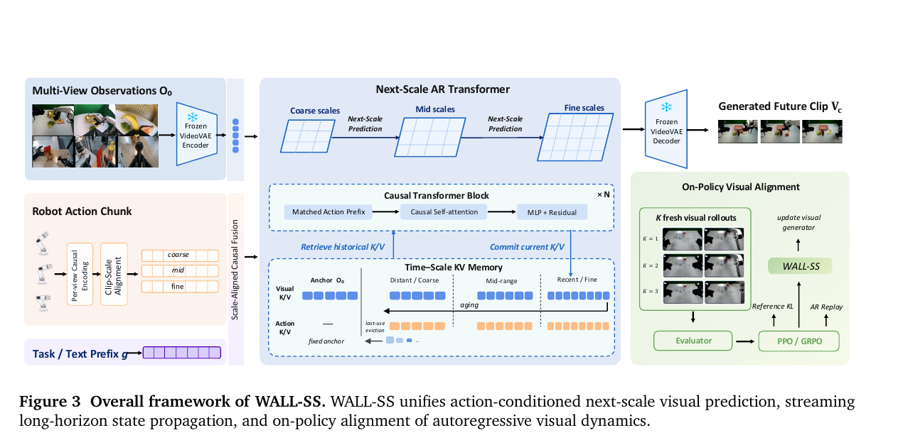
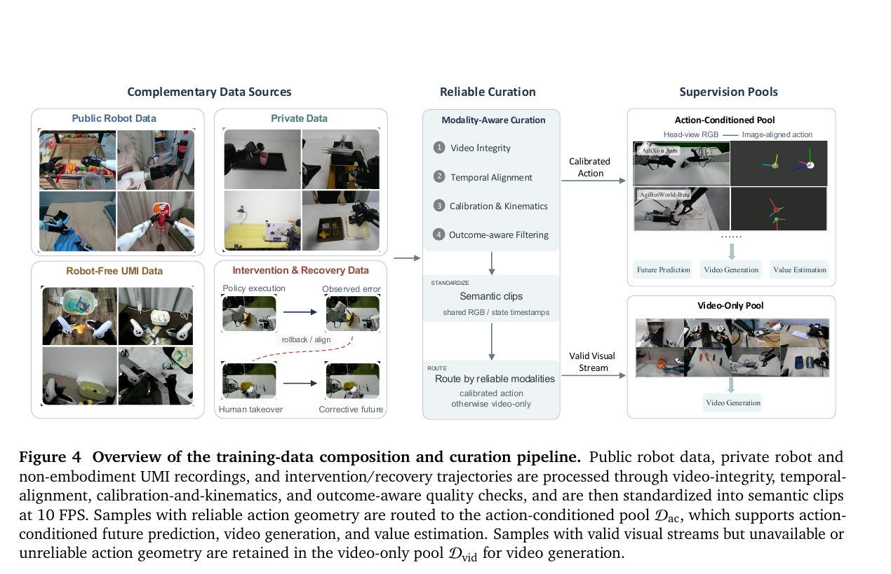
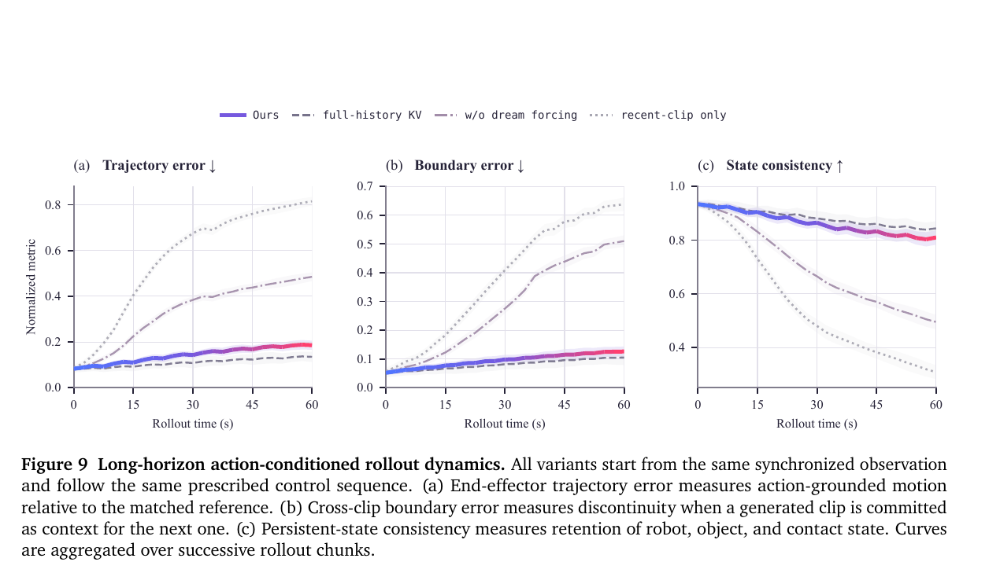
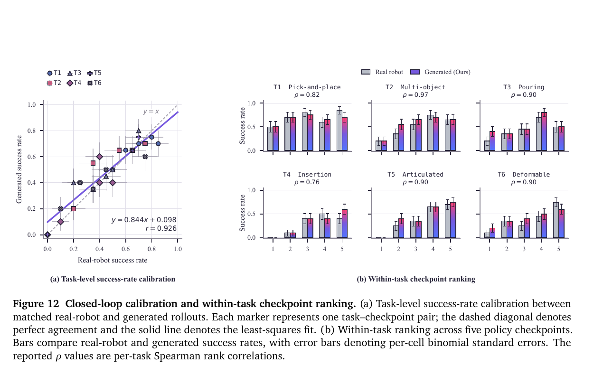
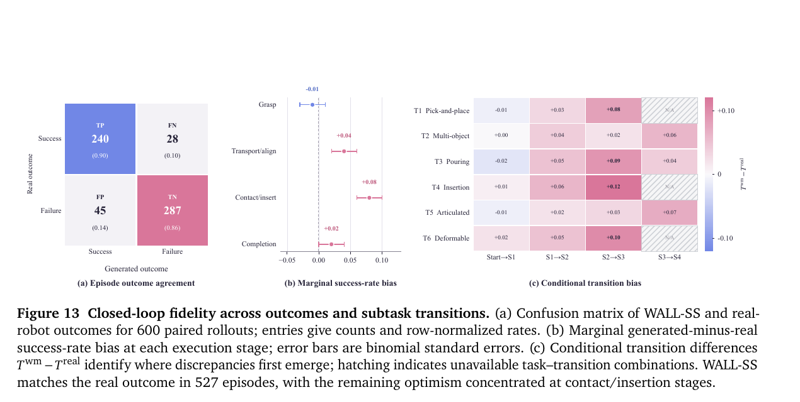

# WALL-SS：通过 Next-Scale Autoregression 扩展长时世界模型

> 论文：**WALL-SS: Scaling Long-horizon World Models via Next-Scale Autoregression**
>
> 版本：arXiv:2608.26239v1，2026-08-26；论文首页日期为 2026-08-28。
>
> 原始文件：/home/mi/Downloads/WALL-SS Scaling Long-horizon World Models via Next-Scale Autoregression-with-annotations.pdf
>
> 阅读日期：2026-09-04

## 精简版

### 一句话结论

WALL-SS 把机器人视频世界模型改写成“时间上逐 clip、clip 内逐尺度”的显式自回归过程，再用 scale-aligned action、受限的 time–scale KV memory、self-generated history 训练和 visual-token RL 解决动作漂移与长时误差；论文在 60 秒 rollout 和 600 组 sim–real 闭环配对上给出了少见的系统证据，但接触/插入阶段仍有明显乐观偏差，且模型规模、训练成本、私有数据量和具体 memory 配置没有披露。

### 核心方法

1. **Action-grounded next-scale prediction：** 每个未来 clip 先预测 coarse visual codes，再逐尺度补 residual detail；与该 clip 对齐的 action 在所有尺度持续作为 causal prefix，而不是只作为一个全局 prompt。
2. **Time–scale memory：** 初始观测作为固定 identity anchor；最近历史保留 fine KV，较远历史只读取预先保存的 coarse KV，并把每段视觉状态与产生它的 action history 配对，在固定预算内滚动提交和淘汰。
3. **Scale-wise dream forcing：** 训练时混合 age-dependent corruption 与 detached self-generated suffix，始终预测 clean future，使模型学会从自己的不完美历史继续生成。
4. **On-policy visual alignment：** 固定机器人 action，把自回归视觉生成器当作 policy；用 action-following 和 long-term consistency scorer 做 group-relative PPO/GRPO，并以 reference KL 与真实轨迹 AR replay 防止画面分布漂移。
5. **共享状态的 action expert：** flow-matching action expert 从已提交的视觉 memory、proprioception 和任务指令预测动作；它与 visual model 共用 causal state，但 visual generator 不读取 action expert 的私有状态。

**读图：** 左侧把多视角观测、按视角投影的 action chunk 和任务文本接入 next-scale AR Transformer；中间在 coarse→mid→fine 生成过程中读取 time–scale KV memory；右侧只对 visual generator 做 on-policy alignment。它不是“一个 RL policy 同时输出动作和视频”：RL 更新的是固定 action 条件下的视觉分布，action expert 是另一条共训分支。

### 关键结果

- **Long-horizon 的主要瓶颈不只是记忆容量，而是训练时是否见过自己的错误历史。** Figure 9（p.18）中 full-history KV 的 60 秒 trajectory/state 指标略好于 bounded WALL-SS，但成本随时长增长；去掉 dream forcing 后，即使保留 long-range memory，trajectory error、boundary error 和 state consistency 仍持续恶化。WALL-SS 的价值更像质量—显存的 Pareto 折中，而不是绝对质量超过无限历史。
- **Visual RL 的提升与 reward 定义高度对齐。** 从 supervised checkpoint 做 on-policy alignment 后，Action Following 从 0.264 提升到 0.290，Trajectory Accuracy 从 0.512 到 0.539，Boundary Error 从 0.118 降到 0.104；subject consistency 和 image quality 在评测噪声内不变（Sec. 6.4，p.19）。这支持 RL 修正自生成分布上的残余 dynamics error，但尚不能排除对两个 learned scorers 的过拟合。
- **Simulator 在平均意义上可用于 policy ranking，但最危险的误差方向仍存在。** 600 个 generated–real 配对的 balanced accuracy 为 0.88，五个 checkpoint 的 within-task pairwise ranking accuracy 为 0.89；然而 332 个真实失败中有 45 个被模拟成成功，false-positive rate 为 0.136，且最大偏差集中在 contact/insertion transition（Figure 12–13、Table 3，p.20–21）。
- **视觉 dynamics alignment 可以间接改善真实 action policy。** 使用 reward-aligned generator 的共享状态后，action expert 的真实机器人平均 Task Progress 从 64.6 提升到 69.1，尽管 action expert 本身没有接收 alignment reward gradient（Sec. 6.4，p.19–20）。这是很有价值的 representation-transfer 证据，但 action expert 经过了分别共训，不能解释为同一冻结 policy 的零成本提升。

### 主要限制

- 论文没有报告 WALL-SS 参数量、训练 GPU/时长、token/clip 分辨率、每个 scale 的配置、固定 KV budget、推理延迟，也没有披露 X2-Robot、UMI 和 intervention/recovery 数据量；难以复现或判断 bounded memory 的实际成本。
- 60 秒证明的是 minute-long rollout，不是任意长、持续数小时的稳定世界状态；论文没有不确定性估计、错误检测或在线 real-observation correction。
- Embodied Video Generation benchmark 来自作者自己的数据 mixture，只有 300 个任务；Action Following scorer、long-horizon scorer 和多数物理指标也是作者协议，缺少跨团队 benchmark 与 scorer robustness。
- Action condition 依赖精确时间同步、相机内外参、机器人运动学和 end-effector 投影。它强约束几何轨迹，但没有直接编码接触力、摩擦、柔顺性或物体内部状态；这些恰好是 sim–real 偏差最大的区域。
- 真机 policy 对比只报告 Task Progress 图和少量汇总数字，未完整披露每任务试验数、严格成功率、置信区间、各模型数据规模与训练预算。

### Takeaway

> WALL-SS 最值得保留的不是“AR 比 diffusion 更适合长视频”，而是一个三层分工：**结构化 memory 决定保留什么历史，self-history training 决定模型能否使用不完美历史，on-policy visual alignment 决定如何修正 rollout 分布上的残余错误。** 其中任何一层缺失，长时世界模型都可能在画面仍可看的情况下丢失 action、接触或持久状态。

---

## 完整版

## Metadata

- **Authors / organization:** X Square Robot Team；PDF metadata 列出 Maeve Zhang、Rain Sun、Xiang Wang、Cyril Zhang 等作者。
- **Venue / year:** Technical report，arXiv 2026。
- **Paper:** [WALL-SS: Scaling Long-horizon World Models via Next-Scale Autoregression](https://arxiv.org/abs/2608.26239)
- **Code:** [X-Square-Robot/wall-ss](https://github.com/X-Square-Robot/wall-ss)
- **Project page:** [WALL-SS project page](http://x2robot.com/pages/ss)
- **Task and setting:** 多视角、语言与 action 条件下的机器人视觉未来生成；支持 60 秒 streaming rollout、外部 policy 的 sim–real 闭环评估，以及共训 action expert 的真实机器人控制。
- **Initialization:** visual generator 从 InfinityStar 初始化，video VAE 冻结。
- **Reading source:** /home/mi/Downloads/WALL-SS Scaling Long-horizon World Models via Next-Scale Autoregression-with-annotations.pdf
- **Reading date:** 2026-09-04
- **Source boundary:** “论文事实”来自该 PDF 正文、公式、Figure 和 Table；“分析推断”与“待验证”用于标出证据边界，不代表作者已完成验证。

## One-sentence Verdict

> WALL-SS 用 next-scale AR 的同一 coarse-to-fine hierarchy 同时组织未来生成和历史记忆，并利用显式 token likelihood 对自生成视觉轨迹做 RL alignment；它是少数把 60 秒 action-conditioned rollout、bounded memory 和真实 policy-evaluation calibration 放在同一系统中验证的工作，但其有效性仍明显依赖私有数据、精确 action projection 和 learned fidelity scorer，尚不能作为安全的真实环境替代品。

## Key Figures

### Figure 3：总体架构与更新边界

**读图：** coarse→mid→fine 是同一个未来 clip 内的 scale-wise AR；clip 完成后才把 synchronized multi-view KV 提交到 memory。右侧 evaluator 对多条 fresh visual rollouts 打分，通过 PPO/GRPO 更新 visual generator，并以 reference KL 和 AR replay 约束。

**证据边界：** 这是信息流图，不证明三个模块各自必要。尤其 action expert 没有画在主图中，不能从图中推出 video/action 是同一输出 head。

### Figure 4：数据与 calibration-aware routing

**读图：** Public Robot、私有 X2-Robot、robot-free UMI 和 intervention/recovery data 先做视频完整性、时间对齐、标定/运动学与 outcome-aware 过滤；有可靠 action geometry 的样本进入 action-conditioned pool，只有 RGB 可靠的样本仍保留为 video-only supervision。

**为什么重要：** 这种 modality-available routing 避免把错位 action 强行作为条件。它同时提醒我们：论文的 action controllability 并非只来自模型结构，还来自严格标定、动作投影和目标平台私有数据。

### Figure 9：memory 与 dream forcing 消融

**读图：** recent-clip only 最快丢失 trajectory、跨 clip 连续性和持久状态；保留 memory 但移除 dream forcing 仍显著退化；bounded WALL-SS 接近 full-history KV，但后者在三个指标上略占优势。

**证据边界：** 图中纵轴经过 normalization，没有给出 raw physical error、显存、attention FLOPs 或 error bar。它支持三种配置的相对趋势，但不能量化“用多少显存换多少绝对误差”。

### Figure 12：sim–real calibration 与 policy ranking

**读图：** 左图比较 30 个 task–checkpoint cell 的 generated/real success rate，拟合斜率为 0.844、相关系数为 0.926；右图显示六个任务内五个 policy checkpoint 的相对排序。作者没有用跨任务绝对难度直接排名，而是在同一任务内比较 checkpoint，这一点比只报总相关系数更可靠。

**证据边界：** 每个 cell 只有 20 次试验，弱 checkpoint 略被高估；相关性高不等于失败方向安全，因此必须结合 Figure 13 的 false-positive 分析。

### Figure 13：平均校准掩盖了 contact/insertion 乐观偏差

**读图：** 600 个配对中有 527 个最终 outcome 一致；45 个真实失败被模拟为成功。分阶段看，grasp 基本校准，transport/alignment 略乐观，contact/insert 的边际 bias 达 +0.08；Insertion 的关键 transition bias 达 +0.12。

**为什么值得保留：** 这正是“平均 calibration 看起来很好，但模型会在最需要安全审计的接触阶段过度乐观”的反例。把该 simulator 用作 checkpoint 筛选器时，false success 比 false failure 更危险。

## Problem and Baseline

### Problem

机器人 world model 若只预测一个固定长度 future clip，会遇到四个接口限制：

1. action 与具体 state transition 的时间对应关系可能被弱化成全局条件；
2. 输出 horizon 固定，不易持续追加；
3. 历史上下文要么只保留最近 clip、丢失持久状态，要么全部保留、成本随时长增长；
4. diffusion/flow generator 的 endpoint likelihood 不易直接用于普通 policy-gradient 更新。

WALL-SS 希望统一表示以下序列：

$$
(O_0,g), A_1,V_1,A_2,V_2,\ldots,A_C,V_C,
$$

其中 $O_0$ 是初始多视角观测，$g$ 是任务文本，$A_c$ 是第 $c$ 个 action chunk，$V_c$ 是其视觉后果。关键因果顺序是：

$$
\text{committed history}
\rightarrow A_c
\rightarrow V_c
\rightarrow \text{memory commit}.
$$

### Baseline formulations

论文 Figure 2 区分三种生成接口：

| Formulation | 条件与输出 | 主要边界 |
|---|---|---|
| Conventional video diffusion | visual history $\rightarrow$ future clip | action 不显式，通常固定 clip |
| Action-conditioned diffusion | history + action $\rightarrow$ future clip | action 可控，但仍主要按独立 clip 去噪 |
| WALL-SS streaming action-causal AR | history, action, task $\rightarrow$ coarse-to-fine clip；再 commit | 显式概率与 streaming state，但承受 AR error accumulation |

最直接的 architecture baseline 是 InfinityStar：它已经把 video 建模为“clip 间自回归、clip 内 next-scale refinement”。WALL-SS 在此基础上加入 action grounding、time–scale memory、dream forcing、visual RL alignment 和 action expert。因此论文不能被解读为从零证明 next-scale AR 优于所有 diffusion world model；更准确的是把一个强 next-scale video prior 改造成机器人交互系统。

### Exact delta

WALL-SS 的核心改动可压缩为：

> **让 action 在每个未来 clip 的所有生成尺度上保持可见；把生成时产生的 scale-specific causal KV 反向用作“近细远粗”的历史；再利用 AR log-probability 对固定 action 下的自生成视觉轨迹做受约束 RL。**

## Method

### 1. 两个自回归轴：时间与尺度

WALL-SS 不是逐像素或逐视觉 token 地串行生成。它有两个层级：

1. **时间轴：** $V_1\rightarrow V_2\rightarrow\cdots\rightarrow V_C$，每个 clip 的完成状态成为下一 clip 的 context；
2. **尺度轴：** 同一 $V_c$ 内从 coarse visual codes 到 mid/fine residual codes；同一尺度内的 token map 可并行预测。

每个尺度预测相对于此前累计 reconstruction 的 residual visual codes。这样 coarse scale 决定布局、主要运动和大体接触关系，fine scale 补充纹理与局部细节。其假设是早期 coarse decision 足以稳定主要动力学，而后续 scale 可以修正视觉残差。

对 clip $c$、scale $\ell$、residual repeat $r$ 的 visual bundle $Z_{c,\ell,r}$，监督目标可以写为：

$$
\mathcal{L}_{AR}
=-
\mathbb{E}_{D}
\mathbb{E}_{(c,\ell,r)\sim \mathrm{Bal}}
\left[
\frac{1}{N_{c,\ell,r}}
\log p_\theta
\left(
Z_{c,\ell,r}
\mid
Z_{c,\prec(\ell,r)},
M_c,
X^A_{c,\kappa(\ell)},
g
\right)
\right].
$$

这里 $\mathrm{Bal}$ 对 clip、scale 和 residual repeat 做平衡，$N_{c,\ell,r}$ 是有效视觉决策数。缺少可靠 action 的样本令 $X^A=\varnothing$，但仍保留 video likelihood。

### 2. ActionBridge 与 scale-aligned causal conditioning

#### 2.1 Action canonicalization

不同 robot/UMI action 先转为统一 end-effector 表示：

- 左右 wrist position 与 orientation；
- normalized gripper opening；
- 与 RGB 对齐的 timestamp；
- 相机内参、外参和机器人 kinematics。

对于 end-effector keypoint $\tilde x_e$，论文把它投影到 head-camera image plane：

$$
\tilde u=K_hT_{h\leftarrow e}\tilde x_e,
\qquad
u=
\left(
\frac{\tilde u_x}{\tilde u_w},
\frac{\tilde u_y}{\tilde u_w}
\right).
$$

动作被渲染成 video-like condition：点表示末端中心，局部坐标轴表示 orientation，颜色区分左右臂并编码 gripper state，marker scale 表示相对深度。该表示与 RGB 共享 frame index、resize/crop 和 tensor layout。

#### 2.2 为什么不是一个 global action prompt

对每个 camera view，deterministic renderer 只使用 prescribed control、rollout state 和 calibration，把计划轨迹映射到相同视觉 timeline；它不能读取未来 telemetry 或 target video。causal action encoder 连续处理动作流，再按与 RGB 相同的 clip interval 切片。

对于 visual scale $\ell$，函数 $\kappa(\ell)$ 选择不超过 $\ell$ 的最细 action scale。query 只能读取：

- task/text；
- 当前 clip；
- 当前 view；
- 与当前 visual scale 对齐的 action prefix；
- 已提交的 causal visual states。

其他 views 的 action、相邻 clips 和 future controls 被 block-diagonal mask 排除。跨视角 adapter 只交换同一时刻、已经因果可见的 visual state。

**分析推断：** action video 是很强的几何 inductive bias，能让网络直接看到“末端应该在图上怎么走”；它也可能成为 shortcut。若 calibration 或 camera pose 发生变化，模型可能先失去 action following，而不是逐渐退化。

### 3. Time–Scale Memory

#### 3.1 Memory record

在每个被保留的 pre-prediction scale boundary $s\in S_M$，模型保存目标尚未出现前的 causal state：

$$
B_{u,s}=
\left(
H^{pre}_{u,s},
\mathcal{A}_u
\right),
$$

其中 $\mathcal{A}_u$ 是同一物理 interval 的 action bank。对第 $c$ 个 clip，memory 为：

$$
M_c=
\{H_{anc}\}
\cup
\left\{
B_{c-\delta,s(\delta)}
\mid
\delta\in D_c
\right\},
$$

并要求：

$$
\delta_1<\delta_2
\Rightarrow
s(\delta_1)\ge s(\delta_2).
$$

也就是 history 越新，读取的 scale 越细；history 越旧，只保留 coarse cumulative prefix。

#### 3.2 三类状态

- **Identity anchor $H_{anc}$：** 只来自初始观测 $O_0$，用于稳定 object identity 与全局 layout，不包含 future action，也不替代当前动态状态。
- **Rolling visual records：** 保存中间 world state；最近 fine、远端 coarse。
- **Paired action records：** 每个 visual record 与造成它的 action interval 绑定，避免只记“现在是什么样”却忘记“如何到达这里”。

论文强调 aging 并不是把 fine KV 在线压缩成 coarse KV；生成时已经保存多个 scale boundary，随年龄增长只是切换读取哪个预计算记录。每个记录在最后一次 scheduled read 后淘汰，因此：

$$
\sup_c \operatorname{mem}(R_c^{mat})\le B_{KV},
$$

理论上 memory 与已经完成的 clip 数量无关。

#### 3.3 Commit 顺序

一个 clip 的所有同步视角、所有 scale 生成完成后，bundle 才成为 persistent memory。随后状态机执行：

~~~text
assemble M_c
→ encode A_c
→ coarse-to-fine generate V_c
→ commit synchronized bundle
→ age scale records
→ evict expired records
→ start clip c+1
~~~

这避免 head view 已经进入 $c+1$、wrist view 仍停留在 $c$ 的 camera-wise causal mismatch。

### 4. Scale-wise Dream Forcing

clean teacher forcing 训练时总看到真实历史，推理时却持续读取自己的生成结果。WALL-SS 用两类历史扰动补这个 exposure gap：

1. **Age-dependent corruption：** 对 memory 中不同年龄的 record 使用不同 corruption；
2. **Self-generated suffix：** lagged streaming model 从当前 state 生成 detached 历史后缀，再要求当前模型从该 history 预测下一段 clean future。

总目标为：

$$
\mathcal{L}_{long}
=
\mathcal{L}_{AR}
+\lambda_{cor}\mathcal{L}_{cor}
+\lambda_{self}\mathcal{L}_{self}.
$$

三个分支都预测同一个 clean future，只改变 causal history 的质量。

**关键辨析：**

- 它不是 reward optimization；
- 它不是 Dreamer 中在 latent imagination 里训练 actor；
- 它与 Self-Forcing / scheduled sampling 的联系比与普通数据增强更近；
- detached/lagged generator 避免把下一段监督直接通过自生成 history 反传。

### 5. World Action Policy

visual model 回答“给定动作，世界怎样变化”；action expert 回答“给定当前世界和任务，下一段动作是什么”。

action expert 读取：

$$
H_c^A=
F_\omega^A
\left(
\operatorname{Read}_V(M_c),
E_s(s_c),
g
\right),
$$

其中 $s_c$ 是 proprioceptive 或 plan-side state。noisy action slots 通过 cross-attention 读取该 context，并以 flow matching 预测 executable action chunk $\hat A_c$。

要区分两个变量：

- $\hat A_c$：action expert 输出的低维可执行轨迹；
- $X^A_{c,j}=\Gamma_j(\hat A_c,s_c)$：经过 grounding/rendering 后供 visual model 使用的 scale-aligned condition。

visual model 不读取 action expert 的 private hidden state。teacher-forced paired transition 中，同一 demonstrated action 同时作为 action expert target 和 visual consequence condition：

$$
\mathcal{L}_{cotrain}
=
\mathcal{L}_{long}
+\lambda_A\mathcal{L}_{act}.
$$

没有可靠 action target 的 video-only sample 只保留 visual loss。

### 6. On-policy Alignment of Visual Dynamics

#### 6.1 “On-policy”指哪一个 policy

这里的 policy 是 visual-token distribution：

$$
\pi_\theta^V(z_n\mid \xi_n),
$$

不是 robot controller。对固定的 $(O_0,A_{1:C},g)$，刚冻结的 behavior copy 采样 $K\ge2$ 条 visual trajectories。每组样本的 prescribed action 完全相同，优化只重新分配不同视觉后果的概率。

#### 6.2 Reward

两个冻结 scorer 在 decoded rollout 上给分：

$$
r_{i,c}
=
\lambda_{act}R_{act}
\left(
\hat V^i_{c-1:c},A_c
\right)
+
\lambda_{long}R_{long}
\left(
O_0,\hat V^i_{b_c-1:c},A_{b_c:c}
\right).
$$

- $R_{act}$：transition 是否符合 prescribed action；
- $R_{long}$：state、clip boundary 和 cross-view consistency；
- task progress 与 terminal success 被明确排除，保留给独立 closed-loop evaluation。

scorer 的负样本由 shifted、reversed、cross-trajectory action，以及 spliced、drifted、view-desynchronized video 构造。其优势是可系统制造错误；风险是 generator 学会满足 scorer 的有限错误模式，而非所有真实物理规律。

#### 6.3 Group-relative update 与 prior preservation

各 rollout 的 discounted clip return 在组内标准化，不训练 critic：

$$
\hat A_{i,c}
=
\operatorname{sg}
\left[
\frac{G_{i,c}-\mu_c}{\sigma_c+\epsilon}
\right].
$$

visual token 通过 clipped likelihood ratio 做 PPO/GRPO-style update。完整 regularization 为：

$$
\mathcal{L}_{align}
=
\mathcal{L}_{PG}
+\beta
\mathbb{E}
\left[
D_{KL}
\left(
\pi_\theta^V\Vert\pi_{ref}^V
\right)
\right]
+\lambda_{AR}\mathcal{L}_{AR}^{real}.
$$

- reference KL 限制局部分布漂移；
- real-trajectory AR replay 保持外观与真实数据 likelihood；
- tokenizer、reward scorers、reference generator 和 action-producing module 冻结；
- 只有 visual generator 与 conditioning adapters 更新。

这正是 AR 相对 diffusion/flow generator 的一个实际优势：sequence/token log-probability 是模型原生输出，不需要先构造 endpoint likelihood proxy。

## Data and Training

### Data composition

| 数据来源 | 论文披露内容 | 主要作用 |
|---|---|---|
| AgiBotWorld-Beta | 1,003,672 trajectories；清洗后 987,508 captioned clips，来自 165,560 unique videos | 多 embodiment、场景、物体和任务的 broad embodied prior |
| ManipArena | 未报告样本数 | 增加 reasoning/contact-rich real-robot tasks |
| X2-Robot private data | 未报告样本数 | 缩小部署 robot、camera geometry 与动作域差距 |
| Non-embodiment UMI | 未报告样本数 | 低成本扩大 egocentric hand–object interaction |
| Intervention/recovery data | 未报告样本数 | 覆盖 policy 访问的 off-nominal state、失败、rollback 和 correction |

所有样本被整理成 10 FPS semantic clips。数据处理保留 source identity、calibration status、outcome/intervention tag、quality flag 和 representation version。

### Modality-available routing

定义 calibration mask：

$$
m_i^{cal}\in\{0,1\}.
$$

数据被路由为：

$$
\mathcal{D}_{ac}
=
\{(v_i,a_i,l_i):m_i^{cal}=1\},
\qquad
\mathcal{D}_{vid}
=
\{(v_i,l_i):m_i^{cal}=0\}.
$$

只有 $\mathcal{D}_{ac}$ 使用 action projection；$\mathcal{D}_{vid}$ 仍训练 visual dynamics 和 language grounding。把 action 错位样本降级为 video-only，比静默使用错误控制更可靠。

### Intervention 与 rollback-replay

论文保留两种人工介入：

1. **Immediate intervention：** policy 出现错误或不安全趋势时，从当前真实状态直接接管；
2. **Rollback-and-replay：** 先保留错误分支，再把系统带回错误前附近，由人执行 corrective branch。

这类数据针对一个重要 shortcut：若训练集里几乎所有 gripper closing 都伴随成功 lift，生成器可能学成“夹爪闭合就把物体吸上来”，即 magnet-like grasp。失败、missed contact、drop、re-grasp 和 recovery 迫使模型区分 intent 与 physical effect。

**证据边界：** 物理 rollback 不能精确恢复 object pose、contact state 和 compliance，因此两条 branch 只是 locally matched intervention，不是严格 counterfactual。论文也没有单独消融 intervention/recovery 数据量对 Figure 7、policy calibration 或 contact bias 的贡献。

### Training stages

1. **Action-grounded AR training：** frozen video VAE；优化 AR generator、action/view adapters；clean teacher-forced context。
2. **Long-horizon adaptation：** 启用 bounded time–scale memory；混合 clean、corrupted 和 self-generated history。
3. **Fidelity scorer training：** 用 matched/mismatched action 和真实/合成 inconsistency 训练两个 scorer，之后冻结。
4. **Visual-policy alignment：** 从 supervised checkpoint 出发，用 fresh rollout、group-relative update、KL 和 AR replay 优化 visual generator。
5. **Action-expert co-training / deployment：** paired transitions 上学习 flow action chunk；真实机器人执行时用测得 proprioception 更新 state。

**待验证：** 论文没有提供完整 hyperparameter table、model size、训练 token 数、GPU 数、训练时长、各阶段步数或 memory schedule。代码若发布完整配置，仍需以仓库实现为准。

## Experiments

### 1. Embodied Video Generation

作者从 generalized embodied-data mixture 构建 200 个 ID 和 100 个 OOD task；80% 带 synchronized action，20% 是 text+image-to-video。OOD 覆盖 novel object–verb pairing、paraphrase、unseen scene 和 composed task。

Table 1（p.15）中与 action/world-model 能力最相关的数字为：

| Model | Interaction Quality ↑ | Instruction Following ↑ | Trajectory Accuracy ↑ | Action Following ↑ |
|---|---:|---:|---:|---:|
| InfinityStar | 0.484 | 0.406 | 0.251 | – |
| Cosmos3-Nano | 0.516 | 0.410 | 0.202 | 0.044 |
| WALL-SS | 0.546 | 0.471 | 0.539 | 0.290 |

**论文事实：** WALL-SS 在自建协议中显著提高 action-sensitive metrics，同时 aesthetic/image quality 只是与强视频模型接近，而非全面领先。

**分析推断：** 这比“所有视觉指标都 SOTA”更可信，因为 improvement 集中在 embodied/action 维度；但 benchmark、数据 mixture 和评测器均由作者控制，且只有 Cosmos3-Nano 提供非空 Action Following baseline，公平性仍有限。

### 2. Counterfactual action following

Figure 7 固定 initial observation 与 instruction，只改变 future control trajectory；生成的 end-effector path 随 action branch 变化。Figure 8 的 pouring rollout 报告 contact-rich 阶段 frame-wise trajectory error 始终低于 image diagonal 的 0.5%。

这组实验比普通 instruction-conditioned video 更接近因果干预，因为 scene/task prior 不变，唯一变化是 prescribed action。不过 trajectory tracking 仍只验证可见末端路径，不能充分验证 force、grasp stability、液体量或隐蔽物理状态。

### 3. 60 秒 streaming rollout

协议从相同 multi-view $O_0$ 和相同 action sequence 开始；初始化后不再喂 ground-truth frame，真实未来只用于 reference。比较四种 memory：

- full WALL-SS；
- w/o dream forcing；
- recent-clip only；
- full-history KV。

Figure 9 分开测 trajectory error、cross-clip boundary error 和 persistent-state consistency；Figure 10 测逐窗口 PSNR/FID/FVD。分开测很重要：画面看起来连续，不代表 action effect 与 object state 正确。

**关键观察：**

- full-history KV 仍是质量上限，说明有损 time–scale retention 不是免费午餐；
- bounded WALL-SS 与 full-history 接近，且 memory 不随 rollout length 增长；
- w/o dream forcing 明显比完整模型差，说明 exposure-gap training 是核心机制；
- recent-clip only 最快遗忘持久状态，表明最后一段视觉不足以恢复所有历史变量。

### 4. Visual RL ablation

在相同 held-out initial observations、actions 和 sampling parameters 下，比较 supervised 与 reward-aligned checkpoint：

| Metric | Supervised | Aligned | 变化 |
|---|---:|---:|---:|
| Action Following ↑ | 0.264 | 0.290 | +0.026 |
| Trajectory Accuracy ↑ | 0.512 | 0.539 | +0.027 |
| Boundary Error ↓ | 0.118 | 0.104 | -0.014 |
| Real-robot Task Progress ↑ | 64.6 | 69.1 | +4.5 |

**论文事实：** appearance metrics 在 evaluation noise 内基本不变，作者将其归因于 KL 与 real AR replay。

**分析推断：** 前三项正好是 scorer 直接优化的维度，属于预期的 in-objective gain；真实 action-expert Task Progress 是更独立的 downstream signal，但 action expert 在两个 generator 上分别进行了相同 co-training，仍混合了 representation 与 retraining effect。

### 5. Closed-loop policy consistency

六个 held-out tasks、五个 policy checkpoints、20 个 matched initial configurations，共：

$$
6\times5\times20=600
$$

组 generated–real rollout。相同 frozen external policy 分别与 WALL-SS 和真实机器人独立交互；初始化后 simulator 不接收真实观测或动作。盲审标注 final outcome 和有序 subtask completion。

Table 3（p.21）：

| 层级 | 指标 | WALL-SS |
|---|---|---:|
| 30 个 task–checkpoint cells | MAE ↓ | 0.062 |
|  | signed bias → 0 | +0.028 |
|  | calibration slope → 1 | 0.84 |
|  | correlation ↑ | 0.93 |
| Within-task ranking | pairwise accuracy ↑ | 0.89 |
|  | mean regret ↓ | 0.025 |
|  | mean Spearman $\bar\rho$ ↑ | 0.88 |
| 600 episode pairs | balanced accuracy ↑ | 0.88 |
|  | success recall ↑ | 0.90 |
|  | failure recall ↑ | 0.86 |
|  | false-positive rate ↓ | 0.14 |

这里最值得注意的不是 0.93 correlation，而是 false-positive：

$$
P(\text{generated success}\mid\text{real failure})
=
\frac{45}{332}
\approx0.136.
$$

如果 simulator 用于挑选 checkpoint，这种错误会“静默晋升”真实世界较弱的 policy。Figure 13 又表明 bias 不是均匀噪声，而集中在 contact/insertion。

### 6. Real-robot action expert

WALL-SS 在七个 tabletop bimanual tasks 上平均 Task Progress 为 69.1；论文报告 $\pi_{0.5}$ 为 49.6、DreamZero 为 44.1、LingBot-VA 为 34.0。WALL-SS 在 ordered classification、press button 和多阶段任务上的优势与 memory claim 一致。

**证据边界：** Figure 14 没有 error bar；正文没有完整列出每任务 strict success、trial count、训练数据/模型容量匹配和显著性检验。该结果支持“action expert 可部署”，但不足以单独证明 next-scale world modeling 是优于所有 VLA baseline 的因果来源。

## Evidence Audit

| Claim | Direct evidence | Controls / ablations | Assessment |
|---|---|---|---|
| scale-aligned action 能使未来跟随 prescribed control | Table 1、Figure 7–8；固定 scene/instruction 改 action | InfinityStar/Cosmos3 baseline；counterfactual branches | **部分支持。** action-sensitive 指标提升大，但 benchmark/scorer 自建，缺少普通 action embedding 与 action-video adapter 对照。 |
| bounded time–scale memory 支持 60 秒 rollout | Figure 9–10；无 GT feedback | recent-only、full-history、w/o dream forcing | **较强支持 60 秒范围。** 没有 raw memory/latency 或更长 horizon，不能外推为无限 streaming。 |
| dream forcing 缓解 self-history exposure gap | Figure 9 的 w/o dream forcing | 相同 memory、移除 self-context training | **较强支持。** 但 age corruption 与 self-generated suffix 没有进一步分拆。 |
| visual-token RL 修正 action drift 和 boundary inconsistency | Sec. 6.4 的 controlled checkpoint ablation | 相同 inputs/actions/sampling；KL+replay | **支持 scorer 对齐的指标。** reward-hacking robustness 与跨 scorer 泛化未验证。 |
| WALL-SS 可用于 policy checkpoint ranking | 600 sim–real pairs，Table 3，Figure 12–13 | within-task ranking、bootstrap CI、stage bias | **有价值但不能安全替代真机。** 0.89 ranking accuracy 与 0.136 optimistic FPR 同时成立。 |
| world-model representation 改善真实 policy | Task Progress 64.6→69.1；Figure 14 | supervised/aligned generator 上相同 action-expert co-training | **部分支持。** action expert 被重新共训，且真机 protocol 披露不完整。 |
| intervention/recovery data 改善失败物理建模 | 数据设计、Figure 4、counterfactual narrative | 无独立 data ablation | **机制合理但未隔离。** 私有数据量与 mixture 权重也未报告。 |

### Fairness of baselines

- Table 1 的视频模型在 architecture、参数量、预训练数据、action interface 和 sampling recipe 上不匹配；WALL-SS 从 InfinityStar 初始化且用大量机器人/私有数据。
- Cosmos3-Nano 是唯一带 Action Following 数字的外部 action baseline；多数通用视频模型该列为空，因此 0.290 的领先不能理解为完整 action-conditioned world-model leaderboard。
- 真机 policy baseline 声称使用相同 tasks、observations、scene randomization 和 rubric，但没有给出等数据、等参数或等训练计算控制。
- full-history KV 是很有价值的 quality upper bound，但没有报告它与 bounded memory 的显存、FLOPs 和 latency 曲线。

### Gain attribution

最终收益混合了：

1. InfinityStar 的 strong next-scale video prior；
2. AgiBotWorld-Beta 的大规模 embodied data；
3. X2-Robot/UMI 私有 domain adaptation；
4. real intervention/recovery data；
5. action rendering 与 scale-aligned mask；
6. time–scale memory；
7. dream forcing；
8. visual RL alignment；
9. action expert co-training。

Figure 9 隔离了 memory 与 dream forcing，Sec. 6.4 隔离了 RL alignment；论文没有给出 action projection、private data、intervention data 和 base initialization 的完整 attribution matrix。

### Missing decisive experiments

1. 在相同模型和数据下比较 global action token、普通 continuous action embedding、rendered action video 与 scale-aligned action。
2. 报告各 memory variant 的 raw GB、FLOPs、latency 与 60/120/300 秒 rollout curve。
3. 拆分 age-dependent corruption 与 self-generated suffix，判断 dream forcing 的主导来源。
4. 用未参与训练的独立 physics/action scorer 或人工物理审计评估 RL 前后，排除 scorer overfitting。
5. 单独移除 intervention/recovery data，并按 grasp、contact、insertion、deformable task 报 sim–real false-positive。
6. 报告模型规模、训练 compute、私有数据量、严格成功率和真机 trial count。

## Assumptions and Inductive Biases

### Explicit assumptions

- prescribed action 与 RGB 可以通过 timestamp、intrinsics、extrinsics 和 kinematics 精确对齐；
- 未来状态可由初始观测、task、action history 和有限 visual memory 充分预测；
- coarse distant history 足以保存 identity、布局、已完成 subgoal 和主要 contact state；
- 多视角 bundle 可以作为同步 physical state 一起 commit；
- AR token likelihood 可以作为 visual dynamics 的稳定 RL interface。

### Hidden assumptions

- 旧历史的高频细节不会在更晚的接触决策中重新变得重要；
- 固定 age–scale schedule 对不同任务、速度和 episode length 都合适；
- initial observation anchor 不会把后来已经变化的布局过度拉回初始状态；
- action-video projection 中的可见 end-effector path 足以代表造成未来的关键控制；
- learned scorers 的 synthetic negatives 覆盖了部署中主要的 dynamics failures；
- 20 个 matched trials 足以稳定估计每个 task–checkpoint cell。

### Possible shortcuts

- generator 可能主要跟随渲染到 image plane 的 marker/path，而没有学习完整 robot/object dynamics；
- task text 与成功 demonstration 相关时，模型可能忽略不符合 task prior 的失败 action；
- action scorer 可能主要读 gripper 附近 motion，而漏掉液体、接触力或遮挡后的物体状态；
- identity anchor 可能提高外观一致性，却掩盖真实物体已发生的永久变化；
- private X2 camera geometry 与测试平台一致，可能使跨相机/跨 embodiment 泛化被高估；
- Task Progress 是 dense rubric，可能放大部分完成的优势而弱化 terminal failure。

## 关键与非常规结果

### 1. Full-history 质量仍略高，bounded memory 的贡献是成本可控

Figure 9 不是“WALL-SS 在所有线上都第一”。full-history KV 在 trajectory error、boundary error 和 state consistency 上略优，但 memory/attention cost 随 rollout duration 增长。

因此正确结论是：time–scale memory 以轻微信息损失换取与总时长无关的预算。论文若没有给出实际 GB/latency，就还不能判断这个 Pareto 点是否足够划算。

### 2. 仅有 long-range memory 不够，self-history training 是硬门槛

w/o dream forcing 保留了推理时的 time–scale memory，却在 60 秒内显著退化。这说明 memory 解决“历史还在不在”，dream forcing 解决“模型是否会从带误差的历史继续推理”。

这两者经常被混为一个“长上下文”问题。WALL-SS 的消融表明，增加 context capacity 无法自动修复 teacher-forcing exposure bias。

### 3. RL 只优化 visual dynamics，却能改善 action expert

alignment reward 不看 task success，不更新 action-producing module；但共享已提交 causal state 的 action expert Task Progress 从 64.6 到 69.1。

这支持一种值得迁移的做法：先让 world state representation 对 action consequence 更自洽，再让 policy 读取它，而不必把所有 reward 直接施加到动作分布上。仍需注意两个 action expert 分别经过共训，因果链没有完全隔离。

### 4. 高相关与危险乐观可以同时成立

sim–real task-level correlation 为 0.93，balanced accuracy 为 0.88，看起来已经很强；但 13.6% 的真实失败被模拟为成功，且错误集中在 contact/insertion。

这改变了 world-model-as-evaluator 的判据：平均 MAE 或 ranking correlation 不足以决定是否能替代真机，必须单独看 optimistic false-positive、失败阶段和最坏任务 regret。

### 5. 失败数据的价值在于打破“action intent = physical effect”

rollback-replay 数据把相近的 task/scene context 配成不同 control branch：missed grasp 不应自动变成成功 lift，drop 后的未来不能从 task instruction 恢复。

这一数据设计与 [[Robot/WAM/WM-DAgger_论文阅读笔记|WM-DAgger]] 的共同点是正面处理 policy-induced OOD state；区别是 WALL-SS 收集真实 intervention/failure transition 来训练 simulator，而 WM-DAgger 用 world model 合成 recovery supervision。

## Independent Assessment

- **Problem value：高。** action-conditioned video 从短 clip 走向可持续、可评估的闭环 simulator，memory、exposure bias 与 sim–real optimism 都是必须正面处理的问题。
- **Novelty：中高，主要是系统组合和层级复用。** Next-scale generation、KV memory、self-forcing、PPO/GRPO 和 action projection 各有先例；真正有辨识度的是用同一 scale hierarchy 同时组织 future refinement 与 history retention，并利用原生 AR likelihood 做 visual-policy alignment。
- **Technical soundness：总体自洽。** 因果 mask、action/view 对齐、memory commit 和 train/inference state transition 能对应起来；未披露的 scale schedule、memory budget 和模型配置使实现审计不完整。
- **Experimental strength：中上。** 60 秒无 GT feedback、受控 memory ablation、visual RL ablation、600 对 sim–real rollout 和 stage-level bias 很有价值；自建 benchmark、私有数据、learned scorer 和不完整真机统计限制外推。
- **Practicality：潜力高，当前成本未知。** bounded KV 是正确方向，但 next-scale multi-view generation、video decode、scorer rollout 和 RL sampling 仍可能很昂贵；论文没有 latency/throughput/显存数字。
- **Likely failure modes：** calibration drift、快速相机变化、长期需要精细旧状态、不可逆形变、遮挡接触、液体/柔性物体、force-sensitive insertion、reward-scorer exploitation、anchor-induced stale state，以及 simulator 对失败 policy 的乐观误判。

## Connections

- [[Robot/WAM/DreamerV4_技术报告|Dreamer 4]]：两者都把可扩展生成式 world model 与 RL 接口结合；Dreamer 4 在 imagined world 中优化 agent policy，WALL-SS 在固定 action 下优化 visual dynamics policy，再用真实 sim–real 配对评估 simulator。
- [[Video/Cosmos3技术报告|Cosmos 3]]：Cosmos 3 用 AR/DM MoT 与 Flow Matching 统一理解、视频、音频和 action；WALL-SS 选择纯 next-scale AR，牺牲 diffusion 表达路径来换显式 likelihood、streaming state 和直接 visual-token RL。
- [[Robot/WAM/DreamZero_Technical_Report|DreamZero]]：两者都有 video/action 共享表示和真实机器人 action expert；DreamZero 更像联合 video-action policy，WALL-SS 更强调 prescribed-action simulator、bounded memory 与 policy-evaluation calibration。
- [[Robot/WAM/WM-DAgger_论文阅读笔记|WM-DAgger]]：共同关注 policy 产生的失败/OOD 状态；WALL-SS 用真实 intervention/recovery data 学 dynamics，WM-DAgger 用 world model 生成 recovery data 训练 BC policy。
- [[Robot/WAM/DreamerV3_技术报告|DreamerV3]]：DreamerV3 用紧凑 RSSM imagination 训练 actor/critic；WALL-SS 用高容量 visual AR 直接渲染未来，具有可检查性但计算成本和像素误差累积更高。

## Open Questions

1. 若 memory budget 固定，age–scale schedule 能否根据任务事件、uncertainty 或 contact state 自适应，而不是只按时间年龄？
2. visual RL 在独立 scorer、人工物理审计和跨相机测试上是否仍提升，还是只拟合 action/consistency reward 的有限判别线索？
3. 能否输出 calibrated uncertainty，并在高风险 contact/insertion 时请求真实观测、短 horizon rollout 或物理 simulator 校验？
4. action-video projection 换成普通 continuous action token 后下降多少？收益来自空间几何先验还是更大的条件带宽？
5. intervention/recovery 数据的边际价值和数据效率是多少？真实失败数据能否系统降低 0.136 的 optimistic FPR？
6. 在 5–30 分钟 rollout、场景发生不可逆变化或早期 fine detail 后续重新重要时，coarse distant memory 是否仍可靠？
7. 作为 policy evaluator，什么 false-positive 上限才足以支持自动 checkpoint promotion？是否应针对真实 failure cost 做非对称 calibration？

## Takeaway

WALL-SS 给长时机器人 world model 一个很实用的拆解：

$$
\text{Long-horizon reliability}
\neq
\text{large context alone}.
$$

它至少需要：

$$
\underbrace{\text{state-selective memory}}_{\text{保留什么}}
+
\underbrace{\text{self-history training}}_{\text{如何承受自身误差}}
+
\underbrace{\text{on-policy alignment}}_{\text{如何修正 rollout 分布}}
+
\underbrace{\text{sim–real failure calibration}}_{\text{是否可用于决策}}.
$$

这篇论文前两项证据较强，第三项有受控提升，第四项则同时暴露了最重要的边界：**world model 可以在平均上很好地排序 policy，却仍在 contact-heavy failure 上系统性过度乐观。**

## 相关笔记

- [[Robot/WAM/DreamerV4_技术报告|Dreamer 4 技术报告]]
- [[Video/Cosmos3技术报告|Cosmos 3 技术报告]]
- [[Robot/WAM/DreamZero_Technical_Report|DreamZero 技术报告]]
- [[Robot/WAM/WM-DAgger_论文阅读笔记|WM-DAgger 论文阅读笔记]]
- [[Robot/WAM/DreamerV3_技术报告|DreamerV3 技术报告]]

## 来源边界

- 本笔记依据用户提供 PDF 的正文、公式、Figure 1–14、Table 1–3 和参考文献整理。
- 笔记只纳入 PDF 正文、图表和页面中能够独立定位、验证的信息；无法独立定位的批注不作为论文事实。
- 所有 leaderboard 与 sim–real 数字均属于论文在 2026-08 的自建数据、评测协议和模型版本；未使用它们推断当前普遍 SOTA。
