# WLA 论文阅读笔记：统一世界建模、语言推理与动作生成

> 论文：**World-Language-Action Model for Unified World Modeling, Language Reasoning, and Action Synthesis**
> 模型：**WLA / WLA-0**
> 版本：arXiv:2606.05979v1，2026-06
> 本笔记基于论文正文、附录以及围绕子任务时间对齐和语义归纳偏置的讨论整理。图表来自 arXiv 原版 PDF 与 LaTeX 源文件，未重新绘制。

---

## 目录

1. [核心结论](#1-核心结论)
2. [研究动机：VLA、WAM 与 WLA](#2-研究动机vlawam-与-wla)
3. [模型结构总览](#3-模型结构总览)
4. [文本子任务与时间对齐：\(s_k\)、\(e_k\)、\(S_t\)](#4-文本子任务与时间对齐s_ke_kst)
5. [Physical Dynamics、Meta-query 与 World Expert](#5-physical-dynamicsmeta-query-与-world-expert)
6. [为什么使用 VAE 特征，而不是 DINO/JEPA](#6-为什么使用-vae-特征而不是-dinojepa)
7. [Action Expert 与联合训练目标](#7-action-expert-与联合训练目标)
8. [两种推理模式](#8-两种推理模式)
9. [实现细节](#9-实现细节)
10. [实验结果与证据强度](#10-实验结果与证据强度)
11. [推荐阅读顺序](#11-推荐阅读顺序)
12. [阅读时需要重点质疑的问题](#12-阅读时需要重点质疑的问题)
13. [术语表](#13-术语表)

---

## 1. 核心结论

WLA 的核心思想是把“下一状态”拆成两个互补层次：

- **高层文本意图（textual intention）**：说明接下来要完成哪些语义子任务，用于任务分解、进度追踪和长时程记忆。
- **低层物理动态（physical dynamics，记为 \(h_t\)）**：编码当前场景到未来状态之间的核心变化，并同时服务于未来图像预测和机器人动作生成。

其主干是具有语言生成能力的自回归视觉语言模型，而不是传统 WAM 常用的双向扩散 Transformer。模型的数据流可以概括为：

\[
(o_{t-h},o_t,\ell,\mathcal M)
\longrightarrow
\begin{cases}
S_t & \text{文本子任务窗口}\\
h_t & \text{共享物理动态表征}
\end{cases}
\]

随后：

\[
\hat o_{t+n}=f_{\mathrm{wm}}(h_t,o_t),
\qquad
\hat a_{t:t+n}=f_{\mathrm{act}}(h_t,q_t).
\]

最重要的结构事实是：

> **Action Expert 不直接读取 World Expert 生成的未来图像。**

世界预测主要在训练时约束 \(h_t\)，使其包含对未来状态变化有用的信息；默认推理时可以完全关闭 World Expert，从而降低延迟。算力充足时，又可以重新启用 World Expert，通过“候选动作采样—未来状态想象—价值排序”进行测试时扩展。

从实验幅度看，论文中不同模块的作用强弱并不相同：

- 在普通短时程模仿学习上，world-model loss 带来**温和但稳定**的提升。
- 在 RMBench 长时程任务上，文本子任务监督和语言记忆带来**非常大的**提升。
- 在无动作视频学习上，相近视觉域中的机器人视频有效，但真实人类第一视角视频尚未成功迁移。

---

## 2. 研究动机：VLA、WAM 与 WLA

  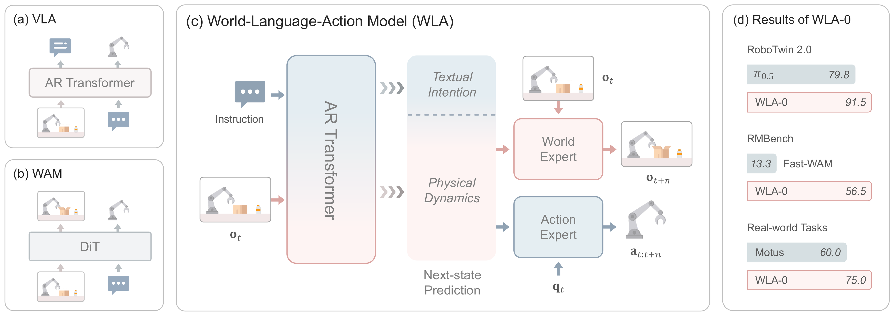

*原论文 Figure 1，PDF 第 2 页：VLA、WAM 与 WLA 的结构对比。*

### 2.1 VLA 的优势与不足

传统 VLA 通常直接学习：

\[
\text{image} + \text{instruction} \rightarrow \text{action}.
\]

它继承了 VLM 的语言理解、指令跟随和语义泛化能力，但常见问题是：

- 对未来物理变化缺乏显式监督；
- 容易退化为反应式控制；
- 长时程任务中的进度、计数和尝试历史不易稳定保留；
- 动作标签本身提供的监督信号相对稀疏。

### 2.2 WAM 的优势与不足

传统 World-Action Model 常以视频生成或未来帧预测为中间接口：

\[
o_t,\ell \rightarrow \hat o_{t+n} \rightarrow a_{t:t+n}.
\]

它能从大规模视频中学习物理变化先验，但通常存在：

- 视频生成主干缺少原生语言生成能力；
- 高层任务分解和语言推理能力有限；
- 在线生成未来视频开销较大；
- 完整视频预测容易让模型负担大量与动作无关的纹理细节。

### 2.3 WLA 的折中

WLA 不要求“先生成图像、再根据图像行动”，而是让同一个动态表征 \(h_t\) 分别支持：

- 未来视觉状态预测；
- 可执行动作生成。

因此更准确地说，WLA 是：

> **带有文本规划和可移除世界预测辅助目标的 VLA/WAM 混合架构。**

---

## 3. 模型结构总览

  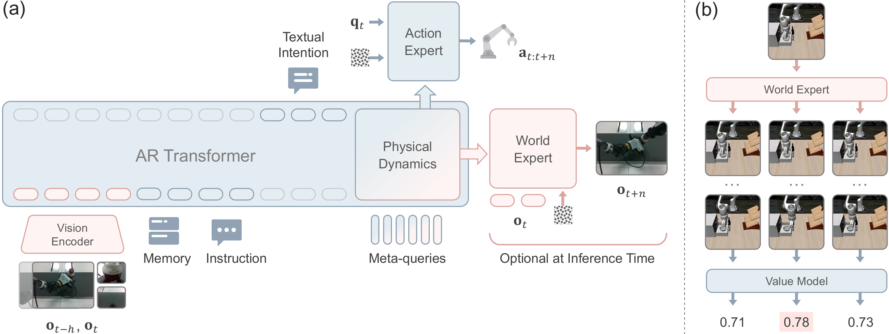

*原论文 Figure 2，PDF 第 4 页：左侧为 WLA 主结构，右侧为测试时扩展。*

### 3.1 输入

每个时间步输入包括：

| 符号 | 含义 |
|---|---|
| \(o_{t-h}\) | 较早的历史视觉观测 |
| \(o_t\) | 当前视觉观测 |
| \(q_t\) | 当前机器人本体状态，如关节或末端执行器状态 |
| \(\ell\) | 用户给出的完整任务指令 |
| \(\mathcal M\) | 已执行或已预测子任务组成的文本记忆 |

历史帧 \(o_{t-h}\) 使模型能够感知变化趋势，而不仅是单帧静态状态。例如在旋转垃圾桶任务中，历史帧有助于估计转速和运动方向。

### 3.2 三个核心组件

| 组件 | 主要职责 | 推理时是否必须启用 |
|---|---|---|
| AR Transformer backbone | 语言理解、文本子任务预测、上下文管理、生成 meta-query 表征 | 是 |
| World Expert | 根据 \(h_t\) 与当前观测预测未来视觉状态 | 默认否；TTS 时启用 |
| Action Expert | 根据 \(h_t\) 与机器人状态生成动作块 | 是 |

### 3.3 结构上的关键依赖关系

\[
\text{AR Backbone}
\rightarrow h_t
\rightarrow
\begin{cases}
\text{World Expert} \rightarrow \hat o_{t+n}\\
\text{Action Expert} \rightarrow \hat a_{t:t+n}
\end{cases}
\]

这意味着未来图像和动作是 \(h_t\) 的两个解码结果，而不是串联关系：

\[
\boxed{h_t \rightarrow \hat o_{t+n}}
\qquad
\boxed{h_t \rightarrow \hat a_{t:t+n}}
\]

而不是：

\[
\hat o_{t+n} \rightarrow \hat a_{t:t+n}.
\]

这正是 World Expert 能在默认推理时被移除的原因。

---

## 4. 文本子任务与时间对齐：\(s_k\)、\(e_k\)、\(S_t\)

论文先把完整任务指令 \(\ell\) 分解成一串中间子任务：

\[
\hat L=\{\hat\ell_1,\hat\ell_2,\ldots,\hat\ell_N\}.
\]

每个子任务 \(\hat\ell_k\) 都对应示范轨迹中的一个时间区间：

\[
[s_k,e_k].
\]

其中：

- \(s_k\)：第 \(k\) 个子任务开始的时间步；
- \(e_k\)：第 \(k\) 个子任务结束的时间步；
- \([s_k,e_k]\)：该语义子任务在整条动作轨迹中的时间对齐标签。

这些值应理解为训练数据中的时间标注，而不是动作值，也不是模型在线预测的连续变量。

### 4.1 为什么预测的是“子任务窗口”而不是单个子任务

WLA 一次生成未来 \(n\) 步动作：

\[
a_{t:t+n}.
\]

这个 action chunk 可能完全位于一个子任务中，也可能跨越多个子任务边界。因此，模型预测覆盖整个动作窗口 \([t,t+n]\) 的连续子任务序列：

\[
S_t=\{\hat\ell_{k_t},\ldots,\hat\ell_{k_{t+n}}\}\subseteq \hat L.
\]

这里：

- \(k_t\) 是时间 \(t\) 所处的子任务编号；
- \(k_{t+n}\) 是时间 \(t+n\) 所处的子任务编号；
- \(k_{t+n}\) 不是 \(k_t+n\)，而是“把时间 \(t+n\) 映射到对应子任务后得到的编号”。

条件：

\[
s_{k_t}\le t,
\qquad
e_{k_{t+n}}\ge t+n
\]

保证 \(S_t\) 的第一个子任务已经覆盖时间 \(t\)，最后一个子任务至少覆盖到动作窗口末端 \(t+n\)。

### 4.2 例子

假设完整任务被分成：

| 子任务 | 文本 | 时间段 |
|---|---|---|
| \(\hat\ell_1\) | 抓住杯子 | \([0,20]\) |
| \(\hat\ell_2\) | 把杯子放到托盘 | \([21,55]\) |
| \(\hat\ell_3\) | 按下按钮 | \([56,75]\) |

若 \(t=15,n=20\)，则动作窗口为 \([15,35]\)，它跨越子任务 1 和 2：

\[
S_t=\{\hat\ell_1,\hat\ell_2\}.
\]

模型学习的不只是“当前正在做什么”，还包括：

> **在接下来这个动作块中，将依次经过哪些语义阶段。**

### 4.3 论文中的真实示例

  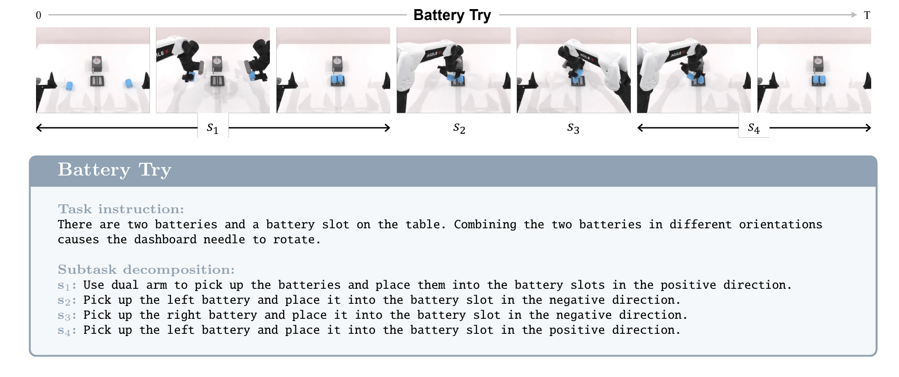

*原论文 Figure 6，PDF 第 15 页：RMBench Battery Try 任务的轨迹与子任务分解。图中的 \(s_1\) 至 \(s_4\) 表示语义阶段；在公式中，\(s_k\) 则表示第 \(k\) 个阶段的起始时间。两者字体相近，但语境不同。*

需要注意：论文没有充分交代这些文本子任务和时间边界是人工标注、规则生成，还是由其他语言模型离线生成后校验。这个数据构造成本是评估方法可扩展性时必须关注的问题。

---

## 5. Physical Dynamics、Meta-query 与 World Expert

### 5.1 Meta-query 如何形成 \(h_t\)

作者在 AR Transformer 的上下文末尾加入一组 meta-query \(Q\)。它们通过因果注意力读取前面的视觉、指令、记忆和文本子任务，输出：

\[
h_t=f(o_{t-h},o_t,\ell,\mathcal M,S_t,Q).
\]

WLA-0 使用 64 个 meta-query。它们不是人工定义的动作 token，而是可学习的查询向量，其输出受到 world loss 与 action loss 的联合训练。

### 5.2 \(h_t\) 是否等同于 latent action

论文称 \(h_t\) 可以解释为 latent action，但更严格的说法是：

> \(h_t\) 是一个同时面向未来图像预测和动作生成优化的共享动态表征。

它与一些显式 latent-action 方法不同：

- 没有独立预训练的 action quantizer；
- 没有固定离散 codebook；
- 不采用先学习 latent action、再训练策略的两阶段流程；
- 通过端到端梯度被迫保留对未来状态和动作都有效的信息。

因此“latent action”是合理解释，但论文没有数学上保证它只包含动作信息或满足最小充分性。

### 5.3 World Expert 的任务

World Expert 接收：

\[
h_t,\quad o_t
\]

并预测未来目标帧：

\[
\hat o_{t+n}=f_{\mathrm{wm}}(h_t,o_t).
\]

实际训练目标不是直接回归 RGB，而是预测未来图像的 VAE latent。World Expert 只预测静态终点帧 \(o_{t+n}\)，而不是完整视频 \(o_{t:t+n}\)。

作者希望这种设计形成信息分工：

- \(h_t\) 只需编码推动状态变化的核心信息；
- World Expert 负责补充高分辨率视觉细节；
- 主干不会被迫直接生成全部像素。

### 5.4 梯度如何影响动作生成

虽然 Action Expert 不读取预测图像，但 world-model loss 会沿以下路径更新主干：

\[
\mathcal L_{\mathrm{wm}}
\rightarrow f_{\mathrm{wm}}
\rightarrow h_t
\rightarrow \text{AR Transformer}.
\]

同时动作损失沿：

\[
\mathcal L_{\mathrm{act}}
\rightarrow f_{\mathrm{act}}
\rightarrow h_t
\rightarrow \text{AR Transformer}.
\]

所以 World Expert 通过共享表征学习，**隐式**改善动作生成，而不是在推理时作为显式条件输入。

---

## 6. 为什么使用 VAE 特征，而不是 DINO/JEPA

论文写道，WLA 中的 physical dynamics 已经在语义层面被建模，因此“不需要额外的语义归纳偏置”。这句话应结合其上下文理解。

### 6.1 “已经在语义层面建模”指什么

\(h_t\) 的上游已经包含：

- 原始任务指令 \(\ell\)；
- 文本子任务窗口 \(S_t\)；
- 历史文本记忆 \(\mathcal M\)；
- 预训练 VLM 的视觉—语言表示。

因此模型在形成 \(h_t\) 时已经知道：

- 当前操作对象是什么；
- 当前处于哪个任务阶段；
- 接下来要完成什么语义目标；
- 哪种对象关系应发生变化。

这里所谓“semantic level”不是说物理动态只包含语义，而是说其上游已经提供了很强的语义条件和语义监督。

### 6.2 DINO/JEPA 带来的语义归纳偏置

DINO、JEPA 一类特征更倾向于保留：

- 物体身份和场景结构；
- 高层语义相似性；
- 对纹理、光照和局部像素变化的鲁棒性。

如果预测目标是 DINO/JEPA 特征，模型更容易满足“未来画面在语义上仍然相似”，但不一定被强迫精确表达：

- 物体移动了多少；
- 姿态是否准确；
- 夹爪是否接触；
- 是否完成精细对齐；
- 局部遮挡和几何关系如何变化。

### 6.3 VAE latent 的互补作用

VAE latent 为了支持图像重建，通常需要保留更多：

- 位置、轮廓与姿态；
- 局部几何；
- 颜色、纹理和场景布局；
- 接触与遮挡变化。

作者希望形成如下互补：

| 信息类型 | 主要来源 |
|---|---|
| “接下来要做什么” | 文本意图、VLM 与记忆 |
| “未来画面具体怎样变化” | VAE latent 世界预测目标 |
| “怎样执行动作” | Action Expert |

因此可以把原句改写得更直接：

> 语言主干已经告诉模型未来在语义上应发生什么；World Expert 更需要补充精细视觉和空间变化，而不是再通过 DINO/JEPA 重复强调高层语义。

### 6.4 证据边界

论文没有提供 VAE、DINO 和 JEPA 目标的直接消融，因此这主要是作者的设计解释，不是被系统实验完全证明的结论。VAE latent 也并非“没有语义”，它只是相对更偏向可重建的视觉细节。

---

## 7. Action Expert 与联合训练目标

Action Expert 接收共享动态表征和机器人本体状态：

\[
a_{t:t+n}=f_{\mathrm{act}}(h_t,q_t).
\]

机器人状态 \(q_t\) 很重要，因为仅凭图像和语义目标不足以确定当前机械臂的精确可执行控制量。

总训练目标为：

\[
\mathcal L
=
\mathcal L_{\mathrm{act}}
+\alpha\mathcal L_{\mathrm{wm}}
+\beta\mathcal L_{\mathrm{lang}}.
\]

其中：

| 损失 | 作用 | WLA-0 权重 |
|---|---|---:|
| \(\mathcal L_{\mathrm{act}}\) | 动作 flow-matching loss | 1 |
| \(\mathcal L_{\mathrm{wm}}\) | 未来图像 VAE latent 的 flow-matching loss | \(\alpha=0.1\) |
| \(\mathcal L_{\mathrm{lang}}\) | 文本子任务交叉熵 | \(\beta=0.005\) |

语言损失的数值权重虽小，但在 RMBench 中删除它会造成巨大性能下降。这说明其价值来自离散子任务结构和进度追踪，而不能只根据损失系数判断重要性。

---

## 8. 两种推理模式

### 8.1 Efficient Mode

默认推理流程为：

1. 输入历史图像、当前图像、指令和文本记忆；
2. 预测当前及未来子任务窗口；
3. meta-query 产生 \(h_t\)；
4. Action Expert 生成动作块；
5. 执行动作并更新文本记忆；
6. 在下一控制周期重新规划。

World Expert 在此模式下完全关闭，因此 world modeling 是训练期的辅助目标，而不是在线控制的必经步骤。

### 8.2 Test-Time Scaling（TTS）

算力允许时，WLA 可以：

1. 用不同随机种子采样 \(K\) 个候选动作块；
2. 为每个候选生成对应的未来静态图像；
3. 由 Value Model 对未来状态评分；
4. 执行最高分动作块。

价值模型使用成功 rollout 训练，时间 \(t\) 的标签为：

\[
v_t=y\cdot\gamma^{T-t},
\]

其中 \(y\in\{0,1\}\) 表示整条 rollout 是否成功。

这是一种：

\[
\text{sample}\rightarrow\text{imagine}\rightarrow\text{rank}\rightarrow\text{execute}
\]

的 best-of-\(K\) 规划方式。

### 8.3 一个未讲清楚的技术细节

正文称每个候选动作都有“对应”的未来帧，但公式中的 World Expert 只显式接收 \(h_t\) 与 \(o_t\)，没有直接接收已采样动作 \(a^{(k)}_{t:t+n}\)。论文没有充分说明：

- 动作和图像是否共享同一随机噪声；
- 是否存在未展开的联合采样耦合；
- 或者二者只是在共享 \(h_t\) 条件下近似对应。

这会影响 TTS 中未来图像对候选动作排序的因果可靠性，是值得检查代码的重点。

---

## 9. 实现细节

WLA-0 的组件配置：

| 组件 | 配置 |
|---|---|
| AR backbone | RynnBrain-2B，约 2.1B 参数 |
| World Expert | SANA-600M，含 VAE 共约 900M 参数 |
| Action Expert | flow-matching head，约 390M 参数 |
| 总参数 | 约 3.4B |
| 默认推理活跃参数 | 约 2B，World Expert 被关闭 |
| Meta-query 数量 | 64 |
| Action chunk | LIBERO 为 8，其余主要实验为 32 |

论文还使用 CUDA Graph、Triton 算子融合、K/V 缓存及预计算，将推理延迟从约 116 ms 降至 40 ms 以下。因此速度优势同时来自模型结构和大量工程优化，比较基线时需要注意实现公平性。

“无 embodied pretraining”不等于所有模块随机初始化。模型仍继承预训练 VLM、视觉编码器、SANA/VAE 等组件；论文强调的是没有使用大规模机器人动作数据进行 embodied pretraining。

---

## 10. 实验结果与证据强度

### 10.1 RoboTwin 2.0 与 LIBERO：World Expert 有帮助，但增益温和

  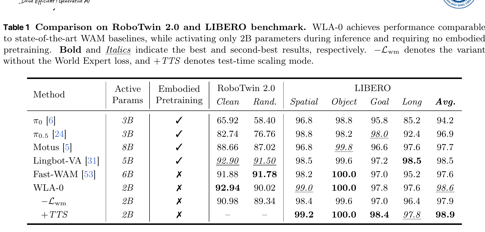

*原论文 Table 1，PDF 第 5 页。*

关键结果：

- RoboTwin Clean：WLA-0 为 92.94，去掉 \(\mathcal L_{\mathrm{wm}}\) 后为 90.98；
- RoboTwin Randomized：90.02 对 89.34；
- LIBERO 平均：98.6 对 97.9；
- TTS 将 LIBERO 平均从 98.6 提升到 98.9。

结论：未来状态监督确实能改善动作学习，但在常规短时程任务中，绝对提升相对有限。LIBERO 已接近饱和，因此不能单独用它证明强世界推理能力。

### 10.2 RMBench：语言子任务是最强证据

  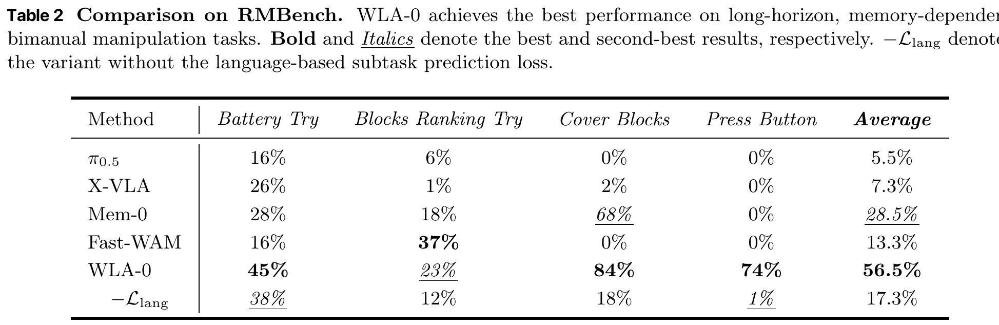

*原论文 Table 2，PDF 第 6 页。*

WLA-0 平均成功率为 56.5%，去掉语言子任务损失后降至 17.3%。这是全文最显著的消融结果，表明：

- 文本子任务可以作为可解释的 progress tracking 接口；
- 累积子任务历史有助于计数、试错和长时程记忆；
- 每次动作前重新推断当前可执行子任务，比单独使用视觉反应式策略更稳定。

但需要同时看到：RMBench 中每个任务单独训练一个模型，且需要子任务分解监督，因此它尚未证明单个通用模型能从原始指令完全自主地产生可靠长时程计划。

### 10.3 真实机器人：动态任务与延迟

  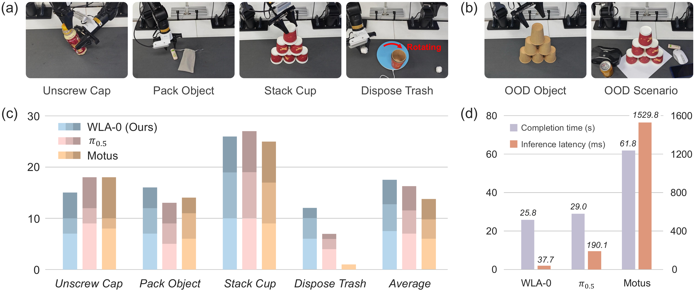

*原论文 Figure 3，PDF 第 7 页。*

论文在单一双臂平台上评估四个任务，每个任务收集 60 条示范。WLA-0 在旋转垃圾桶任务上表现突出，作者将其归因于：

- 历史观测可帮助估计动态目标速度；
- 未来状态监督改善环境变化建模；
- 低延迟控制减少对运动目标的失跟。

论文报告 WLA-0 推理约 37.7 ms，\(\pi_{0.5}\) 约 190.1 ms，Motus 约 1529.8 ms。但 WLA 使用了高度定制的 CUDA/Triton 优化，基线是否获得同等级工程优化没有充分说明。

### 10.4 从无动作机器人视频学习新任务

  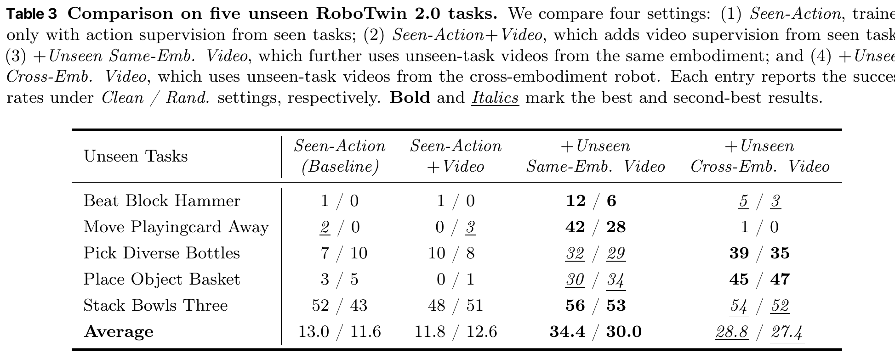

*原论文 Table 3，PDF 第 8 页。*

未见任务平均成功率：

- 仅使用已见任务动作监督：13.0 / 11.6；
- 加入同机器人未见任务视频：34.4 / 30.0；
- 加入跨机器人未见任务视频：28.8 / 27.4。

这说明 World Expert 可以从无动作视频学习“目标视觉变化”，再借助已见任务中学到的视觉变化—动作映射，将其转化为当前机器人的控制知识。

  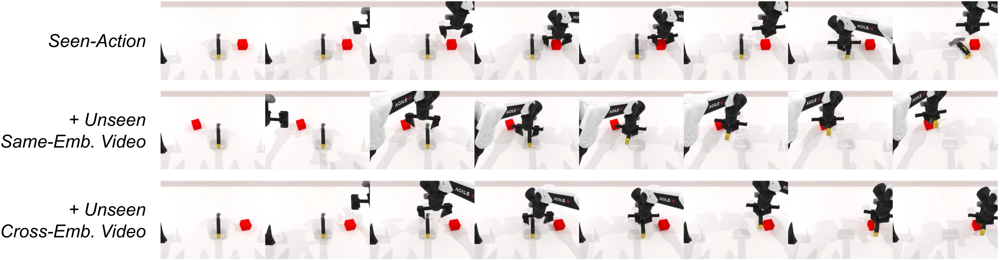

*原论文 Figure 4，PDF 第 8 页：加入未见任务视频后，模型开始抓取锤子并尝试敲击，而 baseline 倾向于直接抓取方块。*

这不是严格零样本学习：模型仍使用大量其他任务的动作数据，并且新任务提供了视频示范，只是没有提供新任务的动作标签。

### 10.5 单帧预测优于多帧预测

  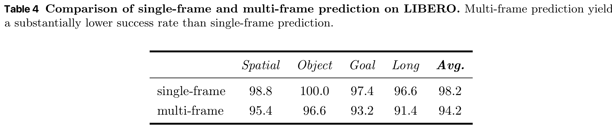

*原论文 Table 4，PDF 第 13 页。*

在作者当前训练配置中，单帧未来预测平均成功率为 98.2，多帧预测为 94.2。合理解读是：过于稠密的视觉监督可能减慢收敛并干扰动作学习。

这一实验不能证明“任何情况下单帧世界模型都优于视频模型”，因为两种设置可能在训练预算、损失平衡和模型容量上具有不同优化难度。

### 10.6 人类第一视角视频迁移失败

  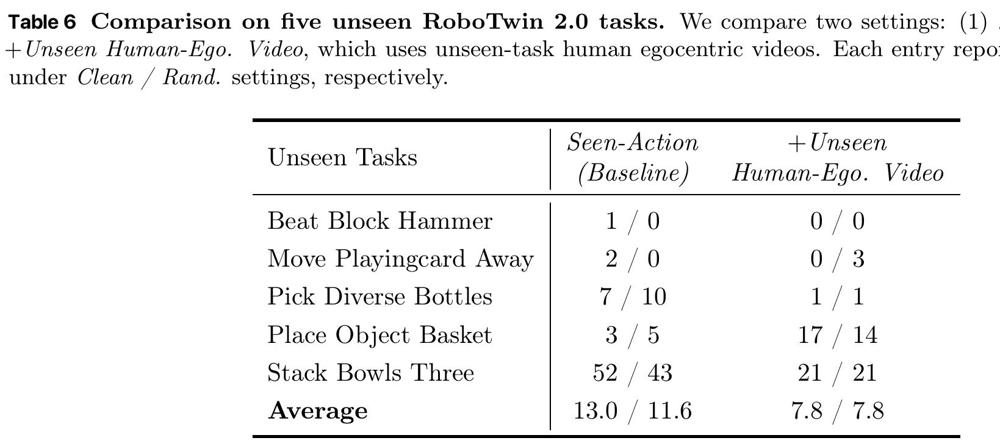

*原论文 Table 6，PDF 第 15 页。*

加入人类第一视角视频后，平均性能从 13.0 / 11.6 下降到 7.8 / 7.8。作者认为主要原因是现实人类视频与 RoboTwin 模拟环境之间的视觉域差异。

  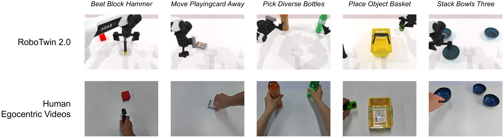

*原论文 Figure 5，PDF 第 15 页：模拟机器人任务与对应人类第一视角视频。*

因此论文目前真正证明的是：

> 相近视觉域中的同构或跨机器人视频可以提供新任务监督；尚未证明可以直接吸收大规模真实人类视频。

### 10.7 World Expert 预测图像的直观质量

  

*原论文 Figure 10，PDF 第 19 页：World Expert 的预测帧与真实帧对比。*

这些图像表明模型能捕捉主要对象和运动趋势，但视觉接近并不自动等于动作因果正确。判断世界模型是否真正帮助控制，仍应以动作消融和任务成功率为主要证据。

---

## 11. 推荐阅读顺序

### 第一遍：抓住主结构

1. Abstract：记住三类输出——文本子任务、未来图像、动作。
2. Figure 1：比较 VLA、WAM、WLA。
3. Methodology 与 Figure 2：理解 \(S_t\)、\(h_t\)、World Expert 和 Action Expert 的关系。
4. Inference Optimization：分清 Efficient Mode 与 TTS。

### 第二遍：检查实验是否支持各项主张

1. Table 1：世界预测辅助损失的真实增益有多大。
2. Table 2：语言子任务和记忆是否必要。
3. Table 3 / Figure 4：无动作视频能否教授新技能。
4. Table 6：不要遗漏人类视频迁移失败的负结果。

### 第三遍：带着质疑读附录

1. 加速技术：速度优势中有多少来自工程优化。
2. Table 4：为什么单帧比多帧更好。
3. RMBench 子任务图：子任务监督到底有多细。
4. Limitations：真实平台和任务覆盖范围是否足以支持“foundation model”式主张。

---

## 12. 阅读时需要重点质疑的问题

### 12.1 \(h_t\) 是否真的学成了 latent action

它同时受视觉和动作损失约束，但没有显式信息瓶颈或可辨识性保证。它可能包含任务语义、场景状态和动作信息的混合，而不只是动作。

### 12.2 子任务监督的成本和来源

论文需要文本子任务以及时间区间 \([s_k,e_k]\)，但没有充分说明如何自动、稳定地构造这些标签。若依赖大量人工或外部 LLM 校验，可扩展性会受到影响。

### 12.3 TTS 中动作和未来图像是否严格对应

公式没有明确展示候选动作如何作为 World Expert 的条件。需要通过代码确认候选动作—未来图像的样本级耦合机制。

### 12.4 “统一模型”是否名副其实

WLA 不是在一个统一 token 空间中纯自回归地生成文本、图像和动作，而是：

\[
\text{AR VLM} + \text{Diffusion World Expert} + \text{Flow Action Expert}.
\]

它是统一训练的混合架构，而不是单一生成机制。

### 12.5 世界建模与语言规划分别贡献多少

短任务中 \(\mathcal L_{\mathrm{wm}}\) 的增益较小；长任务中 \(\mathcal L_{\mathrm{lang}}\) 的增益极大。论文标题强调三者统一，但实验证据显示不同场景下主导因素不同。

### 12.6 速度对比的公平性

WLA 的低延迟依赖 CUDA Graph、Triton fusion、缓存和预计算。比较其他方法时，应确认基线是否使用相同硬件、相同 flow steps、相同 action chunk 和相同优化水平。

### 12.7 无动作视频学习的适用边界

跨机器人模拟视频有效，但真实人类视频失败。视觉域、相机视角、形态差异和动作可实现性映射仍是核心障碍。

### 12.8 “无 embodied pretraining”的措辞

它不代表无预训练，只代表没有使用大规模机器人动作数据进行具身预训练。预训练 VLM、图像生成模型和 VAE 仍贡献了大量先验。

---

## 13. 术语表

| 术语 | 本文中的含义 |
|---|---|
| VLA | Vision-Language-Action，直接从视觉和语言生成动作 |
| WAM | World-Action Model，将世界预测与动作生成结合 |
| WLA | World-Language-Action，将文本子任务、物理动态和动作统一训练 |
| Textual intention | 覆盖未来动作窗口的文本子任务序列 \(S_t\) |
| Physical dynamics | Meta-query 输出的共享动态表征 \(h_t\) |
| Meta-query | 插入 AR 上下文末尾、用于聚合动态信息的可学习查询 |
| World Expert | 从 \(h_t,o_t\) 预测未来图像 VAE latent 的扩散模块 |
| Action Expert | 从 \(h_t,q_t\) 生成动作块的 flow-matching 模块 |
| Action chunk | 一次预测并执行的连续 \(n\) 步动作 |
| Efficient Mode | 推理时关闭 World Expert 的默认低延迟模式 |
| TTS | 采样多个候选动作、想象未来状态并由价值模型排序 |
| Semantic inductive bias | 使模型更重视高层语义相似性而弱化部分低层视觉细节的先验 |
| Embodied pretraining | 使用大规模机器人动作或交互数据进行的具身预训练 |

---

## 最终判断

WLA 最值得借鉴的设计是：

> **把世界模型从在线控制的昂贵显式中间步骤，转化为训练期的动态表征监督；同时保留在算力允许时重新启用世界模型进行候选轨迹筛选的能力。**

其最有说服力的实验不是接近饱和的 LIBERO，而是 RMBench 中语言子任务监督带来的巨大增益，以及机器人视频对未见任务的迁移效果。与此同时，子任务标签构造、TTS 的动作—图像耦合、真实人类视频失败和速度比较公平性，仍是理解与复现这项工作时必须重点检查的部分。

---

## 相关笔记

- [[WorldVLA 论文综述(不建议读)|WorldVLA]]：对比把下一帧预测仅作为辅助训练任务的统一 token 模型；WLA 进一步显式分离语言意图、物理动态和动作生成。
- [[DreamZero_Technical_Report|DreamZero]]：对比推理时持续联合生成视频与动作的 WAM；WLA 默认可关闭 World Expert 以降低实时控制延迟。
- [[OA_WAM|OA-WAM]]：对比以对象地址和 slot routing 强化目标绑定的结构化世界动作模型。
- [[Pi_0.5综述|pi0.5]]：对比使用语言中间输出支持长时程任务的 VLA 路线。
- [[MEM 文章分析|MEM]]：对比面向长时程控制的显式语言记忆与视频记忆设计。
