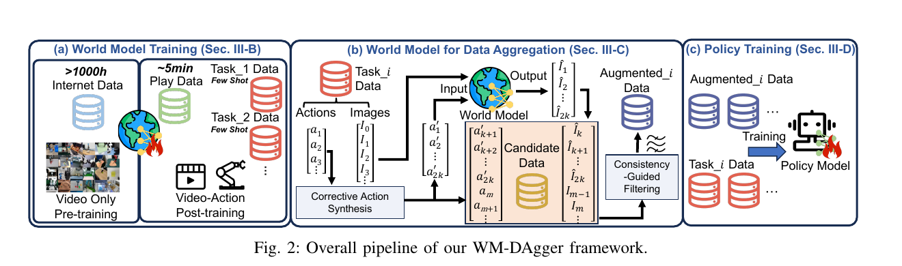
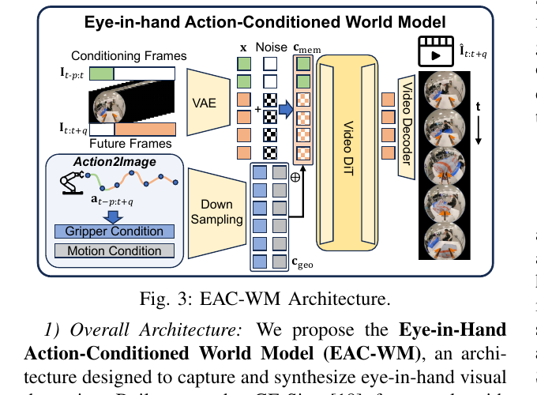
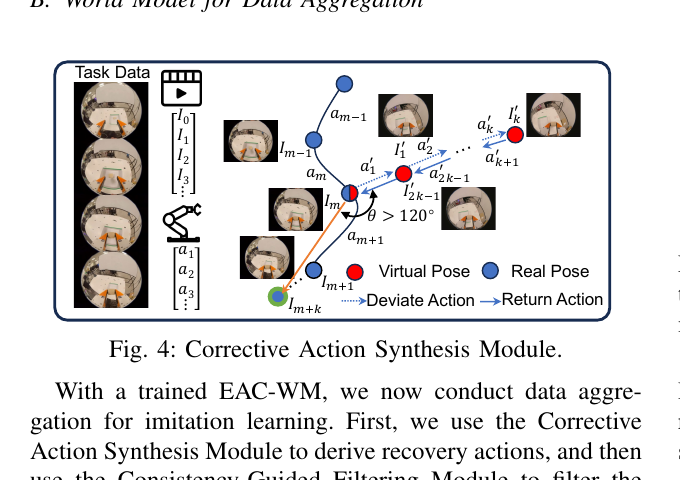
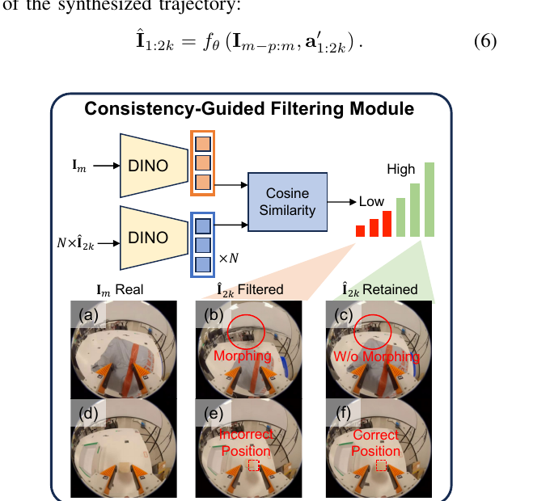
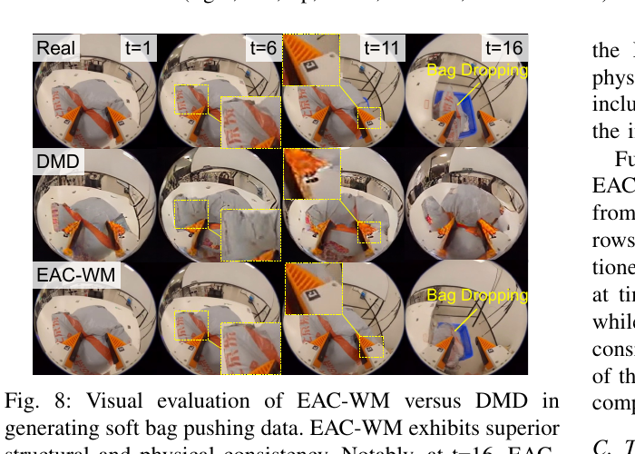

# WM-DAgger：利用世界模型实现高效模仿学习数据聚合

## 精简版

### 一句话结论

WM-DAgger 用 action-conditioned world model 合成“先偏离专家轨迹、再回到专家流形”的 OOD 恢复轨迹，以替代 DAgger 中昂贵的人类逐步纠偏；在四个真实操作任务上效果很强，但它的收益依赖一个昂贵的场景专用 world model，以及方向约束和启发式终帧过滤，尚不能说明 world model 已经可靠地理解了通用恢复动力学。

### 核心方法

1. 用基于 Cosmos-Predict2.5 的 Eye-in-Hand Action-Conditioned World Model（EAC-WM）预测 GoPro 眼在手相机的未来观测；通过 Action2Image 把 6-DoF 位姿和夹爪状态变成逐像素的几何条件。
2. 在专家演示的随机 pivot 处采样偏离方向，构造对称的 deviation/recovery 动作序列；只保留 recovery phase，让策略学习“从 OOD 状态回到任务轨迹”的动作。
3. 用 DINOv2 比较合成轨迹的终帧与同一观察位置的真实专家帧，过滤形变、错误物体位置等 hallucination，再把剩余数据与专家数据一起训练 Gr00t N1.5 action-chunk policy。

### 关键结果

- **少量示范下仍能纠偏：** soft bag pushing 中 1-shot 成功率为 73.3%，Standard BC 为 6.7%，DMD 为 13.3%；20-shot 时 WM-DAgger 达到 96.7%，而 BC 在 10-shot 后停在 30.0%（Table I, p. 6–7）。
- **方向约束是硬门槛：** 20-shot soft bag pushing 的 full model 为 96.7%，移除方向约束后为 0.0%，移除过滤器后为 66.7%（Table III, p. 7）。这说明“生成恢复数据”本身不够，恢复动作的任务方向和数据可信度决定了结果。
- **合成数据存在饱和点：** 300、900、1500、3000 条合成样本的成功率分别为 46.7%、63.3%、96.7%、96.7%；大规模合成并非越多越好，约 1500 条已覆盖主要 OOD 恢复需求（Table II, p. 7）。
- **泛化和复杂形变仍有边界：** pick-and-place 的两个未见物体成功率为 63.3% 和 76.7%，但 towel folding 只有 46.7%，即使 WM-DAgger 仍明显优于 BC 0.0% 和 DMD 10.0%（Table IV、VI, p. 7–8）。

### 主要限制

- EAC-WM 需要 Cosmos-Predict2.5（2B）互联网视频预训练、每个任务约 5 分钟 Play Data 和任务示范；论文的“减少人类成本”不等于不需要额外数据或算力。
- DINOv2 终帧余弦相似度只是 hallucination proxy。它不能保证中间帧动力学正确、动作真的可执行，且“低于候选平均值”不是校准过的物理一致性阈值。
- 固定的几何偏离方向和 `>120°` 角度规则适合当前眼在手、低自由度设置，但未证明适合需要绕障、接触切换或多指协同的恢复动作。
- 没有直接和人类在环的 HG-DAgger、CR-DAgger 做同条件比较；四个任务、单一机器人平台、无误差条和大量定量 world-model rollout 指标限制了结论外推。

### Takeaway

> 对模仿学习来说，world model 最有价值的用途可能不是替代真实环境做长时程规划，而是生成“策略已经犯错之后应该如何回来”的局部监督；但这要求生成数据同时满足任务方向、物理连续性和可验证性，任一环节失真都会把错误恢复写入训练集。

---

## 完整版

## Metadata

- Authors / venue / year: Anlan Yu、Zaishu Chen、Peili Song、Zhiqing Hong、Haotian Wang、Desheng Zhang、Tian He、Yi Ding、Daqing Zhang；arXiv preprint，2026，版本 v1 于 2026-04-13 发布。
- Paper / code: [WM-DAgger: Enabling Efficient Data Aggregation for Imitation Learning with World Models](https://arxiv.org/abs/2604.11351)；[代码仓库](https://github.com/czs12354-xxdbd/WM-Dagger)。
- Task and setting: eye-in-hand 机器人操作中的 few-shot imitation learning；用 world model 合成 OOD recovery data，训练 action-chunk policy。
- Reading date: 2026-08-31
- Source boundary: 本笔记依据论文正文、图表和参考文献整理。带有“论文事实”的内容来自论文；“分析推断”和“待验证”是对证据边界的解释，不应当当成作者已经证明的结论。

## One-sentence Verdict

> 论文把 DAgger 的“人在 OOD 状态下提供纠偏标签”改造成“world model 生成受约束的偏离—返回轨迹，再用真实终帧筛选”，核心贡献是数据聚合接口和过滤机制的组合，而不是一个新的 imitation objective；实验支持它在当前低自由度、眼在手操作任务上有效，但尚未支持其对通用物理恢复的强主张。

## Key Figures

### Figure 2：总体 pipeline

**读图：** 左侧先用超过 1000 小时互联网视频做 video-only pre-training，再用约 5 分钟每任务的 Play Data 和 few-shot Task Data 做 video-action post-training。中间从一个任务的专家数据抽取纠偏动作，经 world model 生成候选视觉轨迹；右侧用 Consistency-Guided Filtering 筛选后，与真实任务数据混合训练 policy。

**证据边界：** 图能准确说明数据流和训练阶段，但不能证明 internet pre-training、Play Data、world model 结构和 policy architecture 各自贡献了多少。

### Figure 3：EAC-WM 与 Action2Image

**读图：** 历史帧和未来帧先由 VAE 变成视觉 token；Action2Image 把动作映射成 gripper condition 和 dense motion condition，再与视觉 token 一起进入 Video DiT，最后由 video decoder 生成未来帧。它的关键不是单独加一个 action token，而是把稀疏动作升维成与每个像素相关的相机运动条件。

**证据边界：** 这是架构示意图。逐像素几何条件是否真的比普通 action embedding 更好，需要 Action2Image 对照消融；论文的表格没有单独报告这一替代实验。

### Figure 4：纠偏动作合成

**读图：** 在专家轨迹的 pivot $m$ 处，蓝点表示真实专家位姿，红点表示虚拟位姿。动作首先沿 $v_d$ 把机器人从专家流形带到 OOD 区域，再沿 $-v_d$ 返回 $I_m$ 所在的专家流形；训练时丢弃前半段 deviation phase，只保留从 OOD 状态出发的 recovery phase。

**一个容易误读的细节：** 正文说过滤掉与 $a_{m+1}$ 夹角小于 $120^\circ$ 的候选，Figure 4 标注为 $\theta>120^\circ$。因此实现层面应理解为：只保留足够偏离下一步专家动作的 deviation direction，随后用反方向作为 return action。正文中“recovery actions do not oppose expert trajectory”说的是回程动作，而不是 $v_d$ 本身。

### Figure 5：一致性引导过滤

**读图：** 将真实专家帧 $I_m$ 和每条候选轨迹最远端的 $\hat I_{2k}$ 输入 DINOv2，计算 cosine similarity，再按照候选集合的自适应阈值保留或丢弃轨迹。图中用 object morphing 和错误物体位置展示被过滤的样本。

**证据边界：** 终帧距离条件帧最远，作为误差累积的 proxy 有一定合理性；但高 DINO 相似度只意味着视觉 embedding 相近，不等价于中间状态满足动力学、碰撞和接触约束。过滤模块的效果主要由 Table III 的 w/o Filter 支持，而非 Figure 5 的定性案例本身。

### Figure 8：与 DMD 的 world-model 视觉对比

**读图：** 对同一 soft-bag action sequence，在 $t=1,6,11,16$ 比较真实帧、DMD 和 EAC-WM。DMD 随时间出现明显 morphing；EAC-WM 在 $t=16$ 仍能表现 bag dropping 的结构变化。

**证据边界：** 这是同条件输入下的定性对照，支持“EAC-WM 的视觉结构更稳定”这一中间 claim；它不能独立证明 EAC-WM 生成的 action-label pair 更适合 policy learning，也不能替代长时程 rollout error 或 action consistency 指标。

## Problem and Baseline

### Problem

普通 behavior cloning 从专家数据学习：

$$
\hat a_t=\pi_\theta(I_t),
$$

部署时一旦出现很小的动作误差，机器人就可能进入专家数据没有覆盖的 OOD 状态。此时策略继续根据错误状态预测动作，误差会进一步扩大，形成 compounding errors。

DAgger 的解决方式是让当前策略在环境中运行，在它进入 OOD 状态时由专家给出正确动作，再把这些 state-action 对加入训练集。它的瓶颈是每轮都要依赖人类纠偏，尤其对于长轨迹、接触丰富或高频控制任务，成本很高。

### Why it matters

恢复数据和正常专家数据解决的不是同一个问题：

- 专家数据告诉策略“任务应该怎么做”；
- recovery data 告诉策略“已经偏离之后如何重新进入可行轨迹”；
- 没有后者，policy 的离线 loss 可以很低，但闭环中一个小误差就可能把状态带出数据分布。

论文选择 soft bag、deformable ballot 和 towel 等任务，是因为这些对象的接触和形变更容易暴露 world model 的物理错误；如果只在刚性、低接触任务上生成恢复数据，视觉相似度可能掩盖错误 dynamics。

### Baseline pipeline

论文实际比较三种 policy training route：

1. **Standard BC：** 只用 few-shot 的真实专家 Task Data 训练，不进行数据聚合。
2. **DMD：** 使用 Diffusion Meets DAgger [6] 生成 OOD 数据，再训练 policy。论文将其称为使用 diffusion-based synthesis 的 SOTA DAgger 方法。
3. **WM-DAgger：** 使用 action-conditioned world model 生成连续视觉恢复轨迹，经筛选后与专家数据合并。

这里需要区分两层 baseline：Standard BC / DMD 是本文的实验 baseline；原始 DAgger、HG-DAgger 和 CR-DAgger 是论文 related work 中提到的 DAgger 家族，但没有在本文的四个任务中直接做同条件实验。

### Exact delta

WM-DAgger 相对 Standard BC 的直接改动可以压缩为：

> **把“策略访问 OOD 状态后由人类标动作”替换成“world model 生成受约束的 OOD 偏离—恢复轨迹，并只把经过终帧一致性筛选的 recovery phase 加入训练集”。**

相对 DMD，作者强调三个差异：

- DMD 的 diffusion synthesis 主要生成单帧，难以表达连续 recovery dynamics；
- EAC-WM 接收 action sequence，逐步生成未来观测；
- Action2Image 将 action 变成 camera motion 的 dense geometric condition，Consistency-Guided Filtering 再抑制长期 rollout hallucination。

## Method

### Data flow

#### 1. 训练 EAC-WM 的数据

论文使用三层数据：

- **Internet video-only data $D_I$：** 超过 1000 小时，用于初始化 Cosmos-Predict2.5（2B）的通用视频先验。
- **Play Data $D_P$：** 每个任务约 5 分钟，由人手持夹爪在工作空间中无目标探索和与物体交互；它主要帮助模型记住当前场景的几何和物体外观。
- **Task Data $D$：** 目标操作的专家示范，实验中每个任务收集 20 条，并在 soft bag pushing 上额外报告 1/3/5/10/20-shot 结果。

论文的 pipeline 是先用 video-only pre-training 建立视频先验，再用同步的 video-action 数据做 post-training。Play Data 和 Task Data 都包含视觉—动作序列，但角色不同：前者覆盖场景交互，后者提供任务相关动力学。

#### 2. Action2Image：把动作升维成像素级条件

每一步动作定义为：

$$
a_t=[t_t,q_t,g_t]^\top,
$$

其中 $t_t\in\mathbb R^3$ 是 Cartesian translation，$q_t\in\mathbb R^4$ 是 unit quaternion，$g_t\in\mathbb R$ 是连续 gripper state。动作与眼在手相机之间通过固定 hand-eye calibration 矩阵转换，得到相机在世界坐标系中的 $R_t\in SO(3)$ 和平移 $o_t\in\mathbb R^3$。

对像素 $(u,v)$，论文计算相机坐标系中的单位 viewing ray：

$$
d_t^{(u,v)}=
\frac{R_tK^{-1}[u,v,1]^\top}
{\left\|R_tK^{-1}[u,v,1]^\top\right\|_2}.
$$

从当前时刻 $t$ 到未来 $t+i$ 的动作被转换为：

- $\Delta o_{t+i}=o_{t+i}-o_t$，在每个像素位置广播成 $\Delta O_{t+i}\in\mathbb R^{H\times W\times3}$；
- 方向变化 $\Delta d_{t+i}^{(u,v)}$，聚合为 $\Delta D_{t+i}\in\mathbb R^{H\times W\times3}$；
- 将标量 gripper state 广播为 $C_{grip}\in\mathbb R^{H\times W\times1}$。

最终的 dense geometric condition 是：

$$
C_{geo,t+i}=\left[\Delta O_{t+i},\Delta D_{t+i},C_{grip}\right]
\in\mathbb R^{H\times W\times7}.
$$

**分析推断：** 这个设计把“动作会造成怎样的相机视线和位置变化”预先写进 condition，降低 Video DiT 从低维 action vector 和高维视频之间自行发现投影关系的难度。它依赖准确的相机内参、外参和位姿记录；如果 hand-eye calibration 或动作执行误差偏大，dense condition 可能反而把错误几何强行注入 world model。

#### 3. Video-action tokenization 与 world-model 输入输出

历史观测帧 $I_{t-p:t}$ 和目标未来帧 $I_{t:t+q}$ 经预训练 VAE 得到视觉 token $x_{t-p:t+q}$。Action2Image 的 dense condition 下采样得到 action token $c_{geo}$，历史视觉 token 作为 memory condition $c_{mem}$。EAC-WM 的总体接口为：

$$
\hat I_{t:t+q}=f_\theta\left(I_{t-p:t},a_{t-p:t+q}\right).
$$

论文将视觉和动作相关条件放到共享的 latent/token 接口中，再交给 Video DiT 预测未来视觉。它不是让 policy 在推理时显式进行规划，而是为数据聚合阶段提供连续的 action-conditioned visual trajectory。

#### 4. 纠偏动作合成

对专家轨迹

$$
\tau=\{a_i,I_i\}_{i=1}^{n}\in D,
$$

随机选择 pivot timestep $m$，并设置 deviation horizon $k$。采样随机单位向量 $v_d\in\mathbb R^3$，构造长度为 $2k$ 的对称动作序列：

1. **Deviation phase $\tau'_d$：** 从专家位姿 $m$ 沿 $v_d$ 偏离，进入潜在 OOD 状态。
2. **Recovery phase $\tau'_r$：** 沿 $-v_d$ 返回原专家流形。

为了避免合成出与任务进展相矛盾的动作，论文过滤与下一步专家动作 $a_{m+1}$ 夹角小于 $120^\circ$ 的方向；Figure 4 用 $\theta>120^\circ$ 标示保留的偏离方向。偏离动作的位移大小设为 Task Data 中平均 action displacement，使合成轨迹的速度尺度接近专家数据。

给定历史视觉状态 $I_{m-p:m}$ 和合成动作 $a'_{1:2k}$，EAC-WM 生成：

$$
\hat I_{1:2k}=f_\theta\left(I_{m-p:m},a'_{1:2k}\right).
$$

整条轨迹的关键用途不是让 policy 学会“主动偏离”，而是让它在合成的偏离状态上看到正确的回程动作。因此最终丢弃 $\tau'_d$，只保留 $\tau'_r$ 作为 virtual recovery data。

#### 5. 一致性过滤

由于 world model 的误差会随 rollout 时间积累，论文把最远端 $\hat I_{2k}$ 当作整条轨迹的质量 proxy。它把终帧与同一观察位置的真实专家帧 $I_m$ 输入冻结的 DINOv2，计算 embedding cosine similarity：

$$
s=\cos\left(\operatorname{DINO}(I_m),
\operatorname{DINO}(\hat I_{2k})\right).
$$

对一批候选轨迹使用自适应阈值，低于候选平均相似度的轨迹被丢弃；如果终帧通过检查，则保留对应的 recovery trajectory。

这个检查针对两类论文展示的 failure：object morphing 和 object position 错误。它的基本假设是：机器人沿 $-v_d$ 回到与 $I_m$ 相同的观察位置后，正确轨迹的终帧应在视觉 embedding 上接近 $I_m$。

#### 6. 策略训练

聚合数据为：

$$
D_{aug}=D\cup D_{virtual}.
$$

策略采用 action chunking，在当前观察 $I_t$ 下预测长度为 $H$ 的动作序列：

$$
\hat A_t=\pi(I_t)=
[\hat a_t,\hat a_{t+1},\ldots,\hat a_{t+H-1}].
$$

训练目标是 action MSE：

$$
\mathcal L_{policy}
=\mathbb E_{(I_t,A_t)\sim D_{aug}}
\left[\frac1H\sum_{i=0}^{H-1}
\left\|\hat a_{t+i}-a_{t+i}\right\|_2^2\right].
$$

论文使用 Gr00t N1.5 作为 robotic policy；world model 生成的数据只在训练阶段使用，部署时运行的是 policy，而不是在线 rollout EAC-WM 做规划。

### Objective and supervision

#### EAC-WM 的 Rectified Flow 目标

目标未来 token 记为 $x_k$，噪声为 $\epsilon\sim\mathcal N(0,I)$，噪声尺度 $\lambda\in[0,1]$。线性 flow path 为：

$$
z_{\lambda,k}=(1-\lambda)x_k+\lambda\epsilon.
$$

Video DiT $\phi_\theta$ 在 $c=\{c_{mem},c_{geo}\}$ 条件下预测从数据到噪声的速度 $\epsilon-x$，训练损失为：

$$
\mathcal L
=\mathbb E_{\lambda,x,\epsilon,c}
\left[w(\lambda)
\left\|\phi_\theta(z_\lambda,\lambda,c)-(\epsilon-x)\right\|_2^2\right].
$$

历史 context token 是未加噪的条件 anchor；未来视觉 token 进入 flow matching 目标。论文称其为从噪声回到数据的 Video DiT，但公式的 target 是在 $x\rightarrow\epsilon$ 路径上的速度，阅读时应以公式和实现的时间方向为准。

#### Policy supervision

policy 只对动作 chunk 做 MSE，不对恢复成功概率、终点距离或 world-model uncertainty 做显式优化。因此 WM-DAgger 的主要贡献发生在**训练数据分布**，不是 policy loss 的形式。

#### 训练时与推理时的组件

| 组件 | 训练 EAC-WM | 生成 virtual data | 训练 policy | 真实部署 |
|---|---:|---:|---:|---:|
| Cosmos-Predict2.5 / EAC-WM | ✓ | ✓ | — | — |
| Action2Image 几何条件 | ✓ | ✓ | — | — |
| Corrective Action Synthesis | — | ✓ | — | — |
| DINOv2 consistency filter | — | ✓ | — | — |
| Gr00t N1.5 policy | — | — | ✓ | ✓ |
| 真实专家人工纠偏 | — | — | — | 不需要 |

“不需要额外 human-in-the-loop”只适用于 virtual data generation 阶段；原始专家示范、Play Data、标定和 world-model 训练仍然需要人和硬件投入。

### Assumptions and inductive biases

- **同一相机位置的终帧可作为正确性参照：** 偏离后沿反方向返回，预期终帧接近 $I_m$。对于有滞后、不可逆形变或路径依赖的物体，这个假设可能不成立。
- **恢复方向可以用局部几何规则构造：** 夹角和平均位移只利用动作空间几何，不知道物体接触、障碍物和任务阶段；它把复杂 recovery problem 简化为局部回撤。
- **动作轨迹和视觉相机运动足够决定未来：** Action2Image 依赖 hand-eye calibration、相机内参和位姿动作的一致性；夹爪接触状态、摩擦、柔性物体内部状态并未显式建模。
- **DINO 相似度与物理正确性相关：** 这是用于筛选的 proxy，不是动力学验证器。相似纹理、背景和物体类别可能让错误帧通过；有效但外观变化大的帧可能被拒绝。
- **合成 recovery data 的标签是 action MSE 可学习的：** policy 训练把 world-model 生成的帧当成真实 observation。若 hallucination 与动作标签不一致，策略会学习到错误的闭环纠偏。
- **shortcut 风险：** 由于终帧回到专家位置、任务对象数量少，策略可能学习相机视角、背景或特定物体纹理，而不是抽象的恢复状态。未见物体实验只覆盖两个对象，尚不足以排除这一点。

## Evidence Audit

| Claim | Direct evidence | Controls / ablations | Assessment |
|---|---|---|---|
| world model 生成的恢复数据能缓解 compounding errors | Soft bag pushing 由 BC 的 6.7% 提升到 WM-DAgger 的 73.3%（1-shot），20-shot 为 96.7% | Standard BC、DMD 对照；Table I | **较强支持**，但仅覆盖本文机器人和任务分布 |
| 连续 action-conditioned WM 比单帧 diffusion synthesis 更适合 recovery | Figure 8 同 action sequence 下 DMD 出现 morphing，EAC-WM 保持结构 | 视觉定性对照；没有统一 video metric 或 action-label metric | **部分支持** |
| Corrective Action Synthesis 是必要的 | 去掉方向约束后 soft bag pushing 成功率为 0.0% | Table III w/o Dir. | **强支持其在该设置中重要**，但不能证明 `>120°` 是唯一或最优规则 |
| hallucination filtering 有效 | 去掉过滤器后成功率从 96.7% 降到 66.7% | Table III w/o Filter；Figure 5 案例 | **较强支持**，但 DINO 阈值是启发式 proxy |
| Play Data 对 world-model 数据质量有帮助 | 去掉 Play Data 后成功率从 96.7% 降到 83.3% | Table III w/o Play Data | **支持**，但没有和等量额外 Task Data 或其他探索数据比较 |
| synthetic data 规模存在足够的覆盖点 | 1500 与 3000 条合成样本均为 96.7%，300/900 明显较低 | Table II | **支持饱和现象**，但只在 soft bag pushing 验证 |
| 对未见物体有视觉泛化 | pick-and-place 的 O4/O5 为 63.3%/76.7%，高于 BC 0.0%/10.0% | seen/unseen object split；Table IV | **部分支持**，只有两个未见物体，且仍显著低于 seen objects |
| 可扩展到复杂形变和 6-DoF manipulation | ballot insertion 73.3%，towel folding 46.7% | BC、DMD 对照；Tables V–VI | **有限支持**；towel 的绝对成功率仍低，不能称为已解决 |

### Fairness of baselines

- 论文明确使用 Standard BC 和 DMD，且 policy 架构采用 Gr00t N1.5；但正文没有充分展开每个 baseline 是否严格使用相同的 policy backbone、训练步数、合成样本数量、筛选预算和超参数。
- DMD 是单帧 diffusion synthesis baseline，论文用它来验证连续 action-conditioned world model 的价值；这是一种有针对性的对照，但不等价于与所有强 DAgger 方法公平竞赛。
- 没有报告人类在环的 DAgger、HG-DAgger 或 CR-DAgger 在相同专家预算下的结果，因此“降低人类成本”和“达到更强总体性能”应分开判断。

### Gain attribution

收益至少来自四个混合因素：

1. 更多训练样本：从 few-shot $D$ 变成 $D\cup D_{virtual}$。
2. OOD 状态覆盖：virtual trajectory 直接提供策略出错后的 observation-action pair。
3. 任务方向规则：`w/o Dir.` 的 0.0% 说明无约束的合成动作会提供反任务监督。
4. World-model 视觉连续性和 filtering：它们使合成帧比单帧 diffusion 更可能与 action label 对齐。

Table III 分离了 Play Data、Filter 和 Direction，但没有把“等量真实数据”“等算力的更强 BC 数据增强”“普通 action embedding vs Action2Image”全部拆开，所以不能把 96.7% 全部归因于 world model 的物理理解。

### Cross-domain or robustness evidence

- **任务类型：** 覆盖刚性 pick-and-place、柔性 bag pushing、ballot insertion 和 towel folding。
- **对象变化：** pick-and-place 有 3 个 seen 与 2 个 unseen object。
- **动作维度：** 论文强调 6-DoF manipulation，但没有给出不同自由度或动作噪声强度下的系统曲线。
- **平台变化：** 仅有一个 UR7e + Robotiq 夹爪 + eye-in-hand GoPro 平台；没有跨机器人、跨相机或跨标定的结果。
- **world-model 评估：** 主要是 Figure 7/8 的定性视频，没有报告 FVD、PSNR、长时程 rollout error、action-conditioned consistency 或真实/生成帧混合训练的独立指标。

### Missing decisive experiment

最关键的缺失实验是：在相同真实示范、相同生成样本数、相同 policy backbone 和相同计算预算下，对比 **human DAgger、DMD、WM-DAgger、随机方向 WM-DAgger**，并对每条生成轨迹分别测量终帧一致性、中间动力学误差和最终 closed-loop recovery success。这样才能区分“更多 OOD 样本”的收益和“更正确的物理恢复”的收益。

## 关键与非常规结果

### 1. 1-shot 就超过普通 BC 的 20-shot

Table I 的最反直觉结果不是 full model 的最高分，而是 1-shot WM-DAgger 已达到 73.3%，远高于 20-shot Standard BC 的 30.0%。这说明该方法主要补足的是**状态分布覆盖**，而不只是增加同一专家流形上的样本。

但这不是“一个示范足以学会任务”的证明：它还使用每任务 5 分钟 Play Data、预训练 Cosmos foundation model 和大量合成 rollout。真正被压缩的是任务示范数量，不是总数据和总计算量。

### 2. 方向约束比 world model 本身更像硬门槛

去掉方向约束后成功率为 0.0%，比去掉过滤器的 66.7% 更严重。论文给出的失败行为是机器人执行任意方向的动作，而不是朝向 soft bag，说明随机 OOD action 可能产生与任务目标相冲突的 supervision。

这改变了一个容易出现的直觉：不能先用 world model 大量生成数据，再期待 policy 自己从噪声中筛出正确 recovery。**恢复数据的 action label 在生成前就必须有任务相关的结构。**

### 3. 生成数据在约 1500 条后饱和

Table II 中从 900 到 1500 条样本有明显提升，但从 1500 到 3000 没有提升。对于这种方法，数据量不是唯一旋钮；当合成轨迹已经覆盖主要局部 OOD manifold 后，继续生成相似的偏离—返回轨迹可能只增加相关样本和错误样本。

该结论只在 soft bag pushing、单一配置和一个生成策略下成立，不能直接推广到更复杂任务。

### 4. 视觉泛化改善，但没有消除复杂形变的困难

在未见物体上，WM-DAgger 的 63.3%/76.7% 仍高于 BC 的 0.0%/10.0%，说明合成的 OOD 状态覆盖可能减少对特定纹理的记忆。然而 towel folding 只有 46.7%，远低于前三个任务的 soft-bag / ballot 结果，表明 6-DoF 和严重形变仍使 world model 的恢复数据不够可靠。

论文结论也承认向 dexterous multi-finger hand 扩展困难，因为高 DoF 会同时增加视觉一致性和 articulated dynamics 的合成难度。

### 5. DMD 的问题被定位为连续物理一致性，而不是单纯画质

Figure 8 中 DMD 在 $t=1,6,11,16$ 的主要失败是 morphing 和错误结构，EAC-WM 在长时间点还能表现 bag dropping。这个对照支持：对 recovery data，单帧看起来逼真不够，关键是同一 action sequence 下的时间连续性和结构保持。

不过该图仍是定性证据。没有 action-conditioned video metric，无法判断 EAC-WM 的视觉改进是否完全转化为 policy 的闭环恢复能力。

## 论文中提到的 SOTA DAgger 方法

> 这里的“论文中提到”很重要：论文只明确把 DMD 称为 SOTA baseline，并没有给 HG-DAgger、CR-DAgger 和 WM-DAgger 做统一 leaderboard。下面按论文引用中的定位整理，不把“被引用”误写成“当前总体 SOTA”。

| 方法 | 论文引用 | 类型与核心机制 | WM-DAgger 论文中的定位 |
|---|---|---|---|
| **DAgger** | Ross, Gordon, Bagnell, 2011, [4] | 原始 Dataset Aggregation：让当前 policy 访问可能的 OOD 状态，由 expert 在线提供动作标签，再迭代聚合数据。 | 理论和流程起点；需要持续 expert intervention，本文试图用 world model 替代这部分成本。 |
| **HG-DAgger** | Kelly et al., ICRA 2019, [5] | Human-Gated DAgger：通过 gating 控制何时由人类接管/提供监督，减少不必要的人类操作。 | 论文 related work 中列出的人工在环变体；本文没有直接实验比较。 |
| **DMD（Diffusion Meets DAgger）** | Zhang et al., arXiv:2402.17768, [6] | 用 diffusion synthesis 生成 OOD 数据，面向 eye-in-hand imitation learning；论文将其称为 SOTA data-aggregation 方法。 | 本文唯一明确的 SOTA DAgger 实验 baseline；作者认为它主要是单帧生成，缺少连续 action-conditioned physical dynamics。 |
| **CR-DAgger（Compliant Residual DAgger）** | Xu et al., arXiv:2506.16685, [13] | 通过 compliant residual 和人类 correction 改善接触丰富的真实操作。 | 论文 related work 中列出的接触操作变体；仍依赖人类纠偏，本文没有直接比较。 |

### 这些方法怎样区分

可以把 DAgger 家族的监督来源分成三类：

1. **人类直接纠偏：** DAgger、HG-DAgger、CR-DAgger。它们的标签来自真实环境中的 expert，但人力成本不同。
2. **生成式数据聚合：** DMD。它减少人工介入，但本文认为单帧 diffusion 难以保持连续物理。
3. **world-model 数据聚合：** WM-DAgger。它生成 action-conditioned 连续轨迹，再以方向规则和终帧相似度过滤；但其“监督正确性”来自 world model 和启发式 proxy，不是人类逐帧确认。

### 相关但不属于 DAgger 的方法

- **World4RL [17]：** 用 diffusion world model 的 imagined rollout 做 policy refinement，并结合 reinforcement learning。它与 WM-DAgger 都用 world model 减少真实试错，但不是 DAgger 数据聚合算法。
- **DayDreamer [16] / Dreamer 系列 [15]：** 通过 latent world model 和 imagination 做 model-based RL，重点是 reward/value 驱动的策略改进，而不是把 recovery state-action pair 直接并入 BC 数据集。
- **Cosmos / GE-Sim [10], [18]：** 是 WM-DAgger 的视频生成 foundation / world-model 技术来源，不是 DAgger 变体。

### 对“SOTA DAgger”问题的结论

从这篇论文本身能确定的名单是：**原始 DAgger、HG-DAgger、DMD、CR-DAgger**；其中论文明确写成 SOTA baseline 的是 **DMD**。WM-DAgger 在本文四个真实任务上超过 Standard BC 和 DMD，但这只说明它在该实验协议下有效，不能据此推出它已经超过人类在环的 HG-DAgger/CR-DAgger，或成为 DAgger 全领域的 SOTA。

## Independent Assessment

- **Problem value：高。** compounding error 是 few-shot BC 在真实机器人上最直接的失败来源，恢复监督比继续堆同分布示范更贴近闭环需求。
- **Novelty：机制组合有价值。** DAgger、world model、action-conditioned video 和 data filtering 都不是新概念；论文的新意主要在于把 dense camera geometry、对称偏离—回程轨迹和 terminal consistency filter 组合成无需人工逐条标注的数据聚合接口。
- **Technical soundness：条件成立。** EAC-WM 的输入输出和训练目标清晰，方向约束的消融也很有信息；但过滤器只检查视觉 embedding，且正文对方向约束的语言和 Figure 4 的符号存在容易误读之处。
- **Experimental strength：中上。** 四个真实任务、刚性和柔性对象、seen/unseen object 与多组消融是优点；缺少重复实验、误差条、world-model 定量指标、human DAgger baseline 和严格成本对齐是主要缺口。
- **Practicality：适合低自由度 eye-in-hand 场景。** 部署时只需 policy，能把 human-in-the-loop 聚合移到离线生成；但需要 Cosmos 级视频先验、任务 Play Data、精确标定和大量生成计算，整体系统并不轻量。
- **Likely failure modes：** 高自由度多指手、相机标定漂移、不可逆柔性形变、恢复路径需要绕障而非直线回撤、终帧与 pivot 视觉本来就不相似、DINO 相似度被背景/纹理 shortcut 误导，以及 world model 生成的中间动作—视觉 pair 不一致。

## Connections

- [[ALOHA与ACT完整笔记|ALOHA 与 ACT]]：对照普通 action-chunk behavior cloning、闭环执行和 compounding error；WM-DAgger 的新增监督发生在 OOD recovery state，而不是改变 chunk MSE 本身。
- [[Diffusion Policy 概述|Diffusion Policy]]：理解连续动作序列生成与 receding-horizon control；DMD 在本文中则被用作 diffusion-based data synthesis baseline。
- [[DreamZero_Technical_Report|DreamZero]]：同样使用 action-conditioned video generation，但 DreamZero 把 video-action flow model 直接作为 policy，WM-DAgger 把 world model 主要用作离线数据生成器。
- [[LightWAM_论文总结|Light-WAM]]：对照“未来视频监督用于训练、推理时直接输出动作”的 WAM 路线；WM-DAgger 的未来视频被进一步用于制造 OOD recovery supervision。
- [[DreamerV4_技术报告|Dreamer 4]]：对照 reward/value 驱动的 imagined RL；WM-DAgger 不在 world model 内优化长期回报，而是把生成轨迹转成 BC 数据。
- [[Robot/WAM/WALL-SS_论文阅读笔记|WALL-SS]]：共同处理 policy-induced OOD state 和失败恢复；WALL-SS 用真实 intervention/recovery transition 训练并校准长时 simulator，WM-DAgger 则用 world model 合成 recovery supervision。

## Open Questions

1. 如果使用真实 DAgger 轨迹或人类 correction 对每条生成轨迹做少量审计，DINO 终帧过滤的精度和 policy gain 能否被量化？
2. 能否把固定的 `>120°` 偏离规则替换成 task-aware、contact-aware 或 uncertainty-aware recovery proposal？
3. 在相同真实示范、合成样本数、训练时间和 policy backbone 下，human DAgger、HG-DAgger、CR-DAgger、DMD 与 WM-DAgger 的 cost-success 曲线分别是什么？
4. 对不可逆的 towel folding、插入和多指 dexterous manipulation，终帧回到 $I_m$ 的一致性假设是否应改成目标状态或接触状态一致性？
5. world model 是否真的学习到了可迁移的 dynamics，还是主要利用了固定相机、对象外观和任务轨迹附近的局部视频先验？需要跨相机、跨 embodiment、跨物体和动作噪声的反事实实验。

## Takeaway

WM-DAgger 最值得保留的不是“用一个大视频模型生成更多数据”，而是一个数据接口设计：**把闭环失败后的恢复行为显式加入 imitation learning，并用任务方向先验与可观测一致性过滤器限制错误监督。** 这条路线能否扩展，取决于过滤器是否从视觉相似度升级为真正的 action-conditioned physical validity 检查。

## 参考文献（与 DAgger 相关）

1. S. Ross, G. Gordon, and D. Bagnell. *A Reduction of Imitation Learning and Structured Prediction to No-Regret Online Learning*. AISTATS, 2011.
2. M. Kelly, C. Sidrane, K. Driggs-Campbell, and M. J. Kochenderfer. *HG-DAgger: Interactive Imitation Learning with Human Experts*. ICRA, 2019.
3. X. Zhang, M. Chang, P. Kumar, and S. Gupta. *Diffusion Meets DAgger: Supercharging Eye-in-Hand Imitation Learning*. arXiv:2402.17768, 2024.
4. X. Xu, Y. Hou, C. Xin, Z. Liu, and S. Song. *Compliant Residual DAgger: Improving Real-World Contact-Rich Manipulation with Human Corrections*. arXiv:2506.16685, 2025.
