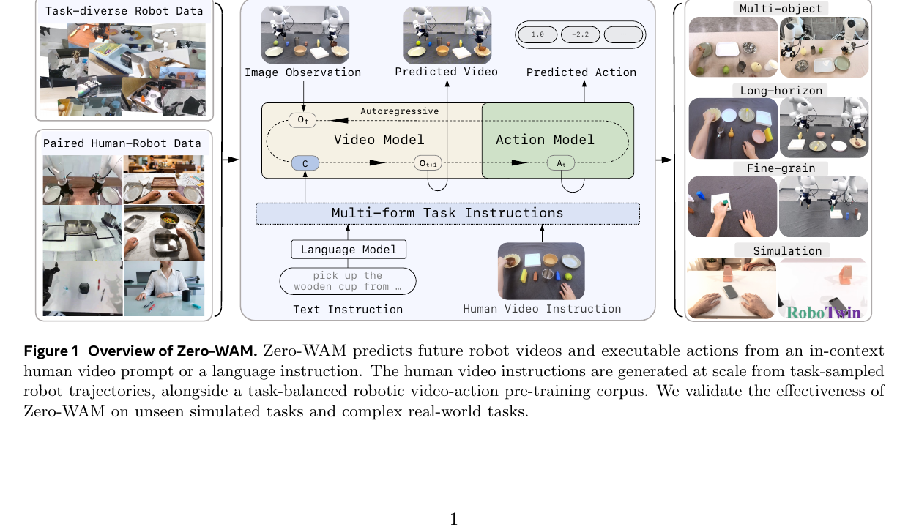
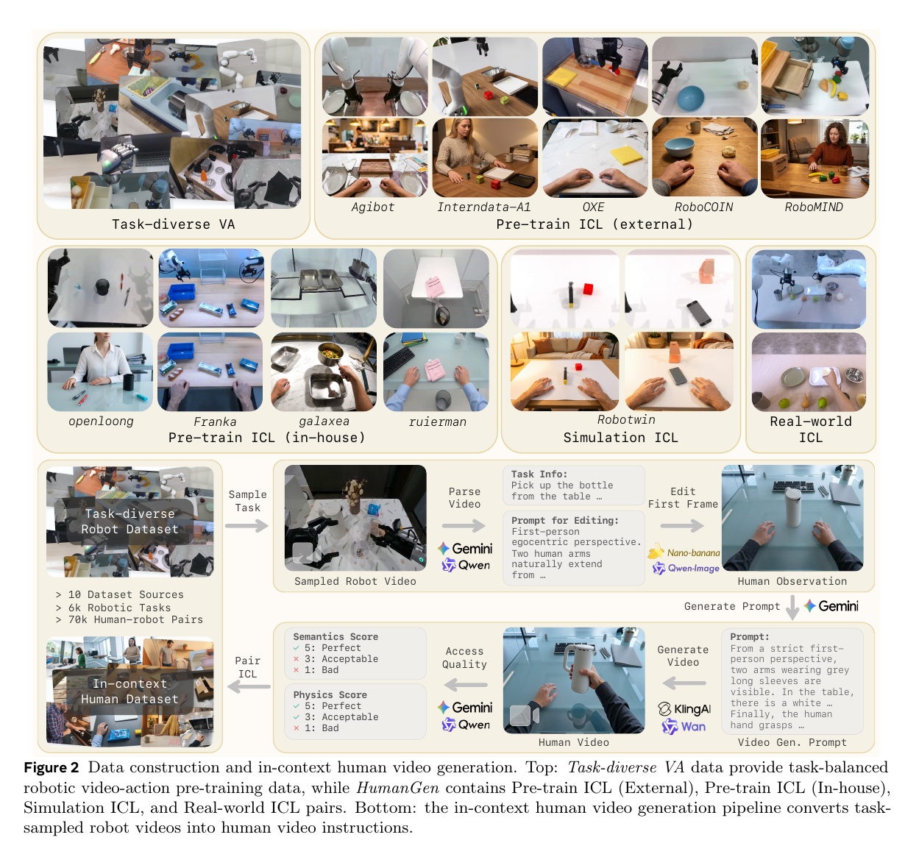
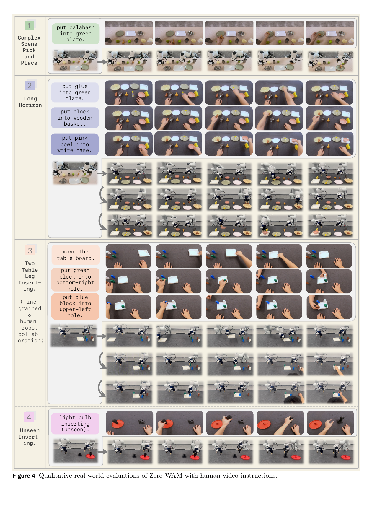
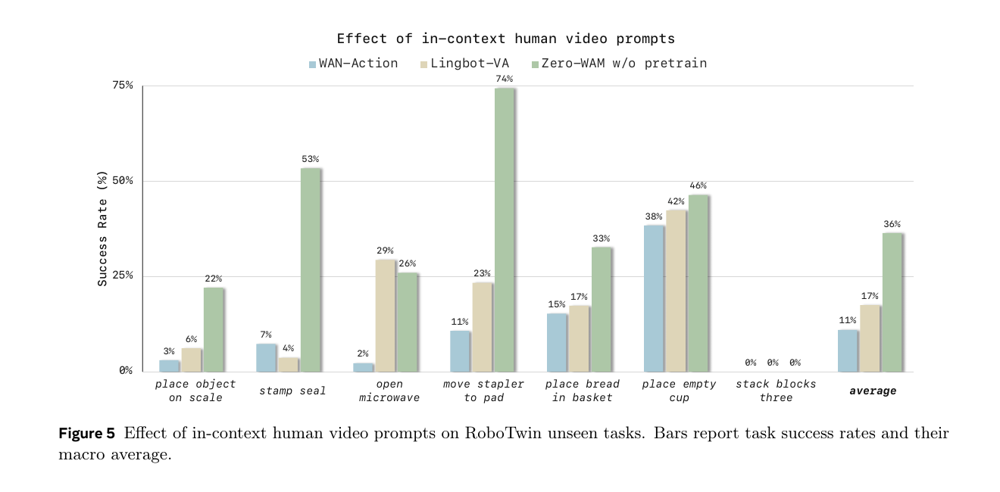
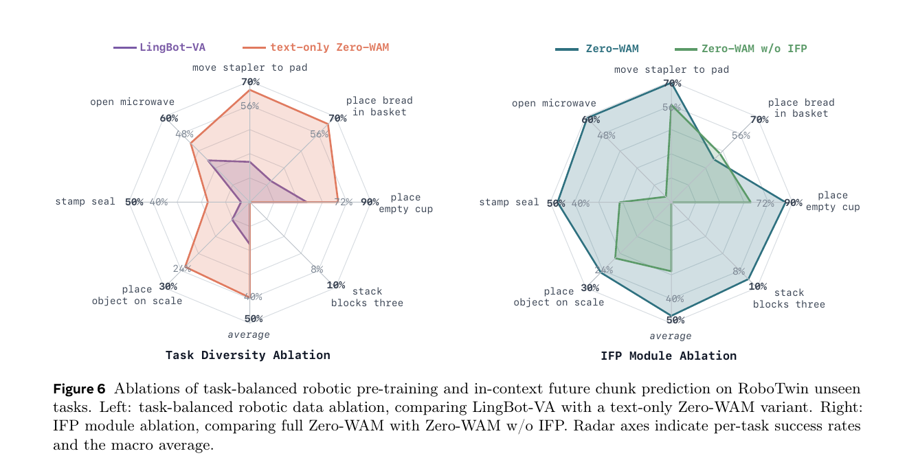

# Zero-WAM：从人类视频上下文到开放任务泛化

## 精简版

### 一句话结论

Zero-WAM 把未见任务泛化重新定义为“根据部署时的人类视频指定任务”，而不是直接从语言和机器人历史外推动作：它用自动生成的 HumanGen 人类—机器人 ICL 对、task-balanced robot video-action pretraining，以及抑制 shortcut 的 IFP 目标，训练一个先预测机器人未来视频、再由 inverse-dynamics action Transformer 解码动作的因果 WAM。方法有效，但“zero-shot”依赖一个已经由机器人轨迹生成的人类视频提示、较重的预训练和真实机器人上的 seen-task embodiment adaptation。

### 核心方法

1. 从 task-sampled robot trajectories 出发，用 VLM 解析任务、编辑首帧、生成 human video，再用 VLM 检查语义与物理合理性，构造 74.2K 对、覆盖 8.6K tasks 的 HumanGen。
2. 用 task-balanced sampling 从 5 个公共机器人视频—动作数据源中重采样，得到每个 epoch 约 400K 条、覆盖 6K+ tasks 的 Task-diverse VA 数据。
3. 将人类视频作为 robot history 前的 prefix memory；video Transformer 预测下一段 robot video，action Transformer 从预测的 robot video 做 inverse dynamics。
4. IFP 让主视频表示同时预测多个有 stride 的更远 future chunks，且 IFP 分支不能直接读取 human video，从而迫使主分支真正编码 ICL 任务信息。

### 关键结果

- RoboTwin 2.0 的 7 个 unseen tasks 上，Zero-WAM 平均成功率为 46.95±0.72%，相比 LingBot-VA 的 17.45±1.40% 高 29.50 个百分点；但最难的 Stack Blocks Three 只有 9.00±2.16%（Table 2, p.11）。
- 在只使用 43 个 seen tasks、相同 Wan2.2 初始化的对照中，加入人类视频使平均成功率从 10.98% 提升到 36.36%（Figure 5, p.13）。
- 去掉 IFP 后 7-task 平均从 46.95% 降至 28.55%，Stack Blocks Three 从 9% 降至 0%；把 task-balanced pretraining 改成 text-only 变体仍有 39.44%，说明数据分布本身也是重要因素（Figure 6, p.14）。
- 真实 Franka 上，object-to-container、three-object sequential、two-table-leg insertion 的成功率分别为 53.3%、33.3%、16.7%；对比使用详细文字指令的 LingBot-VA 为 43.3%、10.0%、0%（Table 3, p.11）。

### 主要限制

- 主结果同时改变了人类视频任务接口、预训练数据规模/分布和 IFP，Zero-WAM 与 baseline 的主表比较不能把 29.50 个百分点全部归因于某一个模块。
- HumanGen 是由 VLM、图像编辑模型和视频生成模型自动合成的，论文未报告生成保留率、人工审计比例、跨生成器测试或合成视频伪影对性能的影响。
- action Transformer 训练时看到 ground-truth next robot video，推理时看到 video Transformer 生成的结果，存在 teacher-forcing / exposure-bias 风险。
- 评测只有 7 个 RoboTwin unseen tasks 和 3 个真实任务族，未覆盖动态、移动操作、开放环境鲁棒性或更长时程任务；真实对比还使用了不同的信息接口。

### Takeaway

人类视频在这里不是要被模仿的动作轨迹，而是一个跨 embodiment 的视觉任务说明；真正让它生效的是“主视频表示必须把这段说明转成未来 robot video”，而 IFP 正是用来阻止模型只靠语言和机器人历史走捷径的训练约束。Zero-WAM 的贡献更像数据构造 + 任务接口 + 训练目标的联合方案，而不是一个单独的新型 action head。

---

## 论文信息

- **论文**：Zero-WAM: In-Context World-Action Modeling from Human Videos for Open-Ended Task Generalization
- **作者**：Jiaming Zhou、Qihang Zhang、Gangwei Xu、Cunxin Fan、Yujie Zhao、Ruilin Wang、Yiming Luo、Shuai Yang、Xing Zhu、Yujun Shen、Junwei Liang、Yinghao Xu
- **机构**：Robbyant、HKUST (GZ)、HKUST
- **版本**：arXiv:2608.26103v1，2026-08-26
- **项目页**：https://robbyant-research.github.io/Zero-WAM/
- **基础模型**：Wan2.2-TI2V-5B
- **评测**：RoboTwin 2.0 unseen-task simulation、双臂 Franka real-world manipulation
- **阅读日期**：2026-08-27

## 一句话 Verdict

**论文事实：** Zero-WAM 让一个因果 video-action policy 在推理时接收 human video 作为 task specification，并在不为未见任务更新参数的情况下执行对应的 robot actions；它在 7 个 RoboTwin unseen tasks 上取得 46.95% 平均成功率。

**分析判断：** 论文最有价值的地方不是把 human video 接到模型里，而是识别出 ICL 模型会忽略视频的 shortcut，并用 IFP 直接约束中间 robot-video representation；不过最终收益仍由合成数据、task balancing、预训练和人类视频接口共同贡献。

## 关键图表

### Figure 1：多形式任务指令进入统一 video-action policy

**读图：** 左侧是 task-diverse robot data 与 paired human-robot data，中间是共享的 autoregressive Video Model 和 Action Model，底部的 task instruction 可以是语言或 human video，右侧展示 multi-object、long-horizon、fine-grained 和 simulation 场景。模型的输出不是单纯动作，还包括未来 robot video。

**证据边界：** 这是总体数据流示意图；它说明 human video 是任务条件、action 依赖 robot-domain video，但不能证明视频提示、数据平衡或 IFP 各自带来的性能增益。

### Figure 2：HumanGen 的数据构造链

**读图：** 上半部分把 Task-diverse VA、外部/内部 pre-train ICL、Simulation ICL 和 Real-world ICL 分开；下半部分展示从 task-sampled robot video 开始，经 VLM 解析、首帧编辑、视频生成和语义/物理评分，最后与原 robot trajectory 配对。

**证据边界：** 图支持“人类视频不是人工逐任务采集，而是从机器人轨迹自动合成”的数据流程；它没有给出合成视频的通过率、人工质量基准或生成成本，因此不能仅凭图判断 HumanGen 的质量和可复现性。

### Figure 4：真实世界中的任务说明与机器人执行

**读图：** 四组示例覆盖复杂场景 pick-and-place、长时程多物体操作、双桌腿精细插入，以及未见的灯泡插入。每组上方是 human video instruction，下方是机器人 rollout，重点不是动作像不像人，而是机器人是否遵循视频指定的目标、顺序和插入位置。

**证据边界：** 这是定性展示，不能替代 Table 3 的成功率；样例是挑选出来的成功或代表性 rollout，也不能说明未见配置上的总体失败率。

### Figure 5：人类视频本身提供了额外任务信息

**读图：** 在只使用 43 个 seen RoboTwin tasks 的小规模训练中，WAN-Action 只用文字，LingBot-VA 使用其 robot pretraining 加文字，Zero-WAM w/o pretrain 使用相同 Wan2.2 初始化但加入 human video。Zero-WAM w/o pretrain 的平均值达到 36%，高于 WAN-Action 的 11% 和 LingBot-VA 的 17%；Stack Blocks Three 三者都为 0%。

**证据边界：** 这是较强的 ICL 对照，说明 human video 能提供超出 text-only 的任务信息；但它只覆盖 43 个 seen tasks，且使用生成的人类视频，不能直接推断真实人类视频或更开放任务上的收益。

### Figure 6：task-balanced data 与 IFP 的两项消融

**读图：** 左侧比较 LingBot-VA 与屏蔽 human video 条件的 text-only Zero-WAM，右侧比较完整 Zero-WAM 与去掉 IFP 的版本。左侧显示 task-balanced robot pretraining 本身能把平均成功率推到约 39%；右侧显示 IFP 使平均值从 28.55% 提升到 46.95%，并把 Stack Blocks Three 从 0% 拉到 9%。

**证据边界：** 右侧 IFP 对照直接支持 anti-shortcut 目标的有效性；左侧仍混合了预训练语料、训练 recipe 和模型初始化差异，不能把 21.99 个百分点完全解释为“只因为 task-level sampling”。

## Problem and Baseline

### 问题：未见任务不是简单的视觉变化

Zero-shot cross-task generalization 要求机器人执行训练时从未见过的 manipulation task，而不是只在已知任务上更换物体颜色、背景或相机。对一个未见任务，语言往往难以完整描述：

- 物体之间的空间约束；
- 多个中间状态和操作顺序；
- 场景应如何随时间变化；
- 精细插入、接触和双臂协作的目标对应关系。

Human video 可以直接展示这些 visual state changes 和 temporal evolution，但它没有机器人可执行的 action。论文因此把它定位为 task specification，而不是 motion imitation：人类和机器人可以拥有不同的 embodiment、视角、背景和物体实例，模型需要迁移 task semantics，而不是复制人手轨迹。

### 标准 WAM baseline

论文沿用 LingBot-VA 系列的 causal video-action modeling。轨迹被切成时间对齐的 video chunk 和 action chunk：

$$
\tau=\{(x_i,a_i)\}_{i=1}^{N}.
$$

给定历史、动作和任务条件，模型预测下一个 robot video/action chunk：

$$
p_{\theta}(x_{i+1},a_{i+1}\mid x_{\leq i},a_{\leq i},c).
$$

该联合分布被拆成：

$$
p_{\theta}^{\mathrm{vid}}(x_{i+1}\mid x_{\leq i},a_{\leq i},c)\cdot p_{\theta}^{\mathrm{act}}(a_{i+1}\mid x_{\leq i},a_{\leq i},x_{i+1},c).
$$

video branch 先预测未来 robot video，action branch 再把未来视觉状态映射成可执行动作，后者相当于 inverse dynamics。Zero-WAM 的确切改动是：

1. 在任务条件中加入人类视频 prefix；
2. 用 HumanGen 和 Task-diverse VA 扩充并重平衡训练数据；
3. 用 IFP 强迫视频主干将 human video 的任务信息写入当前 robot-video representation。

### “zero-shot”的协议边界

在模型部署时，Zero-WAM 不为未见任务进行 parameter update；但这不等于整个实验没有机器人数据：

- 模拟中的 7 个 unseen task 不作为 robot demonstrations 用于 post-training，但它们对应的 robot trajectories 被用来生成 human video prompt。模型在测试时看的是 human video，不直接看到这些 robot actions。
- 真实 Franka 评测前，论文使用 seen-task robot demonstrations 适配真实机器人运动学；未见的是评估配置或组合，而不是整个 embodiment 从未适配。

所以更精确的说法是：**无未见任务的机器人动作示范、无部署时参数更新，但有由机器人轨迹生成或配对的人类视频任务说明，以及 seen-task embodiment adaptation。**

## Method

### 总体数据流

训练和推理的核心顺序可以简化为：

| 步骤 | 输入 | 输出 | 作用 |
|---|---|---|---|
| 任务条件 | human video $h$ 或语言 $\ell$ | prefix/context | 指定目标任务 |
| 视频历史 | robot video chunks $x_{\leq i}$ 与 actions $a_{\leq i}$ | $\hat{x}_{i+1}$ | 预测下一段 robot visual state |
| 动作解码 | robot history、预测的 $\hat{x}_{i+1}$、语言 | $\hat{a}_{i+1}$ | 由未来视觉状态恢复动作 |
| IFP（训练期） | 当前 robot-video representation | 多个更远 future chunks | 让主分支编码长时程任务变化 |

Human video 只直接进入 video Transformer。action Transformer 不直接 cross-attend human video，而是读取已经被 human video 影响的 predicted robot video。这是一条刻意设计的语义传递路径，也构成了方法最容易失败的瓶颈。

### Flow matching 预备知识

对视频 latent 或 action chunk，论文使用相同的 flow-matching 形式。给定干净样本 $x_0$、高斯噪声 $\epsilon$ 和 flow time $t$：

$$
x_t=(1-t)x_0+t\epsilon,\qquad v_t^{\star}=\epsilon-x_0.
$$

模型学习速度场：

$$
\mathcal{L}_{\mathrm{fm}}=\mathbb{E}_{x_0,\epsilon,t}\left[\left\|v_{\theta}(x_t,t,c)-v_t^{\star}\right\|_2^2\right].
$$

视频分支和 action 分支分别在各自的 latent/action space 中执行 flow matching；推理时从噪声沿速度场积分得到未来 robot video 或 action chunk。

### Causal MoT 与人类视频 prefix

Zero-WAM 从 Wan2.2-TI2V-5B 转换而来。video Transformer 和 action Transformer 各自有 QKV projections、FFNs 和 output heads，但 video/action representations 被放在同一 token sequence 中，通过共享 attention layers 交互。action chunk 放在 future video representation 后面，使 action branch 可以读取未来视频，符合上述 factorization。

对于 HumanGen sample，human video $h$ 被放在 robot trajectory 前：

$$
C_{\mathrm{vid},i}=\operatorname{concat}(h,x_{\leq i},a_{\leq i},\ell).
$$

video Transformer 可以读取 $h$ 并预测下一段 robot video。动作条件则保持为：

$$
C_{\mathrm{act},i}=[x_{\leq i},a_{\leq i},x_{i+1},\ell].
$$

训练时 $x_{i+1}$ 是 ground-truth next robot video；推理时换成 video Transformer 生成的 $\hat{x}_{i+1}$。因此 action Transformer 不直接读 human video，任务语义必须先经过 video branch 转译到 robot domain。

### RoPE offset：区分 human 与 robot visual latent

human video 和 multi-view robot video 使用同一个 Wan VAE 编码，处在相同的视觉 latent space。为避免两种视频在同一序列中发生位置混淆，论文保留 robot latent 的坐标，并把 human latent 沿 height 轴平移：

$$
\operatorname{pos}_{\mathrm{robot}}(q,y,x)=(q,y,x).
$$

$$
\operatorname{pos}_{\mathrm{human}}(q,y,x)=(q,y+\Delta H,x),\qquad \Delta H>H_{\mathrm{mv}}.
$$

实现中 $\Delta H=32$。这是一个轻量的 modality/segment separation 机制，但它依赖 positional layout 足以让模型区分 human prefix 和 robot history；论文没有单独测试不同 offset 或更复杂的 modality embedding。

### In-Context Future Chunk Prediction（IFP）

#### 为什么需要 IFP

在 teacher-forcing 训练中，下一段 robot video 常常可以仅根据最近的 robot history 和 language 推断，尤其是训练中反复出现的 seen tasks。这样模型可以得到不错的 next-chunk loss，却不真正使用 human video；到了 unseen task，恰恰失去最重要的 task specification。

IFP 让模型从当前 robot-video representation 同时预测多个带 temporal stride 的 future chunks。设 stride 为 $s$、预测数量为 $K$，第 $k$ 个目标位于更远的 chunk index：

$$
j_k=(i+1)+1+(k-1)s.
$$

Zero-WAM 默认 $K=4$、$s=2$，future-video loss weights 为：

$$
(w_1,w_2,w_3,w_4)=(0.5,0.25,0.15,0.15).
$$

#### IFP 如何迫使主分支使用 human video

主 video Transformer 在预测当前 $x_{i+1}$ 时，收集多个 intermediate layers 的 hidden representations，将它们拼接并通过轻量 MLP 得到：

$$
\phi_{i+1}=P_{\mathrm{fuse}}\left(\operatorname{Concat}(\{r_{i+1}^{m}\}_{m=1}^{M})\right).
$$

每个 IFP module $G_k$ 从 $\phi_{i+1}$、robot history、actions 和 language 预测一个更远的 future video chunk。关键约束是：**IFP module 不能直接读取 human video $h$。**

这样，IFP 未来目标中包含的 task evolution 只能通过主 video Transformer 与 $h$ 交互后写入 $\phi_{i+1}$。如果 IFP 直接读取 $h$，它可以自己完成 human-video-conditioned future prediction，而被部署时移除的 IFP 分支不会反过来训练主 representation。

IFP 的多个 future chunks 是并行预测的，不在训练期相互依赖，因此它主要约束表示中的长时程信息，而不是证明模型能稳定执行同样长度的 autoregressive rollout。

### 训练目标

对普通 Task-diverse VA sample，条件是语言 $c=\ell$：

$$
\mathcal{L}_{\mathrm{VA}}=\mathbb{E}\left[\mathcal{L}_{i+1}^{\mathrm{fm}}(\ell)+\lambda_a\mathcal{L}_{i+1}^{a}(\ell)\right].
$$

对 HumanGen sample，条件是 $c=\{h,\ell\}$，并加入 IFP；动作损失仍标为语言条件，因为 action Transformer 不直接读取 $h$：

$$
\mathcal{L}_{\mathrm{ICL}}=\mathbb{E}\left[\mathcal{L}_{i+1}^{\mathrm{fm}}(c)+\lambda_a\mathcal{L}_{i+1}^{a}(\ell)+\lambda_{\mathrm{ifp}}\mathcal{L}_{\mathrm{ifp}}\right].
$$

论文的设计逻辑是：human video 影响 video prediction，video prediction 再影响 inverse dynamics action prediction；IFP 让这条链路不得不携带任务演化信息。

## Data Curation

### Task-diverse VA：先修正机器人数据分布

Zero-WAM 使用与 LingBot-VA 相同的五个公共机器人视频—动作来源：

- AgiBot；
- InternData-A1；
- Open-X-Embodiment；
- RoboCOIN；
- RoboMIND。

论文认为原始数据中的 trajectory 数量会被少数重复 teleoperation tasks 主导，于是按“manipulation action + object”重分区任务。任务标签优先来自 metadata，不足时从 trajectory 解析；每个 task 只采样有上限的 trajectories，上限根据源数据的 intra-task diversity 调整。

最终每个训练 epoch 采样 6,000+ tasks 和约 400K robot trajectories。这个操作改变的是 task distribution，不是简单地增加原始样本数。

### HumanGen 组成

| 子集 | 人类—机器人 ICL 对 | 任务覆盖 | 作用 |
|---|---:|---:|---|
| Pre-train ICL（External） | 41,188 | 5,062 tasks，来自 5 个公共数据源 | 跨 embodiment、视角、背景、物体和摆放变化 |
| Pre-train ICL（In-house） | 30,247 | 3,522 tasks | 覆盖 bimanual Franka、Galaxea R1 Pro 等内部数据 |
| Simulation ICL | 2,500 | 50 RoboTwin tasks，每 task 50 对 | 43 个 seen tasks post-training，7 个 unseen tasks 评测 |
| Real-world ICL | 252 | 3 个真实任务族 | 在真实 Franka 上做 seen-task kinematics adaptation |
| **合计** | **74,187，约 74.2K** | **约 8.6K tasks** | 统一的 human-video task specification 数据 |

External subset 覆盖超过 45 个 robot embodiments。Simulation ICL 的 7 个 unseen task 是：

- place object on scale；
- stamp seal；
- open microwave；
- move stapler to pad；
- place bread in basket；
- place empty cup；
- stack blocks three。

它们覆盖 unseen object/container、articulated-object manipulation、bimanual manipulation 和 long-horizon manipulation。

### 自动人类视频生成流程

对每条 sampled robot video：

1. 用 Gemini 3.1 Pro 或 Qwen3.6-Plus 提取 task name、初始 object states、状态变化和最终状态；
2. 生成 image-editing prompt，把 robot video 首帧转成 human manipulation scene，并注入背景、视角、环境风格、物体实例和摆放变化；
3. 用 Nano Banana 2 或 Qwen-Image-2.0 编辑首帧；
4. 再让 VLM 根据首帧和对象状态生成 human video prompt；
5. 用 Wan 2.7 或 Kling AI 3.0 合成 human manipulation video；
6. 用 VLM 分别打 semantic preservation 和 physical plausibility 分数，5 为 perfect、3 为 acceptable、1 为 bad，只保留合格视频；
7. 将 human video 与原 robot trajectory 配对，保留可执行 action annotation。

这条 pipeline 解决了人工逐任务采集 human-robot pair 的规模问题，但把成本和风险转移到多模型生成、VLM judge 和数据筛选上。论文没有给出每个阶段的失败率、审核一致性、API/生成成本或合成视频与真实人类视频的 cross-generator robustness。

### 数据混合与训练配置

- 预训练时 Task-diverse VA : HumanGen 的采样比例为 1:5；
- 非 ICL sample 以 0.1 概率 drop language；
- ICL sample 以 0.1 概率 drop human-video latent，并把 language dropout 从 Wan2.2 默认的 0.1 提高到 0.4，降低模型对语言的依赖；
- robot video chunk size 在 1–4 之间随机采样；
- 每张 GPU 将不同 token length 的样本 pack 到一个 sequence，用 attention mask 隔离样本，最大 token length 控制在 160K；
- 预训练总成本为 15,360 GPU hours；
- RoboTwin post-training 使用 64 GPUs、4,000 steps，Task-diverse VA : HumanGen : RoboTwin 的采样比例为 2:10:3。

其中 0.1 的 human-video dropout 是有意保留 language-only 能力的 regularization；但 ICL 推理模式会关闭 language instruction，因此模型既要能依赖 human video，又不能只记住一种固定条件组合。

## Model and Inference

### Backbone instantiation

Zero-WAM 从 Wan2.2-TI2V-5B 构建：

- video Transformer hidden dimension：$d_v=3072$；
- video Transformer：30 layers；
- action Transformer hidden dimension：$d_a=3072$，参数从 video branch 初始化；
- robot video 与 human video：使用 Wan2.2 VAE；
- language：使用 T5；
- RoPE：human video height-axis offset 为 $\Delta H=32$。

这不是从零设计的轻量模型，而是把通用 image/video-to-video backbone 转换成 causal video-action policy。论文没有在正文中给出完整推理 latency、显存或总参数效率表，因此 Zero-WAM 的主要证据集中在泛化和消融，而不是部署效率。

### 两种推理模式

#### Language-only

- 条件为 language instruction $c=\ell$；
- video CFG scale 为 5；
- 不使用 human video。

#### Human-video ICL

- human video 编码一次，并作为 prefix memory cache；
- 条件为 $c=\{h,\ell\}$，但论文实现中关闭 language instruction，语言是 optional；
- ICL CFG scale 为 5；
- action CFG scale 为 1.0。

两种模式的 inference chunk size 都固定为 2。每个控制循环先生成下一段 robot video，再由 action Transformer 生成与之对齐的 executable action chunk。

### 训练—推理不一致

训练时 action Transformer 条件中的 $x_{i+1}$ 是 ground-truth future robot video；推理时则是 video Transformer 生成的 future video。这个分解便于把 action 解码成 inverse dynamics，但也产生两层潜在误差：

1. human video 的语义可能没有完全写入 predicted robot video；
2. 即使语义正确，生成视频中的视觉或动力学误差也会传给 action Transformer。

论文没有报告 teacher-forced future video 与 generated future video 分别作为 action 条件时的误差，也没有给 action branch 一个不依赖生成视频的对照。因此，Zero-WAM 的 action success 既检验了 ICL 任务理解，也检验了 video-to-action chain 的鲁棒性。

## 实验结果

### RoboTwin 2.0：7 个 unseen tasks

#### 评测协议

- RoboTwin 2.0 共 50 个 bimanual manipulation tasks，每 task 50 条 robot trajectories；
- 43 tasks 用于 post-training，7 tasks 按 task-level split 留作 unseen evaluation；
- 每个 seed、每个 unseen task 运行 100 个 closed-loop rollouts；
- 使用 3 个 random seeds，报告 mean ± standard deviation；
- stamp seal 和 move stapler to pad 使用为 cross-task generalization 调整过的 success criteria，所有方法统一使用。

#### 主结果

| Unseen task | WAN-Action | LingBot-VA | Zero-WAM |
|---|---:|---:|---:|
| Place object on scale | 3.00±2.16 | 6.17±4.87 | **24.67±2.05** |
| Stamp seal | 7.33±1.25 | 3.67±2.49 | **47.00±4.55** |
| Open microwave | 2.26±1.60 | 29.33±10.66 | **59.00±2.83** |
| Move stapler to pad | 10.67±1.70 | 23.33±8.22 | **69.14±2.93** |
| Place bread in basket | 15.26±2.55 | 17.33±6.18 | **35.00±3.74** |
| Place empty cup | 38.33±2.05 | 42.33±7.85 | **84.87±0.18** |
| Stack blocks three | 0.00±0.00 | 0.00±0.00 | **9.00±2.16** |
| **Average** | **10.98±1.07** | **17.45±1.40** | **46.95±0.72** |

Zero-WAM 在 7 个任务上都超过两个 baseline，平均比 LingBot-VA 高 29.50 个百分点、比 WAN-Action 高 35.97 个百分点。它在 open microwave、stamp seal、move stapler to pad 等任务上的增益较大，说明 human video 能帮助模型指定 articulated-object 或目标迁移过程。

但性能不是“开放任务已经解决”：Stack Blocks Three 只有 9%，Place object on scale 为 24.67%，Place bread in basket 为 35%。Zero-WAM 更像把“几乎无法从文字和 seen-task history 泛化”推进到了“可以从视觉任务说明中获得可执行线索”，而不是已经具备可靠的长时程任务规划。

### Baseline 条件与归因问题

主表的三者在 pre-training 和 task interface 上不完全相同：

- **WAN-Action**：同样从 Wan2.2-TI2V-5B 初始化，采用相同 MoT causal video-action framework，但只在 43 个 seen RoboTwin tasks 上训练；
- **LingBot-VA**：使用 released robotic video-action pretraining checkpoint，再在相同 seen tasks 上 post-train，推理给 detailed text；
- **Zero-WAM**：在 Task-diverse VA + HumanGen 上预训练，再使用 RoboTwin post-training，推理给 generated human video。

因此主结果支持“完整 Zero-WAM recipe 更强”，但不能单独分离：

- human video ICL 的信息增益；
- task-balanced robot pretraining；
- 74.2K HumanGen 的人类视频规模；
- IFP 目标；
- 与 baseline 不同的任务条件模态。

Figure 5 和 Figure 6 的消融比主表更接近机制证据。

### 真实世界：未见配置而非未适配 embodiment

真实评测在 bimanual Franka 上进行。测试前使用 seen-task robot demonstrations 适配真实机器人运动学，测试时：

- Zero-WAM 只接收 human video instruction，不接收 language instruction；
- LingBot-VA 接收 detailed textual task description；
- 评测配置在机器人训练 demonstrations 中未出现。

| 任务族 | Seen train combinations | Train demos | LingBot-VA（文字） | Zero-WAM（人类视频） |
|---|---:|---:|---:|---:|
| Object-to-container placement | 30 | 120 | 43.3% | **53.3%** |
| Three-object sequential manipulation | 16 | 96 | 10.0% | **33.3%** |
| Two-table-leg insertion | — | 36 | 0.0% | **16.7%** |

Table 3 的统计基于 30 次 real-robot trials。Zero-WAM 在三类任务上都高于 LingBot-VA，尤其是顺序操作；但比较同时改变了 instruction interface（human video vs detailed text），所以它证明的是“视频任务说明在该系统中可用”，而不是在人类视频和文字提供相同信息量时严格胜出。

真实任务的两个重要边界：

1. 物体/容器组合和目标配置未见，但 robot embodiment 已通过 seen-task demonstrations 适配；
2. two-table-leg insertion 的绝对成功率仍只有 16.7%，说明精细物理接触仍是瓶颈，human video 能指定目标不等于机器人能稳定执行。

## 消融实验

### Human video ICL：比 text-only 多传递了任务信息

Figure 5 只使用 43 个 seen RoboTwin tasks 训练，以隔离 ICL 与大规模 pretraining：

- WAN-Action：Wan2.2 初始化，只使用语言；
- LingBot-VA：有 robotic video-action pretraining，只使用语言；
- Zero-WAM w/o pretrain：Wan2.2 初始化，加入 human-video instruction，但没有 Zero-WAM 的大规模 pretraining。

Zero-WAM w/o pretrain 的平均成功率为 36.36%，WAN-Action 为 10.98%，差值 25.38 个百分点；LingBot-VA 为 17.45%。这说明在同一 Wan2.2 起点和 seen-task training protocol 下，human video prompt 提供了文字之外的 task information。

但所有变体在 Stack Blocks Three 上都为 0%，说明少量、局部的 ICL training data 仍不足以解决 unseen long-horizon manipulation。Human video 能指定任务，不代表模型已有足够的 dynamics prior 来执行任务。

注意：Zero-WAM w/o pretrain 仍然使用 Wan2.2 pretrained weights，“w/o pretrain”指没有 Zero-WAM 的大规模 robotic/HumanGen pretraining，而不是从随机初始化开始。

### IFP：抑制“忽略人类视频”的 shortcut

Figure 6 右侧在完整 Zero-WAM recipe 下去掉 IFP：

- full Zero-WAM：平均 46.95%，Stack Blocks Three 为 9%；
- Zero-WAM w/o IFP：平均 28.55%，Stack Blocks Three 为 0%。

这是论文最强的机制性结果之一。IFP 并不直接读取 human video，只有主 video branch 能把 human-video task information 写进 $\phi_{i+1}$，所以 IFP 的提升说明多步 future prediction 确实在惩罚“只看最近 robot history”的策略。

不过 IFP 是额外的训练监督和额外模块，且训练时多个 future targets 并行预测，不等价于测试时进行同样长度的闭环 rollout。它证明的是 representation shaping，而不是 IFP 作为独立 world-model planner 的能力。

### Task-balanced robotic pretraining：数据分布本身是大因素

Figure 6 左侧将 human-video condition mask 掉，构造 text-only Zero-WAM；它仍保留 ICL samples 和 task-balanced robotic pretraining，但不再让模型看到 human video。该变体平均为 39.44%，高于 LingBot-VA 的 17.45%，高 21.99 个百分点。

这个结果说明 task-level repartitioning 和 balanced sampling 对 cross-task transfer 有明显作用，即使没有 human video 条件。但这个对照仍不是完全等参数/等语料的单变量实验：Zero-WAM 与 LingBot-VA 的具体 pretraining corpus、训练 schedule 和模型 recipe 并非全部公开对齐，因此更准确的结论是“task-balanced data 很可能是主要贡献之一”，而不是已严格证明其单独贡献。

## Evidence Audit

| Claim | Direct evidence | Controls / ablations | Assessment |
|---|---|---|---|
| Human video 能作为 unseen task specification | Figure 5：相同 Wan2.2 起点、43 seen tasks，human-video variant 36.36% vs text-only 10.98% | ICL ablation，且报告了 per-task 结果 | **较强支持**；仍限于生成视频和 RoboTwin task family |
| IFP 能让模型使用 human video 而非 shortcut | Figure 6：46.95% vs 28.55%，Stack Blocks Three 9% vs 0% | w/o IFP 对照；IFP 不直接读 human video | **较强支持**；证明的是训练表示作用，不是测试时长 rollout |
| task-balanced robot data 改善 cross-task transfer | text-only Zero-WAM 39.44% vs LingBot-VA 17.45% | human video 被 mask 掉 | **部分支持**；仍混合了 pretraining corpus、recipe 和初始化差异 |
| 完整 Zero-WAM 优于视频—动作 baseline | Table 2：7 tasks 平均 46.95% vs 17.45% | 3 seeds、每 task 每 seed 100 closed-loop rollouts | **结果支持**；主表同时改变任务接口、预训练和数据规模，归因不唯一 |
| 可以执行真实世界未见配置 | Table 3、Figure 4：三类真实任务均高于 LingBot-VA | 使用 seen-task demos 适配 Franka，测试配置 hold out | **初步支持**；只有 30 trials，且 human-video/text interface 不同 |
| HumanGen 可规模化解决 human-robot pair scarcity | 74.2K pairs、8.6K tasks、自动生成 pipeline | 多数据源、VLM quality scoring | **规模主张支持**；质量通过率、人工审计、生成成本和跨模型稳定性未验证 |
| 方法具有开放环境泛化能力 | 论文使用 “open-ended” 目标，但只评估 RoboTwin 7 tasks 与 3 个 real task families | 没有 LIBERO-Plus 或系统 OOD benchmark | **未验证**；不能从当前结果推出广泛鲁棒性 |

### Baseline fairness

- 模型 family 相对合理：WAN-Action 是 Wan2.2 + 同一 MoT framework 的直接 baseline，LingBot-VA 是已有 video-action pretraining baseline。
- 数据条件不完全一致：Zero-WAM 获得 Task-diverse VA、HumanGen 和 IFP，WAN-Action 只在 seen RoboTwin tasks 上训练，LingBot-VA 只有其已有 pretraining。
- 任务条件不完全一致：Zero-WAM 主评测看 human video，baseline 看 language；真实评测更是 Zero-WAM 看 human video、LingBot-VA 看 detailed text。
- 优点是 Figure 5 把 ICL 单独放回相同 Wan2.2 起点与 seen-task training 中，Figure 6 又分别测试 IFP 和 task-balanced data，部分缓解了归因问题。

### Missing decisive experiment

最关键的缺失实验是一个完整的、同一大规模 pretraining recipe 下的四路 factorial 对照：

1. language-only、无 IFP；
2. human-video、无 IFP；
3. language-only、有 IFP；
4. human-video、有 IFP。

四者应使用相同的 robot data、HumanGen trajectories、训练步数、模型参数和推理预算，并进一步比较真实 human video 与 generated human video。这样才能分离 human-video interface 与 IFP 是否存在交互，而不是只分别展示它们有效。

## 关键与非常规结果

### 1. 任务接口的提升比单纯换模型更关键

在 Figure 5 的同 Wan2.2 起点、seen-task-only training 中，human video 使平均成功率从 10.98% 到 36.36%。这不是“模型变大”或“多训练数据”造成的，而是任务条件从 text-only 变成了视觉状态变化说明。它改变了对 zero-shot cross-task 的理解：瓶颈不只是 action generalization，也可能是任务意图的表达带宽。

### 2. IFP 的作用是反 shortcut，而不是普通的 multi-horizon prediction

IFP target 是从当前 representation 预测更远的 robot video，而且不能直接看 human video。它因此把 auxiliary loss 的作用对象从“额外生成一个未来”变成“迫使主干内部表示携带 ICL 任务演化”。Stack Blocks Three 从 0% 到 9% 虽然绝对值不高，却是很有信息量的 barrier-breaking result。

### 3. 数据重平衡与人类视频不是可忽略的工程细节

text-only Zero-WAM 仍达到 39.44%，高于 LingBot-VA 的 17.45%，说明不看 human video 时，task-balanced robot pretraining 也能显著提高 cross-task transfer。Zero-WAM 的主结论不能简化为“human video + IFP 带来全部提升”；数据构造本身可能是同等重要的主贡献。

### 4. 自动生成数据把采集瓶颈变成了生成和验证瓶颈

HumanGen 避免了人工逐任务拍摄 74K 对视频，但需要 VLM task parsing、首帧编辑、视频生成和 VLM quality scoring。生成模型可能把任务名、对象关系或视觉风格以非预期方式编码进 prompt/video，VLM judge 也可能偏好“看起来合理”而非物理可执行的样本。论文报告了数据规模，没有充分报告这一新瓶颈的质量与成本。

### 5. “zero-shot”是任务级的，不是绝对无数据的

模拟评测不把 7 个任务的 robot actions 用于 post-training，但利用它们的 robot trajectory 生成 human prompt；真实 Franka 也先用 seen-task demos 适配 embodiment。Zero-WAM 的真实含义是“未见任务不需要机器人动作示范和部署时参数更新”，不是“完全没有来自任务轨迹的先验”或“无需任何 embodiment calibration”。

### 6. video-to-action 链路引入了隐藏的误差传递

action Transformer 训练时读取 ground-truth future robot video，推理时读取生成视频。human video 的理解错误、视频生成伪影和动作反演误差会串联起来；论文的高 success 同时证明了这条链路在当前任务上可用，但没有单独告诉我们瓶颈来自 task understanding、future video quality 还是 inverse dynamics。

## Assumptions and Failure Modes

### 关键假设

- **人类视频足以指定 manipulation semantics**：假设视频中的目标、顺序和状态变化可以跨 human/robot embodiment 迁移。
- **语义对应比动作对应更重要**：假设机器人无需复制人手轨迹，只要恢复同一 task evolution 即可。
- **生成的 human video 保留了可执行相关信息**：假设图像编辑和视频生成没有改变对象身份、目标关系或关键接触顺序。
- **task-balanced sampling 能改善可迁移性**：假设按 action + object 划分任务能够降低重复 teleoperation 对预训练的支配。
- **IFP 能暴露 shortcut**：假设更远 future chunk 不能仅靠短期 robot history 预测，因而会迫使模型读取 human video。
- **预测的 robot video 足以做 inverse dynamics**：假设视频 branch 的生成误差不会破坏 action Transformer 的动作恢复。
- **RoPE offset 足以隔离两种视觉来源**：假设 height-axis 的位置偏移不会造成新的位置外推或 modality confusion。

### 可能的 shortcut

- 模型可能利用 human video 的拍摄风格、视角、背景或合成伪影识别数据来源，而不是理解对象状态变化。
- VLM 生成 prompt 时使用了从 robot video 解析出的 task info；human video 与 robot trajectory 的语义匹配可能比真实自然人类视频更规整。
- 训练中 action loss 通过 ground-truth future robot video 获得更干净的 inverse-dynamics 输入，可能高估推理时的生成视频条件。
- 43 seen / 7 unseen 的任务划分是 benchmark 内部的 task split，不等于对全新物理、移动场景或开放世界的泛化。
- human video 在 ICL 推理中缓存为 prefix memory，视频长度、视角和 token 数量变化可能影响计算成本与注意力分配。

### 已暴露的失败边界

- Stack Blocks Three：完整模型仍只有 9%，IFP 去掉后为 0%，说明长时程组合任务是明显瓶颈。
- Place object on scale：24.67%，说明并非所有 unseen object/container 迁移都稳定。
- Two-table-leg insertion：真实成功率 16.7%，精细物理接触和插入容错仍困难。
- 论文主要研究 stationary tabletop manipulation，未验证 mobile manipulation、动态场景或 substantially longer-horizon tasks。

## 实践成本与可迁移性

### 成本

- 预训练成本为 15,360 GPU hours，RoboTwin post-training 另使用 64 GPUs × 4,000 steps。
- HumanGen 需要多个 VLM、图像生成和视频生成模型；若使用商业 API，数据生成成本、速率限制和版本漂移都必须纳入复现预算。
- 推理时要先生成未来 robot video，再生成 action chunk；论文没有给出完整 latency、显存和控制频率，因此不能直接把“闭环可用”解释成实时部署。
- ICL 视频只编码一次并缓存 prefix memory，但长视频和多视角输入仍可能增加 context/token 成本。

### 适合的场景

- 任务目标、顺序或空间关系很难用文字完整描述，但人类能快速录制一段示范视频。
- 需要跨物体、容器、颜色或配置迁移，且可以接受测试时先预测 robot visual state。
- 有较大机器人视频预训练资源，愿意为任务级数据平衡和 human-video generation 投入离线成本。

### 不应直接承诺的能力

- 不应称为测试时 model-predictive control：Zero-WAM 生成未来视频是动作链路的一部分，不是对候选动作进行显式规划或搜索。
- 不应称为完全 zero-data：未见任务的 human prompt 及真实 embodiment adaptation 仍需要数据。
- 不应默认适用于任意自然人类视频：论文中的 HumanGen 经过任务解析、首帧编辑、视频生成和 VLM 筛选，分布比 in-the-wild video 更受控。
- 不应只用平均 success rate 代表长时程能力；最难任务的 0–9% 结果仍然揭示了明显尾部风险。

## 相关笔记

- [[Robot/WAM/DreamZero_Technical_Report|DreamZero]]：同属因果 WAM 与 video-action 路线；DreamZero 重点是视频—动作生成及其 zero-shot policy，Zero-WAM 则把 human video 变成部署时的 task specification，并用 IFP 抑制 ICL shortcut。
- [[Robot/WAM/LightWAM_论文总结|Light-WAM]]：对照“future video 只作训练监督、推理直接动作解码”的高效 WAM；Zero-WAM 反过来必须在推理时先生成 robot video，任务接口和效率目标不同。
- [[Robot/WAM/WLA_reading_notes|WLA]]：同样把 world representation 与 action generation 放在统一模型中，但 WLA 通过语言子任务和可选 test-time scaling 传递任务信息，Zero-WAM 的核心条件是 human video。
- [[Robot/VLA/PI/Flex-Pi_论文总结|Flex-π]]：从多流 RGB/pointmap/DINO future supervision 讨论 WAM 的可部署性；Zero-WAM 更关注跨任务的 human-video ICL 和数据规模。
- [[Robot/WAM/OA_WAM|OA-WAM]]：对照 object-addressable slot routing；Zero-WAM 没有显式对象地址，而是让 dense video representation 通过 causal prediction 与 IFP 携带任务状态。

## Open Questions

1. 在相同的大规模 pretraining、相同 HumanGen robot source 和相同 post-training 下，同时做 language-only/human-video × with-IFP/without-IFP 的完整 factorial ablation，human video 与 IFP 是否存在协同效应？
2. 将 generated human video 替换成真实人工视频、不同视频生成器或跨生成器 held-out prompt 后，性能是否保持？VLM judge 的过滤阈值是否决定了结果？
3. action Transformer 若训练时也使用生成的 future robot video，或改成直接读取主 video representation，能否减少 teacher-forcing mismatch？
4. human video 的时长、视角、手部遮挡、机器人视角差异和 prefix token 数量如何影响任务迁移与推理成本？
5. 在 LIBERO-Plus、RoboTwin 的更强 domain randomization、未见相机、未见物理参数、移动操作和动态场景中，Zero-WAM 是否仍能保持 task-level generalization？
6. 能否把 IFP 从并行的 auxiliary predictor 扩展为带 uncertainty 的未来状态摘要，让 action Transformer 知道何时不应信任生成视频？
7. 如果只给一段 human video 而没有对应 robot trajectory 参与数据构造，模型能否从更广泛的 in-the-wild human video 学到同样的 task specification？

## 总结

Zero-WAM 的核心贡献是把机器人未见任务泛化拆成三个可操作部分：用 HumanGen 规模化构造“人类视频—机器人动作”的语义配对，用 task-balanced VA 让预训练覆盖更多任务，而用 IFP 防止模型在 teacher forcing 下只依赖语言和机器人历史。结果表明，human video 确实能作为比文字更具体的任务说明，且 IFP 对最难的长时程任务有关键作用。

但这是一套依赖数据和协议的完整 recipe，而不是一个只靠模型结构就能泛化的 magic module。主结果混合了数据、预训练、任务接口和 IFP；HumanGen 的自动生成质量与成本尚未充分审计；action branch 还面临 ground-truth/generated future video 的训练—推理差异。最准确的定位是：一个以人类视频为部署时任务条件、以未来 robot video 为语义中间表示、面向任务级 cross-task generalization 的 causal World Action Model，而不是完全无数据的通用机器人策略或测试时规划器。
