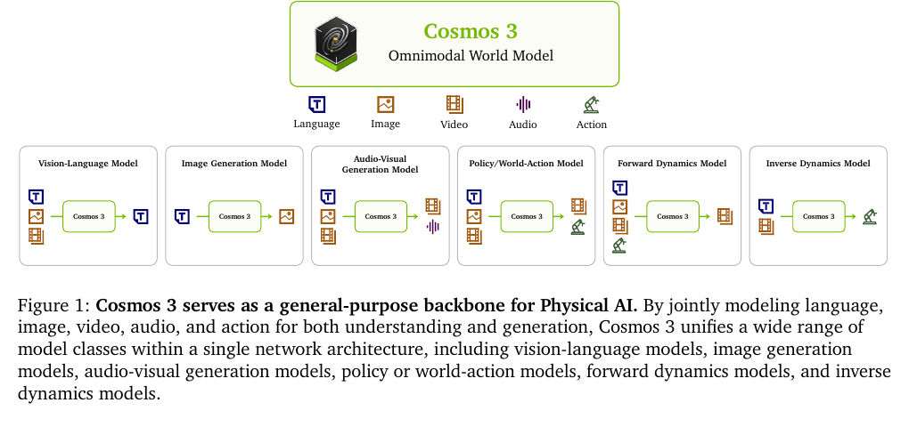
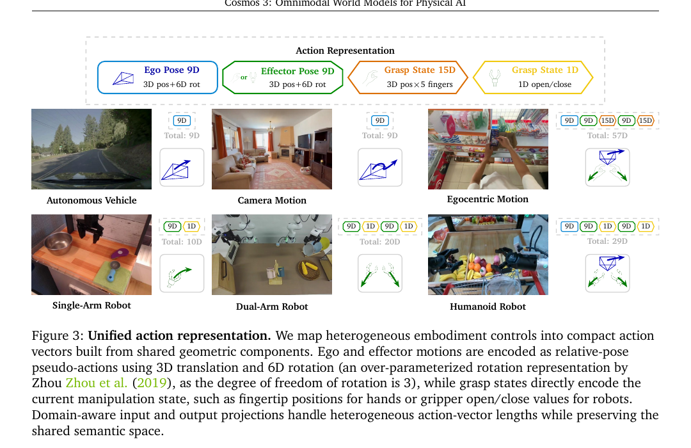
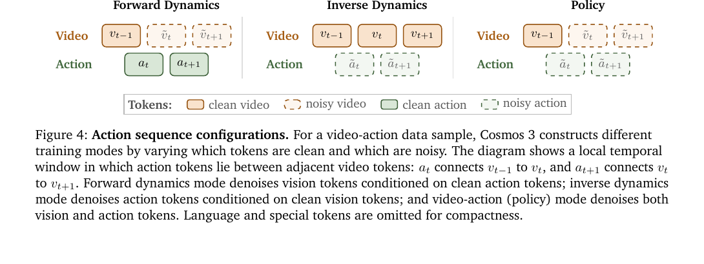
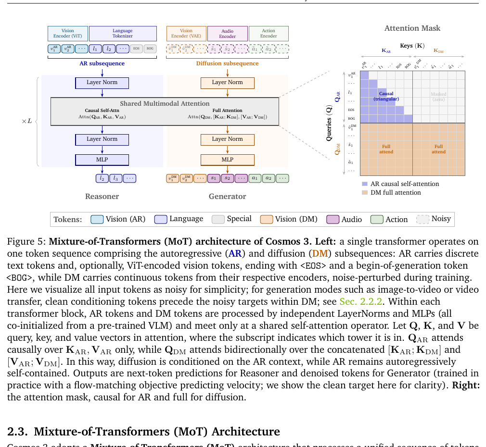
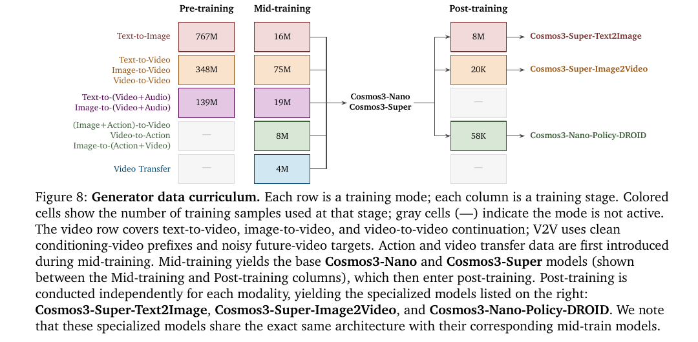
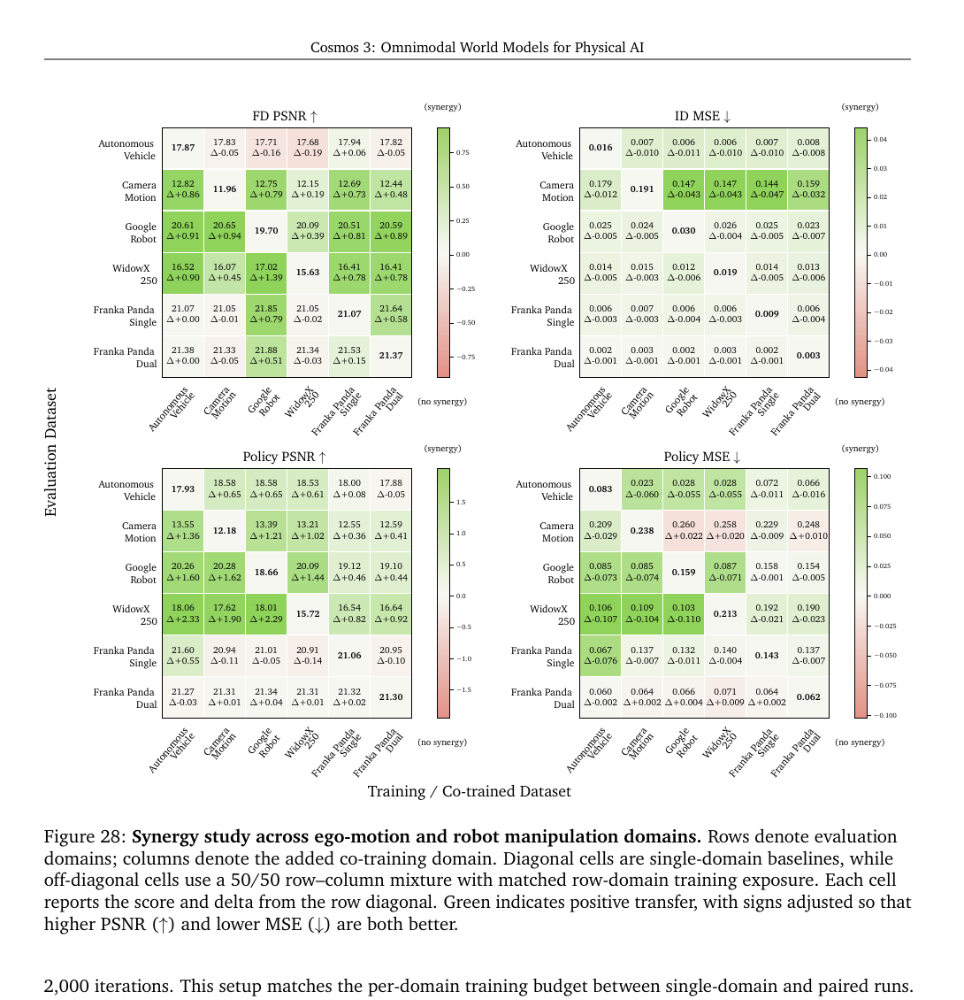

# Cosmos 3：面向 Physical AI 的全模态世界模型

> 论文：**Cosmos 3: Omnimodal World Models for Physical AI**
>
> 版本：arXiv:2606.02800v4，2026-06-23；PDF 首页日期为 2026-06-24。
>
> 原始文件：`/home/mi/Downloads/cosmos3.pdf`
>
> 阅读日期：2026-08-25

## 精简版

### 一句话结论

Cosmos 3 的核心不是把 VLM、视频生成器和机器人策略简单串联，而是用 **AR/扩散双子序列 + 双塔 Mixture-of-Transformers + 统一的时间/动作 token**，让同一骨干同时承担视觉语言理解、图像/视频/音频生成、动力学预测和 action 生成；实验支持“共享表示和 action mid-training 有迁移价值”，但尚未证明它是能做长时域规划或安全闭环控制的完整 world model。

### 核心方法

1. **统一 token 接口**：语言和 ViT 视觉 token 进入 autoregressive（AR）子序列；VAE 视觉、音频和 action token 进入 diffusion（DM）子序列。不同任务只改变哪些 token 是 clean condition、哪些 token 需要 denoise。
2. **MoT 双塔**：Reasoner 与 Generator 使用独立的 LayerNorm、attention projection 和 MLP，但通过共享 attention 交互；DM 可以读取 AR 上下文，AR 不读取 DM，从而保留语言模型的因果性。
3. **Physical AI action prior**：把车辆、相机、手部、单臂/双臂机器人等控制量转换为相对位姿、effector pose 和 grasp state，再用 domain-specific projection 接入共享 action latent space。
4. **渐进式训练**：先用大规模 image/video/audio 训练生成先验，再加入 action、control transfer 和合成 Physical AI 数据，最后分别后训练为 T2I、I2V 和 DROID policy 专家。



**读图：** 图 1 展示的是能力接口的统一，不是一个推理时必然经过的串行 pipeline。相同骨干可以按输入输出配置表现为 VLM、T2I、T2V、音视频生成器、forward/inverse dynamics 或 policy。

### 关键结果

- **论文事实（Table 12–14，p.57–59）**：Cosmos3-Super 在 PAIBench-G 上取得 T2V `80.0`、I2V `82.8`，在 Physics-IQ 上取得 I2V `43.8`、V2V `59.7`；Cosmos HUE 的 T2V/I2V 分数为 `89.3/89.6`。这些结果说明它在 Physical AI 视频评测上很强，但评测包含 prompt upsampling 和 VLM/human judge，不能单独证明架构因果。
- **论文事实（Table 18、20，p.65、70）**：从 action mid-training checkpoint（MT-init）开始后训练，比仅从视觉生成预训练 checkpoint（PT-init）开始更容易适配动作域；例如 LIBERO-10 在 500 次迭代时 MT-init 成功率为 `24.6%`，PT-init 为 `0%`，2000 次时为 `97.4%` 对 `95.2%`。
- **论文事实（Table 15，p.62）**：Cosmos3-Nano/Super 的语义音视频分数 SAV 为 `8.35/8.34`，但整体 AVQ 只有 `7.34/7.31`，低于主要闭源对手；差距主要来自低层音频 Production Quality，而不是声音事件与画面事件的对应关系。
- **论文事实（Figure 28，p.71）**：跨域 action 共训有明显正迁移，也有干扰。例如 Camera Motion 的 FD PSNR 可由 `11.96` 提升到 `12.82`，WidowX-250 与 Google Robot 之间也有较大收益；但 Autonomous Vehicle、Franka 等部分组合出现负迁移。因此“更多 action 域一起训练必然更好”不成立。

### 主要限制

- Cosmos 3 没有 reward/value head、MPC、候选未来搜索或 test-time planning；policy 模式联合生成 action 和预期视频，但不等于能在 imagined rollout 中进行策略优化。
- “统一模型”依赖大量阶段性数据和独立 post-training：Nano/Super 的基础生成模型与 T2I、I2V、DROID policy 专家并不是同一个无需适配即可全面最优的 checkpoint。
- 主要结果混合了大规模数据、结构化 JSON caption、prompt upsampler、模型规模、后训练和 VLM/human judge；论文没有完整拆开这些因素的独立贡献。
- action 主要是相对位姿 pseudo-action 和 grasp state，不是统一的低层 torque/controller 接口；跨 embodiment、长时域、接触力和安全约束仍缺乏充分验证。

### Takeaway

> Cosmos 3 最值得保留的认知是：**全模态 world model 的可迁移性主要来自共享的时空表示、action 接口和跨域 curriculum；但“能生成未来”到“能可靠规划并控制未来”之间仍缺少 reward、闭环和不确定性接口。**

---

## 完整版

## Metadata

- **Authors:** NVIDIA 及合作者（论文首页列出 NVIDIA，完整贡献者见 Appendix G）。
- **Venue / year:** Technical report，arXiv 2026。
- **Paper:** [Cosmos 3: Omnimodal World Models for Physical AI](https://arxiv.org/abs/2606.02800)
- **Code:** [nvidia/cosmos](https://github.com/nvidia/cosmos)、[Cosmos-Framework](https://github.com/nvidia/cosmos-framework)
- **Checkpoints / datasets:** [NVIDIA Cosmos 3 Hugging Face collection](https://huggingface.co/collections/nvidia/cosmos3)
- **Task and setting:** 统一处理 language、image、video、audio、action，用于 multimodal understanding、image/video/audio generation、video transfer、forward/inverse dynamics 和 robot policy。
- **Model variants:** Edge 4B（dense 2B）、Nano 16B（dense 8B）、Super 64B（dense 32B）；Nano/Super 在本文中发布，Edge 后续发布。
- **Reading source:** `/home/mi/Downloads/cosmos3.pdf`
- **Reading date:** 2026-08-25

## One-sentence Verdict

> Cosmos 3 是一套以双塔 MoT、统一时间轴和 action token 为核心的全模态 Physical AI backbone；它用大规模数据和 modality-specific post-training 展示了从视频生成到机器人策略的迁移潜力，但当前证据更像“可适配的 omnimodal foundation model”，还不是完成了闭环规划、奖励建模和长期世界模拟的通用 agent 环境。

## Key Figures



**读图：** 论文把 action 拆成 ego pose、effector pose 和 grasp state。车辆/相机只需要 ego pose，手部和机器人再加入 effector 或 grasp 信息；不同 domain 的输入输出维度仍不同，但通过 domain-specific projection 映射到共享 transformer latent。它支持的是共享几何语义，不是抹平所有 embodiment 的控制器差异。



**读图：** 同一段 video-action 数据通过 clean/noisy mask 被重写为三种训练任务：FD 用 clean action 预测 noisy future video，ID 用 clean video 预测 noisy action，policy 同时预测 noisy video 和 action。图只说明训练/生成方向，不证明 policy 推理时会使用视频未来做搜索或选择。



**读图：** AR 子序列由 Reasoner tower 处理并保持 causal attention；DM 子序列由 Generator tower 处理，能够双向读取 AR 与 DM token。两条路径只在 shared multimodal attention 处交互，AR 永远不读取 DM，因此“统一”是有方向约束的共享，而不是把自回归语言建模和扩散建模完全混成一个无掩码序列。



**读图：** action 和 video transfer 只在 mid-training 阶段加入；中间 checkpoint 再分别后训练为 T2I、I2V 和 DROID policy 专家。论文的“同一架构支持多任务”成立，但最终最强的 T2I、I2V、policy 结果来自不同的 post-trained checkpoint。



**读图：** 对角线是单域训练，非对角线是保持目标域暴露量不变的 50/50 共训。绿色代表正迁移、红色代表干扰；Camera Motion 和 WidowX 等弱域从其他 action 数据获益明显，但并非所有域组合都受益。这是比“全模态共享一定更好”更重要的证据边界。

## Problem and Baseline

### Problem

Physical AI agent 需要同时完成两类互相耦合的能力：

1. **Understanding：** 从部分观测中推断语义、空间关系、时间事件、物理合理性和可能的 action。
2. **Generation：** 预测未来视觉状态、声音、控制信号以及 action 对环境造成的变化。

传统系统通常把这些能力拆成多个模型：

```text
VLM                     → 识别、问答、空间/任务推理
Video / FD model        → 生成或预测未来视觉状态
VLA / WAM               → 生成机器人动作
Audio-visual generator  → 生成与视频对应的声音
```

作者认为这种拆分会导致接口重复、表示不共享和计算浪费。Cosmos 3 的目标是让同一个 backbone 按输入输出配置承担上述角色。

### Why it matters

- 真实世界数据采集慢、贵且有安全风险；Physical AI 需要可扩展的 synthetic data 和 simulation backbone。
- 纯视频生成器只学习“可能发生什么”，没有明确 action interface；纯 VLM/VLA 又缺少高容量的时空生成先验。
- 如果理解、世界模拟和 action 生成共享一套表示，模型可以先进行大规模通用预训练，再以较短的 post-training 适配特定任务或 embodiment。

### Baseline pipeline

Cosmos 3 所对照的隐含 baseline 是多个专用模型的组合，而不是某一个单模型：

$$
\text{VLM} + \text{Video Generator / Forward Dynamics} + \text{VLA / WAM} + \text{Audio Generator}.
$$

对于 action 任务，常见的专用路线要么直接学习 $o_t,c\rightarrow a_{t:t+H}$，要么先预测未来 observation，再由 inverse dynamics 恢复 action；Cosmos 3 把 FD、ID 和 policy 都写成同一套 clean/noisy multimodal token 配置。

### Exact delta

Cosmos 3 的真正改动可以拆成四层：

1. **架构层：** 用 AR/DM packed sequence 和双塔 MoT，把理解与生成放进同一 transformer block。
2. **表示层：** 用独立 ViT、video VAE、audio VAE 和 action projection 将异质模态接入共享 latent；用 absolute temporal modulation 对齐不同 FPS。
3. **数据层：** 用 structured JSON caption、合成 Physical AI 数据、action/transfer curriculum 和高质量过滤扩大监督覆盖。
4. **适配层：** 从 mid-trained Nano/Super checkpoint 分别后训练 T2I、I2V、forward/inverse dynamics 和 DROID policy，而无需修改主架构。

## Method

### Global data flow

1. 语言经过 tokenizer；用于理解的图像/视频经过 ViT；用于生成的图像/视频经过 VAE；音频经过 audio VAE；action 经过 domain-specific input projection。
2. 所有 token 被打包为 `[AR subsequence | diffusion subsequence]`。
3. AR 包含语言和 ViT visual token，使用 next-token prediction；DM 包含 VAE visual、audio、action token，使用 flow-matching denoising。
4. 每层有独立的 Reasoner/Generator 参数，但两者在 joint attention 中交互。
5. 推理时，语言按自回归方式生成；非文本模态按 flow/diffusion steps 迭代去噪。

### Encoders

#### Image and video

- **Understanding encoder：** ViT，patch size 为 `16×16`，之后用两层 MLP 合并 `2×2` token；使用 DeepStack 和 interleaved video timestamps。
- **Generation encoder：** 采用 Wan2.2-TI2V-5B 的 video VAE；时间压缩 `4×`，空间压缩 `32×32`（先 `16×16`，再 `2×2` patch merge）。VAE 在 Generator 训练中冻结。
- **ViT 的训练范围：** Reasoner 阶段与 backbone 联合训练；Generator 阶段保留 Reasoner tower，主要更新生成专用参数。

#### Audio

原始 stereo audio 以 48 kHz 采样，audio VAE hop size 为 1920 samples，因此约得到 `25 tokens/s`。audio VAE 冻结，输出再由 linear projection 投影到 transformer hidden dimension。

#### Action

论文把 action 定义为导致世界状态变化的 causal variable。对连续 pose，使用相邻 SE(3) 状态的相对变换：

$$
\Delta T_t = T_{t-1}^{-1}T_t.
$$

旋转部分采用 6D over-parameterized representation，最后用 SVD 投影回 $SO(3)$。Grasp state 不做时间差分，而是直接表示时刻 $t$ 的操作状态。

不同 embodiment 的 action 由三个可能组件构成：

- **Ego pose：** 主观察 frame 的运动，例如车辆位姿、相机位姿或 head-camera pose。
- **Effector pose：** 手腕、末端执行器等 effectors 的相对位姿。
- **Grasp state：** 手指位置或 gripper open/close 状态。

车辆、相机、egocentric hand、single-arm、dual-arm、humanoid 的原始维度不同，因此使用 domain-specific projection：

$$
z=W_{in}^{(k)}x+b_{in}^{(k)},
\qquad
x=W_{out}^{(k)}z+b_{out}^{(k)}.
$$

其中共享的是 backbone 中的 action semantic latent，不是输入输出层本身。

### Token arrangement and generation modes

#### AR / DM 两个子序列

AR 子序列排列为语言 token、可选的 ViT visual token、`<EOS>` 和 `<BOG>`；DM 子序列排列为 clean conditioning token 后接 noisy target token，模态顺序大致为 vision、audio、action。

主要模式为：

$$
S_{T2I}=[S_{AR},\tilde v_1],
$$

$$
S_{T2V+Audio}=[S_{AR},\tilde v_{1:N},\tilde s],
$$

$$
S_{V2V}=[S_{AR},v_{1:P},\tilde v_{P+1:N}].
$$

当 $P=1$ 时是 I2V，$P>1$ 时是 V2V。Video transfer 则把 control video 的 clean tokens 放在 RGB target 的 noisy tokens 之前。

#### Action modes

对于相邻视频 token $v_{t-1},v_t$，action token $a_t$ 表示从前者到后者的 transition：

- **Forward dynamics（FD）：** clean action $\rightarrow$ noisy future video；回答“给定干预，世界接下来怎样变化”。
- **Inverse dynamics（ID）：** clean video transition $\rightarrow$ noisy action；回答“观察到这个变化，需要什么 action”。
- **Policy：** noisy video + noisy action 一起预测；回答“生成一个 action 及其预期视觉后果”。

这三种模式共享 backbone 和 action representation，但 loss mask、clean/noisy 配置和评测目标不同。**分析推断：** 这种设计比单独挂一个 action head 更能提供视频—动作一致性监督，但仍然没有把生成的视觉未来交给一个显式 planner 进行候选比较。

### Mixture-of-Transformers（MoT）

每个 decoder layer 含两套 transformer 参数：

- **Reasoner tower：** 处理 AR token，独立 LayerNorm、attention projection、MLP，使用 causal self-attention。
- **Generator tower：** 处理 DM token，独立 LayerNorm、attention projection、MLP，使用 full attention。
- **Shared attention：** 两个 tower 的 token 在 attention 层汇合；两套路径都从预训练 VLM 权重初始化。

设 AR/DM 的 query、key、value 为 $Q_{AR},K_{AR},V_{AR}$ 和 $Q_{DM},K_{DM},V_{DM}$：

$$
O_{AR}=\operatorname{Attn}_{causal}(Q_{AR},K_{AR},V_{AR}),
$$

$$
O_{DM}=\operatorname{Attn}_{full}\left(Q_{DM},[K_{AR};K_{DM}],[V_{AR};V_{DM}]\right).
$$

因此：

1. DM 能读取 prompt、ViT visual context 和其他 diffusion token；
2. AR 不读取 DM，保持预训练 VLM 的自回归因果性；
3. Generator 继承 Reasoner 的语义/物理表示，但 DM 的 denoising 不会反过来改变当前 AR 生成结果。

### Multimodal position embedding

Cosmos 3 使用扩展的 3D MRoPE：

- 语言 token 使用 $t=h=w$，兼容标准 1D RoPE。
- ViT visual token 在同一帧共享 $t$，空间位置分别使用 $h,w$。
- VAE video token 沿 $t,h,w$ 三个轴变化。
- Audio 和 action 只有 temporal coordinate，$h=w=0$。
- AR 与 DM 之间插入固定 temporal gap `15000`，用于避免 text→vision 的时间位置过近导致 over-saturation/checkerboard artifact。

不同数据的 token rate 不同，因此用 FPS modulation 把 token index 对齐到真实时间。若 base temporal steps per second 是 $TPS_{base}$，当前模态是 $TPS$，则：

$$
\delta t=\frac{TPS_{base}}{TPS}.
$$

视频以 24 FPS 为 base，经过 4× temporal compression 后 $TPS_{base}=6$。音频约为 `25 TPS`，action 使用各自采样频率。

**论文事实（Table 29，p.108）：** FPS Control 与 MRoPE 同时使用时，Composite 从无控制的 `8.51` 提升到 `9.81`，而平均视频质量维持在约 `12.8–13.0` 的窄区间。这个消融支持“物理时间轴本身有用”，而不仅是把 FPS 写进文字 prompt。

### Model variants

| Variant | MoT 参数量 | Dense transformer | Layers | Hidden | 初始化/备注 |
|---|---:|---:|---:|---:|---|
| Cosmos3-Edge | 4B | 2B | 28 | 2048 | 从头训练，类似 Qwen3-1.7B 设计 |
| Cosmos3-Nano | 16B | 8B | 36 | 4096 | 基于 Qwen3-VL-8B |
| Cosmos3-Super | 64B | 32B | 64 | 5120 | 基于 Qwen3-VL-32B |

MoT 的两套 tower 使总参数量约为对应 dense transformer 的两倍。Nano 和 Super 的 Generation/Reasoner 模型被公开，Edge 在论文中还未发布。

## Data and Training

### Reasoner data

Reasoner 总计约 `24.2M` samples：

- **Pre-training：** `22.0M`，其中 image-text `18,814,952`、video-text `1,016,299`、text-only `2,170,762`。
- **Supervised fine-tuning：** `2.2M`，其中 video-text 占比显著上升，用于 robotics、autonomous driving、smart infrastructure、spatial/temporal reasoning。

数据过滤包括：

1. 用 joint media-text embedding + K-means 做 conversation-level semantic deduplication；相似度高于 `0.95` 的 near-duplicate 被移除，最终约移除 `4.23%`。
2. 用 Gemma-4-31B-it 作为 AI judge，分别评估 Faithfulness、Completeness、Correctness。
3. Pre-training 使用每一维最低阈值为 2 的过滤，保留约 `78%`；SFT 使用阈值 5，保留约 `46%`。**论文事实：** 更严格过滤会选择性删除 referring-expression grounding、captioning 和 VQA 数据，因此质量—覆盖率不是单调关系。

SFT 覆盖 2D/3D grounding、视频事件定位、物理合理性、robot action CoT、AV decision CoT、3D vehicle grounding、warehouse spatial reasoning 和 surgery understanding。这里的“Reasoner”并不只是通用 VLM，而是经过大量领域任务监督的 Physical AI reasoning tower。

### Generator data

Generator 采用从通用到 Physical AI 的多阶段 curriculum：

| 阶段 | 主要数据/模式 | 论文报告规模或比例 |
|---|---|---:|
| Pre-training | T2I | 767M images |
| Pre-training | T2V/I2V/V2V | 347.7M video clips |
| Pre-training | T2(V+A)/I2(V+A) | 138.9M clips with usable audio |
| Mid-training | image T2I | 10% |
| Mid-training | video T2V/I2V/V2V | 32% |
| Mid-training | video + audio | 8% |
| Mid-training | action FD/ID/policy | 25% |
| Mid-training | general transfer | 20% |
| Mid-training | driving world-scenario-map transfer | 5% |

Action mid-training 的最终数据包含 `8.4M episodes / 61.3K hours`：

- Egocentric motion：`41.3K hours / 67.4%`；
- Autonomous vehicle：`10.0K hours / 16.3%`；
- Robotics：`5.4K hours / 8.7%`，包括 `516.7K episodes`；
- Camera motion：`4.6K hours / 7.5%`。

机器人数据保留成功和失败 episode，action 采用 state-difference pseudo-action；多视角输入被拼接到 canvas，并把 camera layout 放入 metadata。idle step 不直接丢弃，而是记录 idle-step count，以便后续采样平衡。

### Structured captions and synthetic data

Cosmos 3 使用结构化 JSON caption，而非只依赖自由文本 caption。字段覆盖：

- subjects、attributes、background、lighting、aesthetics、cinematography；
- video 的 temporal dynamics、object interaction、physical change、human motion、camera motion；
- duration、FPS、spatial height/width、aspect ratio 等显式 media controls。

作者报告，在自建 caption-quality benchmark 上，结构化 annotation 在保持较高 precision 的同时提高 assertion-level recall。这个设计很可能同时影响训练和评测，因为推理时也使用 Reasoner 或 Claude prompt upsampler 把短 prompt 改成结构化 JSON。

为弥补 web-scale 数据中 Physical AI 长尾不足，作者释放五类 SDG 数据：

- SDG-PhyxSim：碰撞、刚体、关节物体、软体、流体和光学现象；
- SDG-RobotSim：多种机器人 embodiment、manipulation 和 locomotion；
- SDG-DriveSim：常规与 long-tail driving；
- SDG-SynHuman：人体运动、相机运动和多人物交互；
- SDG-Warehouse：人—叉车交互和仓储安全。

**分析推断：** Cosmos 3 的“world knowledge”不仅来自网络视频；大量合成物理场景、结构化 caption、领域 action 数据和 VLM 评测样本共同塑造了它的能力。因此不能把最终收益全归因于 MoT。

### Training stages

#### Reasoner pre-training and SFT

- Reasoner 使用 next-token prediction。
- 预训练最多 `16k tokens`，单样本最多 `2048 image tokens`、`8192 video tokens`。
- 预训练 2 epochs；采用 square-root normalized per-token loss weighting。
- SFT 使用 importance-aware sampling，并以固定 `1:4` 比例混入高质量 pre-training 数据，降低领域 specialization 对通用能力的破坏。
- Reasoner 训练完成后，其权重用于初始化 Generator，使语义、视觉和 Physical AI 知识迁移到生成塔。

#### Generator pre-training

Generator 统一使用 rectified flow matching。对任意目标 latent $x_0$ 和高斯噪声 $\epsilon$：

$$
x_\sigma=\sigma\epsilon+(1-\sigma)x_0,
\qquad
v^*=\epsilon-x_0.
$$

模型 $v_\theta(x_\sigma,\sigma,c)$ 通过 masked MSE 预测 velocity；clean conditioning token 不计入 loss。不同模态独立采样 noise level：image/audio/action 使用 logit-normal，video 使用 mode sampling，并通过 rectified-flow shift 把采样分布偏向更高噪声。

视频预训练支持 256p、480p、720p：

- 256p/480p 最多 400 frames，720p 最多 300 frames；
- FPS 范围 `10–30`；
- 固定 `74,000-token` context，使用 sequence packing，避免不同长度样本 padding；
- T2I/T2V/I2V/V2V 采样比例为 `20%/56%/16%/8%`；
- Generator 预训练时只更新生成专用参数，Reasoner tower 保持冻结；
- Cosmos3-Nano 训练了 `31.05T` tokens，Cosmos3-Super 训练了 `17.86T` tokens。

#### Mid-training and post-training

Mid-training 保留原有视觉生成模式，同时加入：

1. **Action：** FD、ID、policy；
2. **Video transfer：** edge、blur、depth、segmentation、world-scenario-map；
3. **高质量/合成 Physical AI 视频：** 机器人、驾驶、人类活动、物理和仓储。

Action loss 乘以 `10×`，用于补偿 normalized action vector 的单元素 MSE 较小问题。

之后从 mid-trained Nano/Super 分别 post-train：

- Cosmos3-Super-Text2Image：20k steps broad T2I + 2k steps ultra-high-quality refinement；
- Cosmos3-Super-Image2Video：约 20k synthetic/high-quality clips，目标 480p、189 frames、约 8 秒；
- Cosmos3-Nano-Policy-DROID：`58K` post-training samples，输入三视角图像 + proprioception，输出 32 个未来 absolute joint-position actions，15 Hz。

这些专家保持与 base model 完全相同的架构；差异来自数据、loss mask、训练阶段和 sampling 配置。

## Infrastructure and Practical Cost

### Training scale

论文的系统部分说明，Cosmos 3 训练平台由 data、training、serving、benchmark 四个基础设施柱组成。数据侧使用 SILA 做多模态处理、embedding retrieval、deduplication、quality inspection 和 WebDataset shard；训练侧依赖 sequence packing、Ulysses/context parallel、selective activation checkpointing、torch compile 和 asynchronous checkpointing。

**论文事实（Table 7、8，p.45–46）：**

- asynchronous checkpointing 使 Nano/Super 端到端训练时间分别减少约 `4%/9%`；
- dense Nano 每 GPU 约 `520 TFLOPS / MFU 0.23`，Super 约 `673 TFLOPS / MFU 0.30`；
- Nano 每 GPU-hour 处理约 `16.23M` video tokens，Super 约 `5.91M`。

PDF 中存在一个需要注意的配置边界：Section 4.2.1 说 Nano/Super 的预训练使用 `1024/2048` 张 GB200；Table 8 的 throughput caption 又写 Nano/Super 的测量 run 使用 `2048/4096` 张 GPU。它们可能是不同的训练/benchmark 配置，不能混写成一个总训练成本数字。

### Serving

Generator 的 reference PyTorch、vLLM-Omni 和相关优化包括：

- Reasoner output cache：diffusion steps 中复用不随噪声变化的 AR conditioning；
- Ulysses context parallel：把长视频 token 分到多 GPU；
- CFG parallel：把 conditional/unconditional 两个 forward 并行执行；
- Cache-DiT、HSDP、CPU offload、VAE patch parallel、FP8 quantization；
- T2I/T2V 使用结构化 prompt upsampling，Reasoner 先生成 JSON，再交给 Generator。

基础 T2V/I2V Generator 常使用 50 diffusion steps；DROID policy 为了低延迟使用 4 steps、CFG guidance `3`、shift `5`，并跳过 video latent decoding。论文称该 policy 可以部署在 `2× NVIDIA RTX Pro 6000` 上，输出 32 steps 的 action，并由 Franky 控制器以 `15 Hz` 执行。

**实践判断：** Cosmos3-Nano 虽然比 Super 小很多，但仍是 16B MoT；高分辨率长视频生成和 50-step denoising 不能视为普通单卡低延迟服务。低延迟结果主要来自专门的 policy post-training、少步采样、缓存和并行部署，不能直接外推到通用 Generator。

## Evidence Audit

| Claim | Direct evidence | Controls / ablations | Assessment |
|---|---|---|---|
| 单一 omnimodal backbone 可覆盖理解与多种生成模式 | Figure 1、Table 10–20；同一架构支持 T2I/T2V/I2V/音频/transfer/FD/ID/policy | 统一 token layout、Reasoner tower ablation、不同 post-trained heads | **结构能力成立；统一收益部分支持**。不同任务实际依赖不同数据和 post-training。 |
| Reasoner 的 Physical AI 表示有助于 Generator | Table 28：T2V Domain `73.7→75.7`，Quality 基本不变；I2V Domain `80.0→80.8` | 仅替换 understanding tower，Generator 从 scratch 训练 | **支持有限范围**。更强的是 domain score，不是整体视觉质量。 |
| action mid-training 学到可迁移 action prior | Table 18、20、Figure 28/29；MT-init 在 FD、ID 和 LIBERO 早期适配更好 | PT-init 与 MT-init 使用相同后训练预算；action 域 pairwise synergy | **较强但非普遍支持**。迁移依赖目标域，部分组合存在 interference。 |
| 统一 action 模式比单独训练更好 | Table 31：joint FD/ID/policy 的 ID MSE `1.11e−3→3.09e−4`，policy coverage `74.1%→77.3%` | PushT 上每个 mode 匹配优化步数 | **支持 trade-off**：FD PSNR `27.13→26.22`，并非所有指标都提升。 |
| 视频生成更符合物理世界 | Physics-IQ、Cosmos HUE、HWB、PAIBench-G、RBench | 自动指标 + human evaluation；5 seeds 或 single seed，模型/评测设置不同 | **结果强，但证据边界明显**：物理分数并不等同于真实环境可控动力学。 |
| action/video 生成可以成为 robot policy | DROID 后训练、RoboLab、RoboArena、MolmoSpaces、Table 37 | RoboLab 任务 success、RoboArena pairwise、RoboLab simulator rollout | **policy 结果支持可用性**，但没有验证长时域安全、uncertainty、真实 deployment distribution 或 planner。 |
| 统一视频 transfer 可替代专用 ControlNet 分支 | Table 16/17；Cosmos3-Nano/Super 在不同 control metric 上超过 baseline | 与 Cosmos-Transfer2.5 对比，single-control 和 driving transfer | **部分支持**：两种规模分别领先不同指标，不能解释为每个设置都全面优于 baseline。 |

### Fairness of baselines

- Reasoner 对比涉及不同模型规模、预训练来源和闭源系统，表格中的 group average 不等于严格同预算比较。
- Generator 对比经常使用各模型推荐参数，但 Cosmos 3 评测使用 Claude/Reasoner prompt upsampling，使 prompt distribution 与训练格式一致；若其他模型的 prompt pipeline 不完全相同，结果会混入 prompt engineering。
- T2I、I2V 和 policy 的最佳结果来自 post-trained 专家，而非单一的 base Cosmos3-Nano/Super；与未 post-train 的 baseline 比较时，必须明确区分 checkpoint 阶段。
- RoboArena、Artificial Analysis 等 leaderboard 是带日期的动态结果，不能当作稳定的学术排名。

### Gain attribution

当前证据无法完全分离以下因素：

1. MoT 双塔和 joint attention；
2. Qwen3-VL 初始化与 Reasoner SFT；
3. `767M` images、`347.7M` videos、结构化 caption 和 synthetic data；
4. action/transfer mid-training 的数据混合；
5. prompt upsampler、negative prompt、sampling steps 和 CFG；
6. 任务特定 post-training 和部署优化。

论文的单因素消融支持 Reasoner tower、FPS modulation、audio co-training 和 action-mode synergy，但没有提供覆盖整个训练 recipe 的等数据、等计算、等 prompt 的完整 attribution matrix。

### Missing decisive experiments

最能改变结论的实验是：

1. 固定数据、模型规模、token budget、prompt 和 post-training，只比较 shared MoT、完全独立 towers、shared single tower 三种架构。
2. 对 `Reasoner → Generator` 迁移做 matched initialization：相同 VLM 初始化、相同 SFT 数据、相同 Generator budget，分离 Reasoner SFT 的作用。
3. 关闭 prompt upsampling 和 synthetic SDG 数据，分别报告 T2V/I2V/Physics-IQ/HUE 的下降幅度。
4. 在同一 embodiment 上比较 action-only、video-only、joint video-action，并在固定 action 数据量下做长时 closed-loop evaluation。
5. 报告 action-conditioned rollout 的 horizon scaling、calibrated uncertainty、OOD intervention、失败恢复和安全约束，而不是只报告短窗口 PSNR 或单次成功率。
6. 在多个新 embodiment 上测试 zero-shot 或少量数据 adaptation；当前统一 action projection 并不能证明无需 embodiment-specific calibration。

## 关键与非常规结果

### 1. 强视频分数与“真正 world model”不是同一件事

**论文事实：** Cosmos3-Super 在 Physics-IQ、HUE、HWB 和 PAIBench-G 上都很强，HWB 达到 `71.9`，高于表中 Veo-3.1 的 `67.8` 和 Wan2.2-A14B 的 `60.7`。

**分析推断：** 这些结果说明模型能生成更符合 prompt、物理外观和人类运动先验的视频，但没有直接说明它能在未见 action 下正确预测状态转移，更没有说明 planner 可以利用这些预测做安全决策。Cosmos 3 更准确的定位是“具有 action/transfer 接口的可适配生成式 backbone”，而非已经完成验证的 model-based RL environment。

### 2. action mid-training 的收益主要体现在适配速度和跨域先验

**论文事实：** Camera Motion 的 action 共训使 FD PSNR 从 `11.96` 上升到 `12.82`；WidowX-250 与 Google Robot 共训带来 `+1.39` 和 `+0.89` 的 FD PSNR 增益。MT-init 在 LIBERO 500 次迭代时已经超过 PT-init `24.6%` 对 `0%`。

**为什么值得记录：** 这比“同一模型在多个 benchmark 上涨点”更接近 foundation model 的实际价值：预训练 action domains 可以缩短新任务/新 embodiment 的 adaptation。与此同时，Figure 28 也显示一些组合出现负迁移，因此 action mixture 需要按目标域和数据规模设计，而不是盲目堆数据。

### 3. 同一 action 模型的三个方向互相帮助，但存在目标冲突

**论文事实（Table 31）：** PushT 上 joint FD/ID/policy 相比每个 mode 单独训练，ID MSE 相对下降约 `72%`，policy coverage 从 `74.1%` 到 `77.3%`；但 FD PSNR 从 `27.13` 降到 `26.22`。

**分析推断：** 视频重建、动作逆推和策略生成共享了某些状态—动作结构，但 FD 更偏向像素/未来状态重建，policy/ID 更偏向 action 可辨识性和控制覆盖，三者并非完全同目标。实践中需要根据最终用途设置 modality/mode loss，而不是只看 joint checkpoint 的平均性能。

### 4. 音频联合训练改善了语义对齐，却没有解决低层音质

**论文事实（Table 15）：** Cosmos3-Nano 的 SAV `8.35`、SA `8.33`、AVAlign `8.16`，均达到表中最高或接近最高；但 PQ `6.32`，整体 AVQ `7.34`，低于 Seedance-1.5-Pro 的 AVQ `7.64`。

**分析推断：** 全模态共享的主要收益首先出现在“声音是否由画面事件引起、发生时间是否对齐”，而不是 waveform fidelity、频宽和空间音效。音频生成要成为 Physical AI 的有效传感器，还需要独立加强 acoustic quality，而不仅是增加 audio tokens。

### 5. 统一 transfer backbone 可以减少专用 adapter，但不是所有指标都由同一规模领先

**论文事实（Table 16/17）：** 在 depth、segmentation、blur、edge 控制上，Cosmos3-Nano/Super 分别在不同指标领先 Cosmos-Transfer2.5；在 driving map transfer 中，Cosmos3-Nano 动态物体 correspondence `0.67`、视频质量 `2.82`，Cosmos3-Super 视频质量 `2.86`。

**证据边界：** 表中是“两个 Cosmos 变体合起来在每个指标不弱”，而不是一个统一 checkpoint 在所有指标都赢。blur SSIM、静态结构和 environment 分数还接近饱和，因此不能把有限增益全部归因于去掉 ControlNet。

### 6. Reasoner 的作用更像物理/领域条件器，而不是直接提高画质

**论文事实（Table 28）：** 把 Generator 的 understanding tower 从 Qwen3-VL-8B 换成 Cosmos3 Reasoner 后，T2V Domain `73.7→75.7`，Robot 子项 `66.5→71.3`，但 Quality 仍为 `73.0`；I2V 也主要提升 Domain，而非 Quality。

**分析推断：** Reasoner SFT 的价值主要是提供 Physical AI 语义、空间和物理条件表示，让 Generator 更容易学会“生成什么”；高频视觉细节仍由 Generator 数据和 denoising capacity 决定。这个结果支持双塔分工，但不支持“Reasoner 越强，视频画质必然越高”。

## Assumptions and Inductive Biases

### Explicit assumptions

- 所有 embodiment 的 action 可以被分解成相对 ego/effector pose 和 grasp state，并在共享 latent 中保留可迁移语义。
- action token $a_t$ 是 $v_{t-1}\rightarrow v_t$ 的 causal variable，视频和 action 的时间戳已经可靠对齐。
- 对不同 FPS 使用 absolute temporal modulation 后，模型可以在一个时间坐标中共享物理变化规律。
- 结构化 JSON caption 能比自由 caption 更完整地表达主体、关系、事件和未来运动。
- generator 的 denoising latent 足以承载视觉、音频和 action 的共同状态。

### Hidden assumptions

- Relative pose pseudo-action 足以代表真正影响环境的控制；低层 controller、接触力、动力学约束和 actuator latency 被视为下游问题。
- 同一个世界状态到 visual/action future 的映射在不同 embodiment 间存在足够共享结构，domain-specific projection 只需处理接口差异。
- Reasoner 与 Generator 的单向信息流足够支持 Physical AI；DM 生成过程中的中间未来不会反过来更新 AR reasoning。
- 50-step generated video 的短窗口物理一致性能够外推到较长 rollout 或真实闭环。

### Possible shortcuts or leakage

- 结构化 prompt 中显式提供 duration、FPS、camera motion 和 scene schema，模型可能依赖 caption template 而非从媒体内容推断全部因素。
- synthetic SDG 场景、VLM-generated caption、VLM judge 和 benchmark prompt 之间可能共享视觉/语言模式。
- action domain identity 通过 projection、metadata 和数据分布暴露，模型可能先识别 domain，再使用 domain-specific shortcut。
- PSNR、VLM judge 和 human binary questions 更容易测到短时视觉/语义一致性，不一定测到 action 后果的长期因果正确性。
- leaderboard 中 prompt upsampling、negative prompt、CFG、采样步数和模型 post-training 的差异可能掩盖 backbone 本身的差异。

## Independent Assessment

- **Problem value：高。** 将理解、生成和 action 接口放进同一 Physical AI backbone，正面回应了数据复用、模型组合和适配成本问题。
- **Novelty：中等偏高，系统整合强于单点算法新颖性。** MoT、flow matching、3D MRoPE、structured caption 和 action token 各有先例或近邻；论文的主要贡献是把它们组织成能扩展到多模态、多 domain、多个 inference mode 的完整 recipe。
- **Technical soundness：总体合理。** token layout、attention mask、flow objective、action projection 和 FPS alignment 之间是自洽的；但“统一 backbone 带来收益”的因果归因仍不完整。
- **Experimental strength：中等偏强。** 覆盖自动指标、human evaluation、transfer、FD/ID、policy 和 ablation；不足是大量结果依赖作者自建数据、内部模型、prompt rewrite、post-training 和带日期 leaderboard。
- **Practicality：分层明显。** Nano 适合研究和部分 policy deployment；Super 适合高质量离线生成和多模态基础模型研究；高分辨率通用生成的 GPU、显存和 denoising 成本仍然很高。
- **Likely failure modes：** 长时 rollout 累积误差、未见 embodiment 的 action calibration、接触/力学状态错误、生成视频与实际 action 后果不一致、VLM judge 对物理错误不敏感、跨域 action mixture interference、prompt schema shortcut 和 policy 的 closed-loop 安全失败。

## Connections

- [[Video/Wan2.1技术报告|Wan2.1 技术报告]]：Cosmos 3 的生成 VAE 采用 Wan2.2-TI2V-5B 路线；两者都体现“视频 VAE + flow/DiT + 数据/系统工程”对视频基础模型的决定性作用。
- [[Robot/WAM/DreamZero_Technical_Report|DreamZero 技术报告]]：两者都把视频生成先验接到 video-action flow matching；DreamZero 更聚焦固定 embodiment 的 WAM policy，Cosmos 3 则把 action、audio、transfer 和 reasoner 一起纳入通用 backbone。
- [[Robot/WAM/DreamerV4_技术报告|Dreamer 4 技术报告]]：Dreamer 4 有显式 reward/value、imagined rollout 和 offline RL；Cosmos 3 有 action-conditioned video/action generation，但尚未提供同等的策略优化闭环。
- [[Robot/WAM/UniPi_技术总结|UniPi 技术总结]]：UniPi 先生成视频计划，再由 inverse dynamics 恢复 action；Cosmos 3 将 video、action、FD、ID、policy 统一为不同 denoising 配置。
- [[Robot/WAM/ShadowDancer_论文总结|ShadowDancer]]：以 shadow pair 学习跨外观 dynamics latent，和 Cosmos 3 的全模态 token/MoT 形成对照。
- [[Robot/WAM/WLA_reading_notes|WLA 论文阅读笔记]]：共同关注 world modeling、language reasoning 和 action synthesis 的组合，但 WLA 的 World Expert/Action Expert 分工与 Cosmos 3 的 AR/DM 双塔不同。
- [[Robot/WAM/WorldVLA 论文综述(不建议读)|WorldVLA]]：可对照“视频预测是训练辅助目标”与 Cosmos 3 “视频/action 可在推理时共同生成”的差别。
- [[VQVAE_综述|VQ-VAE 综述]]：补充理解视觉 latent、token 压缩和生成表示瓶颈；Cosmos 3 的视频 VAE 是连续 latent 路线。

## Open Questions

1. 在完全匹配数据、模型容量、训练 token、prompt 和 post-training 的条件下，MoT 双塔相对单塔/独立模型的真实增益是多少？
2. action mid-training 的跨域收益是否能迁移到未见机器人、不同 control frequency、force/torque action 和接触丰富任务？
3. Cosmos 3 能否在生成 action 后用内部 video future 进行候选筛选、value scoring 或 test-time planning，而不显著增加 latency？
4. 物理一致性是否随 rollout horizon、生成 FPS、resolution 和 conditioning length 单调下降？模型能否输出 calibrated uncertainty？
5. 结构化 caption、prompt upsampling 和 VLM judge 去掉后，视频/音频/策略性能分别下降多少？
6. 共享 action latent 是否真的学习了 embodiment-invariant geometry，还是主要依靠 domain-specific projection 和数据共现？
7. Cosmos3-Nano-Policy-DROID 在真实机器人上的成功率、失败恢复、安全约束和人类干预统计是否能在更大规模、跨实验室设置中复现？

## Takeaway

Cosmos 3 的核心经验可以压缩成一条工程判断：

> **先用统一的 token/time/action 接口把理解、生成和控制数据放进同一 backbone，再用跨域 mid-training 学习可迁移先验；但只有加入 reward/value、闭环 rollout、uncertainty 和安全约束后，生成式 backbone 才可能成为可用于规划的真正 world model。**

## 相关笔记

- [[Video/Wan2.1技术报告|Wan2.1 技术报告]]：视频 VAE、Flow Matching、DiT 和大规模视频训练系统。
- [[Robot/WAM/DreamZero_Technical_Report|DreamZero 技术报告]]：Wan 视频先验到 video-action policy 的直接路线。
- [[Robot/WAM/DreamerV4_技术报告|Dreamer 4 技术报告]]：生成式 world model、imagined rollout 和 offline RL 的对照。
- [[Robot/WAM/UniPi_技术总结|UniPi 技术总结]]：video-as-policy 与 inverse dynamics 路线。
- [[Robot/WAM/WLA_reading_notes|WLA 论文阅读笔记]]：World-Language-Action 的统一建模与 test-time scaling。
- [[VQVAE_综述|VQ-VAE 综述]]：latent compression 和视觉 tokenization 背景。

## 来源边界

- 标有“论文事实”的判断来自 `/home/mi/Downloads/cosmos3.pdf` 的正文、Figure、Table 或 Appendix，并尽量标注页码/表图号。
- “分析推断”是基于论文证据的独立判断，不代表作者原话。
- 论文中的 leaderboard、VLM judge、prompt upsampling、内部数据和 post-training 配置会影响结果；文中“最佳”“SOTA”均应理解为论文报告时、特定评测协议下的结果。
