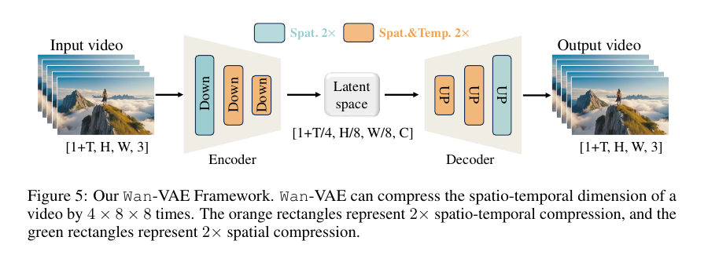
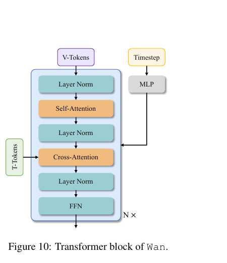
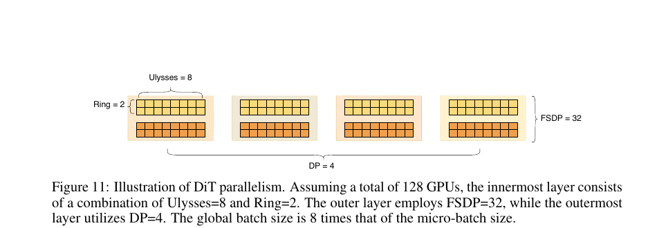
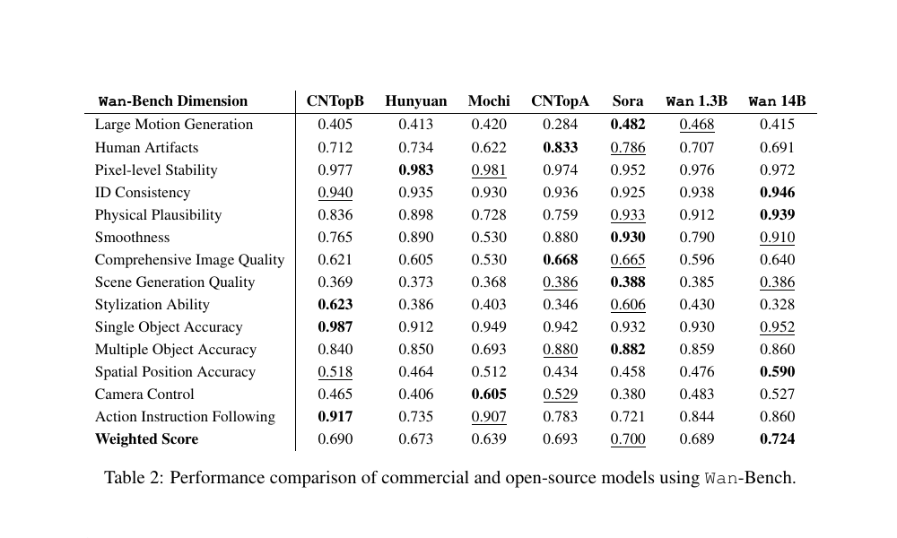
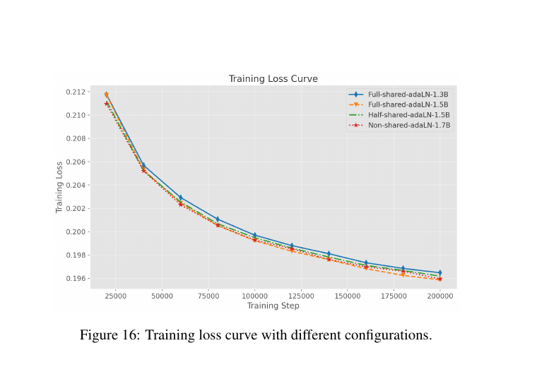
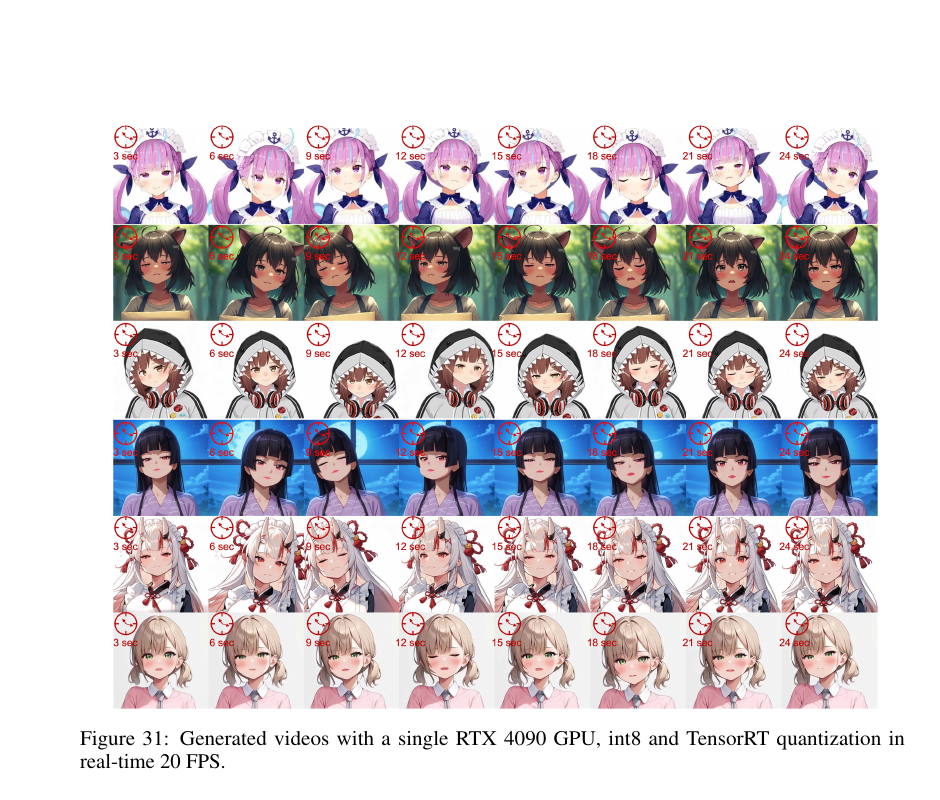

# Wan2.1 技术报告：开放式大规模视频生成模型

> 论文：**Wan: Open and Advanced Large-Scale Video Generative Models**
>
> 版本：arXiv:2503.20314v2，2025-04-19；PDF 文件名为 `wan2.2.pdf`，但论文正文、Figure 和代码链接均指向 Wan2.1。
>
> 原始文件：`/home/mi/Downloads/wan2.2.pdf`
>
> 阅读日期：2026-08-24
>
> 本次补充材料：`/home/mi/Downloads/Wan2.1 补充：VAE、Latent Generation 与 I2V 条件机制.md`
>
> 补充日期：2026-08-27

## 精简版

### 一句话结论

Wan 的主要贡献不是提出一个全新的扩散目标，而是把大规模数据清洗、视频 latent 表示、14B DiT、长序列训练并行、推理加速和多任务适配整合成一套可开放使用的视频基础模型方案；结果很强，但收益高度依赖数据和系统工程，不能全部归因于单一模型结构。

### 核心方法

1. **Wan-VAE**：先把 RGB 视频编码到固定的时空 latent，再由 DiT 在该 latent space 中生成；3D causal VAE 将视频压缩为 `[1+T/4, H/8, W/8, 16]`，第一帧只做空间压缩，以兼容 image condition；RMSNorm 与 feature cache 支持因果的分块处理。
2. **Wan DiT**：使用 `Wan-VAE + Diffusion Transformer + umT5`。视频 latent 经过 3D patchify 后进入时空 self-attention，并通过 cross-attention 注入文本；I2V 还把 reference image 经像素空间零填充和 Wan-VAE 得到 condition latent，并经 CLIP/MLP 的 decoupled cross-attention 注入全局图像条件。
3. **Flow Matching**：对图像和视频使用统一的速度场学习目标：

   $$x_t=tx_1+(1-t)x_0,\qquad v_t=x_1-x_0$$

   $$\mathcal{L}=\mathbb{E}\left[\|u(x_t,c,t)-v_t\|^2\right]$$

4. **系统化训练与部署**：先用低分辨率图像预训练，再逐步加入视频和更高分辨率；训练使用 FSDP、2D Context Parallelism 和 activation offload，推理使用 diffusion cache、FP8/INT8 和 TensorRT。

**读图：** 输入视频经过三次下采样进入 latent space，再由 decoder 重建；总压缩率为时间 4 倍、空间各 8 倍。该模块决定后续 DiT 看到的 token 数量，也直接影响训练和推理成本。

### 关键结果

- **论文事实（p.22–25，Table 4）**：Wan 14B 在作者报告的 VBench 上总分 `86.22%`，视觉质量 `86.67%`，语义一致性 `84.44%`；Wan 1.3B 总分为 `83.96%`。
- **论文事实（p.12，Figure 7）**：在 720×720、25 帧的 VAE 重建测试中，Wan-VAE 声称比 HunyuanVideo VAE 快约 `2.5×`，同时保持有竞争力的 PSNR。
- **论文事实（p.1，p.17–19）**：Wan 1.3B 约需 `8.19 GB VRAM`；14B 的 diffusion cache 带来 `1.62×` 推理加速，8-bit FlashAttention 进一步带来超过 `1.27×` 的模块级加速。
- **分析推断**：Wan 14B 的强项集中在语义遵循、物理合理性、空间位置和身份一致性；Wan-Bench 上它的 stylization、human artifact 和 large-motion 分项并非全部领先。

### 主要限制

- 论文承认大幅运动时仍难以保持细粒度纹理和结构。
- 未优化的 Wan 14B 在单张高端 GPU 上生成短视频约需 30 分钟；实时版本需要额外的 Streamer、Consistency Distillation 和量化流程。
- 训练数据包含内部版权数据，开放代码和权重并不等于数据与全部数据处理器可复现。
- Wan-Bench 由作者构建，使用 RAFT、DINO、Qwen2-VL 和人工偏好加权；它能支持系统比较，但不能替代完全独立的评测。

### Takeaway

> 视频生成基础模型的核心瓶颈不只在 DiT，而在数据质量、视频 VAE、长序列训练系统和推理成本是否被一起设计。

## 完整版

## Metadata

- Authors: Wan Team, Alibaba Group
- Venue / year: Technical report, 2025
- Paper: **Wan: Open and Advanced Large-Scale Video Generative Models**
- arXiv: `2503.20314v2`
- Task: text-to-video、image-to-video，以及视频编辑、个性化、相机控制、实时生成和 video-to-audio
- Model sizes: 1.3B、14B
- Main resolutions: 480p、720p
- Reading source: `/home/mi/Downloads/wan2.2.pdf`

## One-sentence Verdict

> Wan 是一套以数据工程和系统优化为主导、以 `Wan-VAE + Flow-Matching DiT + umT5` 为核心的开放视频生成基础模型 recipe；论文证明了它在综合视频质量上很强，但没有充分分离数据、caption、提示词改写、模型容量和架构设计各自的贡献。

## Key Figures

**读图：** 每个 block 依次处理 video tokens 的 self-attention、text tokens 的 cross-attention 和 FFN；timestep 经过 MLP 后参与调制。论文称 timestep MLP 在 block 间共享、每个 block 保留不同 bias，可以减少约 25% 参数。

**读图：** 在 128 张 GPU 的例子中，内层用 Ulysses=8 与 Ring=2 组合 Context Parallel，外层使用 FSDP=32 和 DP=4。它解决的是百万级视频 token 下的 activation 和通信问题，而不是改变生成建模目标。

**读表：** Wan 14B 的加权总分为 `0.724`，但并非所有分项第一：large motion 为 `0.415`，stylization 为 `0.328`，均明显低于部分对比模型。综合分数掩盖了能力结构的不均衡。

**读图：** 在相近参数量下，增加 block depth 比把参数放进非共享 AdaLN 更有效。该实验支持“参数应优先用于主干深度”的工程判断，但它只在 1.3B 的 text-to-image 训练阶段进行。

**读图：** 图注声称使用 INT8 和 TensorRT 后可以在单张 RTX 4090 上达到 20 FPS。正文另一处写 TensorRT 版本为 8 FPS，论文没有说明两者的分辨率、采样步数或模型配置差异，因此实时数字需要保留证据边界。

## Problem and Baseline

### Problem

论文针对开放视频生成模型的三个缺口：

1. 开源模型与商业模型在画质、运动和指令遵循上仍有差距。
2. 多数模型主要支持 text-to-video，难以覆盖 image-to-video、编辑、个性化和相机控制等创作流程。
3. 高分辨率、长序列视频导致训练和推理成本过高，难以在消费级硬件上使用。

### Baseline pipeline

主流 latent video diffusion pipeline 通常由三部分组成：

1. VAE 将像素视频压缩到 latent space。
2. 文本编码器提供条件表示。
3. U-Net 或 DiT 学习从噪声 latent 恢复视频 latent。

### Exact delta

Wan 的实际改动可以压缩为四个层次：

- 用更适合时空压缩和因果处理的 Wan-VAE 替换通用视频 VAE。
- 用时空 DiT、umT5 cross-attention 和共享 timestep modulation 建立主干。
- 用数据清洗、密集 caption、视觉文字数据和图像—视频课程训练扩大模型能力。
- 用 Context Parallel、cache、低精度和 TensorRT 把大模型推向可训练和可部署。

## Method

### Data flow

1. 从内部版权数据和公开数据收集候选图像、视频，并去重。
2. 用 OCR、审美、NSFW、水印、黑边、过曝、合成图检测、模糊和时长/分辨率规则做基础过滤；作者称约丢弃初始数据的 50%。
3. 按 100 个 cluster 做质量和长尾采样，再按视觉质量、运动质量和类别动态调整训练比例。
4. 用 LLaVA-style caption model 生成 dense captions；视频按 3 FPS 采样，最长 129 帧，并使用 slow-fast visual encoding。
5. 将图像和视频经 Wan-VAE 编码为 latent，文本经 umT5 编码为最长 512 个 token。
6. 对图像或视频 latent 加噪并构造 flow-matching 中间状态，DiT 预测 clean latent 与噪声之间的速度。
7. 推理时通过 ODE solver 逐步积分生成 latent，再由 Wan-VAE decoder 重建视频。

训练和推理的边界很重要：T2V 推理从 Gaussian noise latent 开始，经过 umT5 条件下的 Flow-Matching DiT 生成 clean video latent，最后只调用冻结的 VAE Decoder；推理时不需要把文本先经过 VAE Encoder。I2V 则额外编码 reference image 作为 condition latent。

### Objective and supervision

设 $x_1$ 是干净图像或视频 latent，$x_0\sim\mathcal{N}(0,I)$ 是高斯噪声，$t$ 从 logit-normal 分布采样：

$$x_t=tx_1+(1-t)x_0$$

$$v_t=\frac{dx_t}{dt}=x_1-x_0$$

模型 $u(x_t,c,t;\theta)$ 通过 MSE 学习速度场：

$$\mathcal{L}=\mathbb{E}_{x_0,x_1,c,t}\left[\|u(x_t,c,t;\theta)-v_t\|^2\right]$$

#### DiT 学的是 latent generator，不是 RGB decoder

[论文事实] 训练时，真实视频先经过已经训练好的 Wan-VAE Encoder 得到 clean latent $x_1$，DiT 只学习在条件 $c$ 下从噪声 latent 生成符合该固定分布的 latent。T2V 推理从 $x_0\sim\mathcal{N}(0,I)$ 开始，因此不需要 VAE Encoder；经过多步 ODE/flow integration 得到 $\hat{x}_1$ 后，再调用冻结的 VAE Decoder：

$$\text{Text}\rightarrow\text{umT5}\rightarrow c,\qquad x_0\xrightarrow{\text{Flow-Matching DiT}}\hat{x}_1\xrightarrow{D_{\rm VAE}}\hat{V}$$

[分析推断] 这相当于先固定 $\text{RGB Video}\leftrightarrow\text{Latent Space}$ 的 codec，再训练 latent generator。若 VAE 和 DiT 同时改变，DiT 的 target distribution 也会移动；Wan 的分阶段训练避免了这类表示漂移。

关键训练和推理差异如下：

| 组件 | 训练阶段 | 推理阶段 |
|---|---|---|
| Wan-VAE | 重建、KL、LPIPS，后期加入 3D GAN loss | I2V 编码 reference condition；解码 DiT 生成的 clean latent；T2V 不需要 Encoder |
| DiT | 预测 flow velocity，图像与视频联合训练 | 多步 ODE/flow sampling |
| umT5 | 论文中作为冻结文本 encoder 使用 | 生成 prompt embedding |
| Prompt rewrite | 训练 caption 多样化 | 用 Qwen2.5-Plus 将短 prompt 改写成训练分布附近的长 prompt |
| Diffusion cache | 不改变主训练目标 | 复用相邻采样步 attention/CFG 结果 |

### Wan-VAE

Wan-VAE 的主要设计是：

- 3D causal convolution，避免未来帧影响过去帧；
- 第一帧只做空间压缩，以兼容 image condition；
- 时间压缩 4 倍、空间压缩 8×8、latent channel 为 16；
- 用 RMSNorm 替换 GroupNorm，以便实现 causal feature cache；
- 通过每次最多处理 4 帧的 chunk-wise 编码支持任意长度视频。

训练分三阶段：先训练 2D image VAE，再 inflate 为 3D causal VAE，最后在高质量、多分辨率、多帧数视频上 fine-tune，并加入 3D discriminator 的 GAN loss。200 个 720×720、25 帧视频的重建实验中，作者报告 Wan-VAE 在 PSNR 和处理效率之间取得较好折中（p.12，Figure 7）。

#### Latent shape、posterior 与采样

[论文事实] Wan-VAE 以“首帧 + 后续视频帧”的记法，将输入写成 $V\in\mathbb{R}^{(1+T)\times H\times W\times3}$，编码后得到：

$$Z\in\mathbb{R}^{(1+T/4)\times H/8\times W/8\times16}$$

时间约压缩 4 倍、空间各压缩 8 倍；每个 latent 时空位置是一个 16-channel vector。这里的 16 是随机变量/特征的 channel 维度，不表示 16 个彼此独立的语义因素。

[论文事实] 技术报告使用 KL loss，说明 latent 受到 variational regularization。若按标准 diagonal-Gaussian VAE 展开，可以写成：

$$q_\phi(z\mid x)=\mathcal{N}\left(\mu_\phi(x),\operatorname{diag}(\sigma_\phi^2(x))\right),\qquad z=\mu_\phi(x)+\sigma_\phi(x)\odot\epsilon$$

$$\epsilon\sim\mathcal{N}(0,I)$$

[分析推断] reparameterization 使 sample 后仍可沿 decoder loss 反传；在 diagonal posterior 下可以 factorize 的是 sampling noise，而不是不同空间/时间位置的 latent 内容。不同位置仍通过共享 encoder 和重叠 receptive field 相关。

[待验证] Wan 原始技术报告没有详细展开 posterior covariance 的具体参数化，因此上式是标准 VAE 的解释，不应当当成 Wan 代码实现的逐项证明。

#### Causal VAE、首帧与 feature cache

[论文事实] 第一帧只做 spatial compression，后续帧才参与 temporal compression，因此 image 可以自然映射到与 video 兼容的 latent 形状：$1\times H/8\times W/8\times16$。这也是 I2V 能把 reference image 接入同一套 Wan-VAE 的基础。

[论文事实] causal convolution 只读取当前及历史帧；RMSNorm 替换 GroupNorm，是为了避免 normalization 跨 temporal dimension 汇总未来统计量，并让 feature cache 与 causal processing 兼容。

[论文事实] VAE 可以按 temporal compression ratio 分块编码/解码，而不必一次性缓存整段视频。这里的“VAE 支持任意长度”只描述编码计算图；[分析推断] 它不等于 DiT 的长时生成不会出现 identity、motion 或 scene drift。

[待验证] 补充文档给出的“temporal kernel size=3、保留前一 chunk 最后 2 个 feature”等细节需要以公开实现逐层核对；技术报告正文明确了 causal/cache 设计，但没有列出每个 ResBlock 的完整 kernel 与 padding 配置。

#### VAE loss 与 DiT 的训练边界

[论文事实] 补充材料整理出的 VAE 主要目标为：

$$L_{\rm VAE}=3L_{L1}+3\times10^{-6}L_{KL}+3L_{LPIPS}$$

最终高质量视频阶段再加入 3D GAN loss，但其具体权重在技术报告中没有完整展开。[分析推断] 极小的 KL 权重表明 Wan-VAE 更偏向高保真 reconstruction，而不是为了强 prior regularization 大幅牺牲重建质量。

训练完 VAE 后，DiT 使用冻结的 Encoder 将真实视频变成 clean latent $x_1$，并只在 latent space 学习 flow velocity；冻结的 Decoder 仅在生成结果可视化或最终输出时把 $\hat{x}_1$ 还原成 RGB。Wan 采用“先固定 latent space，再训练 latent generator”的分阶段边界，而不是 VAE 与 DiT 端到端共同移动。

### Video Diffusion Transformer

Wan 的 DiT block 包括：

1. 使用 kernel `(1,2,2)` 的 3D convolution 将 latent patchify 为序列。
2. Video tokens 做 full spatio-temporal self-attention。
3. 通过 cross-attention 注入 umT5 文本 tokens，避免把文本直接拼到超长视频序列中。
4. timestep 经过共享 MLP 预测 6 个 modulation 参数；每个 block 具有独立 bias。

论文的一个反直觉消融是：在相同或相近参数量下，增加 transformer depth 比增加 AdaLN 的独立参数更有效。因此 Wan 采用 fully shared AdaLN 设计，把参数预算留给主干。

### Pre-training and post-training

训练采用 resolution-progressive curriculum：

- 首先进行 256 px text-to-image 预训练；
- 第一阶段联合 256 px 图像和 192 px、16 FPS、5 秒视频；
- 第二阶段提升图像与视频到 480 px；
- 第三阶段提升到 720 px，同时保持 5 秒视频；
- post-training 阶段使用更高质量的视频数据，在 480p 和 720p 上继续优化。

论文称图像数据规模约为视频数据的 10 倍。这个设计先让模型学习文本—视觉语义和空间结构，再逐步承担视频时空建模成本。

### Training scalability

作者的 workload analysis 指出：

- DiT 占训练总计算量超过 85%；
- 视频 token 序列可以达到数十万甚至百万级；
- 1M token、batch size=1 时，14B DiT 的 activation storage 可能超过 8 TB；
- attention 的计算复杂度随序列长度平方增长，成为主要瓶颈。

因此系统采用：

- FSDP 切分参数、梯度和 optimizer state；
- 2D Context Parallel，将 Ring Attention 与 Ulysses 组合；
- activation offloading 与 gradient checkpointing；
- 在 VAE/Text Encoder 和 DiT 之间切换不同的分布式策略，减少 CP 下的重复编码。

在 256K sequence、16 GPU、跨 2 台机器的实验设置中，论文称 2D Context Parallel 的通信开销可低于 1%，而单独使用 Ulysses 时超过 10%（p.16）。

### Inference acceleration

Wan 的推理优化包括：

- FSDP + Context Parallel：多 GPU 推理接近线性加速；
- diffusion cache：利用相邻采样步的 attention similarity 和 CFG similarity，作者报告 Wan 14B T2V 加速 1.62×；
- FP8 GEMM：DiT module 加速 1.13×；
- 8-bit FlashAttention：通过 INT8/FP8 混合量化和 FP32 cross-block accumulation，作者报告超过 1.27× 加速，并在 H20 上达到 95% MFU。

这些数字是不同组件或设置下的加速结果，不能简单相乘得到端到端加速比。

### Prompt alignment

论文认为训练 caption 往往比用户输入更长、更完整，因此直接使用短 prompt 会造成分布偏移。Wan 同时：

- 为训练样本构造长、短、正式、口语、诗意等多种 caption；
- 使用 Qwen2.5-Plus 将用户 prompt 改写为“风格—场景摘要—细节—运动”的结构。

**分析推断：** prompt rewrite 是整个系统的一部分。若比较模型时没有严格统一 prompt 改写策略，那么最终收益会混合模型能力和 prompt engineering 收益。

## Assumptions and inductive biases

- **数据分布假设**：清晰、自然、运动明显的视频比低质量或抖动视频更适合学习视频生成。
- **caption 充分性假设**：更密集、更结构化的 caption 能改善指令遵循和视觉文字生成。
- **有限时空依赖假设**：Streamer 假设长视频主要依赖固定时间窗口内的 token，才能用滑动窗口生成无限长视频。
- **latent 足够性假设**：Wan-VAE 的 16-channel latent 保留了生成任务所需的纹理、文字和运动信息。
- **固定 latent space 假设**：先训练并冻结 Wan-VAE，再让 DiT 学习该 latent 分布；若 VAE 与 DiT 联合漂移，flow target 的含义也会变化。
- **I2V 条件语义假设**：像素空间的 `[I,0,...]`、causal VAE 传播和 mask 能够让模型区分 preserved 与 generated 区域，而不会把 zero-filled frame 当成真实黑帧。
- **I2V loss 边界**：技术报告没有说明 mask 是否同时用于 loss masking；因此不能把 condition mask 自动解释成只在生成区域计算损失。
- **可能的 shortcut**：模型可能利用 prompt 中的风格词、背景和相机模式，而不是真正理解物理关系；Wan-Bench 中的 detector/MLLM 也可能与训练数据或 caption 分布存在相关性。
- **可复现性边界**：内部版权数据、内部质量模型和部分自动标注器没有完全公开，因此社区无法只依靠论文复现同等训练分布。

## Evidence Audit

| Claim | Direct evidence | Controls / ablations | Assessment |
|---|---|---|---|
| Wan-VAE 同时高质量且高效率 | 200 个 720×720、25 帧视频；Figure 7、Figure 8；VAE-D 对照 | VAE 与 VAE-D 的 FID；不同 VAE 的 PSNR/速度比较 | **部分支持**：有直接重建证据，但测试规模有限，未给出完整端到端视频生成归因 |
| I2V condition 需要 VAE latent、mask 和 CLIP global feature | I2V condition construction、mask-guided unified pre-training、I2V SFT | 没有 I2V-specific loss 的显式公式；未完整拆分三条 condition 的独立贡献 | **部分支持**：机制描述清楚，但具体损失与各条件的因果收益仍待验证 |
| Wan 14B 综合视频质量领先 | Wan-Bench、700+ 人工任务、VBench Table 4 | 多模型比较；Wan-Bench 使用 5,000+ pairwise preference 做权重 | **部分支持**：VBench 和人工结果有支持，但 Wan-Bench 自建，模型版本、prompt 和采样设置细节仍影响公平性 |
| 共享 AdaLN 更有效 | 1.3B text-to-image 200K steps 的 loss curve | 1.3B/1.5B/1.7B、共享与非共享 AdaLN 对比 | **支持有限范围**：支持参数预算优先放在 depth，但不能直接推广到所有规模和视频训练阶段 |
| umT5 优于更大的 LLM encoder | 训练曲线与 Table 6 | Qwen2.5、GLM-4、Qwen-VL 对比 | **不完全支持**：Qwen-VL second-last FID 为 42.91，略优于 umT5 的 43.01，只是模型更大 |
| 1.3B 适合消费级使用 | 论文报告 8.19 GB VRAM；Wan-Bench/VBench 结果 | 与更大开源模型比较 | **部分支持**：显存门槛较低，但速度、分辨率、采样步数和真实交互延迟并未完整报告 |
| Streamer 支持实时无限视频 | 滑动窗口训练、Figure 30–31、10–20× 加速描述 | consistency distillation、INT8/TensorRT | **待验证**：Figure 31 写 20 FPS，正文写 8 FPS，且长时漂移和跨窗口失败率缺少量化结果 |

### Missing decisive experiments

最能改变结论的后续实验是：

1. 固定 DiT、VAE 和训练预算，只替换数据过滤、dense caption 和 visual-text data，测量数据流水线的独立贡献。
2. 关闭 prompt rewrite，分别报告原始 prompt 与改写 prompt 的结果。
3. 使用统一模型版本、统一采样步数和统一 prompt，对 Wan-Bench 与 VBench 做独立复核。
4. 对 Streamer 报告 1 分钟、15 分钟和更长视频的 identity drift、motion drift、flicker 和失败率。
5. 对 I2V 做 condition ablation：只用 $z_c$、只用 CLIP、去掉 mask、以及比较像素空间补零和 latent 空间补零；同时明确报告是否做 loss masking。
6. 固定 VAE、DiT 和训练预算，单独测量三种 I2V condition 对首帧保持、运动遵循、全局语义和长时一致性的贡献。

## 关键与非常规结果

### 1. 综合第一不代表每项能力第一

Wan 14B 的 Wan-Bench weighted score 为 `0.724`，但 large motion、stylization、human artifact 和 comprehensive image quality 等分项不是最优。这说明综合分数主要奖励语义、空间和物理维度，不能简单解释为“所有视频质量都最好”。

### 2. 小模型的性价比可能比总分更值得关注

Wan 1.3B 的 weighted score 为 `0.689`，接近 Wan 14B 的 `0.724`，并且声称只需 8.19 GB VRAM。**分析推断：** 如果任务更重视交互速度、成本或批量生成，1.3B 可能比 14B 更具有实际部署价值；但论文缺少完整的 latency—quality Pareto 曲线。

### 3. 数据与 prompt 工程可能是主导因素

视觉文字合成、OCR caption、dense caption、分层运动采样和 prompt rewrite 都直接改变了条件分布。论文展示了这些组件如何被使用，但没有提供足够的逐项因果消融。因此“Wan 的结构领先”与“Wan 的数据 recipe 更好”目前不能完全分离。

### 4. 实时结果存在设置不一致

Figure 31 的图注写单张 RTX 4090 达到 20 FPS，正文写 TensorRT 量化后达到 8 FPS。两者可能使用不同分辨率、采样步数或模型变体，但论文没有展开说明。实时能力应记录为“特定优化配置下的示例结果”，而不是基础模型的普遍属性。

### 5. 扩展任务的证据强度不一致

I2V 有一定人工比较；视频编辑和相机控制主要依赖定性结果；个性化 ArcFace similarity 为 `0.5526`，低于一个对照模型的 `0.5655`；audio 模型只训练环境声和背景音乐，不覆盖 speech、laughter 等人声。因此“统一支持多任务”成立，但各任务的成熟度并不相同。

### 6. I2V 的 reference image 是多路径条件，不是单一 image token

[论文事实] Wan-I2V 同时使用 VAE condition latent $z_c$、preserve/generate mask $m$ 和 CLIP global feature $c_{\rm img}$；它们分别承担局部结构、区域状态和全局语义的条件作用。I2V 还分为不使用 CLIP branch 的 mask-guided unified pre-training，以及加入 CLIP decoupled cross-attention 的 task-specific SFT。

[分析推断] I2V 的主要改动更像“保持 latent flow target 不变、逐步增加条件通道”，而不是重新设计一个 image-specific generator。这解释了为什么参考图像既不能只当 text 的替代品，也不能简单地在 latent 后面补零。

[证据边界] 技术报告没有给出去掉 $z_c$、mask 或 CLIP 的完整等预算消融，也没有明确说明 mask 是否用于 Flow-Matching loss masking；因此三条路径的独立收益和 preserved frame 的损失处理仍待验证。

## Extended Applications

### Image-to-video

Wan-I2V 的 reference image 不是单一的 image token，而是通过 VAE condition latent、binary mask 和 CLIP global feature 三条互补路径进入 DiT。mask 机制还被复用于视频续写、首尾帧转换和随机帧插值。

#### Condition construction：先在像素空间补零，再过 Wan-VAE

[论文事实] 给定 reference image $I$，Wan 先在像素空间构造伪视频：

$$I_c=[I,0,0,\ldots,0]$$

然后整体送入冻结的 Wan-VAE Encoder：

$$z_c=E_{\rm VAE}(I_c)$$

这与“先把 image 编成 latent、再在 latent space 补零”不同。由于 Wan-VAE 是 causal 3D VAE，$z_c(t)$ 依赖 $I_c(\leq t)$；因此后续 pixel frame 虽然为零，后续 condition latent 也不必严格为零，仍可能携带首帧通过 temporal receptive field 传播的信息。

#### Mask 与三类条件

[论文事实] Wan 同时构造 binary mask $M\in\{0,1\}$：1 表示 preserved frame，0 表示需要生成的 frame。经过 rearrange 得到 $m$，并沿 channel 维将 noisy latent、condition latent 和 mask 组合：

$$[x_t;z_c;m]$$

参考图像还经过独立的 CLIP Image Encoder 和 3-layer MLP，得到 global image feature $c_{\rm img}$，通过 decoupled cross-attention 注入 DiT。最终可以把主要条件写成：

~~~text
Text → umT5 → text cross-attention
Reference image → [I,0,...] → Wan-VAE → zc → channel concat
Reference image → CLIP → MLP → c_img → decoupled cross-attention
Mask m + noisy latent xt → DiT
~~~

[论文事实] $z_c$ 更适合保留 reference image 的局部/空间结构，CLIP feature 补充全局语义上下文，text condition 规定内容和运动语义；三者不是互相替代的同一种条件。

#### I2V 的两阶段训练

[论文事实] I2V 先进行 mask-guided unified pre-training，联合覆盖 image-to-video、video continuation、first-last frame transformation 和 random frame interpolation。该阶段的重点是让模型学习哪些位置应 preserve、哪些位置应 generate，并且不使用 CLIP image encoder branch，主要使用 $x_t+z_c+m+c_{\rm text}$。

[论文事实] 随后的 task-specific SFT 才加入 CLIP Image Encoder，通过 decoupled cross-attention 补足仅靠 frame-level latent condition 时不足的 global semantic/contextual information。

#### I2V loss 与 mask 的证据边界

[论文事实] 技术报告详细说明了 reference condition、mask、latent concatenation、CLIP branch 以及两阶段训练，但没有重新给出 I2V-specific loss，也没有明确声明额外的 image-consistency loss 或 CLIP loss。

[分析推断] 因为 I2V 是从 T2V Flow-Matching generator 扩展而来，最自然的理解是仍使用 latent flow-matching objective，只是把条件扩展为 $c_{\rm text},z_c,m,c_{\rm img}$：

$$\mathcal{L}_{\rm I2V}\approx\mathbb{E}\left[\left\|u_\theta(x_t,c_{\rm text},z_c,m,c_{\rm img},t)-(x_1-x_0)\right\|^2\right]$$

上式是强合理推断，不是论文在 I2V 小节显式给出的公式。[待验证] 论文也只明确把 $m$ 作为模型输入条件，没有说明是否用 $(1-m)$ 对 Flow-Matching loss 做 loss masking，因此不能直接断言 preserved 的第一帧不参与 loss。

论文的一个重要观察是：只给有限 conditioning frame 时，预训练 T2V 模型缺乏足够的上下文和语义深度，因此 I2V fine-tuning 仍需要 image encoder 分支。

### Unified video editing

基于 VACE 的 Video Condition Unit 将文本、context frames 和 masks 统一为条件输入。Concept Decoupling 把需要修改的区域和需要保留的区域拆为：

$$F_c=F\times M,\qquad F_k=F\times(1-M)$$

再通过 Wan-VAE 和 Context Adapter 支持 inpainting、outpainting、extension、depth、pose、scribble、layout、object 和 face 等任务。它更像基于 Wan 的统一编辑适配框架，而不是 Wan 主干的新生成目标。

### Personalization and camera control

个性化模块不依赖单独的 ArcFace/CLIP identity extractor，而是把分割后的人脸图像作为前置 latent frames，并用 mask 做 inpainting-style condition。相机控制模块使用相机内外参构造 Plücker coordinates，再通过 camera pose encoder 和 zero-initialized adapter 注入 DiT。

### Streaming and audio

Streamer 使用固定 temporal window 和 denoising queue：生成最左侧 token 后缓存，再向右加入新的 Gaussian noise token。Consistency Model Distillation 将采样步数压缩到 4 步左右，论文报告 10–20× 加速。

Video-to-Audio 使用 1D-VAE 直接压缩 raw waveform，以保留音视频时间对齐；输入是视频、文字和音频 caption，输出最长 12 秒、44.1 kHz stereo audio。由于训练数据主动排除 speech/vocal，因此人声生成是明确缺口。

## Independent Assessment

- **Problem value：高。** 视频生成的真正工程瓶颈包含数据、latent、长序列训练和推理成本，论文覆盖面完整。
- **Novelty：中等偏高，但以系统整合为主。** 3D causal VAE、共享 AdaLN、2D Context Parallel、diffusion cache 等多数是针对视频生成的组合和工程改进，而非全新生成范式。
- **Technical soundness：总体合理。** Flow Matching、Wan-VAE、DiT 和分布式训练设计相互一致；但部分性能归因缺少等预算拆解。
- **Experimental strength：中等偏强。** 有 VBench、Wan-Bench、人工评测和消融，但自建评测、prompt rewrite、内部数据和商业模型设置降低了完全复核性。
- **Practicality：分层明显。** 1.3B 适合低显存尝试；14B 适合高质量离线生成和二次开发；实时版本是额外蒸馏与部署工程，不应与基础 checkpoint 混为一谈。
- **Likely failure modes：** 大幅运动细节丢失、长视频身份/场景漂移、复杂多物体关系错误、风格化能力不足、量化后的 flicker，以及领域数据不足导致的医学/教育等专业场景退化。

## Connections

- [[VQVAE_综述|VQ-VAE 综述]]：用于理解视频 VAE、latent 压缩和生成模型的表示瓶颈。
- [[Robot/WAM/UniPi_技术总结|UniPi]]：同样把视频生成作为策略/计划接口，但 UniPi 通过 inverse dynamics 恢复动作，Wan 是通用视频基础模型。
- [[Robot/WAM/DreamZero_Technical_Report|DreamZero]]：DreamZero 从 Wan2.1-I2V-14B 初始化并进一步联合 video-action flow matching，是 Wan 视频先验进入机器人策略的直接例子。
- [[Video/Cosmos3技术报告|Cosmos 3]]：以 Wan 系列视频 VAE/生成先验为基础，扩展到全模态 Reasoner/Generator、action 和 Physical AI。
- [[Robot/WAM/DreamerV4_技术报告|Dreamer 4]]：对比通用视频生成模型和带 action/reward/value 接口的生成式 world model。
- [[Robot/VLA/RDT-1B|RDT-1B]]：对比 DiT/flow/diffusion backbone 在连续动作建模与视频生成中的不同监督目标。

## Open Questions

1. 如果固定模型容量和训练 token 数，dense caption、visual-text data 和 prompt rewrite 各自贡献多少？
2. Wan-VAE 的 4×8×8 压缩率在更长视频、细文字和大幅运动下是否出现不可逆信息损失？
3. Streamer 的固定窗口能否保持分钟级以上的身份、物体关系和物理状态一致性？
4. Wan 的视频生成先验如何加入 action conditioning、reward 或可执行性约束，才能成为可靠的机器人 world model？

## Takeaway

Wan 最值得复用的不是某一个 block，而是一条系统级经验：

> **先用高质量数据和合适的时空 latent 把生成问题变得可学习，再用并行、缓存、低精度和任务适配把大模型变得可训练、可部署。**

## 相关笔记

- [[VQVAE_综述|VQ-VAE 综述]]：latent 表示和 codebook/压缩的基础背景。
- [[Robot/WAM/UniPi_技术总结|UniPi 技术总结]]：video-as-policy 与视频计划路线。
- [[Robot/WAM/DreamZero_Technical_Report|DreamZero 技术报告]]：Wan 视频生成先验在机器人 video-action policy 中的继承。
- [[Video/Cosmos3技术报告|Cosmos 3]]：视频生成 backbone 向全模态 Physical AI world model 的扩展。
- [[Robot/WAM/DreamerV4_技术报告|Dreamer 4 技术报告]]：生成式视频 world model 与 imagined RL 的对照。
- [[Robot/VLA/RDT-1B|RDT-1B]]：DiT 在连续动作 foundation policy 中的另一种使用方式。

## 来源边界

- 标有“论文事实”的内容直接来自 PDF 正文、图表或附录。
- “分析推断”是基于论文证据的独立判断，不代表作者原话。
- Wan-Bench 的综合权重、部分 caption/质量模型和训练数据来自作者内部流程，外部读者无法完全复现。
- 本次补充还参考用户提供的 `/home/mi/Downloads/Wan2.1 补充：VAE、Latent Generation 与 I2V 条件机制.md`。其中 reparameterization、latent 相关性等是解释性展开；posterior covariance、具体 cache 保留范围、I2V loss 和 mask loss masking 若原技术报告未明确说明，已标为“待验证”。
